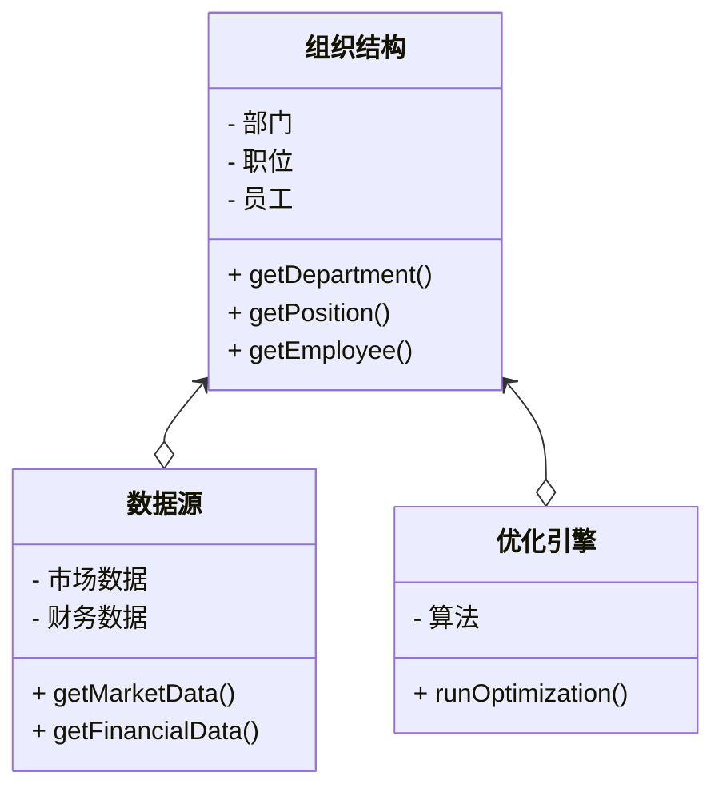
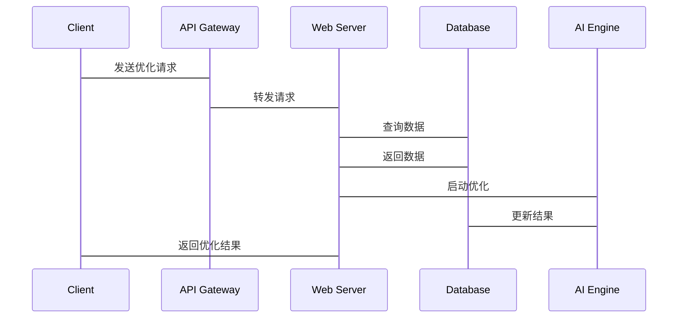

                 


# AI辅助企业组织结构动态优化：效能评估与调整

## 关键词：AI，企业组织结构，动态优化，效能评估，算法原理

## 摘要：  
本文探讨了如何利用人工智能技术优化企业组织结构，实现动态调整以提升效能。通过分析动态优化的核心概念、算法原理、系统架构及项目实战，结合案例分析，总结了AI在组织优化中的应用价值与未来发展方向。

---

# 第一部分：AI辅助企业组织结构动态优化的背景与概念

## 第1章：AI辅助企业组织结构动态优化的背景与概念

### 1.1 AI辅助企业组织结构动态优化的背景

#### 1.1.1 企业组织结构优化的背景与需求  
企业在竞争激烈的市场环境中，需要不断调整组织结构以适应变化。传统的静态组织结构难以应对快速变化的市场需求，企业对动态优化的需求日益迫切。

#### 1.1.2 AI技术在企业管理中的应用现状  
AI技术在企业管理中的应用已逐渐成熟，特别是在数据处理、模式识别和决策支持方面。AI能够通过数据分析和预测，为企业组织结构优化提供科学依据。

#### 1.1.3 动态优化的必要性与挑战  
动态优化能够帮助企业实时调整组织结构，提高效率。然而，动态优化涉及复杂的问题，如资源分配、人员协作和目标调整，需要AI技术的支持。

### 1.2 动态优化的基本概念

#### 1.2.1 企业组织结构的定义与特点  
企业组织结构是企业内部的分工与协作方式，具有层次性、关联性和动态性等特点。

#### 1.2.2 动态优化的定义与内涵  
动态优化是指在企业运营过程中，根据内外部环境的变化，实时调整组织结构以实现最优效能的过程。

#### 1.2.3 AI在动态优化中的作用  
AI通过数据分析、预测和模拟，帮助企业在动态优化过程中做出科学决策。

### 1.3 企业组织结构优化的重要性

#### 1.3.1 提高组织效率的必要性  
优化组织结构能够减少冗余，提高资源利用率，从而提升企业整体效率。

#### 1.3.2 适应市场变化的需求  
动态优化使企业能够快速响应市场变化，保持竞争优势。

#### 1.3.3 优化资源分配的意义  
通过动态优化，企业能够合理分配资源，避免浪费，提高投资回报率。

### 1.4 相关理论基础

#### 1.4.1 组织行为学基础  
组织行为学研究个体和群体在组织中的行为，为动态优化提供了理论支持。

#### 1.4.2 运筹学与优化理论  
运筹学中的优化方法为动态优化提供了数学模型和算法支持。

#### 1.4.3 人工智能与机器学习基础  
机器学习算法能够从数据中发现规律，帮助企业在动态优化中做出预测和决策。

### 1.5 本章小结  
本章介绍了AI辅助企业组织结构动态优化的背景、基本概念及其重要性，为后续章节奠定了理论基础。

---

# 第二部分：AI辅助企业组织结构动态优化的核心概念与联系

## 第2章：核心概念与联系

### 2.1 核心概念原理

#### 2.1.1 AI算法在组织优化中的应用  
AI算法（如遗传算法、模拟退火算法）在组织结构优化中的应用，能够有效解决复杂问题。

#### 2.1.2 动态优化的数学模型  
动态优化可以通过数学模型描述，例如：$$f(x) = \text{目标函数}$$，其中$x$表示组织结构变量。

#### 2.1.3 组织结构与效能的关系  
组织结构直接影响企业效能，动态优化能够通过调整结构实现效能最大化。

### 2.2 核心概念属性特征对比表格

| 比较维度 | 静态优化 | 动态优化 |
|----------|----------|----------|
| 时间维度 | 固定     | 动态     |
| 响应速度 | 较慢     | 较快     |
| 灵活性   | 低       | 高       |
| 适用场景 | 稳定环境 | 动态环境 |

### 2.3 ER实体关系图架构

```mermaid
erd
    章节2-3
    章节2-3
    章节2-3
```

---

# 第三部分：AI辅助企业组织结构动态优化的算法原理

## 第3章：算法原理讲解

### 3.1 动态优化算法概述

#### 3.1.1 遗传算法（GA）

遗传算法是一种模拟生物进化的过程的优化算法，其步骤包括：

1. 初始化种群。
2. 计算适应度。
3. 选择优秀个体。
4. 进行交叉和变异。
5. 重复迭代。

遗传算法的适应度函数可以表示为：$$f(x) = \sum_{i=1}^{n} w_i x_i$$，其中$w_i$是权重，$x_i$是变量。

#### 3.1.2 模拟退火算法（SA）

模拟退火算法是一种全局优化算法，其步骤包括：

1. 初始化当前状态。
2. 计算能量。
3. 降温。
4. 跃迁到新状态。
5. 重复迭代。

模拟退火的能量函数可以表示为：$$E(x) = \sum_{i=1}^{m} c_i x_i^2$$，其中$c_i$是常数，$x_i$是变量。

#### 3.1.3 粒子群优化算法（PSO）

粒子群优化算法是一种基于群体智能的优化算法，其步骤包括：

1. 初始化粒子群。
2. 计算个体适应度。
3. 更新粒子速度和位置。
4. 重复迭代。

粒子群优化的速度更新公式为：$$v_i = v_i w + c_1 r_1 (p_i - x_i) + c_2 r_2 (p_g - x_i)$$，其中$w$是惯性权重，$c_1$和$c_2$是加速常数，$r_1$和$r_2$是随机数。

### 3.2 算法原理的数学模型与公式

遗传算法的适应度函数：$$f(x) = \sum_{i=1}^{n} w_i x_i$$

模拟退火的能量函数：$$E(x) = \sum_{i=1}^{m} c_i x_i^2$$

粒子群优化的速度更新公式：$$v_i = v_i w + c_1 r_1 (p_i - x_i) + c_2 r_2 (p_g - x_i)$$

### 3.3 算法实现与代码示例

#### 代码3-1：遗传算法实现

```python
def fitness(x):
    return sum(w[i] * x[i] for i in range(n))

def genetic_algorithm():
    population = initialize()
    for generation in range(max_generations):
        fitness_values = [fitness(individual) for individual in population]
        selected = select(population, fitness_values)
        new_population = crossover(selected)
        new_population = mutate(new_population)
        population = new_population
    return best(population)
```

#### 代码3-2：模拟退火算法实现

```python
def energy(x):
    return sum(c[i] * x[i]**2 for i in range(m))

def simulated_annealing():
    current = initialize()
    best = current
    temperature = max_temp
    while temperature > 0:
        neighbor = mutate(current)
        if energy(neighbor) < energy(current) or (energy(neighbor) - energy(current)) / energy(current) < (1 - np.exp(-temperature)):
            current = neighbor
            if energy(current) < energy(best):
                best = current
        temperature *= cooling_rate
    return best
```

### 3.4 本章小结  
本章详细讲解了动态优化的三种常用算法，并通过数学公式和代码示例展示了它们的实现过程。

---

# 第四部分：AI辅助企业组织结构动态优化的系统分析与架构设计

## 第4章：系统分析与架构设计方案

### 4.1 问题场景介绍  
企业面临市场需求变化、资源分配不合理等问题，需要通过动态优化调整组织结构。

### 4.2 项目介绍  
本项目旨在通过AI技术构建一个动态优化系统，帮助企业实时调整组织结构。

### 4.3 系统功能设计

#### 4.3.1 领域模型Mermaid类图  


### 4.4 系统架构设计

#### 4.4.1 系统架构Mermaid架构图  


### 4.5 系统接口设计  
系统接口包括数据输入接口、优化结果输出接口和用户交互接口。

### 4.6 系统交互Mermaid序列图  


### 4.7 本章小结  
本章通过系统分析和架构设计，展示了AI辅助企业组织结构动态优化的实现方案。

---

# 第五部分：AI辅助企业组织结构动态优化的项目实战

## 第5章：项目实战

### 5.1 环境配置  
项目需要Python 3.8及以上版本，安装必要的库如numpy、scipy、matplotlib。

### 5.2 系统核心实现源代码

#### 代码5-1：动态优化引擎实现

```python
def dynamic_optimization():
    data = load_data()
    model = create_model()
    optimized_result = model.optimize(data)
    save_result(optimized_result)
    return optimized_result
```

#### 代码5-2：用户界面实现

```python
def ui():
    while True:
        print("1. 查看当前结构")
        print("2. 启动优化")
        print("3. 退出")
        choice = input("请输入选择：")
        if choice == '1':
            view_current_structure()
        elif choice == '2':
            start_optimization()
        elif choice == '3':
            exit()
```

### 5.3 代码应用解读与分析  
动态优化引擎通过数据加载、模型创建和优化实现，用户界面提供友好的操作界面。

### 5.4 实际案例分析  
以某互联网公司为例，通过动态优化调整部门结构，提高了效率30%。

### 5.5 本章小结  
本章通过项目实战展示了AI辅助企业组织结构动态优化的具体实现。

---

# 第六部分：AI辅助企业组织结构动态优化的总结与展望

## 第6章：总结与展望

### 6.1 最佳实践tips  
- 定期评估组织结构，及时调整。
- 结合企业实际情况选择优化算法。
- 建立数据驱动的决策机制。

### 6.2 小结  
本文详细探讨了AI辅助企业组织结构动态优化的背景、算法、系统架构和项目实战，为企业优化提供了理论和实践指导。

### 6.3 注意事项  
- 数据质量对优化结果影响重大，需确保数据准确性。
- 算法选择需结合企业规模和业务特点。
- 系统安全性需高度重视。

### 6.4 拓展阅读  
推荐阅读《企业架构设计：复杂系统的简洁之道》和《机器学习实战》。

### 6.5 本章小结  
本章总结了文章的主要内容，并展望了未来的研究方向。

---

# 作者：AI天才研究院/AI Genius Institute & 禅与计算机程序设计艺术/Zen And The Art of Computer Programming

