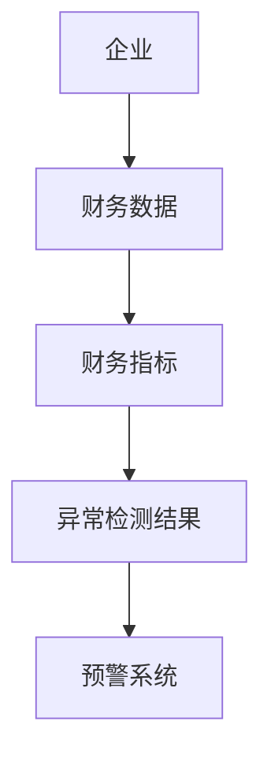
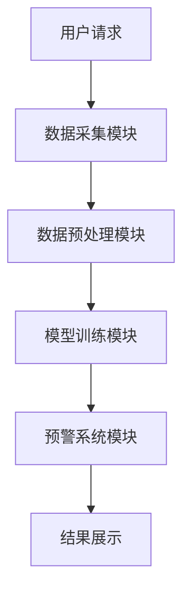

                 


# AI辅助企业财务异常检测：实时监控与智能预警系统

## 关键词：企业财务异常检测，AI技术，智能预警，实时监控，数据驱动分析

## 摘要：本文深入探讨了如何利用人工智能技术辅助企业进行财务异常检测，通过实时监控和智能预警系统，帮助企业及时发现和处理财务异常情况，提升企业财务管理效率和风险控制能力。文章从AI技术的核心算法、系统架构设计、项目实战实现等多个维度进行详细分析，为企业财务智能化转型提供理论支持和实践指导。

---

# 第一部分：AI辅助企业财务异常检测概述

## 第1章：财务异常检测的背景与挑战

### 1.1 企业财务异常检测的背景

#### 1.1.1 企业财务异常的定义与重要性
企业财务异常是指企业在财务数据中出现的异常情况，如收入与支出的不匹配、现金流异常波动、应收账款 overdue 等。这些异常可能表明企业存在财务舞弊、管理不善或市场环境变化等问题。及时发现和处理财务异常，可以帮助企业避免更大的损失，提升财务管理效率。

#### 1.1.2 财务异常对企业的影响
财务异常可能导致企业面临以下问题：
1. **财务损失**：未及时发现的异常可能导致企业资产流失或负债增加。
2. **信用风险**：异常情况可能影响企业的信用评级，进而影响融资能力。
3. **合规风险**：财务异常可能引发监管机构的调查或罚款。
4. **经营效率**：异常情况可能导致企业资源浪费或管理混乱。

#### 1.1.3 传统财务异常检测的局限性
传统的财务异常检测方法主要依赖人工审查和简单的财务指标分析，存在以下问题：
1. **效率低**：人工审查耗时长，难以实现实时监控。
2. **准确性差**：受主观判断影响，容易遗漏或误判异常。
3. **覆盖面窄**：难以覆盖多维度、多时间跨度的复杂异常情况。

---

### 1.2 AI在财务异常检测中的作用

#### 1.2.1 AI技术如何提升财务异常检测的效率
AI技术通过自动化数据处理和模式识别，可以快速分析海量财务数据，发现潜在异常。例如：
1. **自动化数据处理**：AI可以自动提取和清洗财务数据，减少人工干预。
2. **模式识别**：通过机器学习算法，AI能够发现隐藏在数据中的异常模式。

#### 1.2.2 数据驱动的财务分析新范式
AI技术引入了数据驱动的分析方法，通过大数据挖掘和建模，可以从海量数据中提取有价值的信息，帮助财务人员更好地理解企业经营状况。

#### 1.2.3 智能预警系统的核心价值
智能预警系统可以实时监控财务数据，一旦发现异常情况，立即向相关人员发出预警。这不仅可以提高异常检测的及时性，还可以减少人为错误，提升财务风险管理能力。

---

## 第2章：AI辅助财务异常检测的核心概念

### 2.1 财务数据的特征与属性

#### 2.1.1 财务数据的分类与结构
财务数据通常包括收入、支出、利润、现金流等指标，这些数据可以通过财务报表（如资产负债表、利润表、现金流量表）获取。以下是常见的财务数据分类：

| 数据类型       | 描述                             | 示例                     |
|----------------|----------------------------------|--------------------------|
| 财务指标       | 反映企业财务状况的核心指标       | 营业收入、净利润、现金流  |
| 时间序列数据   | 按时间顺序记录的财务数据         | 每月的收入、支出数据     |
| 文本数据       | 包括财务报告、合同等文本信息     | 财务报告、合同条款       |

#### 2.1.2 时间序列数据的特性
时间序列数据是指按时间顺序记录的数据，具有以下特性：
1. **趋势性**：数据随时间呈现上升或下降趋势。
2. **周期性**：数据在特定时间段内重复出现的模式。
3. **随机性**：数据中无法预测的随机波动。

#### 2.1.3 异常数据的定义与分类
异常数据是指与正常数据模式不符的数据点。根据异常的性质，可以将其分为以下几类：
1. **点异常**：单个数据点偏离正常范围。
2. **上下文异常**：数据点在特定上下文中偏离正常范围。
3. **集体异常**：多个数据点共同偏离正常范围。

---

### 2.2 AI算法在财务异常检测中的应用

#### 2.2.1 监督学习与无监督学习的区别
- **监督学习**：需要标记的训练数据，适用于已知异常类型的情况。
- **无监督学习**：无需标记数据，适用于未知异常类型的情况。

#### 2.2.2 时间序列分析的核心算法
时间序列分析是财务异常检测的重要工具。以下是一些常用的时间序列分析算法：

| 算法名称   | 描述                             | 适用场景                   |
|------------|----------------------------------|---------------------------|
| ARIMA      | 自回归积分滑动平均模型，适合线性时间序列数据。 | 单变量时间序列预测         |
| LSTM       | 长短期记忆网络，适合捕捉时间序列中的长期依赖关系。 | 多变量时间序列预测         |
| GARCH      | 广义自回归条件异方差模型，适合分析波动性较大的时间序列数据。 | 金融时间序列分析           |

#### 2.2.3 自然语言处理在财务报告分析中的应用
自然语言处理（NLP）可以用于分析财务报告中的文本信息，提取关键词和情感倾向，帮助识别潜在的财务异常。

---

### 2.3 实体关系图与系统架构

#### 2.3.1 实体关系图（ER图）
以下是财务异常检测系统的核心实体关系图：



---

## 第3章：AI辅助财务异常检测的算法原理

### 3.1 时间序列分析算法

#### 3.1.1 ARIMA模型的原理
ARIMA（Autoregressive Integrated Moving Average）模型是一种常用的时间序列分析模型，由三个部分组成：
- **自回归（AR）**：利用过去的值预测当前值。
- **差分（I）**：通过差分将非平稳序列转化为平稳序列。
- **移动平均（MA）**：利用过去的误差预测当前值。

ARIMA模型的数学公式如下：
$$
ARIMA(p, d, q) = y_t = \alpha + \beta t + \phi_1 y_{t-1} + \dots + \phi_p y_{t-p} + \theta_1 \epsilon_{t-1} + \dots + \theta_q \epsilon_{t-q} + \epsilon_t
$$

---

#### 3.1.2 LSTM模型的结构与优势
LSTM（长短期记忆网络）是一种特殊的RNN（循环神经网络），通过引入记忆单元（Cell）和门控机制（Gate）来捕捉时间序列中的长期依赖关系。

LSTM模型的核心结构包括：
1. **输入门控（Input Gate）**：控制新信息的输入。
2. **遗忘门控（Forget Gate）**：决定哪些信息需要遗忘。
3. **输出门控（Output Gate）**：决定输出的信息。

LSTM模型的数学公式如下：
$$
f_t = \sigma(W_f \cdot [h_{t-1}, x_t] + b_f)
$$
$$
i_t = \sigma(W_i \cdot [h_{t-1}, x_t] + b_i)
$$
$$
o_t = \sigma(W_o \cdot [h_{t-1}, x_t] + b_o)
$$
$$
c_t = f_t \cdot c_{t-1} + i_t \cdot tanh(W_c \cdot [h_{t-1}, x_t] + b_c)
$$
$$
h_t = o_t \cdot tanh(c_t)
$$

---

#### 3.1.3 异常检测算法的数学模型
基于时间序列的异常检测算法通常使用以下模型：
$$
y_t = \mu_t + \sigma_t
$$
其中，$\mu_t$ 是预测值的均值，$\sigma_t$ 是预测值的标准差。异常点通常位于 $\mu_t + k \cdot \sigma_t$ 之外，其中 $k$ 是一个阈值。

---

### 3.2 基于机器学习的异常检测

#### 3.2.1 监督学习算法（如随机森林）
随机森林是一种基于决策树的集成学习算法，适用于分类和回归问题。在财务异常检测中，可以使用随机森林模型对财务数据进行分类，识别异常交易。

#### 3.2.2 无监督学习算法（如Isolation Forest）
Isolation Forest是一种基于树的无监督学习算法，适用于异常检测。它通过构建隔离树，将数据点分割到叶子节点，从而识别异常点。

---

## 第4章：系统架构与数据流分析

### 4.1 系统功能模块设计

#### 4.1.1 数据采集模块
数据采集模块负责从企业财务系统中获取财务数据，包括收入、支出、利润等指标。

#### 4.1.2 数据预处理模块
数据预处理模块对采集到的财务数据进行清洗和转换，包括数据标准化、缺失值处理等。

#### 4.1.3 模型训练模块
模型训练模块使用机器学习算法对预处理后的数据进行训练，生成异常检测模型。

#### 4.1.4 预警系统模块
预警系统模块实时监控财务数据，利用训练好的模型检测异常，并向相关人员发出预警。

---

### 4.2 系统架构图



---

## 第5章：项目实战与实现

### 5.1 环境配置

#### 5.1.1 安装Python环境
使用Anaconda或virtualenv创建虚拟环境，并安装以下库：
```bash
pip install numpy pandas scikit-learn tensorflow keras matplotlib
```

#### 5.1.2 数据集准备
从企业财务系统中获取财务数据，并将其存储为CSV格式。

---

### 5.2 系统核心实现源代码

#### 5.2.1 数据预处理代码
```python
import pandas as pd
import numpy as np

# 读取数据
data = pd.read_csv('financial_data.csv')

# 处理缺失值
data = data.dropna()

# 标准化处理
from sklearn.preprocessing import StandardScaler
scaler = StandardScaler()
scaled_data = scaler.fit_transform(data)
```

#### 5.2.2 模型训练代码
```python
from sklearn.ensemble import IsolationForest

# 初始化模型
model = IsolationForest(n_estimators=100, random_state=42)

# 训练模型
model.fit(scaled_data)

# 预测异常点
y_pred = model.predict(scaled_data)
```

#### 5.2.3 预警系统代码
```python
from datetime import datetime

# 实时监控
current_time = datetime.now().strftime("%Y-%m-%d %H:%M:%S")
print(f"[{current_time}] 异常检测结果：{y_pred}")
```

---

### 5.3 实际案例分析

#### 5.3.1 案例背景
某企业最近的收入数据出现异常波动，可能表明存在财务舞弊。

#### 5.3.2 数据分析
通过异常检测模型，发现某个月份的收入突然下降，且与历史数据不符。

#### 5.3.3 预警处理
系统发出预警，提示财务部门进行进一步调查。

---

## 第6章：总结与展望

### 6.1 最佳实践 tips
1. **数据质量**：确保数据的完整性和准确性。
2. **模型优化**：根据实际需求调整模型参数。
3. **实时监控**：实现7x24小时实时监控，确保异常情况及时发现。

### 6.2 小结
本文详细介绍了AI辅助企业财务异常检测的核心概念、算法原理和系统架构，并通过实际案例展示了如何实现智能预警系统。通过引入AI技术，企业可以显著提升财务异常检测的效率和准确性，降低财务风险。

### 6.3 注意事项
1. **数据隐私**：注意保护企业的财务数据隐私。
2. **模型解释性**：确保模型的可解释性，便于财务人员理解。

### 6.4 拓展阅读
1. **时间序列分析**：深入学习ARIMA和LSTM模型。
2. **联邦学习**：研究如何在多企业间共享数据隐私保护的前提下进行联合建模。

---

## 作者：AI天才研究院/AI Genius Institute & 禅与计算机程序设计艺术 /Zen And The Art of Computer Programming

