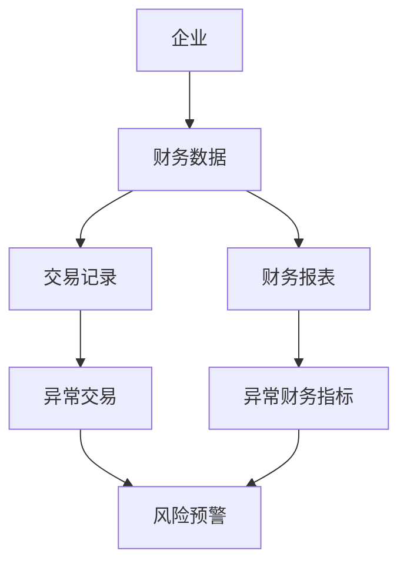
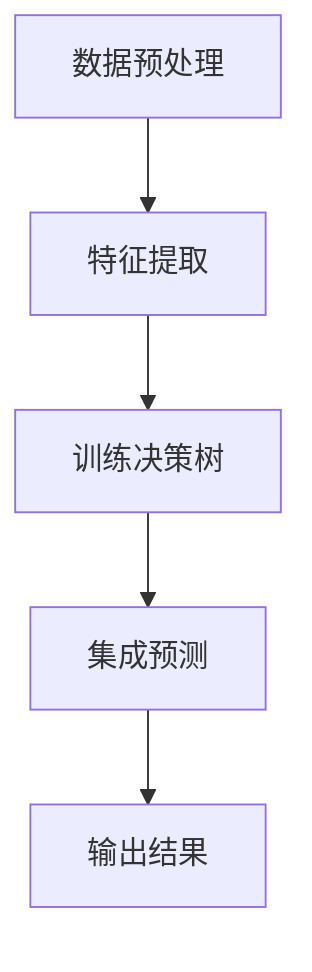
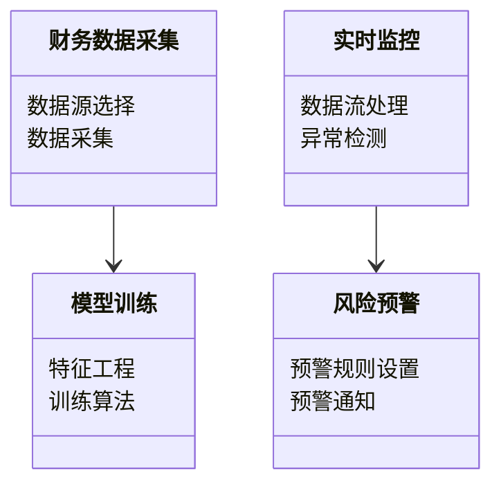
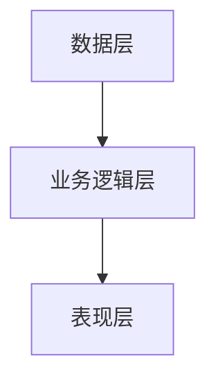
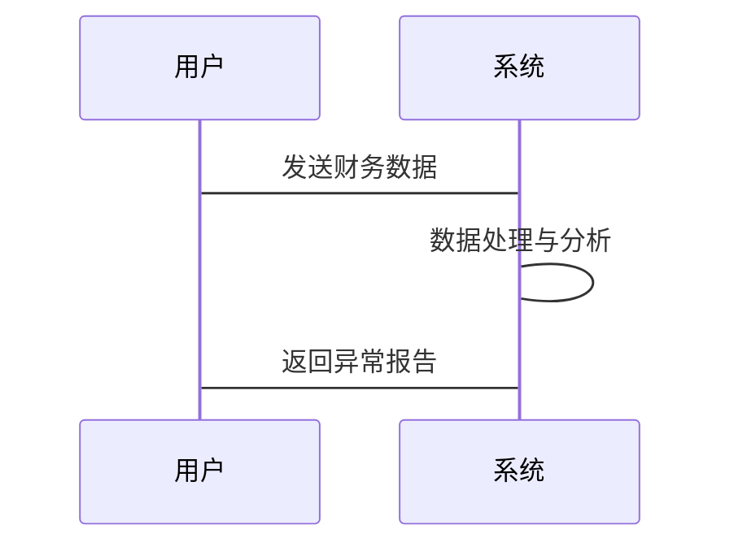

                 


# AI辅助企业财务异常检测：实时监控与风险预警

## 关键词：AI技术，财务异常检测，机器学习，实时监控，风险预警

## 摘要：本文探讨如何利用AI技术辅助企业进行财务异常检测，实现对企业财务数据的实时监控和风险预警。文章详细分析了传统财务异常检测的局限性，介绍了基于机器学习的异常检测算法，并通过系统架构设计和项目实战展示了如何构建实时监控与风险预警系统。最后，文章提出了模型优化和扩展应用的建议，为企业的财务风险管理提供了新的思路和解决方案。

---

## 第一部分：背景与概念

### 第1章：财务异常检测概述

#### 1.1 财务异常检测的背景与意义

企业财务健康状况是衡量其经营状况的重要指标，财务异常情况往往预示着潜在的经营风险或舞弊行为。传统的财务异常检测依赖于财务人员的经验和手动分析，效率低且容易出错。随着AI技术的发展，机器学习和自然语言处理等技术为财务异常检测提供了新的解决方案。

#### 1.2 AI辅助财务异常检测的背景

AI技术的进步使得企业能够实时处理和分析海量财务数据，快速识别异常情况，从而提前采取措施，避免潜在风险。企业对智能化财务风险管理的需求日益增长，推动了AI在财务异常检测中的应用。

#### 1.3 核心概念与联系

财务异常检测的核心概念包括：

- **数据源**：企业的财务报表、交易记录等。
- **检测方法**：基于统计、机器学习或深度学习的算法。
- **预警系统**：实时监控和风险预警。

通过对比表格和ER实体关系图，可以更清晰地理解这些概念之间的关系。

| 概念 | 属性 | 特征 |
|------|------|------|
| 数据源 | 类型 | 财务报表、交易数据 |
| 模型 | 类型 | 机器学习模型、深度学习模型 |
| 预警系统 | 功能 | 实时监控、风险预警 |

ER实体关系图如下：



#### 1.4 本章小结

本章介绍了财务异常检测的重要性和AI技术在其中的应用，明确了核心概念及其关系。

---

## 第二部分：技术基础

### 第2章：数据采集与预处理

#### 2.1 数据来源与采集方法

财务数据来源包括企业内部的财务报表、交易记录等，可以通过数据库查询、API接口等方式进行采集。

#### 2.2 数据清洗与预处理

数据清洗步骤包括去除重复数据、处理缺失值、异常值和噪声数据。预处理阶段需要对数据进行标准化和归一化处理，以便模型更好地学习。

#### 2.3 特征工程

特征工程是提升模型性能的关键步骤。常用特征提取方法包括主成分分析（PCA）和特征选择方法如LASSO回归。

### 第3章：基于机器学习的异常检测算法

#### 3.1 算法原理

随机森林是一种强大的分类算法，适用于财务异常检测。其数学模型如下：

$$ y = \sum_{i=1}^{n} b_i x_i + c $$

其中，\( b_i \) 是特征的权重，\( x_i \) 是特征值，\( c \) 是常数项。

随机森林通过集成学习方法，提高了模型的准确性和鲁棒性。

#### 3.2 算法实现流程

随机森林算法流程如下：



---

## 第三部分：系统设计

### 第4章：系统架构设计

#### 4.1 系统功能设计

系统功能包括数据采集、模型训练、实时监控和风险预警。

领域模型类图如下：



#### 4.2 系统架构设计

系统架构采用分层设计，包括数据层、业务逻辑层和表现层。

架构图如下：



#### 4.3 接口设计与交互流程

接口设计采用RESTful API，交互流程如下：



---

## 第四部分：项目实战

### 第5章：项目实战

#### 5.1 项目介绍

本项目旨在开发一个基于AI的财务异常检测系统，实现对企业财务数据的实时监控和风险预警。

#### 5.2 核心实现

环境搭建：

- 安装Python、Scikit-learn、XGBoost等库。

数据预处理代码示例：

```python
import pandas as pd
from sklearn.impute import SimpleImputer

data = pd.read_csv('financial_data.csv')
imputer = SimpleImputer(strategy='mean')
data_imputed = imputer.fit_transform(data)
```

模型训练代码：

```python
from sklearn.ensemble import RandomForestClassifier

model = RandomForestClassifier(n_estimators=100)
model.fit(X_train, y_train)
```

结果分析：

通过混淆矩阵和ROC曲线评估模型性能，优化模型参数以提高准确率和召回率。

---

## 第五部分：优化与扩展

### 第6章：优化与扩展

#### 6.1 模型优化

通过超参数调优和特征优化提升模型性能。

#### 6.2 结果分析

分析异常检测结果，结合业务知识进行解释和验证。

#### 6.3 扩展应用

将模型部署到生产环境，实现实时监控和自动化预警。

---

## 作者：AI天才研究院 & 禅与计算机程序设计艺术

---

以上是《AI辅助企业财务异常检测：实时监控与风险预警》的详细目录和部分章节内容。通过系统化的分析和实践，本文为企业的财务风险管理提供了有效的解决方案。

