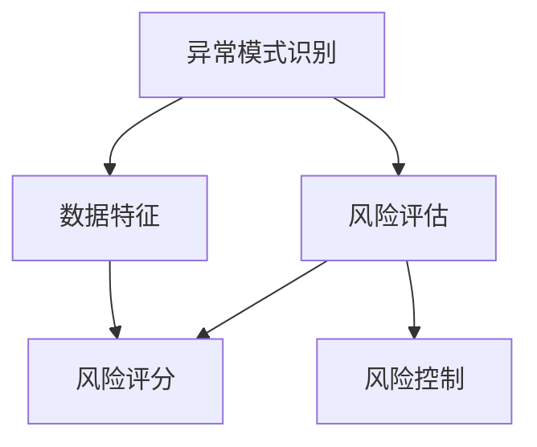
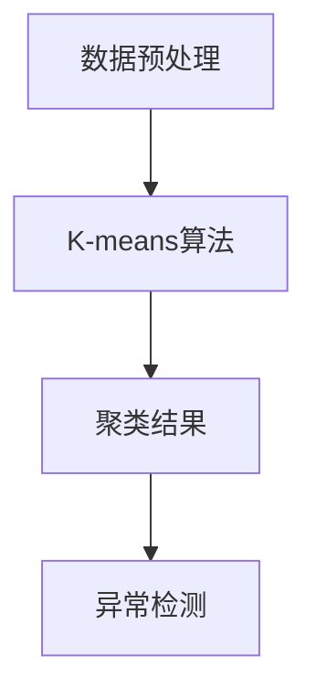
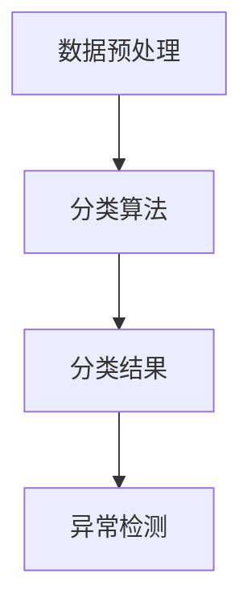
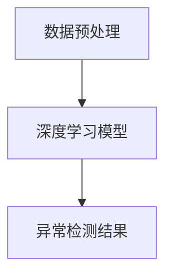
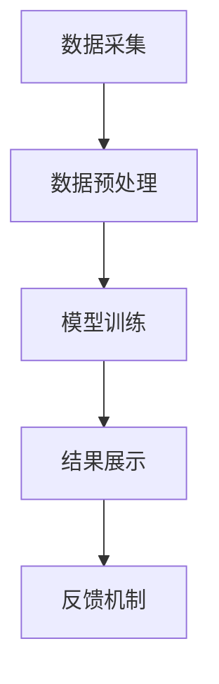
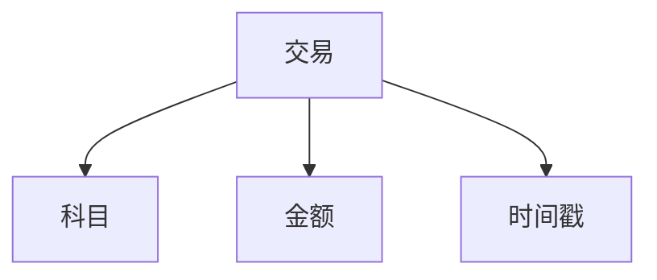
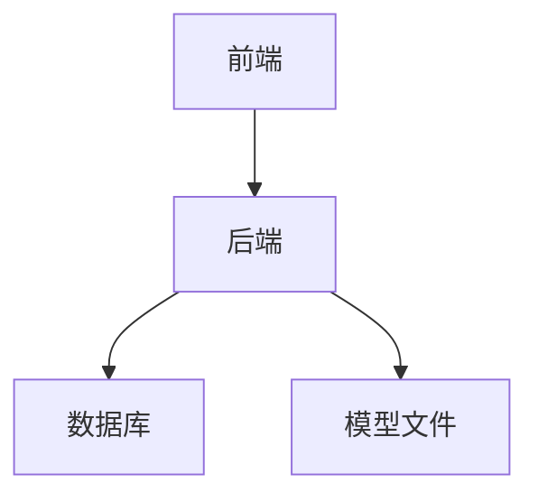
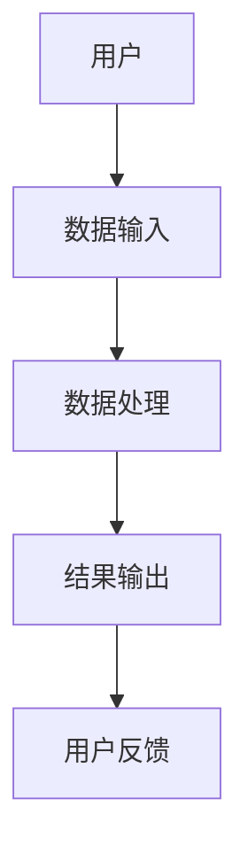

                 


# AI辅助企业财务舞弊检测：异常模式识别与风险评估

> 关键词：企业财务舞弊检测、人工智能、异常模式识别、风险评估、机器学习算法、系统架构设计

> 摘要：随着企业财务舞弊问题的日益严重，传统检测方法的局限性逐渐显现。本文介绍了一种基于人工智能的财务舞弊检测方法，通过异常模式识别和风险评估来实现高效检测。文章详细探讨了AI在财务舞弊检测中的应用，包括核心概念、算法原理、系统架构设计、项目实战以及最佳实践等内容，为企业的财务安全提供了一种创新的解决方案。

---

## 目录

### 第一部分: AI辅助企业财务舞弊检测概述

#### 第1章: 财务舞弊检测的背景与挑战

##### 1.1 问题背景
- 1.1.1 企业财务舞弊的现状与趋势
  - 企业舞弊行为的多样性和复杂性
  - 传统审计方法的局限性
  - 数字化时代下舞弊手段的进化

- 1.1.2 传统财务舞弊检测的局限性
  - 人工审计效率低、成本高
  - 易受主观因素影响，准确性不足
  - 难以发现隐藏的模式和异常

- 1.1.3 AI技术在财务舞弊检测中的潜力
  - 大数据分析能力：发现隐藏的模式
  - 机器学习算法：自动识别异常
  - 高效实时性：实时监控和预警

##### 1.2 问题描述
- 1.2.1 财务舞弊的主要形式与特征
  - 常见舞弊手法：虚增收入、虚减费用、关联交易舞弊等
  - 舞弊行为的特征分析：数据异常、模式突变等

- 1.2.2 异常模式识别的难点
  - 数据稀疏性：正常数据多，异常数据少
  - 数据维度高：多维度数据的复杂性
  - 时间依赖性：舞弊行为的时间模式

- 1.2.3 风险评估的核心要素
  - 舞弊风险的量化
  - 风险的动态变化
  - 风险与业务场景的关联

##### 1.3 问题解决思路
- 1.3.1 引入AI技术的核心逻辑
  - 利用机器学习算法分析财务数据
  - 通过深度学习模型发现隐藏模式
  - 结合自然语言处理技术分析文本数据

- 1.3.2 数据驱动的舞弊检测方法
  - 数据收集与预处理
  - 特征提取与选择
  - 模型训练与优化

- 1.3.3 结合业务场景的AI解决方案
  - 根据不同行业特点定制模型
  - 结合业务规则进行风险评估
  - 提供可解释性结果，便于审计人员理解

##### 1.4 边界与外延
- 1.4.1 财务舞弊检测的边界
  - 检测范围：仅限于财务数据
  - 数据来源：仅限于企业内部数据
  - 检测目标：仅限于财务舞弊行为

- 1.4.2 AI技术的适用范围
  - 适用于数据量大、维度高的场景
  - 适用于需要实时监控的场景
  - 适用于需要复杂模式识别的场景

- 1.4.3 相关领域的扩展
  - 反欺诈检测
  - 信用评估
  - 风险管理

##### 1.5 核心要素组成
- 1.5.1 数据来源与特征
  - 数据来源：财务报表、交易记录、发票数据等
  - 数据特征：时间戳、金额、交易对手、科目编码等
  - 数据预处理：缺失值处理、异常值剔除、标准化等

- 1.5.2 模型选择与优化
  - 算法选择：聚类、分类、深度学习等
  - 模型优化：参数调优、特征工程、模型融合等
  - 性能评估：准确率、召回率、F1值等

- 1.5.3 结果解读与反馈
  - 异常检测结果的可视化展示
  - 风险评分的解释
  - 模型反馈与优化

---

#### 第2章: 异常模式识别与风险评估的核心概念

##### 2.1 异常模式识别的原理
- 2.1.1 异常检测的基本概念
  - 正常数据与异常数据的定义
  - 异常检测的目标：识别异常数据点

- 2.1.2 基于统计的方法
  - Z-score方法
  - 算术平均法
  - 标准差法

- 2.1.3 基于机器学习的方法
  - 聚类算法：K-means、DBSCAN
  - 分类算法：逻辑回归、随机森林
  - 深度学习模型：Autoencoder

##### 2.2 风险评估的框架
- 2.2.1 风险评估的步骤
  - 数据收集与清洗
  - 风险因子识别
  - 风险评分模型构建
  - 风险控制策略制定

- 2.2.2 风险评分模型
  - 评分方法：线性回归、 logistic回归
  - 评分解释：风险等级划分

- 2.2.3 风险控制策略
  - 风险预警：设置阈值，触发警报
  - 风险应对：制定应对措施，降低风险

##### 2.3 核心概念对比
- 2.3.1 异常检测与分类的对比
  - 异常检测：无监督学习，目标是发现异常
  - 分类：有监督学习，目标是分类

- 2.3.2 风险评估与预测的对比
  - 风险评估：基于现有数据，评估风险程度
  - 预测：基于历史数据，预测未来趋势

- 2.3.3 数据特征与模型性能的关系
  - 特征数量对模型性能的影响
  - 特征重要性对模型解释性的影响

##### 图2.1: 异常模式识别与风险评估的概念对比（使用Mermaid流程图）



---

#### 第3章: AI辅助财务舞弊检测的核心算法

##### 3.1 聚类算法
- 3.1.1 K-means算法
  - 算法步骤：选择K值，计算质心，分配样本，迭代优化
  - 代码示例：
    ```python
    from sklearn.cluster import KMeans
    model = KMeans(n_clusters=3)
    model.fit(X)
    ```
  - 算法优缺点：简单高效，但需要选择K值

- 3.1.2 DBSCAN算法
  - 算法步骤：计算距离，密度可达点，噪声点
  - 代码示例：
    ```python
    from sklearn.cluster import DBSCAN
    model = DBSCAN(eps=0.5, min_samples=5)
    model.fit(X)
    ```
  - 算法优缺点：无需选择K值，对噪声点鲁棒

- 3.1.3 聚类在异常检测中的应用
  - 聚类用于识别异常交易模式
  - 聚类结果用于风险评估

##### 图3.1: 聚类算法流程图（使用Mermaid）



##### 3.2 分类算法
- 3.2.1 logistic回归
  - 算法原理：线性回归预测概率
  - 代码示例：
    ```python
    from sklearn.linear_model import LogisticRegression
    model = LogisticRegression()
    model.fit(X, y)
    ```
  - 优缺点：简单，但适合线性可分问题

- 3.2.2 支持向量机
  - 算法原理：寻找最优超平面
  - 代码示例：
    ```python
    from sklearn import svm
    model = svm.SVC()
    model.fit(X, y)
    ```
  - 优缺点：适合小数据集，对高维数据表现好

- 3.2.3 随机森林与梯度提升树
  - 算法原理：集成学习，投票分类
  - 代码示例：
    ```python
    from sklearn.ensemble import RandomForestClassifier
    model = RandomForestClassifier()
    model.fit(X, y)
    ```
  - 优缺点：适合大数据集，抗过拟合

##### 图3.2: 分类算法流程图（使用Mermaid）



##### 3.3 深度学习模型
- 3.3.1 引入神经网络的异常检测
  - 算法原理：通过神经网络自动提取特征
  - 代码示例：
    ```python
    import tensorflow as tf
    model = tf.keras.Sequential([
        tf.keras.layers.Dense(64, activation='relu'),
        tf.keras.layers.Dense(1, activation='sigmoid')
    ])
    model.compile(optimizer='adam', loss='binary_crossentropy')
    model.fit(X, y)
    ```
  - 优缺点：适合复杂数据，但需要大量数据和计算资源

- 3.3.2 Autoencoder在异常检测中的应用
  - 算法原理：通过编码器和解码器结构，最小化重建误差
  - 代码示例：
    ```python
    import tensorflow as tf
    encoder = tf.keras.Input(shape=(input_dim,))
    encoded = tf.keras.layers.Dense(32, activation='relu')(encoder)
    decoded = tf.keras.layers.Dense(input_dim, activation='sigmoid')(encoded)
    autoencoder = tf.keras.Model(encoder, decoded)
    autoencoder.compile(optimizer='adam', loss='binary_crossentropy')
    autoencoder.fit(X, X)
    ```
  - 优缺点：适合高维数据，但需要处理过拟合问题

- 3.3.3 Transformer模型的潜力
  - 算法原理：基于自注意力机制，捕捉数据之间的关系
  - 代码示例：
    ```python
    import tensorflow as tf
    model = tf.keras.Sequential([
        tf.keras.layers.Embedding(input_dim, 64),
        tf.keras.layers.TransformerEncoder(...)
    ])
    ```
  - 优缺点：适合序列数据，但计算资源需求高

##### 图3.3: 深度学习模型流程图（使用Mermaid）



---

#### 第4章: 系统架构与数据处理

##### 4.1 系统架构设计
- 4.1.1 数据采集模块
  - 数据来源：财务系统、数据库、API接口
  - 数据格式：结构化数据、非结构化数据
  - 数据存储：数据库、文件系统

- 4.1.2 数据预处理模块
  - 数据清洗：处理缺失值、异常值
  - 数据转换：标准化、归一化
  - 数据增强：增加特征、降维

- 4.1.3 模型训练与部署模块
  - 模型选择：根据数据特点选择算法
  - 模型训练：使用训练数据优化模型
  - 模型部署：将模型部署到生产环境

- 4.1.4 结果展示与反馈模块
  - 结果可视化：图表展示异常点、风险评分
  - 反馈机制：根据结果调整模型参数
  - 报告生成：自动生成审计报告

##### 图4.1: 系统架构设计（使用Mermaid）



##### 4.2 系统功能设计
- 4.2.1 领域模型设计
  - 实体识别：交易、科目、金额、时间戳
  - 关系建模：交易与科目之间的关系
  - 功能模块：数据采集、预处理、模型训练、结果展示

##### 图4.2: 领域模型设计（使用Mermaid）



##### 4.3 系统架构设计
- 4.3.1 系统架构图
  - 前端：用户界面、数据可视化
  - 后端：API接口、数据处理
  - 数据存储：数据库、模型文件

##### 图4.3: 系统架构设计（使用Mermaid）



##### 4.4 系统接口设计
- 4.4.1 接口描述
  - 数据接口：数据输入、输出格式
  - 模型接口：模型训练、预测接口
  - 结果接口：结果展示、反馈接口

- 4.4.2 交互流程
  - 用户输入数据
  - 系统处理数据
  - 系统返回结果

##### 图4.4: 系统交互流程（使用Mermaid）



---

## 第二部分: 项目实战

### 第5章: 项目实战与经验分享

#### 5.1 环境安装与配置
- 5.1.1 安装Python环境
  - 安装Anaconda
  - 安装必要的库：numpy、pandas、scikit-learn、tensorflow

- 5.1.2 数据集准备
  - 数据来源：公开数据集、企业内部数据
  - 数据格式：CSV、Excel、数据库

- 5.1.3 环境配置
  - 配置虚拟环境
  - 安装项目依赖

#### 5.2 核心代码实现
- 5.2.1 数据预处理代码
  ```python
  import pandas as pd
  import numpy as np

  # 加载数据
  data = pd.read_csv('financial_data.csv')

  # 处理缺失值
  data = data.dropna()

  # 标准化处理
  from sklearn.preprocessing import StandardScaler
  scaler = StandardScaler()
  data_scaled = scaler.fit_transform(data)
  ```

- 5.2.2 模型训练代码
  ```python
  from sklearn.ensemble import RandomForestClassifier
  model = RandomForestClassifier()
  model.fit(X_train, y_train)
  ```

- 5.2.3 结果展示代码
  ```python
  import matplotlib.pyplot as plt

  plt.scatter(y_pred, y_true)
  plt.xlabel('Predicted')
  plt.ylabel('True')
  plt.show()
  ```

#### 5.3 案例分析与经验总结
- 5.3.1 案例分析
  - 数据特征分析：识别异常交易
  - 模型评估：准确率、召回率
  - 结果解读：识别高风险交易

- 5.3.2 经验总结
  - 数据预处理的重要性
  - 模型选择的策略
  - 结果解释的技巧

#### 5.4 项目小结
- 项目成果：成功实现AI辅助财务舞弊检测系统
- 经验教训：数据质量对模型性能的影响
- 持续优化：模型的可解释性提升、实时监控功能的开发

---

## 第三部分: 最佳实践

### 第6章: 最佳实践与经验分享

#### 6.1 小结
- AI技术在财务舞弊检测中的应用前景广阔
- 异常模式识别和风险评估是核心
- 系统架构设计和数据处理是关键

#### 6.2 注意事项
- 数据隐私与安全：确保数据处理符合法律法规
- 模型可解释性：便于审计人员理解和信任
- 持续优化：根据实际情况调整模型和策略

#### 6.3 拓展阅读
- 推荐书籍：《机器学习实战》、《深度学习》
- 推荐博客：Kaggle上的相关案例
- 推荐工具：Python的机器学习库、TensorFlow框架

---

## 作者信息

作者：AI天才研究院/AI Genius Institute & 禅与计算机程序设计艺术 /Zen And The Art of Computer Programming

---

**注：以上目录大纲是完整版的，但需要根据实际需求进行调整，以符合具体的内容和格式要求。**
---

接下来，我会根据这个大纲，逐步完成每部分内容的详细撰写，确保每部分内容详实，逻辑清晰，符合技术博客的写作要求。

