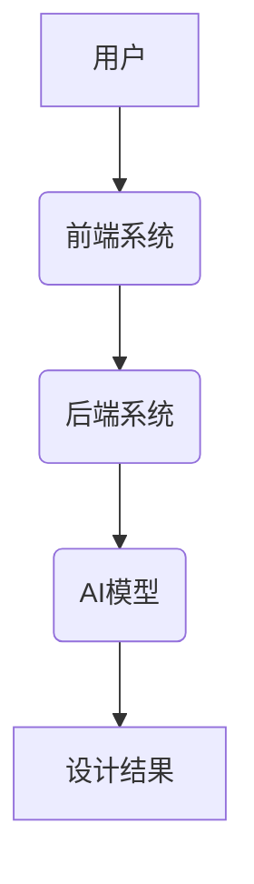

                 


# AI辅助品牌形象设计与管理的创新方法

> 关键词：AI辅助设计，品牌形象管理，生成式AI，深度学习，品牌形象设计

> 摘要：本文系统地探讨了人工智能（AI）在品牌形象设计与管理中的创新应用方法。通过分析AI技术在品牌设计与管理中的优势，详细阐述了生成式AI、数据驱动设计等核心概念，并结合实际案例，讲解了AI辅助设计的系统架构与实现方法。本文旨在为品牌设计与管理领域的专业人士提供理论与实践相结合的指导，助力品牌在数字化转型中实现高效、创新的设计与管理。

---

## 第1章: AI辅助品牌形象设计与管理的背景与现状

### 1.1 AI在品牌设计与管理中的应用现状

#### 1.1.1 传统品牌形象设计与管理的局限性
品牌形象设计与管理是企业品牌战略的核心组成部分。传统设计过程中，设计师需要从市场调研、创意构思到设计执行，耗时长且成本高。同时，品牌管理涉及多维度的分析，包括消费者行为、市场竞争分析等，传统方法依赖人工经验，难以实现高效和精准的管理。

#### 1.1.2 AI技术在品牌设计与管理中的优势
AI技术的引入为品牌形象设计与管理带来了革命性的变化。AI可以通过大数据分析快速生成设计灵感，优化设计流程，降低设计成本。在品牌管理方面，AI能够实时监控品牌表现，提供数据驱动的决策支持，帮助企业更好地应对市场变化。

#### 1.1.3 当前市场对AI辅助设计的需求
随着市场竞争的加剧，企业对高效、创新的品牌设计方案的需求日益增长。AI辅助设计能够快速生成多样化的设计选项，满足企业对个性化和高效性的双重需求。同时，AI技术还可以通过数据挖掘和预测分析，为企业提供精准的品牌管理策略。

### 1.2 品牌形象设计与管理的核心问题

#### 1.2.1 品牌形象设计的关键要素
品牌形象设计的核心要素包括品牌标识（Logo）、品牌颜色、品牌字体、品牌视觉风格等。这些要素需要与品牌的核心价值和目标受众的心理预期相匹配。

#### 1.2.2 品牌管理中的主要挑战
品牌管理面临的主要挑战包括市场需求的快速变化、品牌资产的难以量化、品牌传播的多渠道协调等。传统品牌管理方法难以应对这些复杂问题，而AI技术可以通过数据驱动的方式，提供更高效的解决方案。

#### 1.2.3 AI如何解决品牌形象设计与管理中的问题
AI可以通过生成式设计算法快速生成多种设计方案，帮助设计师找到最优解。在品牌管理方面，AI可以实时监控品牌表现，分析消费者反馈，提供数据驱动的决策支持。

### 1.3 本章小结
本章介绍了AI技术在品牌形象设计与管理中的应用现状，分析了传统设计与管理的局限性，以及AI技术带来的创新优势。通过阐述品牌形象设计与管理的核心问题，为后续章节的深入探讨奠定了基础。

---

## 第2章: AI辅助品牌形象设计与管理的核心概念

### 2.1 AI辅助设计的定义与特点

#### 2.1.1 AI辅助设计的定义
AI辅助设计是指利用人工智能技术，通过数据驱动的方式，辅助设计师完成从创意构思到设计实现的全过程。AI辅助设计不仅能够提高设计效率，还能够提供多样化的设计选项，激发设计师的创造力。

#### 2.1.2 AI辅助设计的核心特点
1. **数据驱动**：AI辅助设计依赖于大量数据，能够通过数据挖掘和分析，提供精准的设计建议。
2. **自动化**：AI可以自动完成部分设计工作，如颜色搭配、字体选择等，降低设计师的工作强度。
3. **创新性**：AI能够生成传统设计方法难以实现的创新设计方案，为企业提供差异化竞争优势。

#### 2.1.3 AI辅助设计与传统设计的对比
| 对比维度 | AI辅助设计 | 传统设计 |
|----------|------------|----------|
| 设计效率 | 高          | 较低      |
| 创新性   | 高          | 中等      |
| 成本     | 低          | 较高      |
| 精准度   | 高          | 较低      |

### 2.2 品牌形象设计的原理与方法

#### 2.2.1 品牌形象的构成要素
品牌形象的构成要素包括品牌标识、品牌颜色、品牌字体、品牌视觉风格等。这些要素需要与品牌的核心价值和目标受众的心理预期相匹配。

#### 2.2.2 数据驱动的品牌设计方法
数据驱动的品牌设计方法通过分析消费者行为数据、市场趋势数据等，为设计提供科学依据。例如，通过分析目标受众的颜色偏好，AI可以推荐适合的品牌颜色方案。

#### 2.2.3 AI在品牌形象设计中的应用流程
1. 数据采集与分析：收集品牌相关数据，包括市场趋势、消费者偏好等。
2. 设计生成：基于数据，生成多种设计方案。
3. 方案优化：通过用户反馈优化设计方案。
4. 设计交付：输出最终的设计方案。

### 2.3 生成式AI在品牌设计中的创新应用

#### 2.3.1 生成式AI的基本原理
生成式AI是一种通过生成对抗网络（GAN）或扩散模型等技术，从训练数据中生成新的内容的技术。生成式AI可以用于生成品牌标识、品牌颜色等设计元素。

#### 2.3.2 生成式AI在品牌设计中的具体应用
1. **品牌标识生成**：AI可以根据品牌名称和核心价值，生成多种品牌标识设计方案。
2. **品牌颜色推荐**：通过分析目标受众的颜色偏好，AI可以推荐适合的品牌颜色方案。
3. **设计优化**：AI可以对生成的设计方案进行优化，例如调整颜色搭配、字体选择等。

#### 2.3.3 基于AI的品牌设计流程优化
1. 数据采集与分析：通过分析消费者行为数据，确定目标受众的偏好。
2. 设计生成：利用生成式AI生成多种设计方案。
3. 方案优化：通过用户反馈优化设计方案。
4. 设计交付：输出最终的设计方案。

### 2.4 本章小结
本章详细介绍了AI辅助设计的核心概念，分析了生成式AI在品牌设计中的创新应用，以及数据驱动的品牌设计方法。通过对比传统设计与AI辅助设计的特点，为后续章节的深入探讨奠定了基础。

---

## 第3章: AI辅助品牌形象设计与管理的算法原理

### 3.1 生成式AI模型的数学基础

#### 3.1.1 概率分布与生成模型
生成式AI模型基于概率分布生成数据。例如，生成对抗网络（GAN）通过生成器和判别器的对抗训练，生成符合数据分布的新样本。

#### 3.1.2 变量关系与损失函数
生成式AI模型的损失函数用于衡量生成样本与真实样本的差异。例如，GAN的损失函数包括生成器损失和判别器损失。

#### 3.1.3 生成模型的训练过程
生成模型的训练过程包括数据预处理、模型构建、训练优化等步骤。例如，GAN的训练过程包括生成器和判别器的交替优化。

### 3.2 基于生成对抗网络的品牌设计生成

#### 3.2.1 GAN模型的结构与原理
GAN模型由生成器和判别器组成。生成器通过对抗训练生成符合数据分布的新样本，判别器通过区分真实样本和生成样本进行训练。

#### 3.2.2 GAN在品牌设计中的应用
1. **品牌标识生成**：GAN可以生成多种品牌标识设计方案。
2. **品牌颜色推荐**：GAN可以通过生成颜色分布，推荐适合的品牌颜色方案。

#### 3.2.3 GAN的训练与优化
1. **模型训练**：通过交替优化生成器和判别器，训练GAN模型。
2. **模型优化**：通过调整学习率、批量大小等参数，优化模型性能。

### 3.3 基于扩散模型的品牌设计生成

#### 3.3.1 扩散模型的基本原理
扩散模型通过逐步添加噪声到数据中，然后逐步去除噪声，生成新的样本。扩散模型的训练过程包括正向过程和反向过程。

#### 3.3.2 扩散模型在品牌设计中的应用
1. **品牌标识生成**：扩散模型可以生成多种品牌标识设计方案。
2. **品牌视觉风格生成**：扩散模型可以生成符合品牌视觉风格的设计元素。

#### 3.3.3 扩散模型的训练与优化
1. **模型训练**：通过训练扩散模型，生成符合数据分布的新样本。
2. **模型优化**：通过调整模型参数，优化生成效果。

### 3.4 基于深度学习的品牌设计生成流程

#### 3.4.1 数据预处理与特征提取
1. **数据预处理**：对品牌相关数据进行清洗和预处理。
2. **特征提取**：通过深度学习模型提取数据的特征。

#### 3.4.2 模型训练与调优
1. **模型训练**：训练生成式AI模型，生成符合数据分布的新样本。
2. **模型调优**：通过调整模型参数，优化生成效果。

#### 3.4.3 品牌设计生成与评估
1. **设计生成**：生成多种品牌设计方案。
2. **设计评估**：通过用户反馈和数据分析，评估设计方案的优劣。

### 3.5 本章小结
本章详细介绍了生成式AI模型的数学基础，分析了基于生成对抗网络和扩散模型的品牌设计生成过程，并探讨了基于深度学习的品牌设计生成流程。通过数学公式和流程图的详细讲解，为后续章节的系统架构设计奠定了基础。

---

## 第4章: AI辅助品牌形象设计与管理的系统架构

### 4.1 系统架构设计

#### 4.1.1 系统整体架构图


#### 4.1.2 前端功能模块设计
前端系统包括用户界面、交互设计、实时预览等功能模块。

#### 4.1.3 后端功能模块设计
后端系统包括数据处理、模型调用、结果输出等功能模块。

### 4.2 数据流与交互流程

#### 4.2.1 数据输入与处理流程
1. 用户输入品牌相关数据，包括品牌名称、核心价值等。
2. 前端系统将数据传输到后端系统。
3. 后端系统对数据进行预处理和特征提取。

#### 4.2.2 模型调用与生成流程
1. 后端系统调用AI模型，生成品牌设计方案。
2. AI模型生成设计结果，返回到后端系统。

#### 4.2.3 结果输出与反馈流程
1. 后端系统将设计结果传输到前端系统。
2. 用户通过前端系统查看设计结果，并提供反馈。

### 4.3 系统接口设计

#### 4.3.1 API接口定义
1. `POST /api/generate`：生成品牌设计方案。
2. `GET /api/results`：获取生成结果。

#### 4.3.2 接口调用流程
1. 用户通过前端系统提交请求。
2. 前端系统调用API接口，后端系统处理请求。
3. 后端系统返回结果，前端系统展示结果。

#### 4.3.3 接口安全与性能优化
1. 接口安全：通过加密和认证机制，确保数据安全。
2. 性能优化：通过缓存和并行处理，提高系统性能。

### 4.4 系统功能设计

#### 4.4.1 品牌设计模块
品牌设计模块包括品牌标识生成、品牌颜色推荐、品牌视觉风格生成等功能。

#### 4.4.2 品牌管理模块
品牌管理模块包括品牌表现监控、消费者反馈分析、品牌传播效果评估等功能。

#### 4.4.3 数据分析模块
数据分析模块包括数据采集、数据处理、数据分析等功能。

### 4.5 本章小结
本章详细介绍了AI辅助品牌形象设计与管理系统的整体架构，分析了前端和后端的功能模块，数据流与交互流程，系统接口设计，以及系统功能设计。通过系统的架构设计，为后续章节的项目实战奠定了基础。

---

## 第5章: AI辅助品牌形象设计与管理的项目实战

### 5.1 项目环境搭建

#### 5.1.1 开发环境安装
1. 安装Python和相关深度学习框架（如TensorFlow、Keras）。
2. 安装生成式AI模型（如GAN、扩散模型）。

#### 5.1.2 开发工具配置
配置IDE（如PyCharm）和版本控制系统（如Git）。

### 5.2 项目核心实现

#### 5.2.1 生成式AI模型实现
```python
import tensorflow as tf
from tensorflow.keras import layers

# 定义生成器模型
def generator_model():
    model = tf.keras.Sequential()
    model.add(layers.Dense(256, activation='relu', input_dim=100))
    model.add(layers.Dense(128, activation='relu'))
    model.add(layers.Dense(64, activation='relu'))
    model.add(layers.Dense(32, activation='relu'))
    model.add(layers.Dense(16, activation='relu'))
    model.add(layers.Dense(1, activation='sigmoid'))
    return model

# 定义判别器模型
def discriminator_model():
    model = tf.keras.Sequential()
    model.add(layers.Dense(16, activation='relu', input_dim=1))
    model.add(layers.Dense(8, activation='relu'))
    model.add(layers.Dense(1, activation='sigmoid'))
    return model

# 训练GAN模型
def train_gan(generator, discriminator, epochs=100):
    g_optimizer = tf.keras.optimizers.Adam(learning_rate=0.0002)
    d_optimizer = tf.keras.optimizers.Adam(learning_rate=0.0002)

    for epoch in range(epochs):
        # 生成假样本
        noise = tf.random.normal([batch_size, 100])
        generated_samples = generator(noise)

        # 判别器训练
        with tf.GradientTape() as d_tape:
            d_real = discriminator(real_samples)
            d_fake = discriminator(generated_samples)
            d_loss = -tf.math.log(d_real) - tf.math.log(1 - d_fake)
        d_gradients = d_tape.gradient(d_loss, discriminator.trainable_weights)
        d_optimizer.apply_gradients(zip(d_gradients, discriminator.trainable_weights))

        # 生成器训练
        with tf.GradientTape() as g_tape:
            g_loss = -tf.math.log(d_fake)
        g_gradients = g_tape.gradient(g_loss, generator.trainable_weights)
        g_optimizer.apply_gradients(zip(g_gradients, generator.trainable_weights))

    return generator, discriminator
```

#### 5.2.2 品牌设计生成与优化
通过训练好的生成器模型，生成多种品牌设计方案，并通过用户反馈优化设计方案。

#### 5.2.3 品牌管理与分析
通过后端系统，实时监控品牌表现，分析消费者反馈，提供数据驱动的品牌管理策略。

### 5.3 项目实战案例分析

#### 5.3.1 案例背景介绍
某企业希望通过AI辅助设计生成新的品牌形象，包括品牌标识和品牌颜色。

#### 5.3.2 数据采集与处理
收集目标受众的行为数据和市场趋势数据，进行数据预处理和特征提取。

#### 5.3.3 模型训练与优化
训练生成式AI模型，生成多种品牌设计方案，并通过用户反馈优化设计方案。

#### 5.3.4 实施结果与分析
通过生成式AI模型，生成多种品牌设计方案，最终选择最优方案作为品牌形象，并通过后端系统实时监控品牌表现。

### 5.4 本章小结
本章通过实际案例，详细介绍了AI辅助品牌形象设计与管理项目的环境搭建、核心实现、品牌设计生成与优化、品牌管理与分析等过程。通过项目的实战，验证了AI技术在品牌形象设计与管理中的有效性。

---

## 第6章: AI辅助品牌形象设计与管理的最佳实践

### 6.1 小结
通过本文的探讨，我们深入了解了AI辅助品牌形象设计与管理的创新方法，包括生成式AI、数据驱动设计等核心概念，以及系统的架构设计和项目实战。

### 6.2 注意事项
1. 数据质量：数据是生成式AI模型的基础，需要确保数据的多样性和准确性。
2. 模型优化：生成式AI模型的性能依赖于模型的优化，需要通过多次训练和调整参数。
3. 用户反馈：用户反馈是优化设计方案的重要依据，需要建立有效的反馈机制。

### 6.3 拓展阅读
1. 《生成式AI：原理与应用》
2. 《深度学习与品牌管理》
3. 《AI辅助设计的未来趋势》

---

## 作者：AI天才研究院 & 禅与计算机程序设计艺术

---

以上是《AI辅助品牌形象设计与管理的创新方法》的完整文章大纲和内容。通过系统化的分析和实践，本文为品牌形象设计与管理领域提供了理论与实践相结合的指导，助力企业在数字化转型中实现高效、创新的品牌设计与管理。

