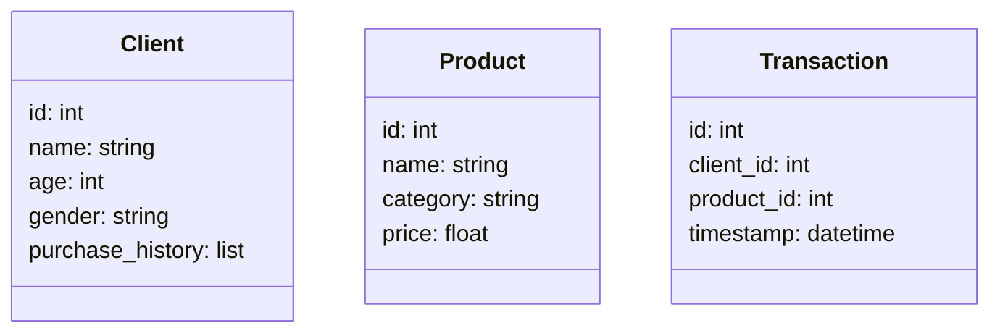
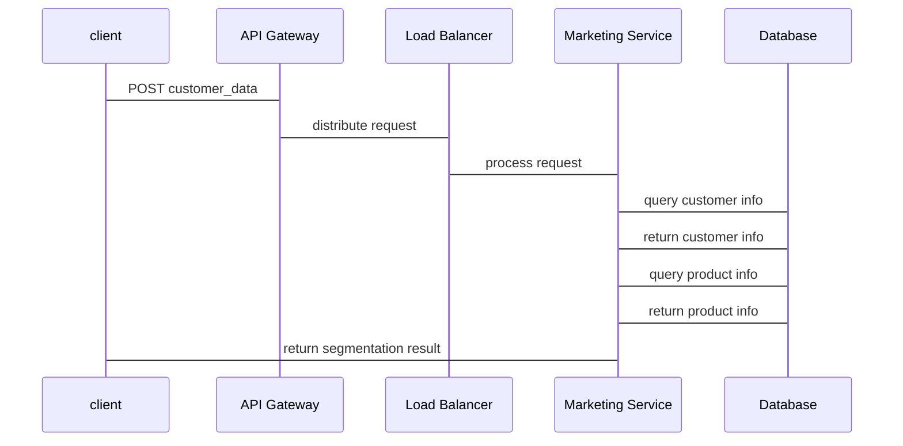

                 


# 第3章: AI辅助客户细分的算法原理

## 3.1 聚类算法在客户细分中的应用

### 3.1.1 K-means算法的原理

K-means是一种经典的无监督学习算法，主要用于聚类分析。其核心思想是将数据划分为K个簇，使得簇内数据点的相似性最大化。

#### 算法步骤：
1. 随机初始化K个簇中心。
2. 计算每个数据点到簇中心的距离，将其归类到最近的簇。
3. 重新计算每个簇的中心。
4. 重复步骤2和3，直到簇中心不再变化或达到预设的迭代次数。

#### 优缺点：
- **优点**：简单高效，易于实现。
- **缺点**：对初始中心敏感，可能收敛到局部最优。

#### 代码实现：
```python
from sklearn.cluster import KMeans
from sklearn.metrics import silhouette_score
import pandas as pd

# 假设我们有客户数据 dataframe，包含特征列
# 使用K-means进行聚类
kmeans = KMeans(n_clusters=3, random_state=0)
kmeans.fit(data)

# 计算 silhouette score 评估聚类效果
score = silhouette_score(data, kmeans.labels_)
print(f"Silhouette Score: {score}")
```

### 3.1.2 层次聚类算法的原理

层次聚类是一种基于树状结构的聚类方法，分为凝聚和分裂两种策略。常用的距离度量方法包括欧氏距离、曼哈顿距离等。

#### 算法步骤：
1. 计算所有样本之间的距离。
2. 按照距离大小合并最近的两个簇。
3. 重复步骤1和2，直到所有样本聚成一个簇。

#### 优缺点：
- **优点**：能够发现数据的层次结构。
- **缺点**：计算复杂度较高，适用于小数据集。

#### 代码实现：
```python
from sklearn.cluster import AgglomerativeClustering
import numpy as np

# 示例数据
X = np.array([[1, 2], [1, 3], [2, 2], [5, 5], [6, 6], [7, 6]])

# 使用层次聚类
clustering = AgglomerativeClustering(n_clusters=2, linkage='ward')
clustering.fit_predict(X)
```

### 3.1.3 DBSCAN算法的原理

DBSCAN是一种基于密度的聚类算法，能够发现任意形状的簇。核心概念是“核心点”和“边缘点”。

#### 算法步骤：
1. 选择一个未访问的点作为起点，计算其在半径ε内的点数。
2. 如果满足密度要求，则将该点及其邻居归为一类。
3. 重复上述步骤，直到所有点都被访问过。

#### 优缺点：
- **优点**：能够处理噪声点，发现任意形状的簇。
- **缺点**：对参数敏感，尤其是半径ε的选择。

#### 代码实现：
```python
from sklearn.cluster import DBSCAN
from sklearn.preprocessing import StandardScaler

# 标准化数据
scaler = StandardScaler()
data_scaled = scaler.fit_transform(data)

# 使用DBSCAN进行聚类
dbscan = DBSCAN(eps=0.5, min_samples=5)
dbscan.fit(data_scaled)

# 获取聚类标签
clusters = dbscan.labels_
print(f"Number of clusters: {len(set(clusters))}")
```

## 3.2 分类算法在精准营销中的应用

### 3.2.1 logistic回归算法

logistic回归是一种常用的分类算法，适用于二分类问题。其核心思想是通过sigmoid函数将线性回归的结果映射到概率空间。

#### 算法公式：
$$ P(y=1|x) = \frac{1}{1 + e^{-(\beta_0 + \beta_1x)}} $$

#### 优缺点：
- **优点**：简单易实现，适合线性可分问题。
- **缺点**：只能处理二分类问题，不适合高维数据。

#### 代码实现：
```python
from sklearn.linear_model import LogisticRegression
from sklearn.model_selection import train_test_split

# 分割数据
X_train, X_test, y_train, y_test = train_test_split(X, y, test_size=0.2)

# 使用logistic回归
lr = LogisticRegression()
lr.fit(X_train, y_train)

# 预测准确率
print(f"Accuracy: {lr.score(X_test, y_test)}")
```

### 3.2.2 支持向量机（SVM）算法

SVM是一种基于边界最优的分类算法，适用于高维数据。其核心思想是通过映射将数据转换到高维空间，然后寻找最优超平面。

#### 核函数：
- **线性核**：$$ g(x, x') = x \cdot x' $$
- **多项式核**：$$ g(x, x') = (x \cdot x' + c)^d $$
- **高斯核**：$$ g(x, x') = e^{-\gamma ||x - x'||^2} $$

#### 优缺点：
- **优点**：适合高维数据，泛化能力强。
- **缺点**：计算复杂度高，参数选择敏感。

#### 代码实现：
```python
from sklearn import svm

# 使用SVM进行分类
model = svm.SVC(kernel='rbf', gamma='auto')
model.fit(X_train, y_train)

# 预测准确率
print(f"Accuracy: {model.score(X_test, y_test)}")
```

### 3.2.3 随机森林算法

随机森林是一种基于决策树的集成学习算法，通过投票机制进行分类。

#### 核心参数：
- **n_estimators**：树的数量。
- **max_depth**：树的最大深度。

#### 优缺点：
- **优点**：鲁棒性强，适合高维数据。
- **缺点**：计算资源消耗大。

#### 代码实现：
```python
from sklearn.ensemble import RandomForestClassifier

# 使用随机森林进行分类
rf = RandomForestClassifier(n_estimators=100, max_depth=2, random_state=0)
rf.fit(X_train, y_train)

# 预测准确率
print(f"Accuracy: {rf.score(X_test, y_test)}")
```

## 3.3 关联规则挖掘在客户细分中的应用

### 3.3.1 关联规则挖掘的基本概念

关联规则挖掘旨在发现数据中的频繁项集和关联规则。常用的算法有Apriori和FPGrowth。

#### Apriori算法步骤：
1. 生成所有单个项的频繁项集。
2. 逐步增加项的数量，生成候选项集。
3. 剪枝不满足频繁度的项集。
4. 生成关联规则。

### 3.3.2 基于Apriori算法的关联规则挖掘

#### 代码实现：
```python
from mlxtend.frequent_patterns import apriori, association_rules

# 使用Apriori算法生成频繁项集
frequent_itemsets = apriori(data, min_support=0.2, use_colnames=True)

# 生成关联规则
rules = association_rules(frequent_itemsets, metric='lift', min_threshold=1)
print(rules)
```

### 3.3.3 关联规则在客户细分中的应用

关联规则可以发现客户的购买行为模式，从而进行精准营销。例如，发现购买特定商品的客户群体，制定针对性的促销策略。

---

# 第4章: 精准营销的系统架构与设计

## 4.1 问题场景介绍

精准营销系统需要处理大量客户数据，包括客户的 demographic、behavioral、transactional 等信息。系统目标是通过AI技术实现客户细分和个性化推荐。

## 4.2 系统功能设计

### 4.2.1 领域模型设计


### 4.2.2 系统架构设计
```mermaid
client
    |- request
    |- response
server
    |- API Gateway
    |- Load Balancer
    |- Marketing Service
        |- Customer Segmentation
        |- Recommendation Engine
    |- Database
        |- Customer Database
        |- Product Database
```

### 4.2.3 系统接口设计

- **输入接口**：接收客户数据和交易记录。
- **输出接口**：提供客户细分结果和推荐列表。

### 4.2.4 系统交互流程


---

# 第5章: 项目实战——AI辅助客户细分与精准营销系统实现

## 5.1 环境安装

### 5.1.1 安装必要的库
- **Python**：3.8+
- **库**：`pandas`, `scikit-learn`, `mlxtend`

### 5.1.2 数据准备
使用电商客户数据集，包含客户的购买记录、产品偏好等信息。

## 5.2 系统核心实现

### 5.2.1 数据预处理
```python
import pandas as pd
from sklearn.preprocessing import StandardScaler

# 读取数据
data = pd.read_csv('customer_data.csv')

# 删除缺失值
data = data.dropna()

# 标准化数据
scaler = StandardScaler()
data_scaled = scaler.fit_transform(data)
```

### 5.2.2 客户细分
```python
from sklearn.cluster import KMeans

# 初始化K-means模型
kmeans = KMeans(n_clusters=5, random_state=0)

# 训练模型
kmeans.fit(data_scaled)

# 获取聚类标签
labels = kmeans.labels_
```

### 5.2.3 精准营销策略
```python
from sklearn.linear_model import LogisticRegression

# 分割数据
X_train, X_test, y_train, y_test = train_test_split(X, y, test_size=0.2)

# 初始化模型
lr = LogisticRegression()

# 训练模型
lr.fit(X_train, y_train)

# 预测准确率
print(f"Accuracy: {lr.score(X_test, y_test)}")
```

## 5.3 案例分析与结果解读

### 5.3.1 聚类结果分析
将客户分为5类，分析每类的特征，如消费金额、购买频率等。

### 5.3.2 分类模型评估
评估模型的准确率、召回率、F1分数等指标，优化模型参数。

---

# 第6章: 系统优化与扩展

## 6.1 系统优化策略

### 6.1.1 数据质量优化
- 数据清洗
- 数据增强

### 6.1.2 模型优化
- 调参优化
- 模型融合

### 6.1.3 系统性能优化
- 异常处理
- 并行计算

## 6.2 系统扩展方向

### 6.2.1 实时分析
支持实时数据处理，快速响应客户需求。

### 6.2.2 多模态分析
结合文本、图像等多种数据源，提升分析精度。

### 6.2.3 自适应优化
根据实时数据动态调整模型参数，提升营销效果。

---

# 第7章: 最佳实践与小结

## 7.1 最佳实践

### 7.1.1 数据预处理
- 清洗数据
- 标准化数据

### 7.1.2 模型选择
- 根据数据特性选择合适的算法
- 多算法对比测试

### 7.1.3 系统部署
- 使用容器化技术部署
- 定期更新模型

## 7.2 小结

AI技术为精准营销带来了新的可能性，通过客户细分和个性化推荐，企业可以更精准地触达目标客户，提升营销效果。然而，实际应用中仍需注意数据隐私、模型解释性等问题。

---

# 附录: 参考文献

1. Bishop, C. M. (2006). Pattern Recognition and Machine Learning.
2. Hastie, T., Tibshirani, R., & Friedman, J. (2009). The Elements of Statistical Learning.
3. 周志华. (2016). 机器学习.

---

作者：AI天才研究院/AI Genius Institute & 禅与计算机程序设计艺术 /Zen And The Art of Computer Programming

