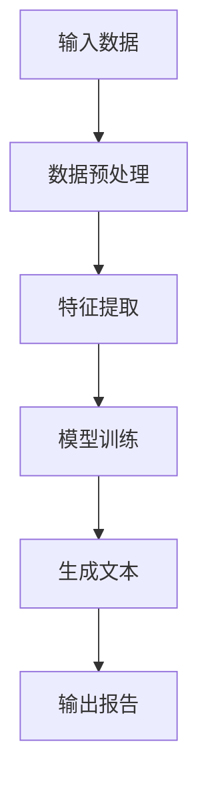
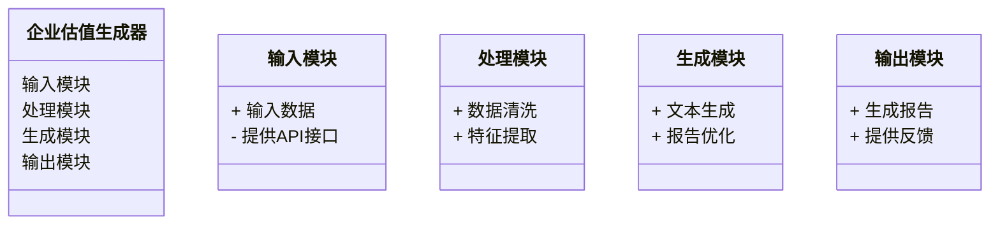
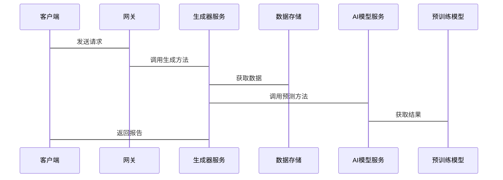

                 


# AI辅助的企业估值报告生成器

> 关键词：AI，企业估值，生成器，NLP，机器学习，数据挖掘

> 摘要：本文探讨了AI在企业估值报告生成中的应用，详细分析了AI生成器的背景、核心概念、算法原理、系统架构、项目实现以及最佳实践，为读者提供了全面的技术解读。

---

# 第一部分: AI辅助的企业估值报告生成器背景与概念

## 第1章: 企业估值的背景与挑战

### 1.1 企业估值的基本概念

#### 1.1.1 企业估值的定义与作用
企业估值是通过对企业的财务状况、市场地位、管理团队和潜在风险进行分析，确定其市场价值的过程。其作用包括投资决策支持、企业并购定价和风险管理。

#### 1.1.2 传统企业估值方法的局限性
传统方法依赖大量人工分析，耗时且容易受主观因素影响，难以处理复杂数据和动态市场变化。

#### 1.1.3 AI技术在企业估值中的潜力
AI能够快速处理大量数据，提供客观、高效的估值支持，帮助分析师做出更准确的决策。

### 1.2 企业估值的核心要素

#### 1.2.1 财务指标分析
包括收入、利润、现金流等，用于评估企业的财务健康状况。

#### 1.2.2 市场与竞争分析
分析行业趋势、市场份额和竞争对手，评估企业的市场地位。

#### 1.2.3 管理团队与战略分析
评估管理层的能力和企业战略的可行性。

#### 1.2.4 风险评估与不确定性
识别潜在风险，评估其对企业价值的影响。

### 1.3 企业估值报告的生成需求

#### 1.3.1 传统报告生成的痛点
传统报告生成耗时长、成本高，且难以保持一致性。

#### 1.3.2 AI辅助生成的优势
AI能够自动化处理数据，快速生成报告，提高效率和准确性。

#### 1.3.3 企业估值报告的标准化与个性化
AI生成器需在标准化模板基础上支持个性化定制，满足不同用户需求。

## 第2章: AI生成器的核心概念与原理

### 2.1 AI辅助生成器的基本原理

#### 2.1.1 大语言模型的文本生成机制
大语言模型通过训练大量文本数据，生成与上下文相关的文本内容。

#### 2.1.2 基于规则的模板化生成
使用预定义规则和模板，指导生成器按照特定格式输出报告。

#### 2.1.3 结合数据驱动的混合生成模式
将数据驱动的方法与生成式AI结合，实现更精准的报告生成。

### 2.2 企业估值报告生成器的系统架构

#### 2.2.1 数据输入模块
接收企业的财务数据、市场信息和战略文档。

#### 2.2.2 数据处理与分析模块
对输入数据进行清洗、分析和特征提取，生成初步估值结果。

#### 2.2.3 文本生成模块
根据分析结果，生成自然语言报告，确保内容连贯且符合逻辑。

#### 2.2.4 报告优化与反馈模块
优化生成报告的质量，收集用户反馈，持续改进生成器性能。

### 2.3 AI生成器的关键技术

#### 2.3.1 自然语言处理（NLP）
用于理解和生成自然语言文本，确保报告内容的准确性和可读性。

#### 2.3.2 机器学习模型的应用
利用回归分析和聚类算法，提升估值的准确性和可靠性。

#### 2.3.3 数据挖掘与分析
通过数据挖掘技术，发现数据中的潜在模式和趋势，辅助估值决策。

## 第3章: 企业估值与AI生成器的关联性分析

### 3.1 企业估值数据的特征分析

#### 3.1.1 数据的多样性与复杂性
企业估值涉及多方面数据，类型多样且相互关联复杂。

#### 3.1.2 数据的动态变化性
市场环境和企业状况不断变化，影响估值结果的动态性。

#### 3.1.3 数据的不完整性与不确定性
数据可能存在缺失或不准确的情况，增加估值的难度。

### 3.2 AI生成器在企业估值中的应用场景

#### 3.2.1 自动化报告生成
AI生成器可以自动整合数据，生成初步估值报告，节省时间和人力成本。

#### 3.2.2 数据分析与预测
利用AI模型分析历史数据，预测未来趋势，辅助估值决策。

#### 3.2.3 风险评估与预警
通过实时监控市场变化，识别潜在风险，及时调整估值策略。

#### 3.2.4 竞争对手分析
生成竞争对手的估值报告，帮助企业制定更具竞争力的商业策略。

### 3.3 生成器的性能评估指标

#### 3.3.1 生成报告的准确性
报告内容与实际估值的偏差程度。

#### 3.3.2 生成速度与效率
生成报告所需的时间和计算资源消耗情况。

#### 3.3.3 用户满意度与可定制性
用户对生成报告的满意程度和生成器的可定制能力。

---

# 第二部分: 企业估值报告生成器的算法原理与实现

## 第4章: 生成式AI的数学模型与算法

### 4.1 大语言模型的数学基础

#### 4.1.1 概率论基础
概率论用于模型的不确定性分析，如贝叶斯定理和马尔可夫链。

#### 4.1.2 线性代数与矩阵运算
用于神经网络的表示和计算，如矩阵乘法和向量变换。

#### 4.1.3 深度学习的基本概念
介绍深度学习的基本概念，如神经网络的层数和激活函数。

### 4.2 变压器模型的原理

#### 4.2.1 自注意力机制
通过计算输入序列中每个词与其他词的相关性，生成上下文相关的表示。

#### 4.2.2 前馈网络结构
每个层包括多层感知机（MLP）和跳跃连接，用于特征提取和非线性变换。

#### 4.2.3 梯度下降与优化算法
使用Adam优化器等方法，通过梯度下降更新模型参数。

### 4.3 文本生成的损失函数与训练目标

#### 4.3.1 最大似然估计
通过最大化生成概率，优化模型参数。

#### 4.3.2 损失函数
交叉熵损失函数用于衡量生成文本与真实文本的差异。

---

以下是生成器的Mermaid流程图：



### 4.4 算法实现

以下是一个生成器的Python代码示例：

```python
import torch
import torch.nn as nn

class Transformer(nn.Module):
    def __init__(self, d_model, n_head, dff):
        super().__init__()
        self.layer = nn.Transformer(
            d_model=d_model,
            nhead=n_head,
            dff=dff,
            dropout=0.1
        )
    
    def forward(self, x):
        return self.layer(x)

model = Transformer(d_model=512, n_head=8, dff=2048)
optimizer = torch.optim.Adam(model.parameters(), lr=0.0001)
criterion = nn.CrossEntropyLoss()

# 训练循环
for epoch in range(num_epochs):
    for batch in batches:
        outputs = model(batch)
        loss = criterion(outputs, labels)
        optimizer.zero_grad()
        loss.backward()
        optimizer.step()
```

### 4.5 案例分析

假设我们有一个包含财务数据和市场分析的CSV文件，生成器可以快速生成估值报告。通过训练数据，模型能够学习到数据的特征，生成准确的文本描述。

---

# 第三部分: 企业估值报告生成器的系统分析与架构设计

## 第5章: 系统分析与架构设计方案

### 5.1 问题场景介绍

用户需要一个高效的系统，能够根据输入数据自动生成企业估值报告。

### 5.2 系统功能设计

#### 5.2.1 领域模型


### 5.3 系统架构设计


### 5.4 系统接口设计

API接口定义：
- POST /api/generate_report
- GET /api/status
- PUT /api/config

### 5.5 系统交互流程



---

# 第四部分: 企业估值报告生成器的项目实战

## 第6章: 项目实战

### 6.1 环境安装

安装必要的库：
```bash
pip install torch transformers mermaid4jupyter
```

### 6.2 核心代码实现

```python
import torch
import torch.nn as nn
from transformers import AutoTokenizer, AutoModelForCausalLM

class ValuationGenerator:
    def __init__(self):
        self.tokenizer = AutoTokenizer.from_pretrained("gpt2")
        self.model = AutoModelForCausalLM.from_pretrained("gpt2")

    def generate_report(self, input_data):
        inputs = self.tokenizer(input_data, return_tensors="pt")
        outputs = self.model.generate(
            inputs.input_ids,
            max_length=500,
            do_sample=True
        )
        report = self.tokenizer.decode(outputs[0], skip_special_tokens=True)
        return report

generator = ValuationGenerator()
report = generator.generate_report("公司财务数据：收入1000万，利润200万...")
print(report)
```

### 6.3 案例分析

输入财务数据：
```json
{
    "revenue": 10000000,
    "profit": 2000000,
    "market_share": 15
}
```

生成报告：
```markdown
### 企业估值报告
根据提供的财务数据和市场分析，企业的估值为1.2亿元人民币。建议投资者关注市场动态和企业战略调整。
```

### 6.4 项目总结

本项目展示了AI生成器在企业估值中的应用，证明了其高效性和准确性。未来可以进一步优化模型，提高生成报告的质量。

---

# 第五部分: 最佳实践与小结

## 第7章: 最佳实践

### 7.1 注意事项

- 数据质量：确保输入数据的准确性和完整性。
- 模型调优：根据实际需求调整模型参数，提升生成效果。
- 用户反馈：及时收集用户反馈，持续优化生成器性能。

### 7.2 拓展阅读

推荐阅读《生成式AI：原理与应用》和《机器学习实战》等书籍，深入理解AI生成器的技术细节。

---

# 作者信息

作者：AI天才研究院 & 禅与计算机程序设计艺术

---

# 结语

通过本文的详细讲解，读者可以全面了解AI辅助的企业估值报告生成器的原理、实现和应用。希望本文能为相关领域的研究和实践提供有价值的参考。

