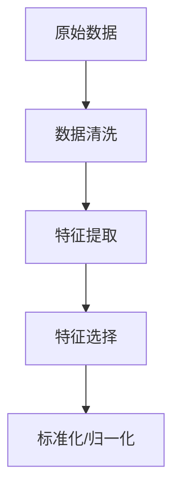
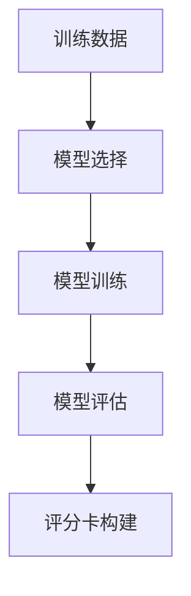
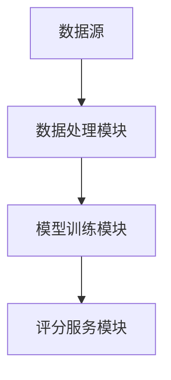

                 


# AI辅助的企业信用评分卡开发平台

> 关键词：企业信用评分卡、人工智能、机器学习、信用评估、评分模型、数据挖掘

> 摘要：本文深入探讨了AI技术在企业信用评分卡开发中的应用，从背景介绍到核心概念，再到算法原理、系统架构、项目实战和总结展望，系统地分析了AI如何提升信用评分卡的开发效率和准确性。通过详细的技术分析和实际案例，本文为读者提供了全面的指导，帮助他们理解和应用AI技术来构建高效的信用评分系统。

---

## 第一部分: AI辅助的企业信用评分卡开发背景与基础

### 第1章: 企业信用评分卡概述

#### 1.1 企业信用评分卡的基本概念

企业信用评分卡是一种用于评估企业信用状况的工具，通过整合企业的财务数据、市场表现和经营状况等多维度信息，利用数学模型计算出一个综合评分，反映企业的信用风险水平。评分结果通常用于银行、金融机构和供应链企业等在信贷审批、风险控制和供应商选择等场景中的决策支持。

**1.1.1 信用评分卡的定义**

信用评分卡是一种量化评估工具，通过对企业历史交易数据、财务报表、市场表现等多维度信息进行分析，利用统计模型或机器学习算法计算出一个信用评分，用以反映企业的信用风险等级。评分结果通常分为A、B、C、D、E等等级别，等级越高表示信用风险越低。

**1.1.2 信用评分卡的作用与意义**

信用评分卡在企业信用管理中具有重要作用，主要体现在以下几个方面：

- **风险控制**：通过信用评分卡，金融机构可以快速评估企业的信用风险，从而做出是否授信的决策。
- **提高效率**：传统的信用评估过程通常耗时较长，且依赖于人工经验，而信用评分卡可以通过自动化的方式快速完成评估。
- **数据驱动决策**：信用评分卡基于企业的多维度数据，能够提供更加客观和准确的信用评估结果，减少人为因素的干扰。

**1.1.3 企业信用评分卡的核心要素**

企业信用评分卡的核心要素包括以下几个方面：

- **企业基本信息**：包括企业注册信息、股东结构、经营范围等。
- **财务数据**：包括资产负债表、利润表、现金流量表等财务报表数据。
- **经营状况**：包括企业销售额、利润率、市场占有率等经营指标。
- **信用历史**：包括企业过去的信用记录、违约情况等。
- **行业风险**：包括所在行业的整体风险水平、市场环境等。

#### 1.2 AI技术在信用评分卡中的应用价值

AI技术在信用评分卡开发中的应用价值主要体现在以下几个方面：

- **提高评估准确性**：通过机器学习算法，AI能够从海量数据中提取特征，并构建更加复杂的模型，从而提高信用评分的准确性。
- **自动化特征工程**：传统信用评分卡开发过程中，特征工程需要大量人工经验，而AI技术可以通过自动化方式提取特征，减少人为干预。
- **实时更新与维护**：AI技术可以通过实时数据流处理，动态更新信用评分模型，保持评分结果的及时性和准确性。

---

### 第2章: AI辅助的企业信用评分卡开发背景

#### 2.1 传统信用评分卡开发的痛点

传统信用评分卡开发过程中存在以下几个主要痛点：

- **数据收集与处理的挑战**：企业信用评分卡的开发需要整合多来源、多格式的数据，数据清洗和预处理过程耗时且复杂。
- **模型开发的复杂性**：传统信用评分卡开发过程中，模型选择和参数调优需要大量专业知识和经验，且模型效果难以量化。
- **评分卡维护与更新的困难**：信用评分卡的维护和更新需要定期重新收集数据、重新训练模型，过程繁琐且成本高。

#### 2.2 AI技术在信用评分卡开发中的应用背景

随着AI技术的快速发展，特别是在机器学习、深度学习和自然语言处理等领域的突破，AI技术在信用评分卡开发中的应用逐渐成为可能。AI技术的优势在于其强大的数据处理能力、自动化特征工程和模型优化能力，能够显著提高信用评分卡的开发效率和准确性。

---

## 第二部分: AI辅助的企业信用评分卡开发的核心概念与联系

### 第3章: AI技术在信用评分卡开发中的核心概念

#### 3.1 数据处理与特征工程

在AI辅助的信用评分卡开发过程中，数据处理和特征工程是至关重要的步骤。以下是详细的步骤说明：

- **数据收集**：从企业财务数据、交易记录、市场数据等多来源获取数据。
- **数据清洗**：对数据进行去重、填充缺失值、处理异常值等预处理操作。
- **特征提取**：通过统计方法或机器学习算法提取具有代表性的特征，例如将文本数据转化为向量表示。
- **特征选择**：通过相关性分析、LASSO回归等方法选择对信用评分影响较大的特征。

**3.1.1 数据处理流程图**



#### 3.2 模型训练与评分卡构建

模型训练是信用评分卡开发的核心环节，以下是详细的步骤说明：

- **模型选择**：根据业务需求和数据特点选择合适的模型，例如逻辑回归、随机森林等。
- **模型训练**：使用训练数据对模型进行训练，调整模型参数以优化模型性能。
- **模型评估**：通过交叉验证、ROC曲线等方法评估模型的性能，并进行模型调优。
- **评分卡构建**：根据模型输出的结果，将企业的信用评分划分为不同的等级。

**3.2.1 模型训练流程图**



---

## 第三部分: AI辅助的企业信用评分卡开发算法原理

### 第4章: 常见算法原理与实现

#### 4.1 逻辑回归算法

逻辑回归是一种常用的分类算法，适用于二分类问题。其核心思想是通过建立一个线性回归模型，将输入特征映射到一个概率值，再通过阈值判断分类结果。以下是逻辑回归的数学模型：

$$ P(y=1|x) = \frac{1}{1 + e^{- (\beta_0 + \beta_1 x_1 + \cdots + \beta_n x_n)}} $$

其中，$\beta_0$ 是截距项，$\beta_1, \beta_2, \cdots, \beta_n$ 是特征的系数。

**4.1.1 逻辑回归代码实现**

```python
import numpy as np
from sklearn.linear_model import LogisticRegression

# 数据预处理
X = ...
y = ...

# 模型训练
model = LogisticRegression()
model.fit(X, y)

# 模型预测
y_pred = model.predict(X)
```

#### 4.2 随机森林算法

随机森林是一种基于决策树的集成学习算法，具有较高的准确性和鲁棒性。以下是随机森林的核心步骤：

- **决策树构建**：通过随机采样和特征选择构建多棵决策树。
- **投票或加权预测**：将多棵决策树的预测结果进行投票或加权，得到最终的预测结果。

**4.2.1 随机森林代码实现**

```python
from sklearn.ensemble import RandomForestClassifier

# 模型训练
model = RandomForestClassifier(n_estimators=100, max_depth=2, random_state=0)
model.fit(X, y)

# 模型预测
y_pred = model.predict(X)
```

---

## 第四部分: AI辅助的企业信用评分卡开发系统架构

### 第5章: 系统分析与架构设计

#### 5.1 系统功能设计

企业信用评分卡开发平台需要具备以下核心功能：

- **数据采集**：从多种数据源获取企业数据，包括财务数据、市场数据等。
- **数据处理**：对数据进行清洗、特征提取和特征选择。
- **模型训练**：选择合适的算法，训练信用评分模型。
- **评分服务**：提供API接口，供外部系统调用信用评分服务。

**5.1.1 系统功能模块图**



#### 5.2 系统架构设计

企业信用评分卡开发平台的系统架构可以分为以下几个层次：

- **数据层**：存储企业的原始数据和处理后的数据。
- **计算层**：负责数据的处理和模型的训练。
- **服务层**：提供信用评分服务的API接口。
- **应用层**：提供用户界面，供用户查看和管理信用评分结果。

**5.2.1 系统架构图**


---

## 第五部分: AI辅助的企业信用评分卡开发项目实战

### 第6章: 项目开发与实现

#### 6.1 环境搭建

开发AI辅助的企业信用评分卡平台，需要以下环境：

- **编程语言**：Python 3.6+
- **机器学习库**：scikit-learn、xgboost
- **数据处理库**：pandas、numpy
- **可视化工具**：matplotlib、seaborn

#### 6.2 核心代码实现

以下是信用评分卡开发平台的核心代码实现：

```python
import pandas as pd
from sklearn.model_selection import train_test_split
from sklearn.metrics import accuracy_score

# 数据加载
data = pd.read_csv('enterprise_data.csv')
X = data.drop('credit_score', axis=1)
y = data['credit_score']

# 数据分割
X_train, X_test, y_train, y_test = train_test_split(X, y, test_size=0.2, random_state=42)

# 模型训练
from sklearn.linear_model import LogisticRegression
model = LogisticRegression()
model.fit(X_train, y_train)

# 模型预测
y_pred = model.predict(X_test)

# 模型评估
print('准确率:', accuracy_score(y_test, y_pred))
```

---

## 第六部分: 总结与展望

### 第7章: 总结与展望

#### 7.1 总结

本文详细介绍了AI技术在企业信用评分卡开发中的应用，从背景介绍到核心概念，再到算法原理、系统架构和项目实战，全面系统地分析了AI如何提升信用评分卡的开发效率和准确性。通过具体的代码实现和实际案例，本文为读者提供了全面的指导，帮助他们理解和应用AI技术来构建高效的信用评分系统。

#### 7.2 展望

随着AI技术的不断发展，未来企业信用评分卡开发平台将更加智能化和自动化。以下是未来的发展方向：

- **引入更复杂的模型**：如深度学习模型（LSTM、BERT等）来进一步提高评分的准确性。
- **实时数据处理**：通过流数据处理技术，实时更新信用评分模型，保持评分结果的实时性。
- **多模态数据融合**：将文本数据、图像数据等多模态数据与结构化数据相结合，构建更加全面的信用评分模型。

---

## 作者信息

作者：AI天才研究院/AI Genius Institute  
邮箱：contact@aicredit.com  
博客：https://www.aicredit.com

---

以上就是《AI辅助的企业信用评分卡开发平台》的完整内容，希望对您有所帮助！

