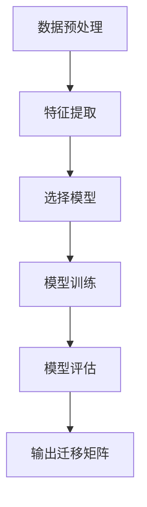
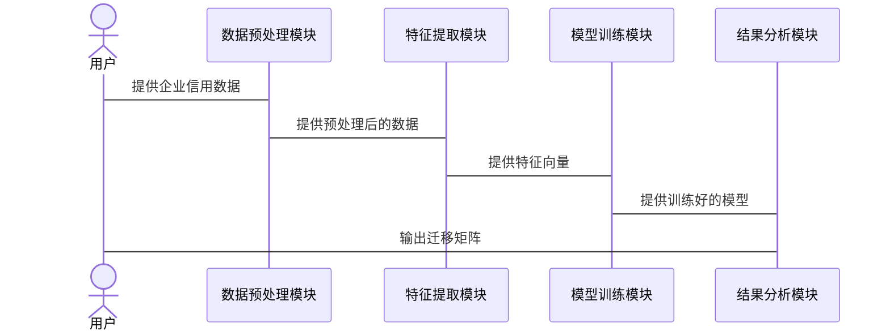

                 


# AI辅助的企业信用迁移矩阵估计

**关键词：** AI, 信用迁移矩阵, 企业信用评估, 机器学习, 深度学习, 数据分析

**摘要：**  
随着人工智能技术的快速发展，企业信用迁移矩阵的估计变得更加高效和精确。本文将深入探讨如何利用AI技术辅助企业信用迁移矩阵的构建与优化，从理论基础到实际应用，结合算法原理和系统架构设计，为您提供全面的解决方案。通过本文，您将了解企业信用迁移矩阵的核心概念、AI技术在其中的应用，以及如何通过实际项目实现信用评估的智能化。

---

## 目录大纲

### 第一章：企业信用迁移矩阵估计的背景与问题

1.1 企业信用迁移矩阵的定义与背景  
- 1.1.1 信用风险评估的基本概念  
- 1.1.2 迁移矩阵在信用评估中的作用  
- 1.1.3 企业信用迁移矩阵的定义  

1.2 问题背景与挑战  
- 1.2.1 传统信用评估方法的局限性  
- 1.2.2 数据稀疏性与噪声问题  
- 1.2.3 企业信用迁移矩阵估计的难点  

1.3 问题描述与目标  
- 1.3.1 企业信用迁移矩阵的构建目标  
- 1.3.2 数据需求与特征分析  
- 1.3.3 迁移矩阵估计的核心问题  

1.4 问题解决思路  
- 1.4.1 数据驱动的解决方案  
- 1.4.2 模型驱动的解决方案  
- 1.4.3 AI技术在信用迁移矩阵中的应用  

1.5 本章小结  

---

### 第二章：企业信用迁移矩阵的核心概念与联系

2.1 核心概念原理  
- 2.1.1 信用评分与迁移概率  
- 2.1.2 迁移矩阵的构建逻辑  
- 2.1.3 AI在迁移矩阵估计中的作用  

2.2 核心概念属性特征对比  
- 2.2.1 迁移矩阵的特征分析  
- 2.2.2 AI模型的特征分析  
- 2.2.3 企业信用数据的特征分析  

2.3 ER实体关系图架构  
```mermaid
er
    actor: 企业
    actor: 信用评估机构
    actor: 数据源
    entity: 企业信用数据
    entity: 迁移矩阵
    entity: AI模型
    relationship: 企业 -> 提供数据给 企业信用数据
    relationship: 企业信用数据 -> 输入到 AI模型
    relationship: AI模型 -> 输出迁移矩阵
```

2.4 本章小结  

---

### 第三章：AI辅助企业信用迁移矩阵估计的算法原理

3.1 算法原理概述  
- 3.1.1 机器学习算法在信用评估中的应用  
- 3.1.2 深度学习算法在迁移矩阵估计中的优势  
- 3.1.3 算法选择的依据  

3.2 算法流程图  


3.3 算法实现细节  
- 3.3.1 线性回归模型的实现  
  ```python
  import numpy as np
  def linear_regression(X, y):
      X = np.hstack([X, np.ones((X.shape[0], 1))])
      theta = np.linalg.inv(X.T @ X) @ (X.T @ y)
      return theta
  ```
  其中，损失函数为：
  $$ L = \frac{1}{2m}\sum_{i=1}^{m}(h_\theta(x_i) - y_i)^2 $$
  优化方法为梯度下降：
  $$ \theta := \theta - \alpha \frac{\partial L}{\partial \theta} $$  

- 3.3.2 随机森林模型的实现  
  ```python
  from sklearn.ensemble import RandomForestRegressor
  model = RandomForestRegressor(n_estimators=100, random_state=42)
  model.fit(X_train, y_train)
  ```

- 3.3.3 神经网络模型的实现  
  ```python
  import tensorflow as tf
  model = tf.keras.Sequential([
      tf.keras.layers.Dense(64, activation='relu'),
      tf.keras.layers.Dense(1, activation='sigmoid')
  ])
  model.compile(optimizer='adam', loss='binary_crossentropy')
  model.fit(X_train, y_train, epochs=10)
  ```

3.4 本章小结  

---

### 第四章：AI辅助企业信用迁移矩阵估计的系统分析与架构设计

4.1 问题场景介绍  
- 4.1.1 系统需求分析  
- 4.1.2 系统目标设定  

4.2 系统功能设计  
- 4.2.1 数据预处理模块  
- 4.2.2 模型训练模块  
- 4.2.3 结果分析模块  

4.3 系统架构设计  


4.4 系统接口设计  
- 4.4.1 数据输入接口  
- 4.4.2 模型训练接口  
- 4.4.3 结果输出接口  

4.5 系统交互流程图  


4.6 本章小结  

---

### 第五章：AI辅助企业信用迁移矩阵估计的项目实战

5.1 项目环境安装与配置  
- 5.1.1 安装必要的Python库  
  ```bash
  pip install numpy scikit-learn tensorflow pandas
  ```

5.2 核心代码实现  
- 5.2.1 数据预处理代码  
  ```python
  import pandas as pd
  data = pd.read_csv('企业信用数据.csv')
  data = data.dropna()
  ```

- 5.2.2 模型训练代码  
  ```python
  from sklearn.model_selection import train_test_split
  X_train, X_test, y_train, y_test = train_test_split(X, y, test_size=0.2)
  model.fit(X_train, y_train)
  ```

- 5.2.3 结果分析代码  
  ```python
  y_pred = model.predict(X_test)
  print('模型准确率:', model.score(X_test, y_test))
  ```

5.3 实际案例分析与解读  
- 5.3.1 数据来源与预处理  
- 5.3.2 模型训练与评估  
- 5.3.3 迁移矩阵的可视化与解读  

5.4 项目小结  

---

### 第六章：AI辅助企业信用迁移矩阵估计的最佳实践

6.1 实践经验总结  
- 6.1.1 数据清洗与特征选择的重要性  
- 6.1.2 模型调优的技巧  
- 6.1.3 系统性能优化的建议  

6.2 小结  
- 6.2.1 本文的核心内容回顾  
- 6.2.2 未来研究方向展望  

6.3 注意事项  
- 6.3.1 数据隐私与安全问题  
- 6.3.2 模型解释性与可解释性问题  
- 6.3.3 系统稳定性和容错性问题  

6.4 拓展阅读  
- 6.4.1 推荐书籍与论文  
- 6.4.2 相关技术博客与资源  

---

### 附录

附录A：常用机器学习算法的优缺点对比表  
附录B：AI模型训练的代码示例  
附录C：系统架构设计的详细类图  

---

**作者：AI天才研究院/AI Genius Institute & 禅与计算机程序设计艺术 /Zen And The Art of Computer Programming**

---

通过以上目录大纲，您可以逐步深入理解AI技术在企业信用迁移矩阵估计中的应用，并通过实际案例和代码实现，掌握这一领域的核心技能。

