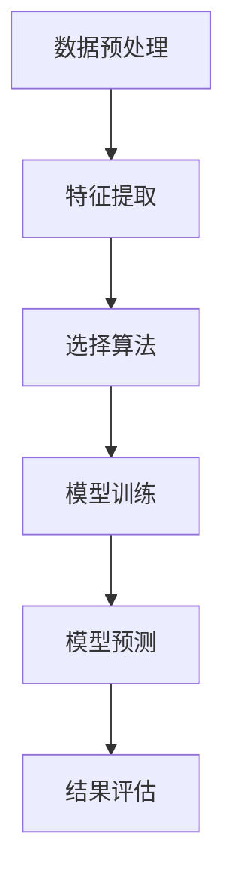
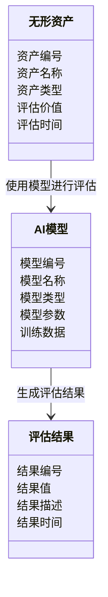
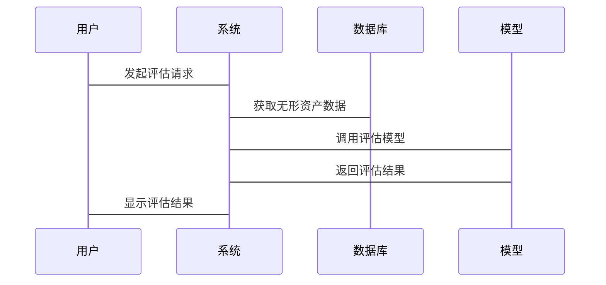

                 


# AI辅助的企业无形资产价值评估

> 关键词：AI，企业价值评估，无形资产，机器学习，资产评估，人工智能

> 摘要：本文将详细探讨AI技术在企业无形资产价值评估中的应用。通过分析AI技术的核心原理，结合实际案例，展示如何利用AI模型提升无形资产评估的准确性与效率。文章内容包括：企业无形资产的基本概念、AI技术的应用原理、相关算法的数学模型、系统架构设计、项目实战案例以及未来发展方向。

---

## 第1章: 背景介绍

### 1.1 问题背景

#### 1.1.1 无形资产的定义与分类
无形资产是指企业拥有或控制的没有实物形态的资产，主要包括品牌价值、专利权、商标权、商誉、客户关系、技术诀窍等。这些资产在企业价值中占据重要地位，尤其是在科技型企业和创新型行业中。

#### 1.1.2 无形资产评估的难点与挑战
传统的企业无形资产评估方法通常依赖于财务数据和市场分析，具有主观性较强、数据获取困难、评估结果不够精准等缺点。此外，市场环境的变化、企业战略调整等因素也会对无形资产价值产生影响。

#### 1.1.3 AI技术在无形资产评估中的优势
AI技术通过大数据分析、机器学习等方法，能够从海量数据中提取有价值的信息，帮助评估人员更准确地判断无形资产的价值。AI技术还能够快速响应市场变化，提供实时的评估结果。

### 1.2 问题描述

#### 1.2.1 无形资产评估的核心问题
- 数据不足或不准确
- 评估模型的主观性
- 市场环境的不确定性

#### 1.2.2 传统评估方法的局限性
- 依赖人工判断，结果可能存在偏差
- 数据获取成本高，处理复杂
- 无法实时更新，难以应对快速变化的市场环境

#### 1.2.3 利用AI技术解决评估问题的可行性
- 利用机器学习模型提高评估准确性
- 通过大数据分析降低数据获取成本
- 实现实时评估，快速响应市场变化

### 1.3 解决策略

#### 1.3.1 引入机器学习模型
利用监督学习、无监督学习等方法，训练模型对无形资产价值进行预测。

#### 1.3.2 数据采集与预处理
通过爬虫技术、API接口等方式获取企业公开数据、行业数据等，并进行清洗和特征提取。

#### 1.3.3 模型优化与调参
通过交叉验证、网格搜索等方法优化模型参数，提高预测精度。

#### 1.3.4 结果验证与反馈
利用实际案例验证模型的预测结果，根据反馈不断优化模型。

### 1.4 边界与外延

#### 1.4.1 无形资产评估的边界
- 数据范围的限制
- 模型适用场景的限制
- 评估结果的解释性

#### 1.4.2 AI技术在无形资产评估中的外延
- 支持多维度分析
- 实现跨行业应用
- 提供动态评估结果

### 1.5 核心要素组成

#### 1.5.1 数据要素
- 企业财务数据
- 行业市场数据
- 用户行为数据

#### 1.5.2 模型要素
- 特征工程
- 算法选择
- 模型训练

#### 1.5.3 应用要素
- 数据接口
- 评估系统
- 结果可视化

### 1.6 本章小结
通过本章的介绍，我们了解了AI技术在企业无形资产评估中的背景、问题及解决策略，为后续章节的深入分析奠定了基础。

---

## 第2章: 核心概念与联系

### 2.1 无形资产评估的理论基础

#### 2.1.1 无形资产评估的基本原理
- 数据驱动的评估方法
- 统计建模与预测
- 多因素分析

#### 2.1.2 无形资产评估的常用方法
- 收益法
- 市场法
- 成本法

#### 2.1.3 AI技术如何辅助评估
- 数据清洗与特征提取
- 模型训练与预测
- 结果分析与优化

### 2.2 AI在无形资产评估中的应用原理

#### 2.2.1 AI技术的核心要素
- 数据
- 算法
- 计算能力

#### 2.2.2 AI模型的评估机制
- 数据预处理
- 模型训练
- 结果预测

#### 2.2.3 AI模型与传统评估方法的对比分析
- 传统方法 vs AI方法
- 优缺点对比
- 综合应用策略

### 2.3 核心概念的ER实体关系图

```mermaid
er
    entity 无形资产 {
        key: 资产编号
        attribute: 资产名称
        attribute: 资产类型
        attribute: 评估价值
        attribute: 评估时间
    }
    entity AI模型 {
        key: 模型编号
        attribute: 模型名称
        attribute: 模型类型
        attribute: 模型参数
        attribute: 训练数据
    }
    entity 评估结果 {
        key: 结果编号
        attribute: 结果值
        attribute: 结果描述
        attribute: 结果时间
    }
    无形资产 --> AI模型: 使用模型进行评估
    AI模型 --> 评估结果: 生成评估结果
```

### 2.4 本章小结
通过本章的分析，我们了解了AI技术在企业无形资产评估中的核心概念与联系，为后续章节的算法分析和系统设计奠定了基础。

---

## 第3章: 算法原理

### 3.1 机器学习算法的选择与优化

#### 3.1.1 算法选择
- 线性回归
- 支持向量机
- 随机森林
- 神经网络

#### 3.1.2 算法优化
- 参数调优
- 正则化方法
- 集成学习

#### 3.1.3 算法评估
- 准确率
- 召回率
- F1值

### 3.2 机器学习模型的数学原理

#### 3.2.1 线性回归模型
$$ y = \beta_0 + \beta_1 x + \epsilon $$

#### 3.2.2 支持向量机模型
$$ \text{目标函数: } \min_{\theta} \frac{1}{2}||\theta||^2 + C \sum_{i=1}^n \xi_i $$
$$ \text{约束条件: } y_i (\theta \cdot x_i + \theta_0) \geq 1 - \xi_i, \xi_i \geq 0 $$

#### 3.2.3 随机森林模型
随机森林通过构建多棵决策树，并对结果进行投票或平均，降低模型过拟合的风险。

### 3.3 算法实现的代码示例

```python
import numpy as np
from sklearn.model_selection import train_test_split
from sklearn.ensemble import RandomForestRegressor
from sklearn.metrics import mean_squared_error

# 数据准备
X = np.array([...]).reshape(-1, n_features)
y = np.array([...])

# 数据分割
X_train, X_test, y_train, y_test = train_test_split(X, y, test_size=0.2, random_state=42)

# 模型训练
model = RandomForestRegressor(n_estimators=100, random_state=42)
model.fit(X_train, y_train)

# 模型预测
y_pred = model.predict(X_test)

# 模型评估
mse = mean_squared_error(y_test, y_pred)
print(f"均方误差: {mse}")
```

### 3.4 算法流程图



### 3.5 本章小结
通过本章的分析，我们了解了AI技术在企业无形资产评估中的算法原理，为后续章节的系统设计奠定了基础。

---

## 第4章: 系统分析与架构设计

### 4.1 项目背景介绍

#### 4.1.1 项目目标
实现一个基于AI的无形资产价值评估系统，提高评估效率和准确性。

#### 4.1.2 项目范围
覆盖品牌价值、专利权、商誉等主要无形资产类型。

#### 4.1.3 项目需求
- 数据采集与处理
- 模型训练与部署
- 结果展示与分析

### 4.2 系统功能设计

#### 4.2.1 领域模型设计



#### 4.2.2 系统架构设计


#### 4.2.3 系统接口设计
- API接口定义
- 数据格式要求
- 接口调用流程

#### 4.2.4 系统交互流程图



### 4.3 本章小结
通过本章的系统设计，我们了解了如何构建一个基于AI的无形资产价值评估系统，为后续章节的项目实现奠定了基础。

---

## 第5章: 项目实战

### 5.1 环境搭建

#### 5.1.1 开发环境配置
- Python版本
- 软件依赖安装

#### 5.1.2 数据集获取
- 数据来源
- 数据预处理
- 特征工程

### 5.2 系统核心实现

#### 5.2.1 数据处理代码

```python
import pandas as pd
import numpy as np

# 数据加载
df = pd.read_csv('无形资产数据.csv')

# 数据清洗
df.dropna(inplace=True)
df = pd.get_dummies(df)

# 特征提取
X = df.drop('评估价值', axis=1)
y = df['评估价值']
```

#### 5.2.2 模型训练代码

```python
from sklearn.model_selection import train_test_split
from sklearn.ensemble import RandomForestRegressor
from sklearn.metrics import mean_squared_error

# 数据分割
X_train, X_test, y_train, y_test = train_test_split(X, y, test_size=0.2, random_state=42)

# 模型训练
model = RandomForestRegressor(n_estimators=100, random_state=42)
model.fit(X_train, y_train)

# 模型预测
y_pred = model.predict(X_test)

# 模型评估
mse = mean_squared_error(y_test, y_pred)
print(f"均方误差: {mse}")
```

#### 5.2.3 系统部署代码

```python
from flask import Flask, request, jsonify

app = Flask(__name__)
model = RandomForestRegressor(n_estimators=100, random_state=42)

@app.route('/api/评估', methods=['POST'])
def assess():
    data = request.json
    X_new = pd.DataFrame([data]).drop('评估价值', axis=1)
    prediction = model.predict(X_new)
    return jsonify({'评估价值': prediction[0]})

if __name__ == '__main__':
    app.run(debug=True)
```

### 5.3 实际案例分析

#### 5.3.1 案例背景
假设我们有一家科技公司，需要评估其品牌价值。

#### 5.3.2 数据准备
品牌价值相关数据，包括收入、利润、市场份额等。

#### 5.3.3 模型训练与预测
通过训练好的模型预测品牌价值，并进行结果分析。

### 5.4 本章小结
通过本章的项目实战，我们了解了如何利用AI技术实现企业无形资产价值评估系统，并通过实际案例验证了系统的有效性。

---

## 第6章: 总结与展望

### 6.1 全文总结

#### 6.1.1 核心内容回顾
- AI技术在企业无形资产评估中的应用
- 相关算法与系统设计
- 项目实战经验

#### 6.1.2 本文的主要贡献
- 提供了一种基于AI的无形资产评估方法
- 给出了系统的架构设计与实现方案
- 实现了一个可落地的评估系统

### 6.2 未来展望

#### 6.2.1 技术发展
- 更复杂的模型应用
- 多模态数据融合
- 自动化评估系统

#### 6.2.2 应用场景扩展
- 更多类型的无形资产评估
- 跨行业应用
- 实时动态评估

### 6.3 最佳实践 Tips

#### 6.3.1 数据的重要性
- 数据质量直接影响评估结果
- 数据多样性有助于提高模型鲁棒性

#### 6.3.2 模型选择策略
- 根据具体场景选择合适的模型
- 定期更新模型以适应市场变化

#### 6.3.3 系统设计建议
- 系统设计要模块化
- 接口设计要标准化
- 交互设计要用户友好

### 6.4 本章小结
通过本章的总结与展望，我们对全文内容进行了回顾，并对未来的发展方向进行了展望。

---

## 附录

### 附录A: 术语表

- 无形资产：没有实物形态的资产，如品牌、专利、商誉等。
- AI技术：人工智能技术，包括机器学习、深度学习等。
- 评估模型：用于预测无形资产价值的数学模型。

### 附录B: 工具安装指南

#### 安装Python环境
```bash
python --version
pip install --upgrade pip
```

#### 安装所需库
```bash
pip install numpy pandas scikit-learn flask
```

### 附录C: 数据格式要求

#### 输入数据格式
CSV格式，包含资产名称、资产类型、相关特征等字段。

#### 输出数据格式
JSON格式，包含评估价值、评估时间等字段。

---

## 作者：AI天才研究院 & 禅与计算机程序设计艺术

通过本文的详细讲解，我们系统地介绍了AI技术在企业无形资产价值评估中的应用，从理论到实践，为读者提供了全面的指导。

