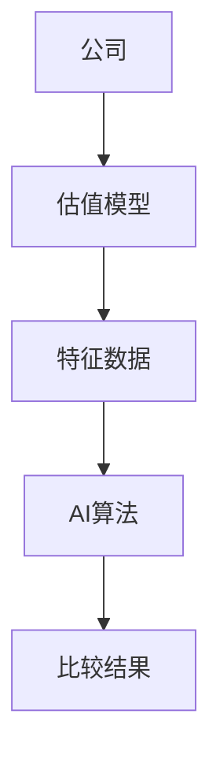
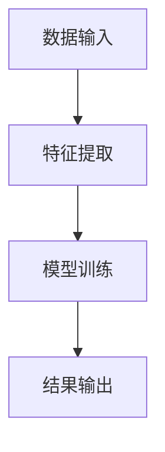
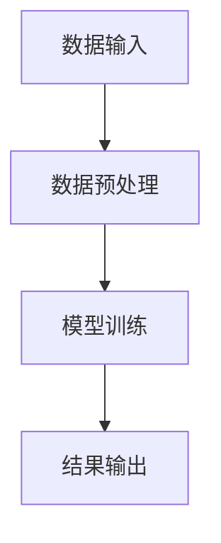

                 


# AI辅助的公司估值模型比较

> 关键词：AI辅助，公司估值，模型比较，机器学习，金融分析

> 摘要：本文探讨了如何利用人工智能技术辅助公司估值模型的比较与优化。通过分析传统估值方法的局限性，结合现代AI算法，提出了一种基于数据驱动的模型比较方法，展示了如何通过回归分析、聚类算法和神经网络等技术实现对公司估值模型的深度比较与优化。文章还提供了实际案例和系统设计，帮助读者理解如何在实际应用中构建和优化AI辅助的公司估值模型。

---

## 第一部分: 背景介绍

### 第1章: 背景介绍

#### 1.1 问题背景
传统公司估值方法，如DCF模型、EV/EBITDA倍数法等，虽然在金融领域得到了广泛应用，但其局限性日益显现。首先，这些方法高度依赖人工判断和经验，主观性较强；其次，市场环境的变化和数据的复杂性使得传统模型难以适应动态的市场条件；最后，随着大数据和人工智能技术的快速发展，利用AI技术优化估值模型成为可能。

#### 1.2 问题描述
AI辅助的公司估值模型比较的核心问题是如何从海量数据中提取有效特征，并利用机器学习算法对不同估值模型的优劣进行量化分析。具体包括以下几个方面：
- **模型输入**：公司财务数据、市场数据、行业基准等。
- **模型输出**：不同估值模型在不同场景下的表现比较。
- **模型比较**：通过AI技术生成可量化的比较指标，如准确性、稳定性、鲁棒性等。

#### 1.3 问题解决
通过引入AI技术，我们可以实现以下目标：
1. **数据预处理**：利用特征工程提取关键财务和市场特征。
2. **模型训练**：使用机器学习算法（如回归分析、聚类算法、神经网络）对估值模型进行训练。
3. **模型比较**：通过可视化工具和量化指标对不同模型的优劣进行比较。

#### 1.4 边界与外延
- **模型适用范围**：AI辅助的模型比较适用于数据量大、特征丰富的场景。
- **模型比较的边界条件**：需要明确比较的维度和指标。
- **AI辅助的局限性**：AI模型的性能依赖于数据质量和算法选择。

---

## 第二部分: 核心概念与联系

### 第2章: 核心概念与联系

#### 2.1 AI辅助模型比较的原理
AI辅助模型比较的过程可以分为以下几个步骤：
1. **数据预处理**：清洗数据，提取关键特征。
2. **模型训练**：使用机器学习算法对模型进行训练。
3. **结果分析**：通过可视化工具对模型性能进行比较。

#### 2.2 核心概念对比表
以下是传统估值模型与AI辅助模型的对比：

| 对比维度       | 传统估值模型                     | AI辅助估值模型                     |
|----------------|----------------------------------|------------------------------------|
| 数据依赖性     | 依赖少量财务数据                 | 依赖大量多维数据                   |
| 模型复杂性     | 模型简单，易于解释               | 模型复杂，基于机器学习算法           |
| 灵活性         | 较低，难以适应市场变化           | 较高，能够动态调整模型               |
| 精确性         | 受人工判断影响较大               | 受数据和算法影响，精度较高           |

#### 2.3 ER实体关系图


---

## 第三部分: 算法原理讲解

### 第3章: 算法原理讲解

#### 3.1 算法原理概述
AI辅助模型比较主要依赖以下几种算法：
1. **回归分析**：用于预测目标变量与特征变量之间的关系。
2. **聚类算法**：用于将相似的模型或公司进行分组。
3. **神经网络模型**：用于复杂非线性关系的建模。

#### 3.2 算法流程图


#### 3.3 代码实现
以下是一个简单的回归分析代码示例：

```python
import numpy as np
from sklearn.linear_model import LinearRegression

# 示例数据
X = np.array([[1], [2], [3], [4]])
y = [2, 4, 6, 8]

# 模型训练
model = LinearRegression()
model.fit(X, y)

# 预测结果
print(model.predict([[5]]))  # 输出：[[10]]
```

---

## 第四部分: 系统分析与架构设计

### 第4章: 系统分析与架构设计

#### 4.1 问题场景介绍
本文设计了一个AI辅助公司估值模型比较的系统，旨在帮助投资者和分析师更高效地比较不同估值模型的优劣。

#### 4.2 系统功能设计
- **数据输入模块**：接收公司财务数据和市场数据。
- **特征提取模块**：提取关键特征并进行数据清洗。
- **模型训练模块**：使用机器学习算法训练估值模型。
- **结果比较模块**：生成模型比较结果并输出。

#### 4.3 系统架构图


---

## 第五部分: 项目实战

### 第5章: 项目实战

#### 5.1 环境安装
需要安装以下Python库：
- `numpy`
- `pandas`
- `scikit-learn`
- `matplotlib`

#### 5.2 核心代码实现
以下是一个完整的项目实现示例：

```python
import numpy as np
import pandas as pd
from sklearn.linear_model import LinearRegression
from sklearn.metrics import mean_squared_error

# 数据加载
data = pd.read_csv('company_data.csv')

# 特征提取
X = data[['revenue', 'profit', 'market_cap']]
y = data['valuation']

# 模型训练
model = LinearRegression()
model.fit(X, y)

# 预测结果
y_pred = model.predict(X)

# 模型评估
mse = mean_squared_error(y, y_pred)
print(f'Mean Squared Error: {mse}')
```

---

## 第六部分: 最佳实践

### 第6章: 最佳实践

#### 6.1 小结
通过本文的介绍，读者可以了解到如何利用AI技术辅助公司估值模型的比较与优化。AI技术的引入不仅提高了模型的精度，还使得模型的比较更加客观和高效。

#### 6.2 注意事项
- 数据的准确性和完整性对模型性能影响重大。
- 模型的选择应根据具体场景和需求进行调整。
- 定期更新模型以适应市场变化。

#### 6.3 拓展阅读
- 《机器学习实战》
- 《金融数据分析与机器学习》
- 《深度学习在金融中的应用》

---

## 作者：AI天才研究院 & 禅与计算机程序设计艺术

---

以上是《AI辅助的公司估值模型比较》的技术博客文章的完整目录和内容框架。如果需要进一步的细节或调整，请随时告知！

