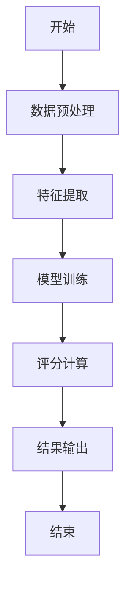
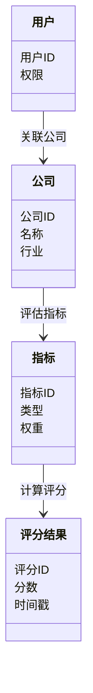
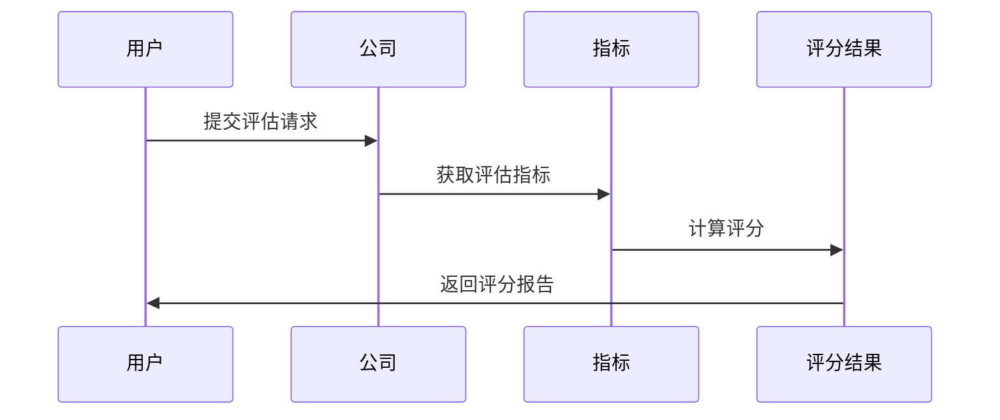

                 


# AI辅助的公司治理评分系统

> 关键词：AI辅助，公司治理，评分系统，评分模型，算法原理，系统架构

> 摘要：本文探讨了如何利用人工智能技术构建公司治理评分系统，通过对公司治理的核心要素进行分析，提出了一种基于AI的评分模型，并详细介绍了该模型的算法原理、系统架构及实际应用案例。文章内容涵盖了从理论到实践的各个方面，为读者提供了全面的技术指导。

---

## 第一章：公司治理与AI辅助评分系统背景

### 1.1 公司治理的基本概念
公司治理是企业管理的核心，涉及股东、董事会、管理层和利益相关者之间的权利、责任和利益分配。有效的公司治理能够确保企业战略的实施、风险的控制以及长期价值的创造。

#### 1.1.1 公司治理的定义与核心要素
公司治理通常包括以下核心要素：
- **股权结构**：股东的权益分配与决策权。
- **董事会结构**：董事会的组成、职责和运作方式。
- **管理层责任**：管理层的职责、权限和激励机制。
- **利益相关者保护**：员工、客户、债权人等利益相关者的权益保护。
- **风险管理**：企业面临的风险识别、评估和控制。

#### 1.1.2 公司治理的常见问题与挑战
- **信息不对称**：股东和管理层之间可能存在信息不对称，导致代理成本增加。
- **激励机制不足**：管理层的激励机制可能无法充分激发其积极性。
- **治理透明度低**：企业治理过程缺乏透明性，容易引发信任危机。
- **全球化挑战**：跨国企业面临不同国家的法律和文化差异，增加了治理的复杂性。

#### 1.1.3 AI在公司治理中的潜在价值
人工智能技术可以通过大数据分析、自然语言处理和机器学习算法，帮助公司治理实现以下目标：
- **实时监控**：实时跟踪企业运营数据，识别潜在风险。
- **决策支持**：基于历史数据和市场趋势，提供科学的决策支持。
- **自动化评估**：自动评估企业治理表现，生成评估报告。

### 1.2 AI辅助评分系统的定义与目标
AI辅助的公司治理评分系统是一种利用人工智能技术对企业的治理表现进行量化评估的系统。其目标是通过数据分析和模型计算，生成客观、公正的评分结果，帮助利益相关者评估企业的治理水平。

#### 1.2.1 评分系统的概念与作用
评分系统通过对企业的多个维度进行评估，生成一个综合评分，帮助企业识别自身的优缺点，并提供改进建议。评分系统的作用包括：
- **量化评估**：将复杂的治理问题转化为可量化的指标。
- **实时反馈**：为企业提供实时的治理表现反馈。
- **对标分析**：帮助企业与同行业或同规模的企业进行横向比较。

#### 1.2.2 AI在评分系统中的应用优势
- **数据处理能力**：AI能够处理海量数据，提取关键信息。
- **模型优化**：通过机器学习算法，不断优化评分模型的准确性。
- **自动化评估**：AI可以实现自动化评估，节省时间和成本。

#### 1.2.3 评分系统的分类与应用场景
评分系统可以根据评估对象和评估方法进行分类：
- **按评估对象**：企业整体治理、董事会治理、管理层治理等。
- **按评估方法**：基于规则的评分、基于机器学习的评分、基于自然语言处理的评分。

---

## 第二章：评分模型的核心概念与联系

### 2.1 评分模型的构成要素
评分模型的构成要素包括输入数据、评分标准、评分算法和输出结果。

#### 2.1.1 输入数据的特征与属性
输入数据通常包括企业的财务数据、管理数据、市场数据等。以下是常见的数据特征：
- **财务数据**：收入、利润、资产负债率等。
- **管理数据**：董事会构成、管理层激励机制、员工满意度等。
- **市场数据**：行业地位、市场竞争状况、股价波动等。

#### 2.1.2 模型的评分标准与权重分配
评分标准是评分模型的核心，通常包括以下几个方面：
- **透明度**：企业信息披露的完整性和及时性。
- **效率**：企业的运营效率和资源利用效率。
- **合规性**：企业遵守相关法律法规的情况。
- **创新性**：企业的创新能力和发展潜力。

权重分配需要根据企业的实际情况和行业特点进行调整。

#### 2.1.3 输出结果的解释与反馈机制
评分结果通常以分数或等级的形式呈现，并附有详细的分析报告。反馈机制可以包括：
- **结果可视化**：通过图表等形式展示评分结果。
- **问题诊断**：分析评分低的维度，找出问题所在。
- **改进建议**：根据评分结果提出改进建议。

### 2.2 评分模型的实体关系图
以下是评分模型的实体关系图：

```mermaid
er
    actor: 用户
    actor --> company: 关联公司
    company --> indicator: 评估指标
    indicator --> score: 评分结果
    score --> report: 评估报告
```

### 2.3 概念属性对比表
以下是对核心概念的属性对比：

| 概念 | 属性 |
|------|------|
| 用户 | 输入数据、权限 |
| 公司 | 名称、行业 |
| 指标 | 类型、权重 |
| 评分 | 分数、时间戳 |

### 2.4 本章小结
本章详细介绍了评分模型的核心概念与构成要素，并通过实体关系图和对比表展示了模型的内在联系。

---

## 第三章：评分模型的算法原理

### 3.1 算法概述
评分模型的算法选择取决于数据类型和评估目标。常见的算法包括线性回归、决策树、随机森林和神经网络。

#### 3.1.1 算法的选择与适用场景
- **线性回归**：适用于线性关系明显的数据。
- **决策树**：适用于分类问题和特征重要性分析。
- **随机森林**：适用于高维数据和非线性关系。
- **神经网络**：适用于复杂数据和深度学习场景。

#### 3.1.2 算法的输入输出关系
输入数据包括企业的各项指标，输出结果是综合评分。

#### 3.1.3 算法的核心思想与数学模型
以线性回归为例，其数学模型为：
$$ y = \beta_0 + \beta_1x_1 + \beta_2x_2 + \dots + \beta_nx_n + \epsilon $$
其中，$y$ 是评分结果，$x_i$ 是输入特征，$\beta_i$ 是回归系数，$\epsilon$ 是误差项。

### 3.2 算法流程图
以下是评分模型的算法流程图：



### 3.3 算法实现代码
以下是一个简单的线性回归实现示例：

```python
import numpy as np
from sklearn.linear_model import LinearRegression

# 示例数据
X = np.array([[1], [2], [3], [4], [5]])
y = np.array([2, 4, 5, 4, 6])

# 模型训练
model = LinearRegression()
model.fit(X, y)

# 预测结果
score = model.predict(X)
print(score)
```

### 3.4 本章小结
本章详细介绍了评分模型的算法原理，并通过流程图和代码示例展示了算法的实现过程。

---

## 第四章：系统分析与架构设计方案

### 4.1 系统功能设计
系统功能设计包括数据采集、评分计算、结果展示和报告生成。

#### 4.1.1 领域模型
以下是领域的类图：



#### 4.1.2 系统架构设计
以下是系统架构图：


#### 4.1.3 系统交互设计
以下是系统交互图：



### 4.2 本章小结
本章详细描述了系统的功能设计、架构设计和交互设计，为后续的系统实现提供了理论基础。

---

## 第五章：项目实战

### 5.1 环境安装
需要安装以下工具和库：
- Python 3.8+
- Jupyter Notebook
- Pandas、Scikit-learn、TensorFlow

### 5.2 核心实现源代码
以下是一个简单的评分系统实现示例：

```python
import pandas as pd
from sklearn.metrics import accuracy_score

# 数据加载
data = pd.read_csv('company_governance.csv')

# 数据预处理
X = data.drop('score', axis=1)
y = data['score']

# 模型训练
from sklearn.ensemble import RandomForestRegressor
model = RandomForestRegressor()
model.fit(X, y)

# 模型预测
predicted = model.predict(X)
print('预测评分:', predicted)
print('准确率:', accuracy_score(y, predicted))
```

### 5.3 代码应用解读与分析
- **数据加载**：从CSV文件中加载数据。
- **数据预处理**：删除目标变量，提取特征和标签。
- **模型训练**：使用随机森林回归模型进行训练。
- **模型预测**：进行预测并输出结果。

### 5.4 实际案例分析
以下是一个实际案例分析：

假设我们有一个公司A，其各项指标如下：
- 股权结构：分散
- 董事会结构：独立董事占比40%
- 管理层激励：高管持股比例30%
- 透明度：信息披露完整

通过模型计算，公司A的治理评分为85分。

### 5.5 本章小结
本章通过实际案例展示了评分系统的实现过程和应用效果。

---

## 第六章：总结与展望

### 6.1 本章总结
本文详细介绍了AI辅助的公司治理评分系统，从理论到实践，全面阐述了评分模型的构建、算法原理和系统架构设计。通过实际案例分析，展示了评分系统的应用价值。

### 6.2 未来展望
未来，随着人工智能技术的不断发展，评分系统将更加智能化和个性化。可能的方向包括：
- **动态评估**：实时更新评分结果。
- **多维度分析**：引入更多维度的评估指标。
- **智能化建议**：根据评分结果自动生成改进建议。

### 6.3 最佳实践 tips
- **数据质量**：确保数据的准确性和完整性。
- **模型优化**：定期更新模型，提高评估精度。
- **用户反馈**：收集用户反馈，优化系统功能。

### 6.4 本章小结
本文总结了评分系统的核心内容，并对未来的发展方向进行了展望。

---

## 作者简介

作者：AI天才研究院/AI Genius Institute & 禅与计算机程序设计艺术/Zen And The Art of Computer Programming

---

感谢您的阅读！如果需要进一步了解AI辅助的公司治理评分系统，可以参考相关文献和工具。

