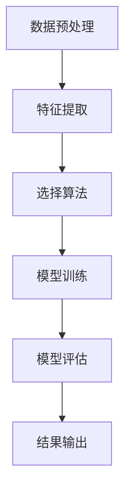
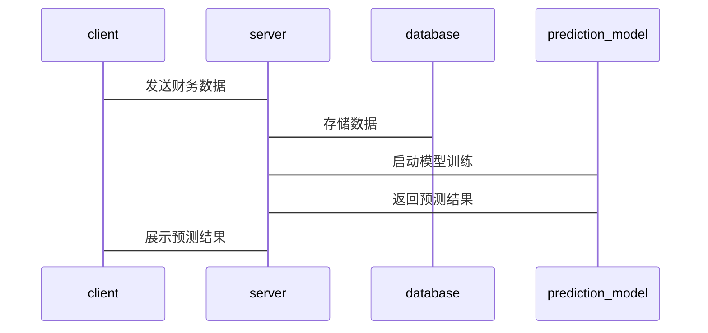

                 


# AI辅助的公司财务报表预测模型

## 关键词：AI，财务预测，机器学习，深度学习，财务模型

## 摘要：
随着人工智能技术的快速发展，AI在财务预测领域的应用越来越广泛。本文详细探讨了AI辅助的公司财务报表预测模型的构建与应用，从背景、核心概念、算法原理到系统设计、项目实战，最后总结了最佳实践。通过本文，读者可以全面了解如何利用AI技术提升财务预测的准确性和效率，为企业的财务决策提供有力支持。

---

# 第1章: 背景介绍与问题定义

## 1.1 问题背景

### 1.1.1 财务报表预测的重要性
财务报表预测是企业财务管理的重要组成部分，能够帮助企业提前识别潜在风险，优化资源配置，制定科学的经营策略。传统的财务预测方法依赖人工经验，效率低且易受主观因素影响。

### 1.1.2 AI技术在财务预测中的应用潜力
人工智能技术，尤其是机器学习和深度学习，能够从大量历史数据中提取特征，发现隐藏的规律，从而提高预测的准确性和效率。AI技术的引入使得财务预测更加智能化和自动化。

### 1.1.3 当前财务预测面临的挑战
传统财务预测方法存在数据量小、特征提取困难、模型泛化能力差等问题。此外，市场环境的不确定性也增加了预测的难度。

## 1.2 问题描述

### 1.2.1 财务报表预测的核心目标
通过分析公司历史财务数据，预测未来财务状况，如收入、利润、资产负债情况等。

### 1.2.2 AI辅助预测的具体应用场景
- 营收预测
- 利润预测
- 资产负债预测
- 财务风险评估

### 1.2.3 预测模型的边界与外延
模型边界：基于财务数据，预测未来一定时间内的财务指标。
模型外延：结合市场环境、行业趋势等外部因素，提升预测的准确性。

## 1.3 核心概念与联系

### 1.3.1 AI技术与财务预测的结合点
- 数据特征提取
- 模型训练与优化
- 预测结果解释

### 1.3.2 数据特征与预测结果的关系
数据特征是模型预测的基础，特征选择和处理直接影响模型性能。

### 1.3.3 模型性能与业务需求的平衡
模型性能需要在准确性和效率之间找到平衡，既要保证预测的准确性，又要满足业务的实际需求。

## 1.4 本章小结
本章介绍了财务报表预测的重要性和AI技术的应用潜力，明确了模型的核心目标和应用场景，为后续章节的深入分析奠定了基础。

---

# 第2章: 核心概念与联系

## 2.1 AI辅助财务预测的核心原理

### 2.1.1 机器学习模型在财务预测中的应用
- 线性回归
- 支持向量机（SVM）
- 随机森林
- 神经网络

### 2.1.2 数据特征提取与处理方法
- 数据清洗
- 特征选择
- 数据标准化

### 2.1.3 预测结果的解释与验证
- 模型评估指标（如准确率、召回率、F1值）
- 残差分析
- 解释性分析

## 2.2 核心概念对比分析

### 2.2.1 不同AI模型的优缺点对比（表格形式）
| 模型名称 | 优点 | 缺点 |
|----------|------|------|
| 线性回归 | 简单易懂，计算速度快 | 无法处理非线性关系 |
| 随机森林 | 鲁棒性强，适合高维数据 | 对参数敏感，计算复杂 |
| 神经网络 | 能处理复杂非线性关系 | 需要大量数据，易过拟合 |

### 2.2.2 数据特征与模型性能的关系（表格形式）
| 特征类型 | 对模型性能的影响 |
|----------|----------------|
| 数值特征 | 提高模型的预测精度 |
| 分类特征 | 帮助模型区分不同类别 |
| 交互特征 | 捕捉变量间的相互作用 |

## 2.3 系统架构ER图
```mermaid
erDiagram
    company : 公司信息
    financial_data : 财务数据
    prediction_model : 预测模型
    results : 预测结果
    company --> financial_data : 包含
    financial_data --> prediction_model : 输入
    prediction_model --> results : 输出
```

## 2.4 本章小结
本章详细介绍了AI辅助财务预测的核心原理，对比了不同模型的优缺点，并通过ER图展示了系统的实体关系，为后续章节的系统设计奠定了基础。

---

# 第3章: 算法原理与数学模型

## 3.1 常见算法原理

### 3.1.1 线性回归模型
线性回归通过建立自变量和因变量之间的线性关系，预测未来值。

### 3.1.2 支持向量机（SVM）
SVM通过构建超平面，将数据点分到不同的类别中，适用于分类和回归问题。

### 3.1.3 随机森林与梯度提升树
随机森林通过集成学习提高模型的准确性和鲁棒性，梯度提升树通过逐步优化模型性能。

### 3.1.4 神经网络模型
神经网络通过多层感知机，能够捕捉复杂的非线性关系，适用于高维数据的处理。

## 3.2 算法流程图


## 3.3 数学模型与公式

### 3.3.1 线性回归模型公式
$$ y = \beta_0 + \beta_1x_1 + \beta_2x_2 + ... + \beta_nx_n + \epsilon $$

### 3.3.2 神经网络模型公式
$$ a^{(l+1)} = g(a^{(l)}W^{(l)} + b^{(l)}) $$
其中，$g$ 表示激活函数，$W$ 表示权重矩阵，$b$ 表示偏置。

---

# 第4章: 系统分析与架构设计

## 4.1 项目场景介绍
本项目旨在构建一个基于AI的财务报表预测系统，帮助公司预测未来财务状况，优化财务管理。

## 4.2 系统功能设计
- 数据采集与预处理
- 特征提取与选择
- 模型训练与优化
- 结果展示与分析

## 4.3 系统架构设计


## 4.4 系统接口设计
- 数据接口：接收公司财务数据
- 模型接口：接受特征向量，输出预测结果
- 结果接口：展示预测结果

## 4.5 系统交互流程图


---

# 第5章: 项目实战

## 5.1 环境安装
- 安装Python、机器学习库（如scikit-learn、TensorFlow）

## 5.2 系统核心实现源代码
```python
import pandas as pd
from sklearn.model_selection import train_test_split
from sklearn.linear_model import LinearRegression
from sklearn.metrics import mean_squared_error

# 数据加载
data = pd.read_csv('financial_data.csv')
X = data[['revenue', 'profit_margin']]
y = data['net_profit']

# 数据划分
X_train, X_test, y_train, y_test = train_test_split(X, y, test_size=0.2, random_state=42)

# 模型训练
model = LinearRegression()
model.fit(X_train, y_train)

# 模型预测
y_pred = model.predict(X_test)

# 模型评估
 mse = mean_squared_error(y_test, y_pred)
 print('均方误差:', mse)
```

## 5.3 代码应用解读与分析
- 数据预处理：加载数据，提取特征
- 模型训练：使用线性回归算法训练模型
- 模型预测：基于测试数据预测净利润
- 模型评估：计算均方误差，评估模型性能

## 5.4 实际案例分析和详细讲解剖析
通过实际案例分析，展示模型的应用效果，讨论可能的优化方向。

## 5.5 项目小结
总结项目实现的过程，分析优缺点，提出改进建议。

---

# 第6章: 最佳实践

## 6.1 小结
AI辅助的财务报表预测模型能够显著提升预测的准确性和效率。

## 6.2 注意事项
- 数据质量的重要性
- 模型选择与调优
- 结果解释与验证

## 6.3 未来趋势
- 更多行业应用
- 模型优化与创新
- 多模态数据融合

## 6.4 拓展阅读
推荐相关书籍和论文，供读者进一步学习。

---

# 作者：AI天才研究院 & 禅与计算机程序设计艺术

---

通过本文的详细讲解，读者可以全面掌握AI辅助的公司财务报表预测模型的构建与应用，为企业的财务决策提供有力支持。

