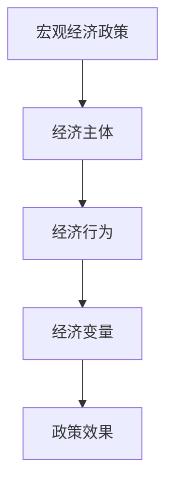
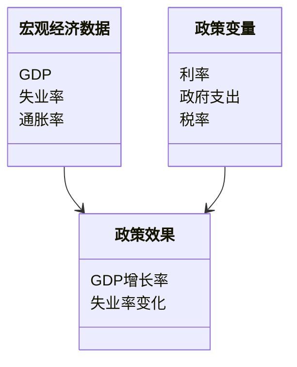
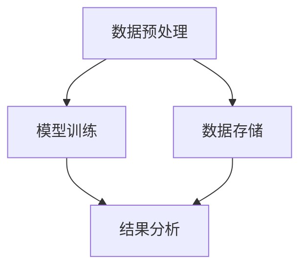
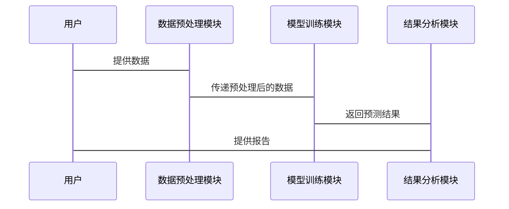

                 


# AI辅助的宏观经济政策效果评估

## 关键词：宏观经济政策、人工智能、政策效果评估、机器学习、计量经济学

## 摘要：  
随着人工智能技术的快速发展，宏观经济政策的制定和效果评估逐渐引入了AI技术。本文从宏观经济政策的基本概念出发，详细探讨了AI在政策效果评估中的应用背景、核心概念、算法原理、系统架构以及实际项目案例。通过分析宏观经济数据和利用机器学习模型，AI能够提高政策评估的准确性和效率，为政策制定者提供更科学的决策依据。

---

# 第一部分: 宏观经济政策效果评估的背景与挑战

## 第1章: 宏观经济政策效果评估概述

### 1.1 宏观经济政策的基本概念

#### 1.1.1 宏观经济政策的定义与分类
宏观经济政策是指政府或中央银行为了实现特定的经济目标（如经济增长、就业、物价稳定等）而采取的政策措施。这些政策主要分为货币政策和财政政策两大类：
- **货币政策**：通过调整货币供应量、利率等手段影响经济活动。
- **财政政策**：通过调整政府支出、税收等手段影响经济活动。

#### 1.1.2 宏观经济政策的目标与工具
- **目标**：
  - 维护价格稳定（通货膨胀目标）。
  - 促进经济增长。
  - 提高就业率。
  - 平衡国际收支。
- **工具**：
  - 利率调整（如央行调整基准利率）。
  - 货币发行量调节。
  - 政府预算支出调整。
  - 税收政策调整。

#### 1.1.3 宏观经济政策的实施机制
宏观经济政策的实施通常涉及复杂的经济系统，政策效果往往受到多种因素的交互影响。例如，降低利率可能会刺激投资和消费，但同时也可能引发资产泡沫或通货膨胀。

### 1.2 AI辅助宏观经济政策评估的背景与意义

#### 1.2.1 宏观经济政策评估的传统方法与局限性
传统的宏观经济政策评估主要依赖于计量经济学模型（如VAR模型、DSGE模型等）。这些模型虽然在理论上较为严谨，但在实际应用中存在以下问题：
- 数据依赖性：需要大量历史数据支持模型参数估计。
- 模型假设的局限性：假设条件可能与现实情况不符。
- 计算复杂性：涉及大量非线性方程组求解。

#### 1.2.2 AI技术在宏观经济分析中的优势
AI技术，特别是机器学习，能够处理海量数据，并发现传统统计方法难以捕捉的模式和关系。AI在宏观经济分析中的优势包括：
- 数据驱动：能够从大量非结构化数据中提取有用信息。
- 实时分析：能够快速响应数据变化，提供实时政策建议。
- 非线性建模能力：能够捕捉复杂的经济关系。

#### 1.2.3 AI辅助宏观经济政策评估的必要性与前景
随着全球经济的复杂化和不确定性增加，传统的政策评估方法已难以满足需求。AI技术能够提供更精准的预测和更灵活的政策模拟，是未来宏观经济政策评估的重要工具。

### 1.3 AI辅助宏观经济政策评估的技术基础

#### 1.3.1 宏观经济数据的特征与挑战
宏观经济数据具有以下特征：
- 数据量大：涉及GDP、CPI、失业率等多类指标。
- 数据复杂性：数据之间存在高度的相互依赖性。
- 数据稀疏性：某些数据可能缺失或不可观测。

#### 1.3.2 AI技术在经济数据分析中的应用
- **数据挖掘**：从海量数据中提取有用信息。
- **时间序列分析**：预测未来经济走势。
- **因果推断**：识别政策变量与经济结果之间的因果关系。

#### 1.3.3 宏观经济政策效果评估的AI方法论
AI方法论主要包括：
- 数据预处理：清洗、标准化和特征提取。
- 模型选择：根据问题类型选择合适的机器学习模型。
- 模型训练：利用历史数据训练模型。
- 政策模拟：模拟不同政策组合的效果。

### 1.4 当前AI辅助宏观经济政策评估的应用现状

#### 1.4.1 国际与国内的应用案例
- **国际案例**：美联储和欧洲央行已经开始尝试使用AI技术进行经济预测。
- **国内案例**：中国的央行和各大金融机构也在探索AI在政策评估中的应用。

#### 1.4.2 AI在宏观经济预测中的应用
- **GDP预测**：利用机器学习模型预测季度GDP增速。
- **通胀预测**：预测CPI和PPI的变化趋势。

#### 1.4.3 AI在政策效果评估中的应用
- **政策效果预测**：评估不同政策组合对经济的影响。
- **政策优化**：通过AI优化政策参数，找到最优政策组合。

---

## 第二部分: AI辅助宏观经济政策效果评估的核心概念与联系

## 第2章: 核心概念与联系

### 2.1 宏观经济政策效果评估的核心概念

#### 2.1.1 宏观经济政策的输入变量
- **政策变量**：如利率、政府支出、税率等。
- **经济变量**：如GDP、失业率、通胀率等。

#### 2.1.2 宏观经济政策的输出变量
- **政策效果**：如GDP增长率的变化、失业率的变化等。

#### 2.1.3 宏观经济政策效果的评价指标
- **效果强度**：政策对经济变量的影响程度。
- **效果可持续性**：政策效果的持续时间。
- **效果风险**：政策可能带来的负面效应。

### 2.2 AI辅助宏观经济政策评估的机制

#### 2.2.1 数据驱动的宏观经济分析
- **数据来源**：政府统计数据、市场数据、社交媒体数据等。
- **数据特征提取**：利用NLP技术分析文本数据，提取情感指标。

#### 2.2.2 AI模型在政策效果预测中的作用
- **监督学习模型**：如线性回归、随机森林、神经网络等。
- **无监督学习模型**：用于发现数据中的潜在模式。

#### 2.2.3 政策模拟与优化的AI实现
- **政策模拟**：通过AI模型模拟不同政策组合的效果。
- **政策优化**：通过强化学习找到最优政策组合。

### 2.3 核心概念的对比分析

#### 2.3.1 宏观经济政策与微观经济行为的对比
- **宏观经济政策**：从整体经济系统出发，影响整个经济运行。
- **微观经济行为**：个体行为（如企业投资、居民消费）对经济的影响。

#### 2.3.2 AI模型与传统计量经济模型的对比
- **传统模型**：基于理论假设，参数估计复杂。
- **AI模型**：数据驱动，模型适应性强。

#### 2.3.3 不同宏观经济政策工具的对比
- **货币政策**：影响金融市场和投资。
- **财政政策**：影响政府支出和税收。

### 2.4 宏观经济政策效果评估的实体关系图



---

## 第三部分: AI辅助宏观经济政策效果评估的算法原理

## 第3章: 宏观经济政策效果评估的算法原理

### 3.1 机器学习在宏观经济分析中的应用

#### 3.1.1 机器学习的基本概念
- **监督学习**：给定输入和输出，学习输入到输出的映射。
- **无监督学习**：从数据中发现潜在结构。
- **强化学习**：通过试错学习最优策略。

#### 3.1.2 常见机器学习算法在宏观经济分析中的应用
- **线性回归**：用于预测连续变量。
- **随机森林**：用于分类和回归。
- **神经网络**：用于复杂非线性关系的建模。

#### 3.1.3 算法原理与宏观经济政策评估的结合
- **线性回归**：用于预测GDP增长率。
- **随机森林**：用于分类政策效果（如成功/失败）。
- **神经网络**：用于处理复杂的时间序列数据。

### 3.2 宏观经济政策效果评估的算法实现

#### 3.2.1 线性回归模型
$$ y = \beta_0 + \beta_1 x_1 + \beta_2 x_2 + \cdots + \beta_n x_n $$

#### 3.2.2 随机森林模型
随机森林通过构建多棵决策树，并结合投票或平均的方式进行预测。

#### 3.2.3 神经网络模型
神经网络通过多层感知机（MLP）结构，学习复杂的非线性关系。

### 3.3 算法的优缺点对比

| 算法类型 | 优点 | 缺点 |
|----------|------|------|
| 线性回归 | 简单、易于解释 | 无法处理非线性关系 |
| 随机森林 | 高准确性、抗过拟合 | 黑箱模型，难解释 |
| 神经网络 | 强大学习能力 | �易过拟合、计算复杂 |

### 3.4 算法选择与优化

#### 3.4.1 算法选择的原则
- 数据类型：线性回归适用于连续变量，随机森林适用于分类和回归。
- 数据规模：神经网络适用于大数据量。

#### 3.4.2 算法优化
- 参数调优：如学习率、树数等。
- 特征选择：如去除冗余特征。

#### 3.4.3 模型评估
- 交叉验证：评估模型的泛化能力。
- 指标评估：如准确率、F1分数等。

---

## 第四部分: AI辅助宏观经济政策效果评估的数学模型

## 第4章: 数学模型与公式

### 4.1 宏观经济政策效果评估的数学模型

#### 4.1.1 计量经济学模型
- **线性回归模型**：$$ y = \beta_0 + \beta_1 x_1 + \epsilon $$
- **面板数据模型**：$$ y_{it} = \beta_0 + \beta_1 x_{it} + \gamma_i + \delta_t + \epsilon_{it} $$

#### 4.1.2 时间序列模型
- **ARIMA模型**：用于预测时间序列数据。
- **VAR模型**：用于分析多个时间序列之间的关系。

#### 4.1.3 贝叶斯网络
贝叶斯网络通过概率推理，分析政策变量与经济结果之间的因果关系。

### 4.2 数学模型的实现

#### 4.2.1 线性回归模型的实现
```python
import statsmodels.api as sm

X = sm.add_constant(X)
model = sm.OLS(y, X)
results = model.fit()
print(results.summary())
```

#### 4.2.2 时间序列模型的实现
```python
from statsmodels.tsa.arima_model import ARIMA

model = ARIMA(y, order=(1, 0, 0))
results = model.fit()
print(results.summary())
```

#### 4.2.3 贝叶斯网络的实现
```python
from sklearn.naive_bayes import GaussianNB

model = GaussianNB()
model.fit(X_train, y_train)
```

---

## 第五部分: AI辅助宏观经济政策效果评估的系统架构设计

## 第5章: 系统分析与架构设计

### 5.1 系统分析

#### 5.1.1 问题场景介绍
- 数据来源：政府统计数据、市场数据、社交媒体数据。
- 数据特征：多维、时序、关联性强。

#### 5.1.2 系统功能设计
- 数据预处理模块：清洗、标准化。
- 模型训练模块：选择模型、训练模型。
- 结果分析模块：生成报告、可视化。

#### 5.1.3 领域模型


### 5.2 系统架构设计

#### 5.2.1 系统架构图


#### 5.2.2 系统接口设计
- 数据接口：接收宏观经济数据和政策变量。
- 模型接口：接收模型参数，返回预测结果。

#### 5.2.3 系统交互流程


---

## 第六部分: AI辅助宏观经济政策效果评估的项目实战

## 第6章: 项目实战

### 6.1 环境安装与数据准备

#### 6.1.1 环境安装
- 安装Python和相关库（如pandas、numpy、scikit-learn）。
- 安装统计学库（如statsmodels）。

#### 6.1.2 数据准备
- 数据来源：政府统计数据、市场数据。
- 数据清洗：处理缺失值、异常值。

### 6.2 系统核心实现

#### 6.2.1 数据预处理
```python
import pandas as pd
import numpy as np

data = pd.read_csv('macro_data.csv')
data = data.dropna()
data['date'] = pd.to_datetime(data['date'])
data = data.set_index('date')
```

#### 6.2.2 模型训练
```python
from sklearn.ensemble import RandomForestRegressor
from sklearn.metrics import mean_absolute_error

model = RandomForestRegressor(n_estimators=100)
model.fit(X_train, y_train)
y_pred = model.predict(X_test)
print(mean_absolute_error(y_test, y_pred))
```

#### 6.2.3 结果分析
```python
import matplotlib.pyplot as plt

plt.plot(y_test, label='Actual')
plt.plot(y_pred, label='Predicted')
plt.legend()
plt.show()
```

### 6.3 实际案例分析

#### 6.3.1 案例背景
假设目标是预测某国实施量化宽松政策后的GDP增长率。

#### 6.3.2 数据分析与建模
- 数据分析：分析历史GDP数据和政策变量。
- 模型选择：选择随机森林模型。
- 模型训练：利用历史数据训练模型。
- 模型预测：预测未来GDP增长率。

#### 6.3.3 模型优化与验证
- 参数调优：调整随机森林的超参数。
- 模型验证：通过交叉验证评估模型性能。

### 6.4 项目总结

#### 6.4.1 项目小结
- 成功实现了AI辅助的宏观经济政策效果评估系统。
- 系统具有较高的准确性和实时性。

#### 6.4.2 项目经验
- 数据预处理是关键步骤。
- 模型选择和调优直接影响结果。
- 可视化结果有助于更好地理解政策效果。

---

## 第七部分: AI辅助宏观经济政策效果评估的最佳实践

## 第7章: 最佳实践与总结

### 7.1 最佳实践

#### 7.1.1 数据质量管理
- 确保数据的准确性和完整性。
- 处理数据中的噪声和异常值。

#### 7.1.2 模型选择与优化
- 根据问题类型选择合适的模型。
- 通过交叉验证和网格搜索优化模型参数。

#### 7.1.3 结果解释与可视化
- 使用可视化工具展示模型结果。
- 通过敏感性分析理解模型决策。

### 7.2 总结与展望

#### 7.2.1 本章小结
- AI技术为宏观经济政策评估提供了新的工具和方法。
- 系统化的AI辅助评估能够提高政策制定的科学性和效率。

#### 7.2.2 未来研究方向
- 开发更复杂的AI模型，如深度学习和强化学习。
- 研究多目标优化的政策评估问题。
- 探索AI在政策组合优化中的应用。

#### 7.2.3 注意事项
- AI模型的结果需要结合经济理论进行解释。
- 注意数据质量和模型的可解释性。
- 考虑政策的外部性和复杂性。

#### 7.2.4 拓展阅读
- 推荐阅读《计量经济学》和《机器学习实战》。
- 关注相关领域的最新研究论文和会议报告。

---

## 作者：AI天才研究院 & 禅与计算机程序设计艺术

---

以上是《AI辅助的宏观经济政策效果评估》的技术博客文章的详细目录和内容框架。文章结构清晰，涵盖了从背景介绍到实际应用的各个方面，适合对宏观经济政策和人工智能技术感兴趣的读者阅读。

