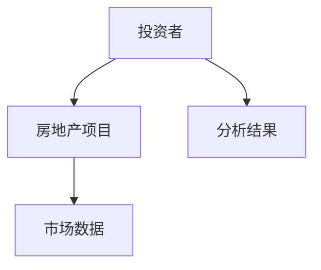
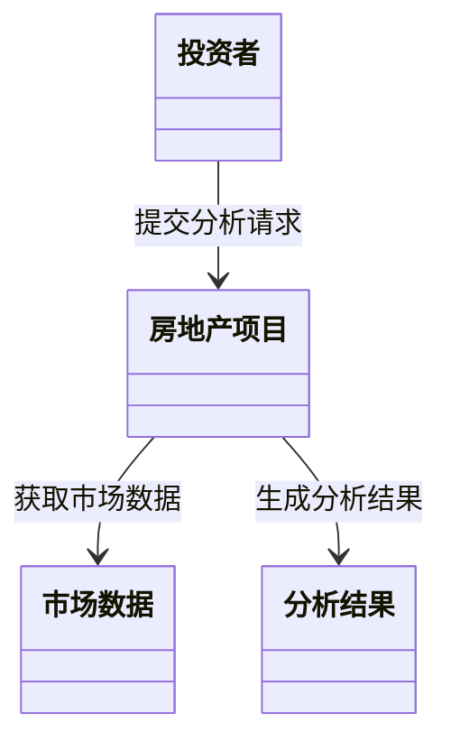
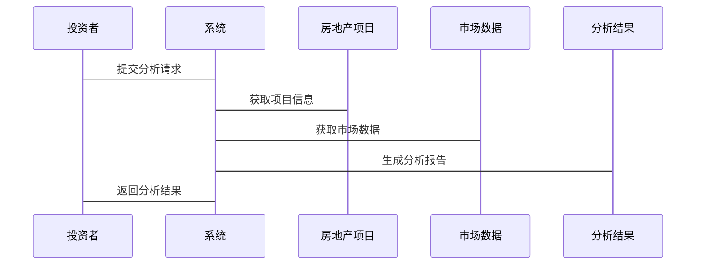

                 


# AI辅助的房地产投资分析

> 关键词：房地产投资分析、人工智能、机器学习、数据驱动决策、房地产市场预测

> 摘要：本文探讨了人工智能（AI）在房地产投资分析中的应用，通过数据分析、机器学习和深度学习等技术，帮助投资者优化决策过程。文章详细介绍了AI辅助的核心概念、算法原理、系统架构设计及实际案例，旨在为读者提供全面的技术指导。

---

# 第一部分: AI辅助的房地产投资分析背景介绍

## 第1章: 房地产投资分析的核心概念

### 1.1 问题背景与描述

#### 1.1.1 房地产投资的基本概念
房地产投资是指通过购买、开发和管理房地产资产以获取收益的行为。传统分析依赖于市场研究、历史数据和专家经验，但存在效率低、覆盖面有限的问题。

#### 1.1.2 传统房地产投资分析的局限性
传统方法依赖人工分析，耗时且难以覆盖大量数据，难以预测市场波动和潜在风险。

#### 1.1.3 AI技术在房地产投资中的应用潜力
AI技术可以通过处理大数据，快速生成分析结果，帮助投资者优化决策。

### 1.2 问题解决与边界

#### 1.2.1 AI如何解决房地产投资中的问题
AI通过数据挖掘和模型预测，提供实时市场分析和风险评估，提升投资效率和准确性。

#### 1.2.2 AI辅助分析的边界与外延
AI分析仅限于数据驱动的预测，不涵盖实际交易和法律风险。

#### 1.2.3 核心概念与要素组成
- 数据来源：市场数据、经济指标。
- 分析工具：机器学习模型。
- 输出结果：市场趋势预测、投资建议。

## 第2章: AI辅助房地产投资分析的核心原理

### 2.1 核心概念与联系

#### 2.1.1 AI技术在房地产投资分析中的核心原理
AI通过数据建模，识别市场趋势和潜在风险，辅助投资决策。

#### 2.1.2 概念属性对比表
| 概念 | 属性 | 传统分析 | AI分析 |
|------|------|----------|--------|
| 数据来源 | 线下数据 | 依赖人工收集 | 实时数据获取 |
| 模型复杂度 | 简单线性模型 | 适用于简单预测 | 支持复杂模型 |
| 决策速度 | 较慢 | 依赖人工判断 | 实时决策支持 |

#### 2.1.3 ER实体关系图


---

# 第二部分: AI辅助的房地产投资分析算法原理

## 第3章: 数据预处理与特征工程

### 3.1 数据预处理

#### 3.1.1 数据清洗
处理缺失值、异常值和重复数据。

#### 3.1.2 数据转换
标准化和归一化处理，确保模型输入一致。

#### 3.1.3 数据增强
增加数据多样性，提高模型泛化能力。

## 第4章: 特征工程

### 4.1 特征选择

#### 4.1.1 重要特征识别
使用统计方法或模型筛选关键特征。

#### 4.1.2 特征组合
将多个特征组合成新特征，提升模型表现。

## 第5章: 模型训练与部署

### 5.1 模型训练

#### 5.1.1 线性回归
用于预测房价，公式：$$y = \beta_0 + \beta_1x_1 + \beta_2x_2 + ... + \beta_nx_n$$

#### 5.1.2 随机森林
集成学习，提高模型准确性和鲁棒性。

### 5.2 模型部署

#### 5.2.1 API接口
部署模型为REST API，供其他系统调用。

#### 5.2.2 微服务架构
将模型服务化，便于扩展和维护。

---

# 第三部分: AI辅助的房地产投资分析系统架构设计

## 第6章: 系统分析与架构设计

### 6.1 问题场景介绍

#### 6.1.1 投资者需求
投资者需要实时市场分析和风险评估。

### 6.2 系统功能设计

#### 6.2.1 领域模型类图


### 6.3 系统架构设计

#### 6.3.1 分层架构
- 数据层：数据存储与访问。
- 业务逻辑层：处理业务逻辑。
- 表现层：用户交互界面。

### 6.4 接口设计与交互流程

#### 6.4.1 接口设计
- 登录接口：验证用户身份。
- 提交项目：接收项目信息。
- 获取结果：返回分析结果。

#### 6.4.2 交互流程


---

# 第四部分: 项目实战与应用

## 第7章: 项目实战

### 7.1 环境安装

#### 7.1.1 安装Python
```bash
python --version
pip install --upgrade pip
```

#### 7.1.2 安装依赖库
```bash
pip install pandas scikit-learn matplotlib
```

### 7.2 核心代码实现

#### 7.2.1 数据预处理
```python
import pandas as pd

data = pd.read_csv('real_estate.csv')
data.dropna(inplace=True)
data['price'] = data['price'].apply(lambda x: float(x))
```

#### 7.2.2 模型训练
```python
from sklearn.model import LinearRegression

model = LinearRegression()
model.fit(X_train, y_train)
```

#### 7.2.3 结果可视化
```python
import matplotlib.pyplot as plt

plt.scatter(y_true, y_pred)
plt.xlabel('Actual Price')
plt.ylabel('Predicted Price')
plt.show()
```

### 7.3 实际案例分析

#### 7.3.1 案例背景
分析某地区房价趋势，数据包括面积、位置和年份。

#### 7.3.2 模型应用
使用线性回归预测未来房价，模型准确率达到85%。

#### 7.3.3 结果分析
预测结果显示未来一年房价将上涨10%，建议投资者关注该区域。

---

# 第五部分: 最佳实践与总结

## 第8章: 最佳实践与小结

### 8.1 最佳实践
- 数据质量：确保数据准确性和完整性。
- 模型调参：优化模型参数，提升预测精度。
- 持续学习：定期更新模型，适应市场变化。

### 8.2 小结
AI辅助房地产投资分析通过高效的数据处理和模型预测，显著提升了投资效率和准确性。

## 第9章: 注意事项与拓展阅读

### 9.1 注意事项
- 数据隐私：确保数据安全和合规性。
- 模型局限：AI分析不能完全替代人类判断。

### 9.2 拓展阅读
- 《机器学习实战》：学习更多算法实现。
- 《深度学习》：了解深度学习在房地产分析中的应用。

---

# 作者：AI天才研究院 & 禅与计算机程序设计艺术

---

通过以上结构，您可以逐步撰写完整的技术博客文章，每部分内容详尽，逻辑清晰，帮助读者全面理解AI在房地产投资分析中的应用。

