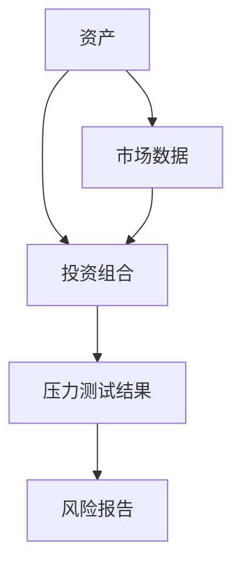
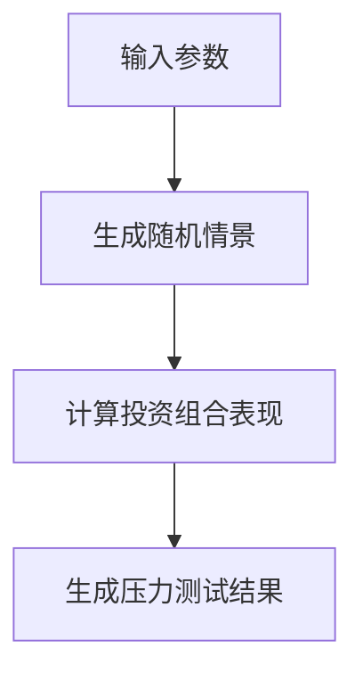
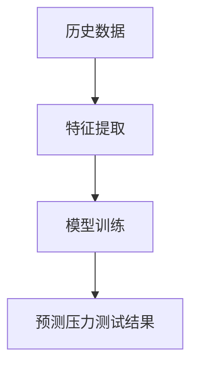
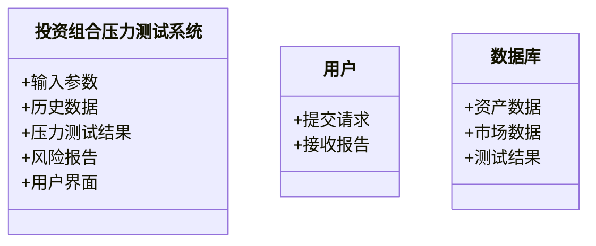
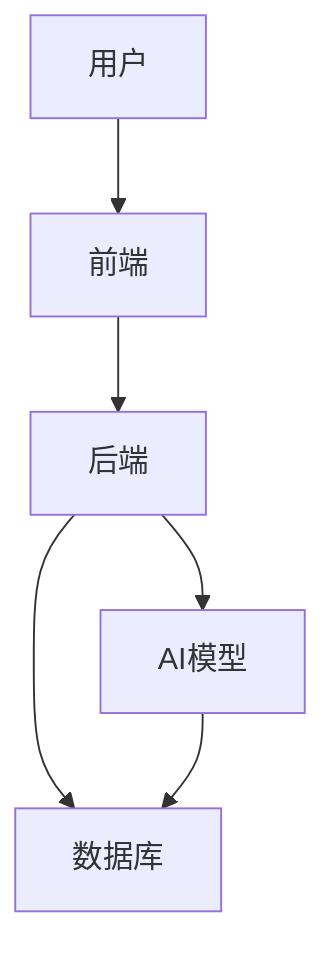
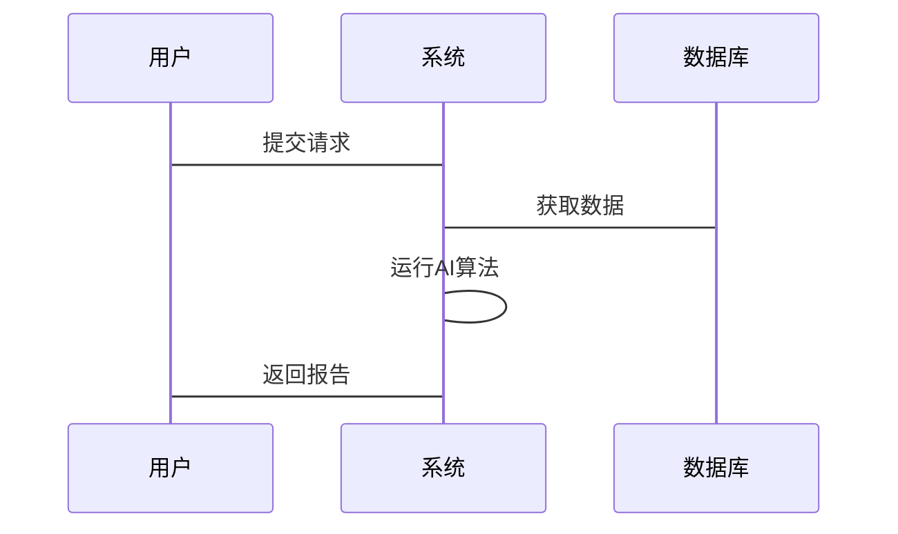

                 


# AI辅助的投资组合压力测试

> **关键词**: 投资组合压力测试，人工智能，风险管理，机器学习，金融建模，压力测试算法，风险管理工具

> **摘要**: 本文探讨了AI在投资组合压力测试中的应用，分析了传统方法的局限性，并详细介绍了基于机器学习的算法和系统架构。通过实际案例展示如何利用Python实现AI辅助的压力测试，强调了其在金融风险管理中的重要性。

---

# 目录大纲：《AI辅助的投资组合压力测试》

---

## 第1章：投资组合压力测试的背景与意义

### 1.1 投资组合压力测试的定义与核心概念
- 1.1.1 投资组合压力测试的定义
- 1.1.2 压力测试的核心目标
- 1.1.3 压力测试在金融风险管理中的作用

### 1.2 传统投资组合压力测试的局限性
- 1.2.1 传统压力测试方法的局限性
- 1.2.2 数据驱动与模型驱动的对比
- 1.2.3 传统方法在复杂市场环境中的不足

### 1.3 AI辅助投资组合压力测试的优势
- 1.3.1 AI技术在金融领域的应用潜力
- 1.3.2 AI辅助压力测试的核心优势
- 1.3.3 未来发展趋势与应用前景

---

## 第2章：投资组合压力测试的核心概念与联系

### 2.1 核心概念与属性对比
- 2.1.1 压力测试指标：VaR、CVaR、ES等
- 2.1.2 投资组合构成：资产类别、权重分配
- 2.1.3 压力情景：市场崩盘、流动性危机、极端波动

### 2.2 实体关系图（ER图）


### 2.3 核心概念的数学模型
- 2.3.1 投资组合收益：$$ E(R_p) = \sum_{i=1}^{n} w_i E(R_i) $$
- 2.3.2 投资组合风险：$$ \sigma_p^2 = \sum_{i=1}^{n} \sum_{j=1}^{n} w_i w_j \sigma_{ij} $$

---

## 第3章：AI辅助压力测试算法

### 3.1 蒙特卡洛模拟


### 3.2 机器学习模型


### 3.3 算法实现代码
```python
import numpy as np
from sklearn.ensemble import RandomForestRegressor

# 示例数据
n_samples = 100
n_features = 10
X = np.random.rand(n_samples, n_features)
y = np.random.rand(n_samples)

# 特征提取
selected_features = X[:, :5]

# 模型训练
model = RandomForestRegressor(n_estimators=100)
model.fit(selected_features, y)

# 预测
new_data = np.random.rand(1, 5)
prediction = model.predict(new_data)
```

### 3.4 数学模型
- 3.4.1 蒙特卡洛模拟的基本原理：$$ P(X \leq x) = \frac{N}{M} $$，其中$N$是满足条件的情况数，$M$是总模拟次数。
- 3.4.2 机器学习模型的损失函数：$$ L = \frac{1}{M}\sum_{i=1}^{M} (y_i - \hat{y}_i)^2 $$

---

## 第4章：压力测试系统架构

### 4.1 系统功能设计


### 4.2 系统架构设计


### 4.3 系统接口设计


---

## 第5章：项目实战与案例分析

### 5.1 环境安装
```bash
pip install numpy pandas scikit-learn matplotlib
```

### 5.2 核心实现代码
```python
import pandas as pd
import numpy as np
from sklearn.ensemble import IsolationForest

# 数据加载
data = pd.read_csv('market_data.csv')

# 特征工程
features = data[['return', 'volatility', 'market_cap']]
target = data['risk_score']

# 模型训练
model = IsolationForest(n_estimators=100, random_state=42)
model.fit(features)

# 预测
new_features = pd.DataFrame({
    'return': [0.05],
    'volatility': [0.15],
    'market_cap': [1000000]
})
prediction = model.predict(new_features)
```

### 5.3 实际案例分析
- 5.3.1 案例背景
- 5.3.2 数据准备
- 5.3.3 模型训练
- 5.3.4 结果解读

---

## 第6章：总结与展望

### 6.1 本章总结
- AI辅助压力测试的优势
- 系统设计的关键点
- 实际案例的启示

### 6.2 未来展望
- 更复杂的模型应用
- 实时压力测试的可能性
- 多因子模型的结合

### 6.3 最佳实践tips
- 数据质量的重要性
- 模型的可解释性
- 定期更新模型参数

---

# 作者：AI天才研究院 & 禅与计算机程序设计艺术

