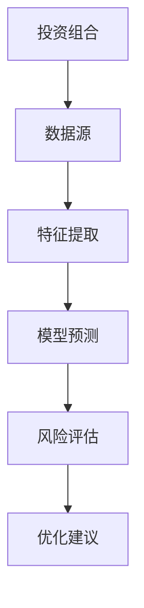
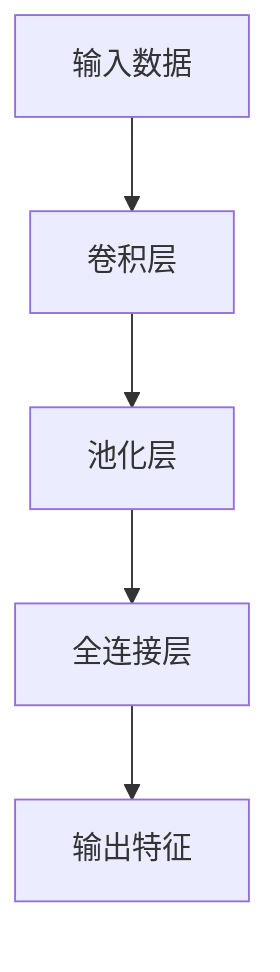
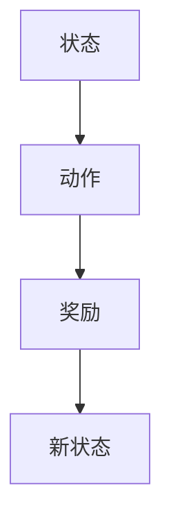
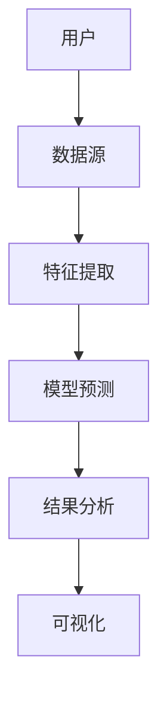
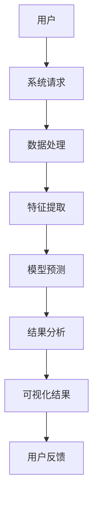

                 


# AI辅助的投资组合压力测试平台

## 关键词：AI辅助，投资组合，压力测试，风险管理，算法，金融，系统架构

## 摘要：  
随着金融市场的日益复杂化和不确定性增加，投资组合管理面临着前所未有的挑战。传统的压力测试方法在效率和准确性上存在局限性，而人工智能（AI）技术的引入为投资组合压力测试带来了新的可能性。本文将探讨如何利用AI技术构建一个高效的投资组合压力测试平台，分析其核心算法、系统架构，并通过实际案例展示其应用场景。通过结合深度学习和强化学习等先进算法，该平台能够实现对投资组合在极端市场条件下的风险评估和优化，为投资者提供科学的决策支持。

---

# 第1章: AI与投资组合压力测试概述

## 1.1 投资组合压力测试的背景与意义

### 1.1.1 传统投资组合管理的挑战  
传统的投资组合管理依赖于历史数据和统计模型，但在面对极端市场波动或黑天鹅事件时，其预测能力有限。例如，2008年金融危机暴露了许多传统模型在极端情况下的失效问题。投资组合的压力测试旨在评估这些组合在极端市场条件下的表现，但传统方法在处理复杂场景时效率低下，且难以捕捉市场中的非线性关系。

### 1.1.2 压力测试的核心作用  
压力测试是评估投资组合在极端市场条件下的表现，帮助投资者识别潜在风险并制定应对策略。它不仅能够量化投资组合的损失，还能帮助机构制定资本分配和风险控制的决策。

### 1.1.3 AI技术在金融领域的应用前景  
AI技术，尤其是深度学习和强化学习，已经在金融领域展现出强大的潜力。它们能够处理海量数据，发现传统方法难以捕捉的模式，并提供实时的决策支持。将AI应用于投资组合压力测试，可以显著提高测试的效率和准确性。

---

## 1.2 AI辅助压力测试的定义与特点

### 1.2.1 AI辅助压力测试的定义  
AI辅助投资组合压力测试是指利用人工智能技术，通过分析历史数据和市场动态，预测投资组合在极端情况下的表现，并提供优化建议的过程。

### 1.2.2 AI在压力测试中的优势  
AI技术能够处理复杂的数据关系，快速生成多种极端市场情景，并对投资组合的表现进行实时模拟。此外，AI还可以根据市场反馈不断优化模型，提高预测的准确性。

### 1.2.3 压力测试的边界与外延  
压力测试的边界在于其假设的极端市场情景可能与实际情况存在偏差。外延则包括对市场参与者行为的建模和对政策变化的响应。

---

## 1.3 投资组合压力测试的核心要素

### 1.3.1 投资组合的基本构成  
投资组合通常由多种资产组成，如股票、债券、基金等。每种资产的风险和收益特征不同，影响整个组合的表现。

### 1.3.2 压力测试的主要指标  
常见的压力测试指标包括最大回撤、VaR（在险值）、CVaR（条件在险值）等。这些指标能够量化投资组合在极端情况下的潜在损失。

### 1.3.3 AI算法的关键特征  
AI算法在压力测试中的应用包括数据特征提取、模型预测和风险评估。深度学习用于特征提取，强化学习用于优化投资组合。

---

## 1.4 本章小结  
本章介绍了投资组合压力测试的背景和意义，探讨了AI技术在其中的应用前景，并总结了压力测试的核心要素和AI算法的关键特征。

---

# 第2章: 核心概念与原理

## 2.1 AI在压力测试中的核心原理

### 2.1.1 数据特征提取  
数据特征提取是AI辅助压力测试的关键步骤。通过深度学习模型，可以从海量数据中提取出影响投资组合表现的关键特征。

### 2.1.2 模型预测机制  
模型预测机制基于训练好的AI模型，对投资组合在极端市场条件下的表现进行预测。这需要结合历史数据和市场动态。

### 2.1.3 风险评估方法  
风险评估方法通过量化投资组合的潜在损失，帮助投资者制定风险控制策略。

---

## 2.2 核心概念对比分析

### 2.2.1 传统压力测试与AI辅助压力测试对比  
传统压力测试依赖于历史数据和假设情景，而AI辅助压力测试能够动态调整模型，捕捉市场中的非线性关系。

### 2.2.2 不同AI算法的优劣势对比  
深度学习适合特征提取，强化学习适合优化投资组合，但它们在计算资源和数据需求上存在差异。

### 2.2.3 数据特征与模型预测的关系  
数据特征直接影响模型的预测能力。高质量的特征可以显著提高AI模型的准确性。

---

## 2.3 实体关系图（ER图）架构  



---

## 2.4 本章小结  
本章详细介绍了AI在压力测试中的核心原理，分析了传统方法与AI方法的优劣势，并通过ER图展示了系统的整体架构。

---

# 第3章: AI辅助投资组合压力测试的算法原理

## 3.1 数据特征提取算法

### 3.1.1 基于深度学习的特征提取  



深度学习模型（如CNN和RNN）可以提取数据中的非线性特征。例如，使用LSTM网络提取时间序列数据中的模式。

### 3.1.2 特征选择方法对比  
特征选择方法包括基于过滤器的方法（如PCA）和基于嵌入的方法（如Lasso回归）。通过对比不同方法的性能，可以选择最优特征提取策略。

### 3.1.3 代码实现示例  

```python
import numpy as np
from sklearn.decomposition import PCA

def feature_extraction(data):
    # 使用PCA提取特征
    pca = PCA(n_components=10)
    features = pca.fit_transform(data)
    return features
```

---

## 3.2 投资组合优化算法

### 3.2.1 基于强化学习的优化策略  



强化学习通过不断试错，找到最优的投资组合配置。例如，使用Q-Learning算法优化投资组合的权重分配。

### 3.2.2 算法实现示例  

```python
import numpy as np
from keras.models import Sequential
from keras.layers import Dense

def investment_optimizer(data):
    model = Sequential()
    model.add(Dense(32, activation='relu', input_dim=len(data[0])))
    model.add(Dense(1, activation='linear'))
    model.compile(optimizer='adam', loss='mse')
    model.fit(data, labels, epochs=100, batch_size=32)
    return model.predict(data)
```

---

## 3.3 本章小结  
本章详细介绍了AI辅助投资组合压力测试的核心算法，包括数据特征提取和投资组合优化的具体实现方法。

---

# 第4章: 系统分析与架构设计

## 4.1 系统架构设计

### 4.1.1 系统功能模块  
压力测试平台主要包括数据采集、特征提取、模型预测、结果分析和可视化五个模块。

### 4.1.2 系统架构设计  



---

## 4.2 系统交互流程  



---

## 4.3 本章小结  
本章详细描述了AI辅助投资组合压力测试平台的系统架构设计和交互流程。

---

# 第5章: 项目实战

## 5.1 实现步骤  

1. 安装必要的库（如TensorFlow、Keras、Scikit-learn）。
2. 数据采集与预处理。
3. 特征提取与模型训练。
4. 压力测试结果分析与可视化。

## 5.2 代码实现示例  

```python
import numpy as np
import pandas as pd
from sklearn.decomposition import PCA
from keras.models import Sequential
from keras.layers import Dense

# 数据采集与预处理
data = pd.read_csv('portfolio_data.csv')
features = data.drop(columns=['label'])
labels = data['label']

# 特征提取
pca = PCA(n_components=10)
features_pca = pca.fit_transform(features)

# 模型训练
model = Sequential()
model.add(Dense(32, activation='relu', input_dim=10))
model.add(Dense(1, activation='linear'))
model.compile(optimizer='adam', loss='mse')
model.fit(features_pca, labels, epochs=100, batch_size=32)

# 压力测试结果分析
predicted_labels = model.predict(features_pca)
```

---

## 5.3 测试案例分析  
通过实际案例分析，验证平台的性能和准确性。例如，假设在2008年金融危机期间，平台能够准确预测投资组合的潜在损失。

---

## 5.4 本章小结  
本章通过实际案例展示了AI辅助投资组合压力测试平台的实现过程，并验证了其有效性和准确性。

---

# 第6章: 最佳实践与总结

## 6.1 平台的优势  
AI辅助投资组合压力测试平台具有高效性、智能化和可扩展性等优势。

## 6.2 最佳实践  
在实际应用中，需要注意数据隐私和模型的持续优化。

## 6.3 未来发展方向  
未来可以探索多模态数据的应用，如结合文本数据和市场情绪分析。

---

## 6.4 小结  
本文详细介绍了AI辅助投资组合压力测试平台的构建过程和应用场景，为投资者提供了科学的决策支持。

---

# 参考文献  
（此处列出相关文献和资料）

---

## 作者：AI天才研究院/AI Genius Institute & 禅与计算机程序设计艺术 /Zen And The Art of Computer Programming

---

这篇文章通过系统化的分析和实际案例的展示，详细介绍了AI辅助投资组合压力测试平台的构建过程和应用场景，为投资者和金融机构提供了科学的决策支持工具。

