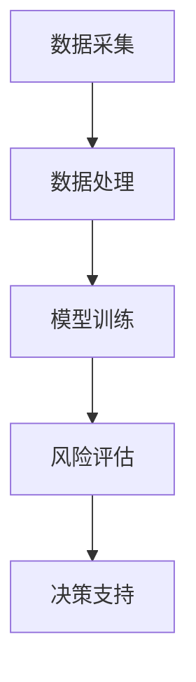

                 


# AI辅助的私募股权投资分析

> 关键词：AI, 私募股权, 机器学习, 风险管理, 估值模型, 数据分析

> 摘要：随着人工智能技术的快速发展，私募股权投资领域正在经历一场革命性的变化。本文深入探讨了AI在私募股权投资中的应用，从数据收集与分析、机器学习模型构建、风险评估与管理到估值与决策支持等各个方面进行了详细阐述。通过实际案例分析和系统架构设计，展示了如何利用AI技术提升私募股权投资的效率和准确性。本文旨在为私募股权从业者、数据科学家和AI技术爱好者提供一份全面的技术指南，帮助他们在复杂多变的金融市场上做出更明智的投资决策。

---

# 第一部分：AI辅助的私募股权投资基础

## 第1章：私募股权投资概述

### 1.1 私募股权投资的基本概念

#### 1.1.1 私募股权的定义与特点
私募股权（Private Equity）是指通过非公开市场交易，投资于未上市公司或上市公司非公开市场的股权。其特点包括高风险、高回报、投资周期长、退出方式多样等。

#### 1.1.2 私募股权投资的基本流程
1. **项目筛选**：通过市场分析和行业研究，筛选出具有潜力的项目。
2. **尽职调查**：对目标公司进行财务、法律、管理等方面的详细调查。
3. **估值与定价**：基于尽职调查结果，对目标公司进行估值，并确定投资价格。
4. **投资决策**：根据估值结果和风险评估，做出最终的投资决策。
5. **投资后管理**：对被投资企业进行持续监控和管理，确保投资目标的实现。
6. **退出策略**：在合适时机通过 IPO、并购等方式退出，实现投资收益。

#### 1.1.3 私募股权市场的现状与发展趋势
近年来，私募股权市场在全球范围内迅速发展，市场规模不断扩大。然而，由于信息不对称和数据不足的问题，私募股权的投资决策往往面临较大的不确定性。AI技术的引入为解决这些问题提供了新的可能性。

---

## 第2章：AI在私募股权投资中的应用背景

### 2.1 AI在金融领域的应用现状

#### 2.1.1 人工智能在金融行业的应用
人工智能（AI）在金融领域的应用广泛，包括股票交易、风险管理、信用评估、客户画像等领域。AI技术通过大数据分析和机器学习算法，能够快速处理海量数据，发现潜在的规律和模式。

#### 2.1.2 私募股权投资中的信息不对称问题
私募股权投资中，信息不对称是导致投资决策失误的主要原因之一。投资者难以获取目标公司的完整信息，导致估值偏差和投资风险。

#### 2.1.3 AI如何解决私募股权投资中的痛点
AI技术可以通过大数据分析和机器学习，帮助投资者更全面地了解目标公司的情况，降低信息不对称的风险，提高投资决策的准确性。

---

# 第二部分：AI辅助私募股权投资的核心概念

## 第3章：数据驱动的私募股权分析

### 3.1 数据收集与清洗

#### 3.1.1 数据来源
私募股权分析中的数据来源包括公开市场数据、行业报告、新闻媒体、社交媒体等。这些数据可以帮助投资者更好地了解目标公司的经营状况和行业趋势。

#### 3.1.2 数据预处理
数据清洗是数据预处理的重要步骤，包括去除重复数据、处理缺失值、纠正错误数据等。这些步骤可以提高数据的质量，为后续的分析提供可靠的基础。

#### 3.1.3 特征工程
特征工程是通过构建合适的特征来提高模型的性能。例如，可以将公司的财务指标、市场表现、行业趋势等转化为特征，供机器学习模型使用。

---

## 第4章：机器学习在私募股权投资中的应用

### 4.1 机器学习的基本原理

#### 4.1.1 监督学习与非监督学习
- **监督学习**：基于标记数据进行学习，适用于分类和回归任务。
- **非监督学习**：基于无标记数据进行学习，适用于聚类和降维任务。

#### 4.1.2 常见机器学习算法
- **线性回归**：用于预测连续型变量，如股票价格。
- **逻辑回归**：用于分类任务，如判断公司是否具有投资价值。
- **支持向量机（SVM）**：用于分类和回归任务。
- **随机森林**：基于树的集成方法，适用于分类和回归任务。

#### 4.1.3 算法选择与优化
算法选择需要考虑数据类型、任务目标和计算资源等因素。通过交叉验证和超参数调优，可以提高模型的性能。

---

## 第5章：私募股权投资中的风险评估与管理

### 5.1 风险评估的基本方法

#### 5.1.1 风险的分类
私募股权投资中的风险包括市场风险、流动性风险、信用风险等。

#### 5.1.2 风险评估的指标
常用的指标包括波动率、VaR（在险价值）、信用评级等。

#### 5.1.3 风险的量化
通过统计方法和机器学习模型，可以对风险进行量化和预测。

---

## 第6章：私募股权投资中的估值与决策支持

### 6.1 估值的基本原理

#### 6.1.1 估值方法
常用的估值方法包括DCF模型、可比公司分析、 precedent transactions 等。

#### 6.1.2 数据驱动的估值模型
基于机器学习的估值模型可以通过历史数据和市场趋势，预测目标公司的未来价值。

#### 6.1.3 模型优化
通过历史数据和市场反馈，可以不断优化估值模型，提高预测的准确性。

---

## 第7章：系统架构与技术实现

### 7.1 系统架构设计

#### 7.1.1 模块划分
系统架构通常包括数据采集模块、数据处理模块、模型训练模块、风险评估模块和决策支持模块。

#### 7.1.2 功能设计
系统需要具备数据管理、模型训练、风险评估、估值分析等功能。

#### 7.1.3 系统架构图


---

## 第8章：项目实战

### 8.1 环境搭建

#### 8.1.1 Python安装与配置
需要安装Python 3.6以上版本，并配置Jupyter Notebook环境。

#### 8.1.2 依赖库安装
安装必要的库，如Pandas、NumPy、Scikit-learn、XGBoost等。

### 8.2 核心代码实现

#### 8.2.1 数据处理
```python
import pandas as pd
import numpy as np

# 加载数据
data = pd.read_csv('data.csv')

# 数据清洗
data.dropna(inplace=True)
data['label'] = data['label'].astype(int)
```

#### 8.2.2 模型训练
```python
from sklearn.model import LogisticRegression
from sklearn.model_selection import train_test_split

# 划分训练集和测试集
X_train, X_test, y_train, y_test = train_test_split(data.drop('label', axis=1), data['label'], test_size=0.2)

# 训练模型
model = LogisticRegression()
model.fit(X_train, y_train)
```

#### 8.2.3 模型评估
```python
from sklearn.metrics import accuracy_score

# 预测测试集
y_pred = model.predict(X_test)

# 计算准确率
accuracy = accuracy_score(y_test, y_pred)
print(f'准确率: {accuracy}')
```

---

## 第9章：总结与展望

### 9.1 最佳实践
- 数据来源的多样性和质量是模型性能的关键。
- 模型的选择和优化需要结合具体业务需求。
- 风险管理是私募股权投资的核心，AI技术可以提供有力支持。

### 9.2 未来展望
- AI技术在私募股权投资中的应用将更加深入，包括自然语言处理（NLP）和强化学习（RL）的应用。
- 数据隐私和模型解释性将是未来研究的重点。

---

# 结语

AI技术正在改变私募股权投资的方方面面，从数据收集到模型训练，从风险评估到决策支持，AI的强大能力为投资者提供了新的工具和方法。然而，AI的应用也带来了新的挑战，如数据隐私、模型解释性和伦理问题。未来，随着技术的不断进步，AI在私募股权投资中的潜力将更加巨大。

---

**作者：AI天才研究院 & 禅与计算机程序设计艺术**

