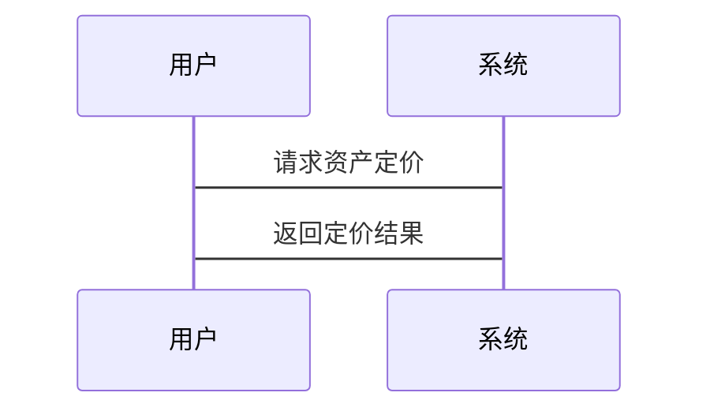

                 


# AI辅助的资产定价模型校准

> 关键词：AI辅助、资产定价、模型校准、机器学习、深度学习、金融建模、数学优化

> 摘要：本文详细探讨了AI技术在资产定价模型校准中的应用，从传统模型的局限性到AI算法的优势，结合数学建模和系统架构设计，提供了一个完整的解决方案。通过实际案例分析和代码实现，展示了如何利用AI提升资产定价的准确性和效率。

---

## 第一部分: 资产定价与AI辅助校准概述

### 第1章: 资产定价与AI校准的背景介绍

#### 1.1 资产定价的基本概念
资产定价是金融领域的重要组成部分，旨在确定资产的公允价值。核心要素包括资产的风险、回报和市场环境。常见模型有CAPM和APT，但传统方法在处理复杂数据时表现有限。

#### 1.2 AI在资产定价中的应用背景
AI技术的崛起为金融领域带来了革新。机器学习和深度学习算法能够处理海量数据，发现传统模型难以捕捉的模式，提升定价的准确性。

#### 1.3 资产定价模型校准的挑战与机遇
校准问题涉及参数估计和优化，传统方法依赖假设和经验，存在误差大、效率低的问题。AI技术通过优化算法和大数据处理，为校准提供了新思路。

---

## 第二部分: AI辅助资产定价的核心概念与算法原理

### 第2章: AI辅助资产定价的核心概念

#### 2.1 资产定价模型的数学表示
资产定价模型通常表示为：
$$ y = \beta_0 + \beta_1x + \epsilon $$
其中，y为资产收益，x为影响因素，β为参数，ε为误差项。

#### 2.2 AI在资产定价中的核心算法
- **机器学习算法**：线性回归、SVM、随机森林。
- **深度学习算法**：神经网络、CNN、RNN、Transformer。

#### 2.3 校准问题的数学建模
目标函数：
$$ \text{minimize} \sum_{i=1}^n (y_i - \hat{y}_i)^2 $$
其中，y_i为实际值，ŷ_i为预测值。

### 第3章: AI辅助资产定价的核心算法原理

#### 3.1 机器学习算法在资产定价中的应用
- **线性回归**：简单但线性假设限制了应用。
- **支持向量机**：适用于高维数据，但参数敏感。
- **随机森林**：集成方法，稳定性高，但解释性差。

#### 3.2 深度学习算法在资产定价中的应用
- **神经网络**：非线性建模能力强，但训练复杂。
- **卷积神经网络（CNN）**：适合处理图像数据，但在时间序列上表现一般。
- **循环神经网络（RNN）**：适合时间序列数据，但存在梯度消失问题。
- **Transformer架构**：在序列建模中表现出色，但计算资源需求高。

#### 3.3 算法原理的数学模型
- 线性回归的数学公式：
  $$ y = \beta_0 + \beta_1x + \epsilon $$
- 神经网络的前向传播公式：
  $$ a^{(l+1)} = \sigma(w^{(l)}a^{(l)} + b^{(l)}) $$

#### 3.4 算法实现的Python代码示例
```python
import numpy as np
from sklearn.linear_model import LinearRegression

# 示例数据
X = np.array([1, 2, 3, 4]).reshape(-1, 1)
y = np.array([2, 4, 5, 6])

# 训练模型
model = LinearRegression()
model.fit(X, y)

# 预测
print(model.predict([[5]]))
```

---

## 第三部分: 系统分析与架构设计方案

### 第4章: 系统分析与架构设计

#### 4.1 系统功能设计
- 数据获取：从数据库或API获取资产数据。
- 特征工程：数据清洗、特征提取。
- 模型训练：选择并训练AI模型。
- 结果评估：验证模型性能。

#### 4.2 系统架构设计
使用Mermaid绘制系统架构图：


#### 4.3 接口与交互设计
接口设计：
- 数据接口：提供REST API用于数据获取。
- 模型接口：提供API用于模型调用。

交互设计：


---

## 第四部分: 项目实战

### 第5章: 项目实战

#### 5.1 项目介绍
以股票定价为例，使用机器学习模型进行校准。

#### 5.2 核心实现
- 数据预处理：清洗和标准化。
- 特征提取：选择影响股价的关键因素。
- 模型训练：使用随机森林进行训练。
- 结果评估：计算准确率和混淆矩阵。

#### 5.3 代码实现
```python
import pandas as pd
from sklearn.ensemble import RandomForestRegressor
from sklearn.metrics import mean_squared_error

# 数据获取与预处理
data = pd.read_csv('stock_data.csv')
X = data[['开盘价', '最高价', '最低价', '成交量']]
y = data['收盘价']

# 模型训练
model = RandomForestRegressor(n_estimators=100)
model.fit(X, y)

# 预测与评估
y_pred = model.predict(X)
print(mean_squared_error(y, y_pred))
```

#### 5.4 案例分析
通过实际数据验证模型的准确性和稳定性，调整参数优化性能。

---

## 第五部分: 总结与展望

### 第6章: 总结与展望

#### 6.1 总结
AI技术显著提升了资产定价的准确性和效率，但算法选择和数据质量仍需优化。

#### 6.2 展望
未来，结合多模态数据和更复杂的模型结构，AI将在资产定价中发挥更大作用。

#### 6.3 最佳实践
- 数据预处理是关键，需谨慎处理缺失值和异常值。
- 选择合适的模型并进行调参，提升性能。
- 定期更新模型，适应市场变化。

---

作者：AI天才研究院 & 禅与计算机程序设计艺术

