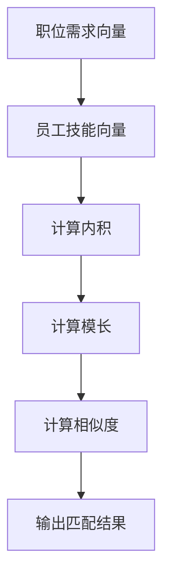

                 


# AI驱动的企业人才匹配系统：职位需求与员工技能智能匹配

> 关键词：AI，人才匹配，机器学习，职位需求，员工技能，深度学习

> 摘要：随着企业对高效人才匹配的需求日益增加，AI技术的应用为解决这一问题提供了新的可能性。本文将详细探讨AI驱动的企业人才匹配系统的原理、算法、架构设计及其实现，通过实际案例分析和系统设计，揭示如何利用AI技术实现职位需求与员工技能的智能匹配。文章从理论到实践，全面解析这一系统的核心技术与应用场景，为企业的智能化人才管理提供参考。

---

## 第一部分: AI驱动的企业人才匹配系统概述

### 第1章: 人才匹配的重要性与挑战

#### 1.1 企业人才匹配的核心问题

##### 1.1.1 传统招聘与匹配的痛点

在传统的人才招聘与匹配过程中，企业面临着以下痛点：
- **信息不对称**：企业难以全面了解候选人的真实能力与潜力。
- **效率低下**：人工筛选简历和匹配职位的过程耗时且成本高昂。
- **主观性**：招聘人员的主观判断可能影响决策的客观性。
- **动态需求**：职位需求的变化难以快速响应到招聘流程中。

##### 1.1.2 AI驱动匹配的优势

AI技术的应用为人才匹配带来了显著的优势：
- **高效性**：通过算法快速匹配职位需求与候选人技能。
- **精准性**：基于数据驱动的匹配，减少人为误差。
- **实时性**：能够动态调整匹配策略，适应需求变化。
- **可扩展性**：支持大规模数据处理，适用于大企业或灵活用工场景。

##### 1.1.3 企业人才匹配的边界与外延

企业人才匹配的边界包括：
- **内部员工调配**：优化员工岗位分配，提升内部效率。
- **外部人才引入**：精准招聘符合需求的候选人。
- **实习生与临时用工**：灵活匹配短期需求。

其外延则扩展至：
- **职业发展规划**：为员工提供发展方向建议。
- **培训计划制定**：基于技能差距推荐培训内容。

#### 1.2 职位需求与员工技能的匹配逻辑

##### 1.2.1 职位需求的核心要素

职位需求的核心要素包括：
- **岗位职责**：具体的工作内容与职责。
- **技能要求**：岗位所需的硬性技能（如编程语言）与软性技能（如团队合作）。
- **经验要求**：相关工作经验年限。
- **优先级**：某些技能或经验的优先级更高。

##### 1.2.2 员工技能的关键维度

员工技能的关键维度包括：
- **技术能力**：编程语言、工具使用能力。
- **软技能**：沟通能力、团队协作能力。
- **教育背景**：学历、专业相关性。
- **项目经验**：参与过的项目类型与规模。

##### 1.2.3 匹配逻辑的结构化分析

匹配逻辑的结构化分析可以表示为：
$$
\text{匹配度} = \sum_{i=1}^{n} w_i \cdot s_i
$$
其中，$w_i$ 是第$i$个技能的权重，$s_i$ 是该技能的匹配程度。

---

### 第2章: AI驱动人才匹配的核心概念

#### 2.1 职位需求分析

##### 2.1.1 职位需求的分解与建模

职位需求可以分解为以下要素：
- **职责分解**：将岗位职责拆解为具体的任务。
- **技能分解**：将技能要求拆解为具体的技能点。
- **权重分配**：根据岗位的重要性，为每个技能点分配权重。

##### 2.1.2 职位需求的权重分配

权重分配可以通过以下步骤实现：
1. 确定每个技能的重要性。
2. 使用层次分析法（AHP）计算权重。
3. 调整权重以反映实际需求。

##### 2.1.3 职位需求的动态调整

动态调整可以通过以下方式实现：
- **实时反馈**：根据候选人匹配情况调整权重。
- **数据更新**：定期更新职位需求模型。

#### 2.2 员工技能评估

##### 2.2.1 技能标签化与标准化

技能标签化与标准化的过程包括：
1. 将技能进行分类（如技术技能、软技能）。
2. 为每个技能定义标准化的评估指标。

##### 2.2.2 技能评估的多维度指标

多维度指标包括：
- **技术能力**：编程语言、框架掌握程度。
- **项目经验**：参与过的项目类型、规模。
- **教育背景**：学历、专业相关性。

##### 2.2.3 技能数据的采集与处理

技能数据的采集可以通过以下途径：
- **简历解析**：从简历中提取技能信息。
- **能力测试**：通过在线测试评估技能水平。
- **面试评估**：通过面试进一步验证技能。

#### 2.3 匹配算法原理

##### 2.3.1 基于规则的匹配

基于规则的匹配是一种简单但有效的匹配方法：
1. 根据职位需求设定规则。
2. 根据规则匹配符合条件的候选人。

##### 2.3.2 基于机器学习的匹配

基于机器学习的匹配流程：
1. 数据预处理：清洗和特征提取。
2. 模型训练：使用监督学习模型（如逻辑回归、随机森林）。
3. 模型预测：预测候选人与职位的匹配度。

##### 2.3.3 深度学习模型的应用

深度学习模型（如神经网络）可以用于：
- **文本匹配**：匹配职位描述与简历内容。
- **语义理解**：理解技能描述的语义。

---

## 第二部分: 算法原理与实现

### 第3章: 算法原理与实现

#### 3.1 基于余弦相似度的匹配算法

##### 3.1.1 余弦相似度的数学公式

余弦相似度的公式为：
$$
\text{相似度} = \frac{\vec{A} \cdot \vec{B}}{|\vec{A}| |\vec{B}|}
$$

##### 3.1.2 算法流程图



##### 3.1.3 算法实现代码

```python
import numpy as np

def cosine_similarity(vec1, vec2):
    dot_product = np.dot(vec1, vec2)
    norm_vec1 = np.linalg.norm(vec1)
    norm_vec2 = np.linalg.norm(vec2)
    return dot_product / (norm_vec1 * norm_vec2)
```

#### 3.2 基于协同过滤的匹配算法

##### 3.2.1 协同过滤的数学公式

协同过滤的公式为：
$$
\text{相似度} = \frac{\sum_{i=1}^{n} r_{ui} \cdot r_{vi}}{\sqrt{\sum_{i=1}^{n} r_{ui}^2} \cdot \sqrt{\sum_{i=1}^{n} r_{vi}^2}}}
$$

##### 3.2.2 算法实现代码

```python
def collaborative_filtering(user_item_matrix, user_id, item_id):
    # 计算用户和项目的相似度
    similarity = cosine_similarity(user_item_matrix[user_id], user_item_matrix[item_id])
    return similarity
```

---

## 第三部分: 系统架构与功能设计

### 第4章: 系统架构与功能设计

#### 4.1 系统应用场景

系统应用场景包括：
- **企业内部招聘**：优化内部员工调配。
- **外部人才引入**：精准匹配外部候选人。
- **灵活用工**：快速匹配实习生或临时用工。

#### 4.2 系统功能模块

##### 4.2.1 职位需求管理模块

- 职位发布
- 职位需求编辑
- 职位需求查询

##### 4.2.2 员工技能库管理模块

- 技能标签管理
- 技能数据录入
- 技能数据查询

##### 4.2.3 匹配算法引擎模块

- 算法选择
- 参数配置
- 匹配结果输出

##### 4.2.4 匹配结果展示模块

- 结果可视化
- 结果导出
- 结果分析

#### 4.3 系统架构设计

##### 4.3.1 分层架构设计

分层架构包括：
- **前端层**：用户交互界面。
- **业务逻辑层**：处理用户请求。
- **数据访问层**：访问数据库。

##### 4.3.2 微服务架构实现

微服务架构包括：
- **职位需求服务**：处理职位相关请求。
- **员工技能服务**：处理技能相关请求。
- **匹配引擎服务**：提供匹配算法服务。

##### 4.3.3 高可用性与扩展性

通过负载均衡和容灾设计，确保系统的高可用性和可扩展性。

---

## 第四部分: 项目实战

### 第5章: 项目实战

#### 5.1 环境配置

- **Python版本**：Python 3.8+
- **依赖库**：numpy、scikit-learn
- **开发工具**：Jupyter Notebook、VS Code

#### 5.2 核心实现代码

##### 5.2.1 数据预处理

```python
import pandas as pd

# 读取数据
data = pd.read_csv('employee_skills.csv')

# 数据清洗
data.dropna(inplace=True)
data = pd.get_dummies(data, columns=['技能'])
```

##### 5.2.2 模型训练

```python
from sklearn.model import LogisticRegression

# 训练模型
model = LogisticRegression()
model.fit(X_train, y_train)
```

##### 5.2.3 模型预测

```python
# 预测匹配度
y_pred = model.predict(X_test)
```

#### 5.3 实际案例分析

通过实际案例分析，验证系统的匹配效果，并进行优化。

---

## 第五部分: 总结与展望

### 第6章: 总结与展望

#### 6.1 系统优缺点总结

- **优点**：高效、精准、动态调整。
- **缺点**：数据依赖性高、模型调优复杂。

#### 6.2 未来发展方向

- **模型优化**：引入更复杂的深度学习模型。
- **数据扩展**：引入更多维度的数据。
- **应用场景扩展**：应用于更多行业和岗位类型。

---

## 作者：AI天才研究院/AI Genius Institute & 禅与计算机程序设计艺术 /Zen And The Art of Computer Programming

---

本文通过系统化的分析与实践，全面揭示了AI驱动的企业人才匹配系统的原理与实现。从理论到实践，从算法到系统设计，为企业的智能化人才管理提供了有价值的参考与指导。

