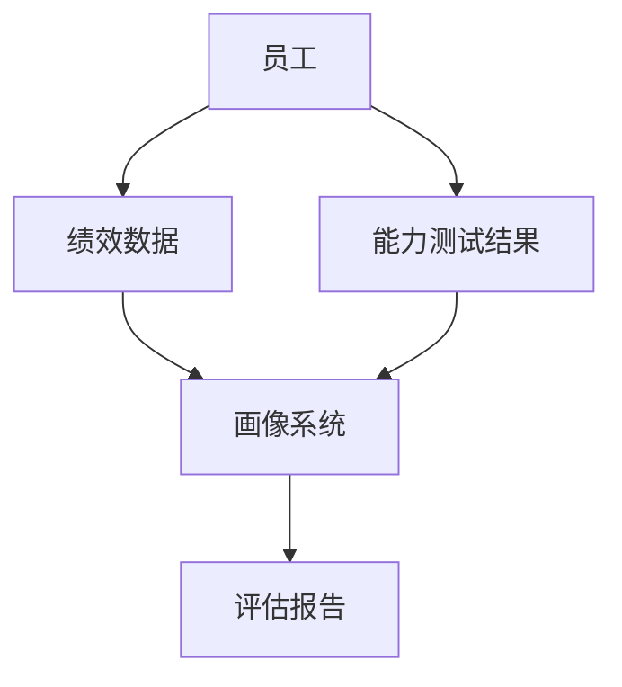
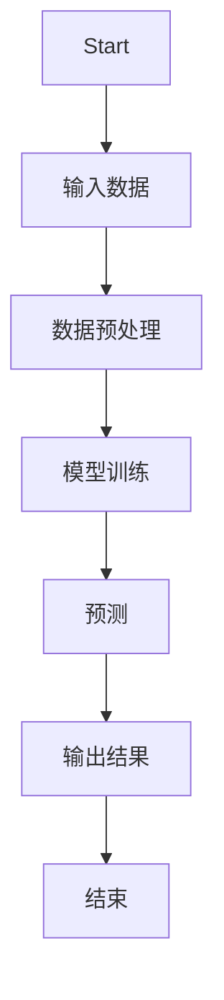
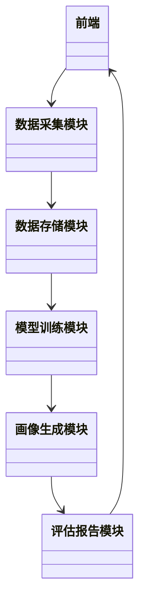

                 


# AI驱动的企业人才画像系统：全方位员工能力评估

> 关键词：AI驱动，企业人才，画像系统，员工能力评估，人工智能，数据分析

> 摘要：本文将详细介绍AI驱动的企业人才画像系统，探讨如何利用人工智能技术实现员工能力的全方位评估。通过分析数据采集、特征提取、模型训练等核心步骤，结合实际案例，展示系统在企业中的应用价值。文章还将深入探讨算法原理、系统架构设计以及项目实战，为读者提供全面的技术解读。

---

## 第1章：背景介绍

### 1.1 问题背景与描述

#### 1.1.1 传统企业人才评估的局限性
传统的企业人才评估方法依赖于主观判断和经验，存在以下问题：
- 评估结果的主观性较强，难以量化。
- 数据维度有限，难以全面反映员工能力。
- 评估周期较长，难以实时反馈。

#### 1.1.2 当前企业人才管理面临的挑战
现代企业面临以下人才管理挑战：
- 员工能力分布复杂，难以统一标准。
- 数据分散，缺乏有效整合。
- 人才评估需要高效、精准的工具。

#### 1.1.3 AI技术在人才评估中的应用前景
AI技术在人才评估中的应用前景广阔：
- 利用大数据分析技术，实现精准画像。
- 通过机器学习算法，优化评估模型。
- 实现实时反馈和动态调整。

### 1.2 问题解决与边界

#### 1.2.1 AI驱动人才画像系统的解决方案
AI驱动的人才画像系统通过以下步骤实现员工能力评估：
1. 数据采集：收集员工的绩效数据、能力测试结果等。
2. 特征提取：从数据中提取关键特征，如技能水平、工作效率等。
3. 模型训练：利用机器学习算法训练画像模型。
4. 画像生成：根据模型输出员工能力画像。
5. 结果分析：生成评估报告，提出改进建议。

#### 1.2.2 系统的边界与适用范围
系统的边界包括：
- 数据来源：仅限于企业内部数据。
- 评估对象：仅限于在职员工。
- 评估维度：包括技能、绩效、潜力等。

#### 1.2.3 核心要素与组成结构
系统的核心要素包括：
- 数据采集模块：负责数据的收集和预处理。
- 模型训练模块：负责特征提取和模型训练。
- 画像生成模块：负责生成员工能力画像。
- 评估报告模块：负责输出评估结果。

---

## 第2章：核心概念与联系

### 2.1 核心概念解析

#### 2.1.1 数据采集与特征提取
- 数据采集：通过问卷、测试、绩效数据等方式收集员工信息。
- 特征提取：从数据中提取关键特征，如技能水平、工作效率等。

#### 2.1.2 模型训练与画像生成
- 模型训练：利用机器学习算法训练画像模型。
- 画像生成：根据模型输出员工能力画像。

#### 2.1.3 结果分析与评估优化
- 结果分析：分析画像结果，评估模型准确性。
- 评估优化：根据分析结果优化模型参数。

### 2.2 核心概念对比分析

#### 2.2.1 不同人才评估方法的对比
| 方法 | 优点 | 缺点 |
|------|------|------|
| 传统评估 | 主观性较低 | 数据维度有限 |
| AI驱动 | 数据全面 | 技术复杂 |

#### 2.2.2 实体关系图


---

## 第3章：算法原理

### 3.1 算法流程

#### 3.1.1 算法流程图


#### 3.1.2 数学模型
- 线性回归模型：
  $$ y = \beta_0 + \beta_1x + \epsilon $$
- 聚类算法：K-means

### 3.2 Python实现

#### 3.2.1 核心算法代码
```python
import numpy as np
from sklearn.cluster import KMeans

# 示例数据
X = np.array([[2, 3], [5, 8], [1, 2], [6, 7]])

# K-means聚类
kmeans = KMeans(n_clusters=2)
kmeans.fit(X)

# 输出聚类结果
print(kmeans.labels_)
```

---

## 第4章：系统分析与架构设计

### 4.1 系统功能模块

#### 4.1.1 功能模块说明
- 数据采集模块：负责数据的收集和预处理。
- 画像生成模块：负责生成员工能力画像。
- 评估报告模块：负责输出评估结果。

#### 4.1.2 系统架构图


---

## 第5章：项目实战

### 5.1 环境安装与配置

#### 5.1.1 环境要求
- Python 3.6+
- Scikit-learn库
- Mermaid工具

### 5.2 核心代码实现

#### 5.2.1 数据预处理代码
```python
import pandas as pd
from sklearn.preprocessing import StandardScaler

# 读取数据
data = pd.read_csv('employee_data.csv')

# 数据标准化
scaler = StandardScaler()
scaled_data = scaler.fit_transform(data)
```

#### 5.2.2 模型训练代码
```python
from sklearn.model_selection import train_test_split
from sklearn.svm import SVC

# 划分训练集和测试集
X_train, X_test, y_train, y_test = train_test_split(scaled_data, data['target'], test_size=0.2)

# 训练模型
model = SVC()
model.fit(X_train, y_train)
```

### 5.3 实际案例分析

#### 5.3.1 案例背景
某企业希望评估员工的销售能力，数据包括销售额、客户满意度等。

#### 5.3.2 实施步骤
1. 数据采集：收集员工的销售数据。
2. 数据预处理：清洗数据，标准化处理。
3. 模型训练：训练销售能力预测模型。
4. 生成画像：输出员工销售能力画像。

---

## 第6章：最佳实践

### 6.1 小结

#### 6.1.1 项目总结
通过AI驱动的人才画像系统，企业可以实现员工能力的全方位评估，提升人才管理效率。

#### 6.1.2 经验总结
- 数据质量是关键。
- 模型选择需要根据具体场景调整。
- 系统的可解释性需要重视。

### 6.2 注意事项

#### 6.2.1 数据隐私保护
- 确保数据隐私合规。
- 遵守相关法律法规。

#### 6.2.2 模型优化建议
- 定期更新模型。
- 优化特征选择。

### 6.3 未来趋势

#### 6.3.1 技术发展趋势
- AI技术的不断进步。
- 数据分析工具的多样化。

#### 6.3.2 应用场景扩展
- 更多行业应用。
- 更多维度的评估。

### 6.4 拓展阅读

#### 6.4.1 推荐书籍
- 《机器学习实战》
- 《深度学习》

#### 6.4.2 推荐博客
- 禅与计算机程序设计艺术（https://www.zybulb.com）

---

## 作者

**作者：AI天才研究院/AI Genius Institute & 禅与计算机程序设计艺术 /Zen And The Art of Computer Programming**

---

希望这篇文章能够为读者提供全面的技术解读，帮助他们理解AI驱动的企业人才画像系统的核心原理和实际应用。

