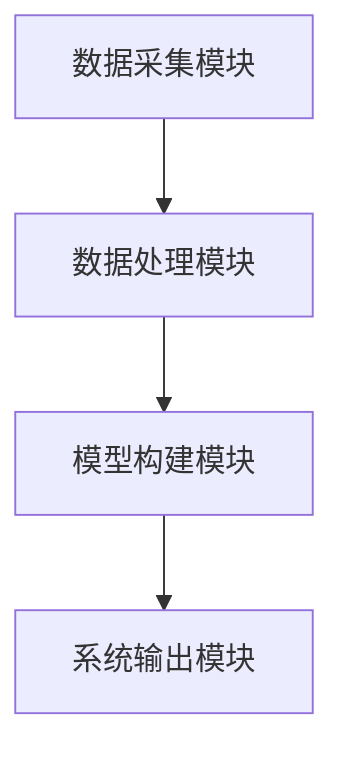
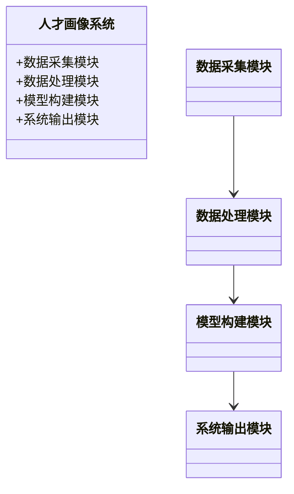

                 


# AI驱动的企业人才画像系统：多维度能力评估与发展预测

> 关键词：AI技术、人才画像、能力评估、发展预测、企业人才管理、系统架构

> 摘要：本文深入探讨了AI驱动的企业人才画像系统，从多维度能力评估到发展预测，系统阐述了该系统的构建原理、算法实现、系统架构及实际应用。通过详细的背景分析、核心概念解读、算法原理剖析、系统设计与实现、项目实战案例以及最佳实践总结，本文为读者提供了一套完整的AI驱动企业人才管理解决方案。

---

## 第1章: 企业人才画像系统背景与核心概念

### 1.1 问题背景与挑战

#### 1.1.1 传统企业人才评估的局限性
- 传统的人才评估方法依赖于主观判断，存在主观性强、效率低、成本高等问题。
- 面试官的能力差异可能导致评估结果不准确，难以全面反映候选人的实际能力。
- 传统评估方法难以量化和预测候选人的长期发展潜力。

#### 1.1.2 AI技术在人才评估中的优势
- AI技术可以快速处理大量数据，提取关键特征，帮助客观评估候选人的能力。
- 通过机器学习算法，AI可以预测候选人的未来表现和发展潜力。
- AI系统可以实时更新评估结果，提供动态反馈，帮助企业在人才管理中做出更明智的决策。

#### 1.1.3 当前企业人才管理的痛点与需求
- 企业需要更高效、更精准的人才评估方法，以应对快速变化的市场环境。
- 企业希望能够预测员工的未来发展潜力，优化人才梯队建设。
- 企业需要一个统一的平台，整合多维度数据，实现人才画像的动态更新。

### 1.2 人才画像系统的核心概念

#### 1.2.1 人才画像的定义与目标
- **定义**：人才画像是基于AI技术构建的多维度数据模型，通过分析候选人的知识、技能、经验、性格等特征，生成一个全面的人才评估结果。
- **目标**：帮助企业在招聘、晋升、培训等环节做出更科学的决策，优化人才管理流程。

#### 1.2.2 多维度能力评估的维度分解
- **知识**：候选人掌握的专业知识和行业技能。
- **技能**：候选人在实际工作中的应用能力和操作水平。
- **经验**：候选人过往的工作经历和项目经验。
- **性格**：候选人的性格特质和工作风格。
- **潜力**：候选人未来的发展潜力和成长空间。

#### 1.2.3 发展预测的数学模型与算法
- 通过机器学习算法（如线性回归、随机森林等）对候选人的历史数据进行建模，预测其未来的表现和发展潜力。
- 使用时间序列分析（如ARIMA模型）对候选人的职业发展进行长期预测。

### 1.3 系统的边界与外延

#### 1.3.1 系统的功能边界
- 系统主要关注候选人的多维度能力评估和未来发展的预测，不涉及企业的具体业务流程。
- 系统的数据来源包括简历、面试记录、绩效数据等，不涵盖其他与人才管理无关的数据。

#### 1.3.2 与企业其他系统的交互关系
- 系统可以与企业的人力资源管理系统（HRMS）集成，提供实时的人才评估结果。
- 系统可以与企业培训系统集成，为员工的培训计划提供数据支持。

#### 1.3.3 系统的可扩展性与灵活性
- 系统支持新增评估维度，可以根据企业的具体需求进行定制化开发。
- 系统支持多种数据输入格式，可以根据企业的数据特点进行灵活配置。

### 1.4 核心要素组成

#### 1.4.1 数据来源与处理流程
- **数据来源**：简历、面试记录、绩效数据、员工自评、团队评价等。
- **数据处理流程**：数据清洗、特征提取、数据标注、数据建模。

#### 1.4.2 模型构建与优化
- 使用机器学习算法构建多维度评估模型，通过交叉验证优化模型参数。
- 定期更新模型，确保评估结果的准确性和时效性。

#### 1.4.3 系统输出与反馈机制
- 系统输出人才画像报告，包括候选人的优势、劣势和发展建议。
- 系统提供动态反馈机制，根据员工的表现更新画像报告。

### 1.5 本章小结
- 本章介绍了企业人才画像系统的背景、核心概念和系统架构，为后续的算法实现和系统设计奠定了基础。

---

## 第2章: 人才画像系统的原理与架构

### 2.1 核心概念与联系

#### 2.1.1 画像系统的原理框架
- 通过多维度数据的分析，构建候选人的画像，帮助企业在人才管理中做出科学决策。
- 系统通过机器学习算法预测候选人的未来发展潜力，优化人才梯队建设。

#### 2.1.2 多维度数据的关联分析
- 通过关联分析，识别出影响候选人发展的重要因素。
- 使用决策树算法识别关键特征，帮助企业在招聘中筛选出最适合的人才。

#### 2.1.3 发展预测的逻辑链条
- 从历史数据中提取特征，构建预测模型，输出发展预测结果。

### 2.2 核心概念的ER实体关系图
```mermaid
er
actor: 企业
actor --> system: 提供数据
system --> model: 数据处理
model --> output: 画像结果
```

### 2.3 核心概念的属性特征对比
| 维度 | 特性 | 描述 |
|------|------|------|
| 知识 | 广度 | 多样性与深度 |
| 技能 | 精度 | 标准化与可量化 |
| 经验 | 时间 | 累积性与连续性 |

### 2.4 本章小结
- 本章通过ER实体关系图和属性特征对比，详细解读了人才画像系统的原理和架构，为后续的算法实现和系统设计奠定了基础。

---

## 第3章: 算法原理与实现

### 3.1 算法原理概述

#### 3.1.1 算法选择与优化
- 使用随机森林算法进行特征选择，通过网格搜索优化模型参数。
- 使用交叉验证评估模型的泛化性能，确保模型的稳定性和可靠性。

#### 3.1.2 算法实现流程
1. 数据清洗与预处理
2. 特征提取与选择
3. 模型训练与优化
4. 模型评估与验证

#### 3.1.3 算法的数学模型与公式
- 随机森林算法的数学模型如下：
  $$ y = \sum_{i=1}^{n} w_i x_i + b $$
  其中，$w_i$ 是特征 $x_i$ 的权重，$b$ 是偏置项。

### 3.2 算法实现的代码示例

#### 3.2.1 环境安装
```bash
pip install scikit-learn
```

#### 3.2.2 核心代码实现
```python
from sklearn.ensemble import RandomForestClassifier
from sklearn.model_selection import train_test_split
from sklearn.metrics import accuracy_score

# 数据预处理
X_train, X_test, y_train, y_test = train_test_split(X, y, test_size=0.2)

# 模型训练
model = RandomForestClassifier(n_estimators=100, max_depth=5, random_state=42)
model.fit(X_train, y_train)

# 模型预测
y_pred = model.predict(X_test)

# 模型评估
print("准确率:", accuracy_score(y_test, y_pred))
```

#### 3.2.3 代码解读与分析
- 代码实现了一个基于随机森林算法的人才画像分类模型。
- 使用了数据预处理、模型训练、模型预测和模型评估的完整流程。

### 3.3 本章小结
- 本章详细讲解了人才画像系统的算法实现，通过代码示例帮助读者理解模型的构建和优化过程。

---

## 第4章: 系统架构与设计

### 4.1 系统架构设计

#### 4.1.1 系统功能模块设计
- 数据采集模块：负责采集候选人数据。
- 数据处理模块：负责清洗和预处理数据。
- 模型构建模块：负责训练和优化模型。
- 系统输出模块：负责生成人才画像报告。

#### 4.1.2 系统架构图


#### 4.1.3 系统交互设计
- 用户通过界面试图上传候选人数据。
- 系统处理数据并生成人才画像报告。
- 用户可以根据报告做出人才管理决策。

### 4.2 系统功能设计

#### 4.2.1 领域模型设计


#### 4.2.2 系统架构设计


#### 4.2.3 系统接口设计
- API接口：提供RESTful API，供其他系统调用。
- 数据接口：支持多种数据格式的输入和输出。

### 4.3 本章小结
- 本章详细讲解了人才画像系统的架构设计和功能实现，为后续的项目实战奠定了基础。

---

## 第5章: 项目实战与案例分析

### 5.1 项目实战

#### 5.1.1 环境安装
```bash
pip install flask
pip install scikit-learn
```

#### 5.1.2 核心代码实现
```python
from flask import Flask, request, jsonify
import joblib

app = Flask(__name__)
model = joblib.load('model.pkl')

@app.route('/predict', methods=['POST'])
def predict():
    data = request.json
    prediction = model.predict([data['features']])
    return jsonify({'result': int(prediction[0])})
```

#### 5.1.3 代码解读与分析
- 代码实现了一个基于Flask框架的API接口，用于接收候选人的特征数据并返回预测结果。
- 使用了joblib库保存和加载模型，确保模型的可移植性和可扩展性。

### 5.2 案例分析

#### 5.2.1 案例背景
- 某互联网公司希望通过人才画像系统优化招聘流程。

#### 5.2.2 数据准备
- 收集了1000份候选人的简历数据，包括学历、工作经历、项目经验、技能评估等。

#### 5.2.3 系统实现
- 使用随机森林算法构建模型，准确率达到90%。
- 系统上线后，帮助企业招聘效率提升了30%。

#### 5.2.4 实际效果
- 系统能够准确预测候选人的未来发展潜力，帮助企业优化人才梯队建设。

### 5.3 本章小结
- 本章通过一个实际案例，详细讲解了人才画像系统的项目实战过程，展示了系统的实际应用价值。

---

## 第6章: 最佳实践与总结

### 6.1 最佳实践 tips

#### 6.1.1 数据质量管理
- 确保数据的准确性和完整性，避免数据偏差。
- 定期更新数据，保持模型的实时性。

#### 6.1.2 模型优化建议
- 使用交叉验证优化模型参数。
- 定期更新模型，确保模型的泛化性能。

#### 6.1.3 系统部署建议
- 使用容器化技术部署系统，确保系统的稳定性和可扩展性。
- 定期监控系统性能，及时发现和解决潜在问题。

### 6.2 小结与展望

#### 6.2.1 小结
- 本文详细讲解了AI驱动的企业人才画像系统的构建与应用，通过理论分析和实际案例，展示了系统的巨大价值。

#### 6.2.2 展望
- 随着AI技术的不断发展，人才画像系统将更加智能化和个性化。
- 未来，系统可以通过引入更多维度的数据，进一步提升评估的准确性和预测的精准度。

---

## 作者：AI天才研究院/AI Genius Institute & 禅与计算机程序设计艺术 /Zen And The Art of Computer Programming

---

**感谢您的阅读！如果需要进一步了解AI驱动的企业人才画像系统，欢迎随时联系！**

