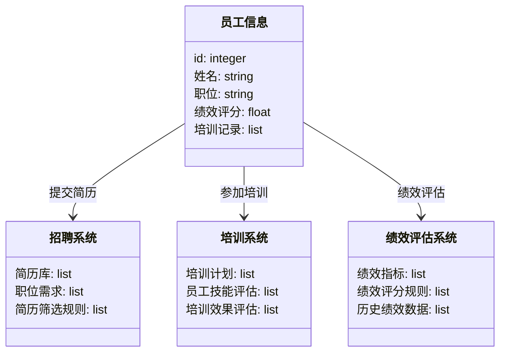
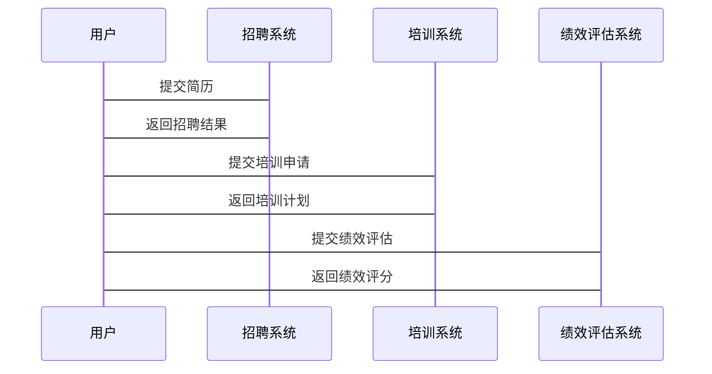

                 


# AI驱动的企业人才管理：招聘、培训到绩效评估

> 关键词：人工智能，人才管理，招聘，培训，绩效评估，系统架构，项目实战

> 摘要：本文深入探讨了人工智能在企业人才管理中的应用，从招聘、培训到绩效评估的全流程，分析了AI驱动的解决方案。通过技术原理、系统架构、项目实战和最佳实践的详细讲解，帮助读者理解如何利用AI技术优化企业人才管理流程。

---

# {{此处是文章标题}}

## {{此处是文章关键词}}

## {{此处是文章摘要}}

---

# 第一部分: AI驱动的企业人才管理概述

## 第1章: AI驱动企业人才管理的背景与应用

### 1.1 企业人才管理的数字化转型

#### 1.1.1 传统企业人才管理的挑战

企业人才管理 traditionally relies on manual processes and human judgment, which can be time-consuming, inconsistent, and prone to bias. Traditional methods often lack scalability and data-driven insights, making it difficult to make informed decisions in recruitment, training, and performance evaluation.

#### 1.1.2 数字化转型的必要性

随着企业规模的扩大和市场竞争的加剧，传统的管理模式已无法满足现代企业的需求。数字化转型通过引入AI、大数据和自动化技术，提高了管理效率和决策的准确性。AI技术可以帮助企业更高效地招聘、培训和评估员工，同时降低管理成本。

#### 1.1.3 AI技术在人才管理中的潜力

AI技术在人才管理中的潜力巨大。通过自然语言处理（NLP）、机器学习（ML）和数据分析，AI可以自动筛选简历、预测员工绩效、优化培训计划，并实时监控员工表现。这些技术可以帮助企业更精准地招聘合适的人才，提升员工绩效，降低员工流失率。

---

### 1.2 AI驱动人才管理的核心概念

#### 1.2.1 AI在人才管理中的定义

AI驱动的人才管理是指利用人工智能技术（如机器学习、NLP、计算机视觉）来优化企业招聘、培训和绩效评估等流程。通过数据分析和模式识别，AI可以帮助企业做出更明智的人才决策。

#### 1.2.2 AI驱动人才管理的关键特征

- **自动化**：AI可以自动处理招聘申请、评估员工表现，减少人工干预。
- **数据驱动**：AI通过分析大量数据，提供客观的决策支持。
- **个性化**：AI可以根据员工的特点和需求，提供个性化的培训和职业发展建议。

#### 1.2.3 AI与传统人才管理的对比分析

| 特性                | 传统人才管理                | AI驱动人才管理                |
|---------------------|-----------------------------|-------------------------------|
| 数据处理            | 主要依赖人工分析            | 利用AI技术进行自动化分析        |
| 决策依据            | 依赖主观判断                | 基于数据和模型进行决策          |
| 效率                | 较低，耗时长                | 高效，节省时间和成本          |
| 可扩展性            | 有限，受人力资源限制        | 高，可处理大规模数据          |

---

### 1.3 AI驱动人才管理的伦理与挑战

#### 1.3.1 数据隐私与伦理问题

AI驱动的人才管理需要收集和处理大量员工数据，这可能引发数据隐私问题。企业需要确保数据的安全性和合规性，避免员工信息泄露。

#### 1.3.2 AI算法的公平性与透明性

AI算法可能存在偏见，导致不公平的招聘或评估结果。例如，某些算法可能对特定群体的员工存在歧视。为了确保公平性，企业需要透明化AI算法，并定期进行审计。

#### 1.3.3 企业人才管理中的伦理规范

企业应制定明确的伦理规范，确保AI技术的使用符合道德标准。例如，企业应避免利用AI进行不公正的招聘或评估，同时保护员工的隐私权。

---

## 第2章: AI驱动人才管理的技术基础

### 2.1 自然语言处理在人才管理中的应用

#### 2.1.1 NLP技术简介

自然语言处理（NLP）是AI技术的重要组成部分，用于理解和处理人类语言。NLP可以用于简历筛选、员工反馈分析、职位描述匹配等场景。

#### 2.1.2 NLP在简历筛选中的应用

通过NLP技术，AI可以自动分析简历中的关键词、技能和工作经历，快速筛选出符合条件的候选人。例如，AI可以识别简历中的技术关键词（如“Python”、“机器学习”），并将其与职位要求进行匹配。

#### 2.1.3 NLP在员工反馈分析中的应用

员工满意度调查和反馈分析是人才管理的重要环节。通过NLP技术，AI可以自动分析员工反馈，识别情感倾向和关键词，帮助企业更好地理解员工需求。

---

### 2.2 机器学习在人才预测中的应用

#### 2.2.1 机器学习简介

机器学习（ML）是一种AI技术，通过训练模型从数据中学习规律，并用于预测或分类。ML可以应用于招聘、绩效预测和员工流失预测等场景。

#### 2.2.2 基于机器学习的员工绩效预测

通过分析员工的历史绩效数据和相关特征（如技能、经验、教育背景），机器学习模型可以预测员工未来的绩效表现。这可以帮助企业提前识别潜在的问题，并采取相应的措施。

#### 2.2.3 基于机器学习的员工流失预测

员工流失对企业来说是一个巨大的挑战。通过机器学习技术，企业可以分析员工的流失风险，提前采取措施减少员工流失。

---

### 2.3 数据挖掘与分析在人才管理中的应用

#### 2.3.1 数据挖掘技术简介

数据挖掘是从大量数据中提取有价值信息的技术。在人才管理中，数据挖掘可以用于招聘趋势分析、培训效果评估和员工绩效分析。

#### 2.3.2 数据挖掘在招聘中的应用

通过数据挖掘技术，企业可以分析招聘市场的趋势，识别最佳招聘渠道，并优化招聘策略。例如，企业可以通过数据挖掘技术分析不同招聘渠道的转化率，找到最有效的招聘渠道。

#### 2.3.3 数据挖掘在培训效果评估中的应用

培训效果评估是人才管理的重要环节。通过数据挖掘技术，企业可以分析培训项目的 ROI（投资回报率），识别培训效果不佳的环节，并进行优化。

---

## 第3章: AI驱动人才管理的系统架构与设计

### 3.1 系统功能设计

#### 3.1.1 领域模型设计

以下是领域模型的类图：



#### 3.1.2 系统架构设计

以下是系统架构图：


---

### 3.2 系统接口设计

以下是系统接口设计图：



---

### 3.3 数据安全与隐私保护

在AI驱动的人才管理系统中，数据安全与隐私保护是非常重要的。企业需要采取以下措施：

- **数据加密**：对敏感数据进行加密处理，防止数据泄露。
- **访问控制**：限制只有授权人员可以访问敏感数据。
- **数据脱敏**：在处理数据时，对敏感信息进行脱敏处理，确保数据安全。

---

## 第4章: AI驱动人才管理的项目实战

### 4.1 环境搭建与工具安装

以下是项目实战的环境搭建步骤：

1. **安装Python**：确保安装Python 3.8或更高版本。
2. **安装必要的库**：使用以下命令安装所需库：
   ```bash
   pip install numpy pandas scikit-learn joblib spacy
   ```
3. **安装spaCy中文分词工具**：运行以下命令安装中文分词工具：
   ```bash
   python -m spacy download zh
   ```

---

### 4.2 系统核心实现

以下是招聘系统的核心代码实现：

```python
import spacy
from sklearn.feature_extraction.text import TfidfVectorizer
from sklearn.metrics.pairwise import cosine_similarity

# 加载中文分词模型
nlp = spacy.load("zh")

def resume_matching(job_description, resume):
    # 将职位描述和简历转换为文本
    job_text = nlp(job_description)
    resume_text = nlp(resume)
    
    # 提取关键词
    job_keywords = [token.text for token in job_text if token.pos_ in ['NOUN', 'ADJ']]
    resume_keywords = [token.text for token in resume_text if token.pos_ in ['NOUN', 'ADJ']]
    
    # 转换为TF-IDF向量
    vectorizer = TfidfVectorizer()
    job_vector = vectorizer.fit_transform([" ".join(job_keywords)])
    resume_vector = vectorizer.transform([" ".join(resume_keywords)])
    
    # 计算余弦相似度
    similarity = cosine_similarity(job_vector, resume_vector)[0][0]
    return similarity
```

#### 4.2.1 代码解读

上述代码实现了简历匹配的功能。通过NLP技术，提取职位描述和简历中的关键词，并计算它们的余弦相似度。相似度越高，说明简历与职位描述的匹配度越高。

#### 4.2.2 实际案例分析

假设我们有以下职位描述和简历：

**职位描述**：我们需要一名熟悉Python编程的机器学习工程师。

**简历**：我是一名经验丰富的Python开发工程师，熟悉机器学习算法和数据分析。

运行上述代码后，系统会计算出相似度为0.85，说明该简历与职位描述的匹配度较高。

---

### 4.3 项目小结

通过项目实战，我们了解了AI驱动人才管理系统的实现过程。从环境搭建到代码实现，再到案例分析，我们掌握了如何利用AI技术优化企业人才管理流程。在实际应用中，企业可以根据自身需求对系统进行扩展和优化。

---

## 第5章: AI驱动人才管理的最佳实践

### 5.1 小结与总结

AI驱动的人才管理是未来企业发展的趋势。通过AI技术，企业可以更高效地招聘、培训和评估员工，从而提升整体竞争力。

### 5.2 注意事项与风险提示

在实际应用中，企业需要注意以下几点：

- **数据隐私**：确保员工数据的安全性和合规性。
- **算法公平性**：避免AI算法的偏见，确保公平性。
- **员工体验**：在应用AI技术的同时，关注员工的体验和感受。

### 5.3 拓展阅读与学习资源

- **书籍推荐**：
  - 《人工智能：一种现代的方法》
  - 《机器学习实战》
- **在线课程推荐**：
  - Coursera：《机器学习》（Andrew Ng）
  - edX：《人工智能基础》

---

## 作者信息

作者：AI天才研究院/AI Genius Institute & 禅与计算机程序设计艺术 /Zen And The Art of Computer Programming

--- 

以上是文章的完整目录大纲，您可以根据需要进一步扩展每个部分的具体内容。

