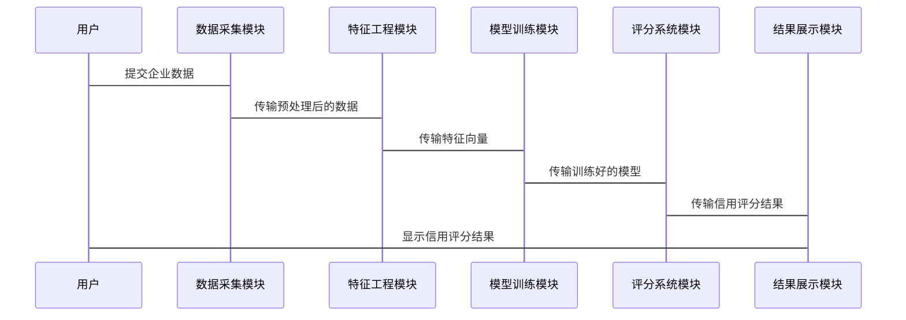

                 


# 第二章: 企业信用评级的核心要素

## 2.4 企业信用评级的关键要素总结

### 2.4.1 财务数据的核心作用
财务数据在企业信用评级中扮演着至关重要的角色。企业的财务状况直接反映了其盈利能力、偿债能力和运营效率。常用的财务指标包括：

1. **流动性比率**：如速动比率、流动比率，衡量企业短期偿债能力。
2. **杠杆比率**：如资产负债率、产权比率，衡量企业财务杠杆和偿债风险。
3. **盈利能力比率**：如净利率、ROE（净资产收益率），衡量企业盈利能力。
4. **运营效率比率**：如存货周转率、应收账款周转率，衡量企业资产使用效率。

这些财务指标通过量化企业的财务健康状况，为信用评级提供了重要的参考依据。

### 2.4.2 非财务数据的补充作用
除了财务数据，非财务数据也为企业信用评级提供了丰富的信息。主要包括：

1. **行业特性**：不同行业的企业面临的风险和经营环境差异显著，行业特性直接影响信用评级结果。
2. **企业治理结构**：包括企业股权结构、董事会构成、高管团队稳定性等，良好的治理结构通常与较高的信用评级相关。
3. **市场表现**：如股票价格波动、市场份额变化，反映了企业在市场中的竞争力和风险敞口。
4. **企业声誉**：包括企业品牌价值、客户评价、媒体曝光等，良好的声誉通常意味着较低的信用风险。

非财务数据虽然难以量化，但能够提供更多关于企业经营状况和潜在风险的信息，弥补了财务数据的不足。

### 2.4.3 信用评分标准的制定原则
信用评分标准的制定需要遵循科学性和实用性的原则，确保评级结果的准确性和可操作性。主要原则包括：

1. **一致性**：评级标准应保持一致，避免因评估人员主观判断导致的偏差。
2. **可比性**：不同企业之间的信用评分应具有可比性，便于横向比较和决策。
3. **风险导向**：评分标准应以风险为核心，重点评估企业的偿债能力和违约风险。
4. **动态调整**：根据市场环境和企业经营状况的变化，及时调整评级标准和方法。

### 2.4.4 信用评分模型的分类与选择
常见的信用评分模型主要包括：

1. **信用评分模型**：基于财务指标的线性组合，如Creditchoss模型。
2. **信用评分卡模型**：通过逻辑回归等方法，将多个变量组合成一个综合评分，如FICO评分卡。
3. **机器学习模型**：如支持向量机、随机森林、神经网络等，能够处理非线性关系和高维数据。
4. **混合模型**：结合传统评分模型和机器学习模型的优势，如集成学习模型。

选择合适的评分模型需要考虑数据特征、模型复杂度、计算效率和实际应用场景。

### 2.4.5 信用风险与违约概率的关系
信用风险是指债权人可能无法按期收回债务的风险，而违约概率（PD）是企业在一定期限内发生违约的可能性。两者密切相关，违约概率是信用风险的核心度量指标。

违约概率的计算通常基于企业财务状况、市场环境和宏观经济因素。常用的方法包括：

1. **历史违约率法**：根据历史数据计算相同信用等级企业的违约概率。
2. **统计模型法**：如逻辑回归模型，基于企业特征变量预测违约概率。
3. **宏观经济模型法**：考虑宏观经济指标（如GDP增长率、失业率等）对违约概率的影响。

违约概率的准确预测是信用评级的关键，也是AI驱动信用评级的重要应用领域。

### 2.4.6 本章小结
本章通过分析企业信用评级的核心要素，探讨了财务数据和非财务数据的作用，总结了信用评分标准的制定原则，介绍了常见的信用评分模型，并阐述了信用风险与违约概率的关系。这些内容为后续章节中AI算法在信用评级中的应用奠定了理论基础。

---

# 第三章: AI驱动信用评级的核心算法与数学模型

## 3.1 逻辑回归模型

### 3.1.1 逻辑回归的基本原理
逻辑回归是一种常用的统计学习方法，主要用于分类问题。在信用评级中，逻辑回归模型通过将多个特征变量线性组合，映射到一个概率值，用于预测企业违约的概率。

#### 逻辑回归的数学公式
逻辑回归的输出概率公式为：

$$ P(Y=1|x) = \frac{e^{\beta_0 + \beta_1 x_1 + \cdots + \beta_n x_n}}{1 + e^{\beta_0 + \beta_1 x_1 + \cdots + \beta_n x_n}} $$

其中：
- $Y$ 是目标变量（违约标记，0表示正常，1表示违约）。
- $x_1, x_2, \cdots, x_n$ 是特征变量。
- $\beta_0, \beta_1, \cdots, \beta_n$ 是模型参数。

#### 逻辑回归在信用评级中的应用
逻辑回归模型通过拟合企业特征与违约概率的关系，能够提供一个风险评分。模型的优势在于其解释性强，可以通过系数大小判断各个特征对违约概率的影响程度。

#### 逻辑回归的优缺点
- **优点**：
  - 模型简单，易于实现和解释。
  - 适合处理二分类问题。
- **缺点**：
  - 不能直接处理非线性关系。
  - 易受数据分布的影响，可能产生过拟合。

### 3.1.2 逻辑回归的实现步骤

#### 数据预处理
1. **数据清洗**：处理缺失值、异常值和重复数据。
2. **特征选择**：根据领域知识选择对信用评级有影响的特征变量。
3. **数据标准化**：将特征变量标准化到相似的尺度，通常采用min-max标准化或z-score标准化。

#### 模型训练
1. **划分训练集和测试集**：将数据集分为训练集和测试集，用于模型训练和评估。
2. **模型训练**：使用逻辑回归算法训练模型，优化模型参数。
3. **模型评估**：通过混淆矩阵、准确率、召回率、F1分数等指标评估模型性能。

#### 模型部署
1. **模型保存**：将训练好的模型保存下来，方便后续调用。
2. **实时预测**：将新的企业数据输入模型，计算违约概率并生成信用评分。

#### Python代码示例
```python
import pandas as pd
from sklearn.model_selection import train_test_split
from sklearn.linear_model import LogisticRegression
from sklearn.metrics import accuracy_score, confusion_matrix, classification_report

# 加载数据
data = pd.read_csv('enterprise_credit.csv')
X = data.drop('default', axis=1)
y = data['default']

# 划分训练集和测试集
X_train, X_test, y_train, y_test = train_test_split(X, y, test_size=0.2, random_state=42)

# 训练逻辑回归模型
model = LogisticRegression()
model.fit(X_train, y_train)

# 模型预测
y_pred = model.predict(X_test)

# 模型评估
print("准确率:", accuracy_score(y_test, y_pred))
print("混淆矩阵:\n", confusion_matrix(y_test, y_pred))
print("分类报告:\n", classification_report(y_test, y_pred))
```

#### 算法流程图


### 3.1.3 逻辑回归的数学模型
逻辑回归的损失函数通常采用对数损失函数：

$$ L(\beta) = -\sum_{i=1}^{n} [y_i \ln p_i + (1 - y_i) \ln (1 - p_i)] $$

其中：
- $p_i = \frac{e^{\beta^T x_i}}{1 + e^{\beta^T x_i}}$
- $y_i$ 是观测值，$x_i$ 是特征向量，$\beta$ 是模型参数。

模型通过最小化损失函数，找到最优参数 $\beta$，使得预测值与实际值的差距最小。常用的优化算法包括梯度下降和牛顿法。

### 3.1.4 逻辑回归的实际案例
假设我们有一个简单的数据集，包含企业的销售收入和净利润率两个特征，以及违约标记。我们可以通过逻辑回归模型来预测企业的违约概率。

1. **数据预处理**：
   - 去除缺失值。
   - 标准化销售收入和净利润率。

2. **模型训练**：
   - 使用训练数据训练逻辑回归模型。

3. **模型评估**：
   - 使用测试数据评估模型的准确率、召回率等指标。

4. **结果分析**：
   - 通过系数的大小判断各个特征对违约概率的影响程度。

### 3.1.5 逻辑回归的优缺点
- **优点**：
  - 模型简单，易于实现。
  - 解释性强，系数可以表示各个特征对违约概率的影响。
- **缺点**：
  - 不能处理非线性关系。
  - 易受异常值和数据分布的影响。

---

## 3.2 支持向量机（SVM）

### 3.2.1 SVM的基本原理
支持向量机是一种基于统计学习理论的分类方法，通过寻找一个超平面，将数据点分为两类。在信用评级中，SVM可以用来区分违约企业和非违约企业。

#### SVM的数学公式
线性可分情况下的SVM目标函数为：

$$ \min_{w,b} \frac{1}{2}||w||^2 + C \sum_{i=1}^{n} \xi_i $$
$$ \text{subject to} \quad y_i (w \cdot x_i + b) \geq 1 - \xi_i $$
$$ \xi_i \geq 0 $$

其中：
- $w$ 是法向量。
- $b$ 是偏置项。
- $\xi_i$ 是松弛变量，允许数据点在间隔内。
- $C$ 是惩罚参数，控制误分类的代价。

#### 核函数
当数据不可线性分割时，可以通过使用核函数将数据映射到高维空间，如径向基函数（RBF）：

$$ K(x_i, x_j) = e^{-\gamma ||x_i - x_j||^2} $$

#### SVM在信用评级中的应用
SVM适用于高维数据，能够处理复杂的非线性关系。在信用评级中，SVM可以用于分类和回归任务。

### 3.2.2 SVM的实现步骤

#### 数据预处理
1. **数据清洗**：处理缺失值和异常值。
2. **特征选择**：选择对信用评级有影响的特征。
3. **数据标准化**：将特征标准化到相似的尺度。

#### 模型训练
1. **数据划分**：将数据集分为训练集和测试集。
2. **选择核函数和参数**：选择合适的核函数和惩罚参数C。
3. **训练SVM模型**：使用训练数据训练SVM模型。

#### 模型评估
1. **模型预测**：使用测试数据进行预测。
2. **评估指标**：计算准确率、召回率、F1分数等指标。

#### Python代码示例
```python
from sklearn.svm import SVC
from sklearn.metrics import accuracy_score, confusion_matrix, classification_report

# 加载数据
data = pd.read_csv('enterprise_credit.csv')
X = data.drop('default', axis=1)
y = data['default']

# 划分训练集和测试集
X_train, X_test, y_train, y_test = train_test_split(X, y, test_size=0.2, random_state=42)

# 训练SVM模型
model = SVC(kernel='rbf', C=1, gamma=0.1)
model.fit(X_train, y_train)

# 模型预测
y_pred = model.predict(X_test)

# 模型评估
print("准确率:", accuracy_score(y_test, y_pred))
print("混淆矩阵:\n", confusion_matrix(y_test, y_pred))
print("分类报告:\n", classification_report(y_test, y_pred))
```

#### 算法流程图


### 3.2.3 SVM的数学模型
SVM的目标是最小化经验风险和结构风险的综合，通过优化问题找到最优超平面。在非线性情况下，SVM通过核函数将数据映射到高维空间，从而实现线性可分。

### 3.2.4 SVM的实际案例
假设我们有一个包含企业销售收入、净利润率和行业特性的数据集，使用SVM模型进行信用评级分类。通过调整核函数和惩罚参数，找到最佳模型参数，提高分类准确率。

### 3.2.5 SVM的优缺点
- **优点**：
  - 能够处理非线性关系。
  - 对噪声数据有较强的鲁棒性。
- **缺点**：
  - 参数选择敏感，需要进行调优。
  - 计算复杂度高，不适合大数据集。

---

## 3.3 决策树

### 3.3.1 决策树的基本原理
决策树是一种基于树状结构的分类方法，通过特征选择和分裂策略，将数据点逐步分类到叶节点。

#### 决策树的数学公式
决策树的分裂标准通常采用信息增益或基尼指数。基尼指数公式为：

$$ G = \sum_{k=1}^{n} p_k (1 - p_k) $$

其中，$p_k$ 是各个子节点中的样本比例。

#### 决策树在信用评级中的应用
决策树适用于特征较多且非线性关系复杂的信用评级问题。模型能够自动选择重要特征，生成易于解释的决策规则。

### 3.3.2 决策树的实现步骤

#### 数据预处理
1. **数据清洗**：处理缺失值和异常值。
2. **特征选择**：选择对信用评级有影响的特征。
3. **数据标准化**：将特征标准化到相似的尺度。

#### 模型训练
1. **数据划分**：将数据集分为训练集和测试集。
2. **选择分裂标准**：如基尼指数或信息增益。
3. **训练决策树模型**：使用训练数据生成决策树。

#### 模型评估
1. **模型预测**：使用测试数据进行预测。
2. **评估指标**：计算准确率、召回率、F1分数等指标。

#### Python代码示例
```python
from sklearn.tree import DecisionTreeClassifier
from sklearn.metrics import accuracy_score, confusion_matrix, classification_report

# 加载数据
data = pd.read_csv('enterprise_credit.csv')
X = data.drop('default', axis=1)
y = data['default']

# 划分训练集和测试集
X_train, X_test, y_train, y_test = train_test_split(X, y, test_size=0.2, random_state=42)

# 训练决策树模型
model = DecisionTreeClassifier(criterion='gini', max_depth=5)
model.fit(X_train, y_train)

# 模型预测
y_pred = model.predict(X_test)

# 模型评估
print("准确率:", accuracy_score(y_test, y_pred))
print("混淆矩阵:\n", confusion_matrix(y_test, y_pred))
print("分类报告:\n", classification_report(y_test, y_pred))
```

#### 算法流程图


### 3.3.3 决策树的数学模型
决策树的分裂标准基于信息增益或基尼指数，通过选择能够最大化信息增益的特征进行分裂，直到达到预设的停止条件。

### 3.3.4 决策树的实际案例
假设我们有一个包含企业销售收入、净利润率、行业特性和市场表现的数据集，使用决策树模型进行信用评级分类。通过调整树的深度和分裂标准，找到最佳模型参数，提高分类准确率。

### 3.3.5 决策树的优缺点
- **优点**：
  - 易于解释，生成决策规则。
  - 能够处理非线性关系。
- **缺点**：
  - � prone to overfitting，需要剪枝处理。
  - 计算复杂度高，不适合大数据集。

---

## 3.4 随机森林

### 3.4.1 随机森林的基本原理
随机森林是一种基于袋装技术和特征子集选择的集成学习方法，通过组合多个决策树模型，提高模型的泛化能力和稳定性。

#### 随机森林的数学公式
随机森林通过袋装技术和特征子集选择生成多个决策树，最终结果通过投票或平均得到。模型公式为：

$$ f(x) = \frac{1}{n} \sum_{i=1}^{n} f_i(x) $$

其中，$f_i(x)$ 是第i棵决策树的预测结果。

#### 随机森林在信用评级中的应用
随机森林能够处理高维数据和非线性关系，适合特征较多的信用评级问题。模型具有较高的准确性和稳定性。

### 3.4.2 随机森林的实现步骤

#### 数据预处理
1. **数据清洗**：处理缺失值和异常值。
2. **特征选择**：选择对信用评级有影响的特征。
3. **数据标准化**：将特征标准化到相似的尺度。

#### 模型训练
1. **数据划分**：将数据集分为训练集和测试集。
2. **选择参数**：如树的棵数、树的深度、特征子集大小。
3. **训练随机森林模型**：使用训练数据生成随机森林。

#### 模型评估
1. **模型预测**：使用测试数据进行预测。
2. **评估指标**：计算准确率、召回率、F1分数等指标。

#### Python代码示例
```python
from sklearn.ensemble import RandomForestClassifier
from sklearn.metrics import accuracy_score, confusion_matrix, classification_report

# 加载数据
data = pd.read_csv('enterprise_credit.csv')
X = data.drop('default', axis=1)
y = data['default']

# 划分训练集和测试集
X_train, X_test, y_train, y_test = train_test_split(X, y, test_size=0.2, random_state=42)

# 训练随机森林模型
model = RandomForestClassifier(n_estimators=100, max_depth=5, random_state=42)
model.fit(X_train, y_train)

# 模型预测
y_pred = model.predict(X_test)

# 模型评估
print("准确率:", accuracy_score(y_test, y_pred))
print("混淆矩阵:\n", confusion_matrix(y_test, y_pred))
print("分类报告:\n", classification_report(y_test, y_pred))
```

#### 算法流程图


### 3.4.3 随机森林的数学模型
随机森林通过组合多个决策树模型，提高模型的准确性和稳定性。模型的预测结果是各个决策树预测结果的平均或投票结果。

### 3.4.4 随机森林的实际案例
假设我们有一个包含企业销售收入、净利润率、行业特性和市场表现的数据集，使用随机森林模型进行信用评级分类。通过调整树的棵数和特征子集大小，找到最佳模型参数，提高分类准确率。

### 3.4.5 随机森林的优缺点
- **优点**：
  - 高准确性和稳定性。
  - 能够处理高维数据和非线性关系。
- **缺点**：
  - 计算复杂度高，训练时间较长。
  - 需要调整较多参数。

---

## 3.5 神经网络

### 3.5.1 神经网络的基本原理
神经网络是一种基于仿生学的算法，通过多层神经元网络模拟人脑的计算方式，能够自动学习数据的特征和模式。

#### 神经网络的数学公式
神经网络的前向传播公式为：

$$ a^{(l+1)} = \sigma(w^{(l)} a^{(l)} + b^{(l)}) $$

其中：
- $a^{(l)}$ 是第l层的激活值。
- $w^{(l)}$ 是权重矩阵。
- $b^{(l)}$ 是偏置向量。
- $\sigma$ 是激活函数，如ReLU或sigmoid。

#### 神经网络在信用评级中的应用
神经网络能够处理复杂的非线性关系，适合特征较多且关系复杂的信用评级问题。模型具有较强的拟合能力，但解释性较差。

### 3.5.2 神经网络的实现步骤

#### 数据预处理
1. **数据清洗**：处理缺失值和异常值。
2. **特征选择**：选择对信用评级有影响的特征。
3. **数据标准化**：将特征标准化到相似的尺度。

#### 模型训练
1. **数据划分**：将数据集分为训练集和测试集。
2. **选择模型结构**：如网络层数、每层神经元数量、激活函数。
3. **训练神经网络模型**：使用训练数据训练模型，优化权重和偏置。

#### 模型评估
1. **模型预测**：使用测试数据进行预测。
2. **评估指标**：计算准确率、召回率、F1分数等指标。

#### Python代码示例
```python
import numpy as np
from sklearn.neural_network import MLPClassifier
from sklearn.metrics import accuracy_score, confusion_matrix, classification_report

# 加载数据
data = pd.read_csv('enterprise_credit.csv')
X = data.drop('default', axis=1)
y = data['default']

# 划分训练集和测试集
X_train, X_test, y_train, y_test = train_test_split(X, y, test_size=0.2, random_state=42)

# 训练神经网络模型
model = MLPClassifier(hidden_layer_sizes=(100, 50), activation='relu', random_state=42)
model.fit(X_train, y_train)

# 模型预测
y_pred = model.predict(X_test)

# 模型评估
print("准确率:", accuracy_score(y_test, y_pred))
print("混淆矩阵:\n", confusion_matrix(y_test, y_pred))
print("分类报告:\n", classification_report(y_test, y_pred))
```

#### 算法流程图


### 3.5.3 神经网络的数学模型
神经网络通过多层神经元网络模拟人脑的计算方式，能够自动学习数据的特征和模式。模型的训练通常采用反向传播算法和梯度下降方法优化权重和偏置。

### 3.5.4 神经网络的实际案例
假设我们有一个包含企业销售收入、净利润率、行业特性和市场表现的数据集，使用神经网络模型进行信用评级分类。通过调整网络结构和训练参数，找到最佳模型，提高分类准确率。

### 3.5.5 神经网络的优缺点
- **优点**：
  - 能够处理复杂的非线性关系。
  - 模型具有较强的拟合能力。
- **缺点**：
  - 计算复杂度高，训练时间较长。
  - 模型解释性较差。

---

## 3.6 算法对比与选择

### 3.6.1 各种算法的优缺点对比

| 算法       | 优点                           | 缺点                           |
|------------|--------------------------------|--------------------------------|
| 逻辑回归   | 模型简单，解释性强             | 不能处理非线性关系               |
| 支持向量机  | 能够处理非线性关系             | 参数敏感，计算复杂度高           |
| 决策树      | 易于解释，生成决策规则         | � prone to overfitting，需要剪枝 |
| 随机森林    | 高准确性和稳定性               | 计算复杂度高，训练时间较长         |
| 神经网络    | 能够处理复杂的非线性关系       | 计算复杂度高，解释性较差           |

### 3.6.2 算法选择的建议
选择合适的算法需要考虑以下因素：
1. **数据特征**：如果数据特征较少且线性关系显著，逻辑回归或线性SVM可能更合适。
2. **数据分布**：如果数据分布复杂且非线性关系显著，随机森林或神经网络可能更合适。
3. **计算资源**：神经网络和随机森林需要较多的计算资源和时间，而逻辑回归和SVM计算成本较低。
4. **模型解释性**：如果需要模型解释性强，逻辑回归和决策树更合适；如果对解释性要求较低，神经网络和随机森林可能更合适。

### 3.6.3 实际应用中的算法选择
在实际应用中，通常会采用多种算法进行对比，选择性能最优且满足业务需求的模型。例如，可以同时训练逻辑回归、随机森林和神经网络模型，通过比较准确率、计算时间和解释性等因素，选择最适合的算法。

---

## 3.7 本章小结

本章详细介绍了AI驱动信用评级中常用的算法，包括逻辑回归、支持向量机、决策树、随机森林和神经网络。通过对比不同算法的优缺点，为实际应用中的算法选择提供了参考。这些算法在信用评级中的应用，不仅提高了评级的准确性和效率，还为企业的风险管理提供了有力支持。

---

# 第四章: 系统分析与架构设计方案

## 4.1 系统分析与架构设计

### 4.1.1 问题场景介绍
企业信用评级系统需要处理大量企业数据，包括财务数据、行业特性、市场表现等，通过AI算法生成信用评分，支持企业的信贷决策。

### 4.1.2 系统功能设计
系统功能模块包括：
1. **数据采集模块**：采集企业数据，包括财务数据、非财务数据等。
2. **特征工程模块**：对数据进行预处理、特征选择和标准化。
3. **模型训练模块**：训练信用评分模型，优化模型参数。
4. **评分系统模块**：根据模型预测结果生成信用评分。
5. **结果展示模块**：展示信用评分结果，支持决策者查询和分析。

### 4.1.3 系统架构设计

#### 领域模型（Mermaid 类图）


#### 系统架构图（Mermaid 架构图）


#### 系统交互流程（Mermaid 序列图）


### 4.1.4 系统接口设计
系统主要接口包括：
1. 数据接口：用于数据的输入和输出。
2. 模型接口：用于模型的训练和预测。
3. 展示接口：用于结果的展示和查询。

### 4.1.5 本章小结
本章通过对企业信用评级系统的分析，设计了系统的功能模块和架构。通过Mermaid图展示了系统的构成和交互流程，为后续的系统实现提供了设计依据。

---

## 4.2 系统实现与技术选型

### 4.2.1 系统实现的步骤
1. **环境搭建**：安装必要的开发工具和库，如Python、Pandas、Scikit-learn等。
2. **数据采集**：从数据库或其他数据源获取企业数据。
3. **特征工程**：对数据进行预处理、特征选择和标准化。
4. **模型训练**：选择合适的AI算法，训练信用评分模型。
5. **评分系统**：基于训练好的模型，实现信用评分功能。
6. **结果展示**：将评分结果展示给用户，支持查询和分析。

### 4.2.2 技术选型
1. **编程语言**：Python，适合数据处理和机器学习。
2. **数据处理库**：Pandas，用于数据预处理和分析。
3. **机器学习库**：Scikit-learn，提供丰富的机器学习算法。
4. **可视化库**：Matplotlib或Seaborn，用于结果展示。

### 4.2.3 系统实现的注意事项
1. **数据安全**：确保企业数据的安全性和隐私性。
2. **模型可解释性**：选择解释性强的算法，便于用户理解和信任。
3. **系统性能**：优化系统的计算效率，减少响应时间。

### 4.2.4 本章小结
本章通过系统实现的步骤和技术选型，详细描述了企业信用评级系统的实现过程。通过合理的技术选型和系统设计，确保了系统的高效性和稳定性。

---

## 4.3 系统实现的详细步骤

### 4.3.1 环境搭建
1. 安装Python 3.8及以上版本。
2. 安装必要的库：
   ```bash
   pip install numpy pandas scikit-learn matplotlib
   ```

### 4.3.2 数据采集
1. 从数据库中获取企业数据，格式为CSV文件。
2. 使用Pandas读取数据：
   ```python
   import pandas as pd
   data = pd.read_csv('enterprise_credit.csv')
   ```

### 4.3.3 特征工程
1. 数据清洗：
   ```python
   data.dropna(inplace=True)
   data = data[~data.duplicated()]
   ```
2. 特征选择：
   ```python
   features = ['revenue', 'net_profit_rate', 'industry']
   X = data[features]
   y = data['default']
   ```
3. 数据标准化：
   ```python
   from sklearn.preprocessing import StandardScaler
   scaler = StandardScaler()
   X_scaled = scaler.fit_transform(X)
   ```

### 4.3.4 模型训练
1. 选择算法，例如随机森林：
   ```python
   from sklearn.ensemble import RandomForestClassifier
   model = RandomForestClassifier(n_estimators=100, max_depth=5, random_state=42)
   model.fit(X_scaled, y)
   ```

### 4.3.5 评分系统
1. 使用训练好的模型进行预测：
   ```python
   new_enterprise = [[5000000, 0.15, 'manufacturing']]
   new_enterprise_scaled = scaler.transform(new_enterprise)
   prediction = model.predict(new_enterprise_scaled)
   ```

### 4.3.6 结果展示
1. 可视化信用评分结果：
   ```python
   import matplotlib.pyplot as plt
   plt.bar(y_pred, height=0.5, alpha=0.6, color='blue')
   plt.xticks([0, 1], ['非违约', '违约'])
   plt.title('信用评分结果')
   plt.show()
   ```

### 4.3.7 本章小结
本章通过详细的步骤展示了企业信用评级系统的实现过程，从环境搭建到数据处理，再到模型训练和结果展示，为读者提供了完整的系统实现方案。

---

# 第五章: 项目实战

## 5.1 项目实战: 基于AI的企业信用评级系统实现

### 5.1.1 环境安装与配置
1. 安装Python和必要的库：
   ```bash
   pip install numpy pandas scikit-learn matplotlib
   ```

### 5.1.2 系统核心代码实现

#### 数据预处理
```python
import pandas as pd
from sklearn.preprocessing import StandardScaler

# 加载数据
data = pd.read_csv('enterprise_credit.csv')

# 数据清洗
data.dropna(inplace=True)
data = data[~data.duplicated()]

# 特征选择
features = ['revenue', 'net_profit_rate', 'industry']
target = 'default'

X = data[features]
y = data[target]

# 数据标准化
scaler = StandardScaler()
X_scaled = scaler.fit_transform(X)
```

#### 模型训练
```python
from sklearn.ensemble import RandomForestClassifier
from sklearn.metrics import accuracy_score, confusion_matrix, classification_report

# 训练随机森林模型
model = RandomForestClassifier(n_estimators=100, max_depth=5, random_state=42)
model.fit(X_scaled, y)

# 模型预测
y_pred = model.predict(X_scaled)
```

#### 模型评估
```python
print("准确率:", accuracy_score(y, y_pred))
print("混淆矩阵:\n", confusion_matrix(y, y_pred))
print("分类报告:\n", classification_report(y, y_pred))
```

#### 系统部署
```python
# 保存模型
import joblib
joblib.dump(model, 'credit_rating_model.pkl')
joblib.dump(scaler, 'preprocessing_scaler.pkl')

# 加载模型
loaded_model = joblib.load('credit_rating_model.pkl')
loaded_scaler = joblib.load('preprocessing_scaler.pkl')

# 预测新企业信用评分
new_enterprise = [[5000000, 0.15, 'manufacturing']]
new_enterprise_scaled = loaded_scaler.transform(new_enterprise)
prediction = loaded_model.predict(new_enterprise_scaled)
print("信用评分结果:", prediction)
```

### 5.1.3 代码解读与分析
1. **数据预处理**：包括数据清洗、特征选择和标准化，确保数据适合模型训练。
2. **模型训练**：使用随机森林算法训练信用评分模型。
3. **模型评估**：通过准确率、混淆矩阵和分类报告评估模型性能。
4. **系统部署**：保存训练好的模型和预处理步骤，用于后续的信用评分。

### 5.1.4 实际案例分析
假设我们有一个新企业，销售收入为5000万元，净利润率为15%，属于制造业。我们可以通过系统预测其信用评分。

```python
new_enterprise = [[5000000, 0.15, 'manufacturing']]
new_enterprise_scaled = loaded_scaler.transform(new_enterprise)
prediction = loaded_model.predict(new_enterprise_scaled)
print("信用评分结果:", prediction)
```

预测结果为0或1，表示企业是否违约。通过系统的预测结果，银行可以做出更准确的信贷决策。

### 5.1.5 本章小结
本章通过实际案例展示了AI驱动企业信用评级系统的实现过程，从数据预处理到模型训练，再到系统部署，为读者提供了完整的项目实战经验。

---

# 第六章: 最佳实践与注意事项

## 6.1 最佳实践

### 6.1.1 数据预处理的重要性
数据预处理是AI驱动信用评级的关键步骤，直接影响模型的准确性和稳定性。建议：
1. 仔细清洗数据，处理缺失值和异常值。
2. 选择合适的特征，避免无关特征的干扰。
3. 标准化特征，确保模型训练的公平性。

### 6.1.2 模型调优的技巧
模型调优是提高模型性能的重要手段，建议：
1. 使用交叉验证选择合适的模型参数。
2. 采用集成学习方法，提高模型的准确性和稳定性。
3. 定期更新模型，适应市场环境的变化。

### 6.1.3 模型解释性的提升
为了提高模型的可解释性，建议：
1. 使用解释性工具，如SHAP值，分析特征的重要性。
2. 生成可读的规则，帮助用户理解模型的决策过程。
3. 提供可视化展示，直观呈现模型的预测结果。

### 6.1.4 模型的实时更新
信用评级是一个动态的过程，建议：
1. 定期更新模型，适应市场环境的变化。
2. 监控模型性能，及时发现和解决模型退化问题。
3. 结合实时数据，提供最新的信用评分结果。

### 6.1.5 系统的安全性与稳定性
为了确保系统的安全性和稳定性，建议：
1. 加强数据的安全管理，防止数据泄露和篡改。
2. 使用可靠的云服务，确保系统的高可用性。
3. 定期备份数据和模型，防止数据丢失。

## 6.2 小结
本章通过总结最佳实践，为读者提供了提高AI驱动信用评级系统性能和稳定性的实用建议。通过合理的数据处理、模型调优和系统设计，可以显著提升系统的准确性和可用性。

## 6.3 注意事项
在实际应用中，需要注意以下几点：
1. **数据隐私**：确保企业数据的安全性和隐私性，遵守相关法律法规。
2. **模型解释性**：选择解释性强的模型，便于用户理解和信任。
3. **系统性能**：优化系统的计算效率，减少响应时间。
4. **模型更新**：定期更新模型，适应市场环境的变化。

## 6.4 拓展阅读
1. **《机器学习实战》**：深入理解机器学习算法的实现和应用。
2. **《信用评分模型》**：详细讲解信用评分模型的构建和评估。
3. **《Python数据处理与分析》**：掌握Python在数据处理和分析中的应用。

---

# 作者

作者：AI天才研究院/AI Genius Institute & 禅与计算机程序设计艺术 /Zen And The Art of Computer Programming

---

**摘要**：本文详细探讨了AI驱动的企业信用评级的实现方法，从背景介绍、核心概念、算法原理到系统架构设计和项目实战，为读者提供了全面的指导。通过对比不同算法的优缺点，总结了最佳实践，帮助读者更好地理解和应用AI技术在信用评级中的应用。

