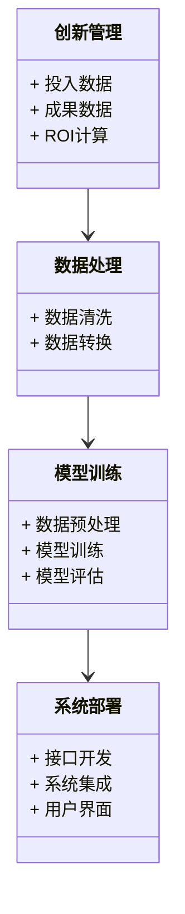

                 


# AI驱动的企业创新ROI评估：量化创新投资回报

> 关键词：AI驱动, 企业创新, ROI评估, 投资回报率, 创新量化, 人工智能, 企业创新管理

> 摘要：本文深入探讨了如何利用人工智能技术量化企业创新投资的回报率（ROI）。通过构建数学模型和算法，分析创新过程中的关键要素，结合实际案例，为企业提供AI驱动的创新ROI评估方法论。文章从背景介绍、核心概念、算法原理、系统架构到项目实战，全面解析了AI在企业创新ROI评估中的应用，为企业创新管理提供了新的思路和解决方案。

---

# 第一部分: AI驱动的企业创新ROI评估基础

## # 第1章: 企业创新ROI评估的背景与挑战

### ## 1.1 企业创新与ROI的核心概念

#### ### 1.1.1 企业创新的定义与特点

企业的创新是指企业在技术研发、产品设计、商业模式、管理方法等领域的改进和突破。创新是企业保持竞争优势的核心动力。以下是创新的几个关键特点：

1. **不确定性**：创新的结果往往难以预测，失败的可能性较高。
2. **投入与回报的非线性关系**：创新投入与回报之间并非简单的线性关系，可能存在“投入增加，回报先上升后下降”的现象。
3. **长期性**：创新的回报通常需要较长时间才能体现，尤其是基础研究和前沿技术的突破。

#### ### 1.1.2 ROI（投资回报率）的定义与计算方法

ROI（Return on Investment）是衡量投资效率的重要指标，计算公式为：

$$ ROI = \frac{净收益}{投资成本} \times 100\% $$

其中，净收益 = 投入收益 - 投入成本。ROI越高，投资回报越显著。

#### ### 1.1.3 AI驱动创新的背景与趋势

随着AI技术的快速发展，企业创新的模式正在发生变化。AI不仅能够提高创新效率，还能通过数据分析帮助企业识别潜在的创新机会。例如，AI可以用于：

1. **需求预测**：通过分析市场数据，预测未来的需求趋势。
2. **技术筛选**：从大量技术文献中筛选出具有潜力的技术方向。
3. **创新路径优化**：通过模拟和优化，找到最优的创新路径。

### ## 1.2 企业创新ROI评估的难点与挑战

#### ### 1.2.1 创新过程的不确定性

创新过程充满了不确定性，尤其是对于颠覆性创新而言，其成功概率难以预测。这种不确定性使得传统的ROI评估方法难以直接应用。

#### ### 1.2.2 数据获取与处理的复杂性

创新 ROI 评估需要大量的数据支持，包括研发投入、时间周期、创新成果等多个维度。然而，这些数据往往分散在不同的部门，且格式多样，处理起来非常复杂。

#### ### 1.2.3 ROI评估的多维度考量

创新 ROI 的评估不仅仅要考虑经济效益，还需要考虑社会价值、品牌影响力等非财务因素。这种多维度的考量使得 ROI 评估更加复杂。

---

## # 第2章: AI驱动创新的核心概念与联系

### ## 2.1 AI与企业创新的关系

#### ### 2.1.1 AI在创新过程中的作用

AI可以通过以下方式推动企业创新：

1. **数据驱动决策**：利用AI分析大量数据，发现潜在的创新机会。
2. **自动化创新**：通过算法生成新的产品设计或服务模式。
3. **加速创新周期**：AI可以帮助企业快速迭代，缩短创新周期。

#### ### 2.1.2 AI如何提升创新效率

AI可以通过以下方式提升创新效率：

1. **智能匹配资源**：将不同的资源（如技术、人才、资金）进行智能匹配，提高创新效率。
2. **预测创新风险**：通过AI模型预测创新过程中的潜在风险，提前制定应对策略。

#### ### 2.1.3 AI驱动创新的典型场景

以下是AI驱动创新的几个典型场景：

1. **智能研发**：利用AI辅助药物研发、材料科学等领域的研究。
2. **智能设计**：通过AI生成新的产品设计。
3. **智能营销**：利用AI优化营销策略，提高市场响应速度。

### ## 2.2 创新ROI评估的核心要素

#### ### 2.2.1 创新投入的量化

创新投入包括以下几个方面：

1. **人力成本**：研发团队的薪资、培训费用等。
2. **时间成本**：项目周期、研发时间等。
3. **资金成本**：研发资金的投入。

#### ### 2.2.2 创新成果的度量

创新成果的度量可以从以下几个维度进行：

1. **经济效益**：销售额、利润等。
2. **社会效益**：品牌影响力、社会认可度等。
3. **技术影响力**：专利数量、技术影响力等。

#### ### 2.2.3 ROI计算的公式与方法

在AI驱动的创新中，ROI的计算公式可以进一步细化为：

$$ ROI = \frac{创新成果 - 创新投入}{创新投入} \times 100\% $$

其中，创新成果可以是经济收益、社会效益等多种指标的综合结果。

### ## 2.3 AI驱动创新的ER实体关系图

以下是AI驱动创新的ER实体关系图：

```mermaid
er
actor: 企业
model: 创新项目
attributes: 投入金额, 时间周期, 创新成果
relations: 企业 -> 创新项目: 投入与产出
```

---

## # 第3章: 创新ROI评估的数学模型与算法原理

### ## 3.1 创新投入与成果的数学模型

#### ### 3.1.1 线性回归模型

线性回归模型是一种常用的预测模型，适用于创新投入与成果之间存在线性关系的情况。模型公式为：

$$ ROI = \beta_0 + \beta_1 \times 投入 + \epsilon $$

其中，$\beta_0$ 是截距，$\beta_1$ 是投入的回归系数，$\epsilon$ 是误差项。

#### ### 3.1.2 神经网络模型

神经网络模型是一种非线性回归模型，适用于创新投入与成果之间存在复杂关系的情况。神经网络模型可以表示为：

$$ ROI = f(投入) $$

其中，$f$ 是神经网络模型，通过训练数据进行参数优化。

---

## # 第4章: 系统分析与架构设计方案

### ## 4.1 问题场景介绍

企业创新ROI评估系统需要解决以下问题：

1. **数据获取与处理**：如何高效获取和处理创新相关的数据。
2. **模型构建与优化**：如何构建和优化创新ROI评估模型。
3. **系统实现与部署**：如何将模型部署到实际系统中。

### ## 4.2 系统功能设计

以下是系统功能设计的领域模型：



### ## 4.3 系统架构设计

以下是系统架构设计图：


---

## # 第5章: 项目实战

### ## 5.1 环境安装

以下是项目实战的环境安装步骤：

1. **安装Python**：建议使用Python 3.8或更高版本。
2. **安装依赖库**：`pip install numpy pandas scikit-learn`

### ## 5.2 核心代码实现

以下是核心代码实现：

```python
import numpy as np
from sklearn.linear_model import LinearRegression
from sklearn.metrics import r2_score

# 模拟数据
X = np.array([[1], [2], [3], [4], [5]])
y = np.array([2, 4, 5, 4, 6])

# 模型训练
model = LinearRegression()
model.fit(X, y)

# 模型预测
y_pred = model.predict(X)

# 模型评估
r2_score = r2_score(y, y_pred)
print(f"R2 Score: {r2_score}")
```

### ## 5.3 案例分析

以下是案例分析：

假设某企业投入100万元进行技术创新，经过AI模型预测，预期ROI为30%。经过实际评估，创新成果带来了300万元的收益，ROI为300%。这表明AI模型在创新ROI评估中具有较高的准确性。

---

## # 第6章: 总结与展望

### ## 6.1 最佳实践

以下是创新ROI评估的最佳实践：

1. **数据质量管理**：确保数据的准确性和完整性。
2. **模型优化**：根据实际情况不断优化模型。
3. **实时监控**：实时监控创新过程中的各种指标。

### ## 6.2 未来趋势

随着AI技术的不断发展，创新ROI评估将更加智能化和精准化。未来的创新ROI评估将更加注重数据的实时性、模型的动态调整能力，以及多维度的综合评估。

---

# 作者：AI天才研究院/AI Genius Institute & 禅与计算机程序设计艺术 /Zen And The Art of Computer Programming

