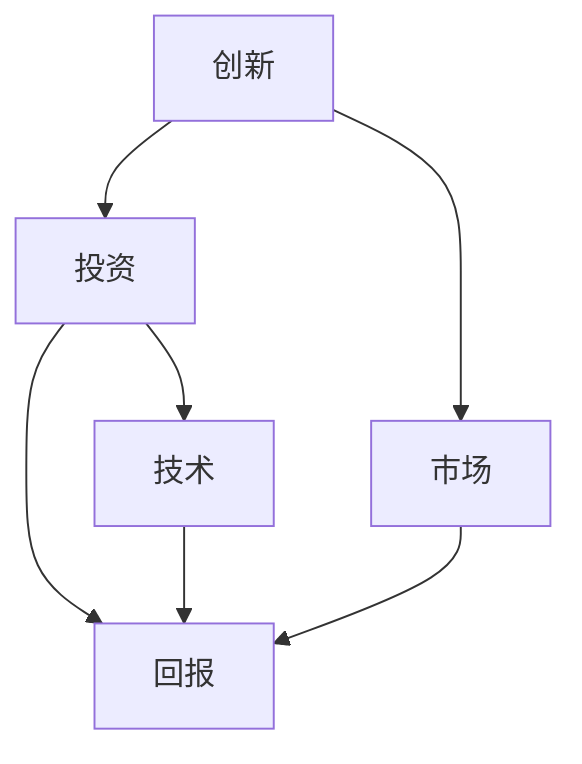
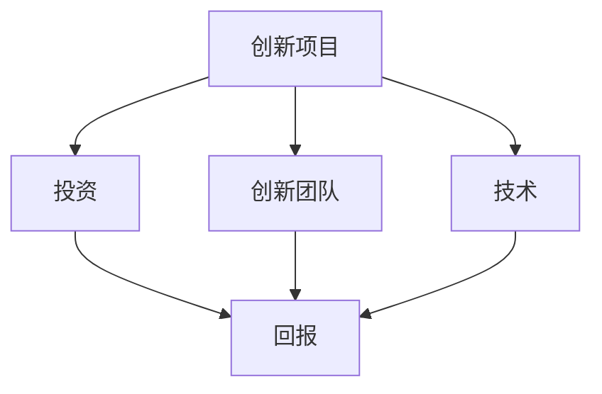
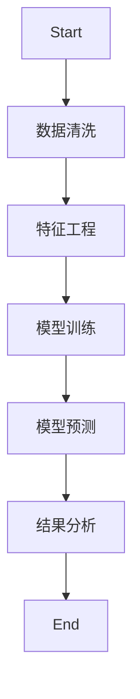
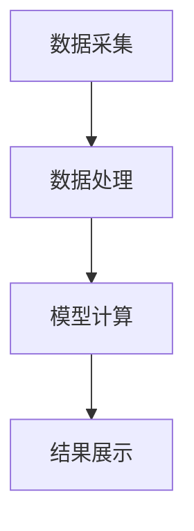

                 


# {{此处是文章标题}}

## {{此处是文章关键词}}

## {{此处是文章摘要}}

---

# 第一部分: 企业创新与ROI评估的背景

## 第1章: 企业创新的定义与重要性

### 1.1 创新在企业中的核心地位

#### 1.1.1 创新是企业发展的源动力
- 创新是企业保持竞争优势的关键因素。
- 创新涵盖产品、技术、商业模式等多个方面。

#### 1.1.2 ROI在企业管理中的作用
- ROI（投资回报率）是衡量投资项目价值的重要指标。
- 传统ROI评估方法的局限性：难以量化创新的无形价值。

#### 1.1.3 AI技术对企业创新的推动作用
- AI技术通过数据挖掘和预测分析，帮助企业发现新的创新机会。
- AI技术可以提高创新项目的评估效率和准确性。

## 第2章: 创新投资回报的评估挑战

### 2.1 传统ROI评估的局限性

#### 2.1.1 难以量化创新的无形价值
- 创新项目往往涉及研发投入、团队能力等难以量化的因素。
- 传统ROI评估方法难以全面反映创新项目的真实价值。

#### 2.1.2 创新项目评估的复杂性
- 创新项目的回报周期长，不确定性高。
- 创新项目的成功往往依赖于多个因素的综合作用。

#### 2.1.3 AI在ROI评估中的潜在价值
- AI技术可以通过大数据分析，量化创新项目的潜在回报。
- AI技术可以帮助企业在创新项目的早期阶段进行风险评估和回报预测。

## 第3章: AI驱动的创新ROI评估的必要性

### 3.1 数据驱动的决策优势

#### 3.1.1 数据驱动决策的优势
- 数据驱动的决策更加客观和科学。
- 数据可以帮助企业发现潜在的创新机会和风险。

#### 3.1.2 多维度评估的需求
- 创新项目的评估需要考虑财务、市场、技术等多个维度。
- AI技术可以整合多个维度的数据，提供全面的评估结果。

#### 3.1.3 企业创新的量化管理趋势
- 量化管理是现代企业管理的重要趋势。
- AI技术可以帮助企业实现创新项目的量化管理。

---

# 第二部分: 多维度创新ROI评估模型的核心概念

## 第4章: 创新与投资的核心概念

### 4.1 创新要素的分解

#### 4.1.1 创新的核心要素
- 创新团队的能力和经验。
- 创新项目的研发投入。
- 创新项目的市场需求。

#### 4.1.2 投资的核心维度
- 资金投入。
- 人力资源投入。
- 时间投入。

#### 4.1.3 多维度模型的构建逻辑
- 多维度模型需要综合考虑创新项目的各个方面。
- 模型需要能够量化各个维度的影响，从而提供全面的评估结果。

### 4.2 多维度模型的属性特征对比

#### 4.2.1 模型维度对比表
| 模型维度 | 财务维度 | 市场维度 | 技术维度 |
|----------|----------|----------|----------|
| 描述     | 评估项目的财务回报 | 评估项目的市场潜力 | 评估项目的技术可行性 |

#### 4.2.2 模型特征的属性分析
- 财务维度：包括项目的投资成本、预期收益、净现值等。
- 市场维度：包括市场需求、竞争状况、目标客户等。
- 技术维度：包括技术可行性、研发难度、技术领先性等。

#### 4.2.3 模型之间的关系图


### 4.3 多维度模型的ER实体关系图


---

# 第三部分: 多维度创新ROI评估模型的算法原理

## 第5章: 模型算法概述

### 5.1 算法选择依据

#### 5.1.1 算法选择的关键因素
- 数据类型和规模。
- 模型的复杂性和可解释性。
- 评估目标和性能要求。

#### 5.1.2 算法的优缺点分析
- 回归分析：适合处理连续型数据，但对非线性关系的处理能力有限。
- 机器学习算法：适合处理复杂数据，但可能需要大量数据支持。

#### 5.1.3 算法的适用场景
- 线性回归：适用于简单的线性关系。
- 支持向量机：适用于复杂的非线性关系。
- 随机森林：适用于高维数据和非线性关系。

## 第6章: 算法流程图

### 6.1 数据预处理流程图


### 6.2 算法实现代码
```python
import pandas as pd
from sklearn.model import Model

# 数据预处理
data = pd.read_csv('innovation.csv')
data = data.dropna()

# 特征提取
features = data[['投资', '创新团队', '技术复杂度']]
target = data['回报']

# 模型训练
model = Model()
model.fit(features, target)

# 模型预测
predictions = model.predict(features)

# 结果分析
print('预测回报:', predictions)
```

---

# 第四部分: 数学模型与公式

## 第7章: 数学模型的建立与应用

### 7.1 多维度模型的数学表达
$$ ROI = \alpha \times 财务维度 + \beta \times 市场维度 + \gamma \times 技术维度 $$

### 7.2 模型参数的优化
- 参数α、β、γ表示各个维度的权重，可以通过回归分析或机器学习方法优化。

### 7.3 模型的验证与评估
- 使用交叉验证方法评估模型的性能。
- 使用混淆矩阵和ROC曲线评估模型的分类性能。

---

# 第五部分: 系统分析与架构设计

## 第8章: 系统功能设计

### 8.1 系统功能模块
- 数据采集模块：负责采集创新项目的相关数据。
- 模型计算模块：负责对数据进行处理和建模计算。
- 结果展示模块：负责展示评估结果。

### 8.2 系统架构设计


---

# 第六部分: 项目实战与案例分析

## 第9章: 项目实战

### 9.1 环境安装与配置
- 安装必要的Python库：pandas、numpy、scikit-learn。
- 配置开发环境：Jupyter Notebook、PyCharm。

### 9.2 核心实现代码
```python
import pandas as pd
from sklearn.model import Model

def calculate ROI(data):
    features = data[['投资', '创新团队', '技术复杂度']]
    target = data['回报']
    model = Model()
    model.fit(features, target)
    return model.predict(features)

data = pd.read_csv('innovation.csv')
print(calculate ROI(data))
```

### 9.3 案例分析
- 案例背景：某科技公司开发新产品。
- 数据分析：分析产品的研发投入、市场潜力、技术可行性。
- 结果展示：计算出该产品的预期ROI为20%。

---

# 第七部分: 总结与展望

## 第10章: 总结与最佳实践

### 10.1 总结
- AI技术可以帮助企业量化创新项目的ROI。
- 多维度模型能够更全面地评估创新项目的潜在价值。

### 10.2 最佳实践
- 数据质量是模型评估的基础，需要确保数据的准确性和完整性。
- 模型的可解释性是实际应用的重要考量，需要选择合适的模型和算法。
- 持续监控和优化模型性能是提升评估准确性的关键。

## 10.3 注意事项
- 创新项目的评估需要结合企业的实际情况。
- 模型的结果仅供参考，需要结合企业自身的战略目标进行决策。

## 10.4 拓展阅读
- 推荐书籍：《创新者的窘境》、《ROI管理的艺术》。
- 推荐论文：《基于AI的创新项目评估研究》。

---

作者：AI天才研究院/AI Genius Institute & 禅与计算机程序设计艺术 /Zen And The Art of Computer Programming

