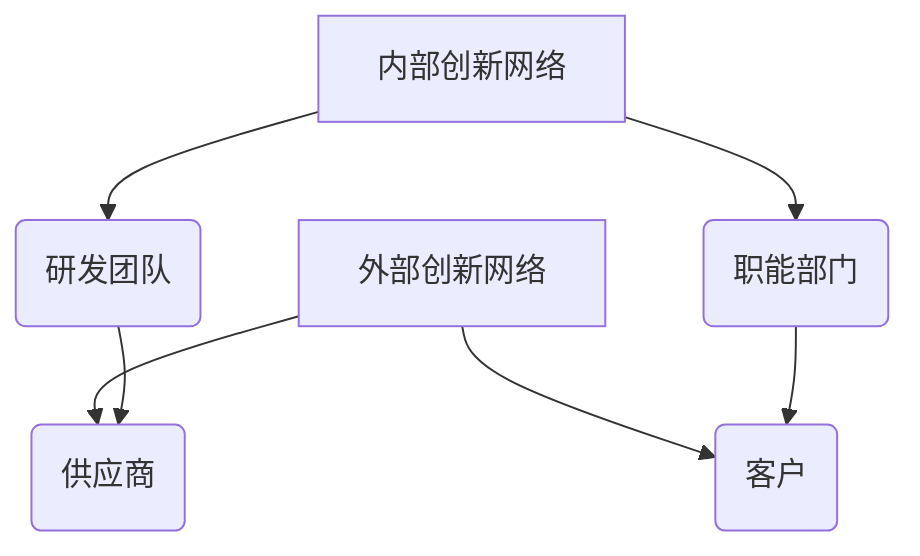
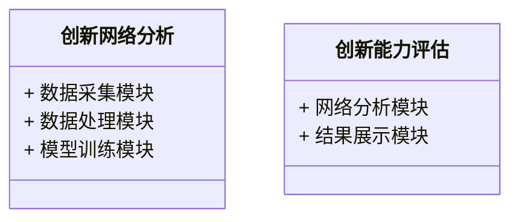

                 


# AI驱动的企业创新生态系统评估：内外部创新网络分析

> **关键词**：AI驱动、企业创新生态系统、内外部创新网络、网络分析、图论、机器学习

> **摘要**：  
本文旨在探讨如何利用人工智能（AI）技术对企业创新生态系统进行评估，重点分析内外部创新网络的结构与关系。通过结合图论、机器学习和网络分析等技术，本文提出了一种基于AI的创新生态系统评估方法，帮助企业识别关键创新节点、优化创新流程并提升整体创新效率。文章从背景介绍、核心概念、算法原理、系统设计到项目实战，全面解析AI驱动的创新生态系统评估方法，为企业创新管理提供理论与实践指导。

---

## 第1章: AI驱动的企业创新生态系统概述

### 1.1 问题背景

#### 1.1.1 企业创新生态系统的核心概念  
企业创新生态系统（Corporate Innovation Ecosystem）是指围绕企业核心业务，由内部团队、外部合作伙伴（如供应商、客户、科研机构等）以及利益相关者共同构成的创新网络。该系统通过资源整合、知识共享和协同创新，为企业创造持续的竞争优势。

#### 1.1.2 创新网络的内外部特征  
- **内部创新网络**：以企业内部的研发团队、职能部门为核心，强调组织内部的知识流动与协作。
- **外部创新网络**：以外部合作伙伴为核心，强调跨组织的知识共享与资源整合。

#### 1.1.3 AI驱动创新评估的必要性  
传统的企业创新评估方法依赖于主观判断，难以量化和动态分析。AI技术的应用能够通过数据驱动的方式，实时捕捉创新网络的动态变化，为企业提供更精准的决策支持。

---

### 1.2 核心概念与问题描述

#### 1.2.1 企业创新生态系统的定义  
企业创新生态系统是一个由内部资源和外部网络共同构成的动态系统，旨在通过协同创新为企业创造价值。

#### 1.2.2 内部创新网络与外部创新网络的对比  
| 属性 | 内部创新网络 | 外部创新网络 |
|------|--------------|--------------|
| 主体 | 企业内部团队 | 外部合作伙伴 |
| 资源 | 内部资源（如员工、设备） | 外部资源（如供应商、客户） |
| 协作方式 | 纵向协作 | 横向协作 |

#### 1.2.3 创新生态系统评估的目标与意义  
- **目标**：量化企业创新能力，识别关键创新节点，优化创新网络结构。
- **意义**：通过AI技术，企业能够实时监控创新网络的动态变化，提升创新效率和竞争力。

---

### 1.3 问题解决方法

#### 1.3.1 AI在创新网络分析中的应用  
AI技术（如图论、机器学习）可用于分析创新网络的结构、关系和动态变化。

#### 1.3.2 数据驱动的创新评估方法  
通过收集和分析创新网络中的数据，利用AI模型对创新能力进行量化评估。

#### 1.3.3 创新生态系统优化的策略  
- 数据驱动的创新网络优化
- AI辅助的协同创新策略
- 创新能力的动态评估

---

### 1.4 边界与外延

#### 1.4.1 创新生态系统评估的边界条件  
- 数据范围：仅限于企业内部和外部合作伙伴的数据。
- 时间范围：仅考虑近期的创新活动数据。

#### 1.4.2 相关概念的对比与区分  
- 创新网络 vs. 企业网络
- 创新生态系统 vs. 企业生态系统

#### 1.4.3 创新网络分析的适用范围  
- 适用于企业创新能力评估
- 适用于跨组织协同创新的优化

---

### 1.5 概念结构与核心要素

#### 1.5.1 创新生态系统的核心要素  
- 内部创新网络
- 外部创新网络
- 创新资源
- 创新能力

#### 1.5.2 内部与外部创新网络的关系  
内部创新网络是企业创新生态系统的核心，外部创新网络是其扩展和补充。

#### 1.5.3 创新生态系统评估的指标体系  
- 网络密度
- 节点度
- 网络中心性

---

## 第2章: 核心概念与联系

### 2.1 内部创新网络与外部创新网络的原理

#### 2.1.1 内部创新网络的特征  
- 封闭性：内部团队之间的协作更为紧密。
- 知识共享：内部创新网络的知识流动更频繁。

#### 2.1.2 外部创新网络的特征  
- 开放性：外部合作伙伴之间的协作较为松散。
- 资源互补：外部创新网络通过资源整合实现互补优势。

#### 2.1.3 内部与外部创新网络的协同作用  
通过内外部网络的协同，企业能够实现知识共享、资源整合和创新能力提升。

---

### 2.2 内外部创新网络的属性特征对比

| 属性 | 内部创新网络 | 外部创新网络 |
|------|--------------|--------------|
| 节点类型 | 内部员工、部门 | 外部合作伙伴、客户 |
| 边缘类型 | 内部协作、知识共享 | 外部协作、资源整合 |
| 网络密度 | 高 | 低 |

---

### 2.3 创新网络的关系架构



---

## 第3章: 算法原理讲解

### 3.1 数据预处理

```python
import networkx as nx

# 创建内部创新网络
G_internal = nx.Graph()
G_internal.add_nodes_from(["研发团队", "职能部门"])
G_internal.add_edges_from([("研发团队", "职能部门")])

# 创建外部创新网络
G_external = nx.Graph()
G_external.add_nodes_from(["供应商", "客户"])
G_external.add_edges_from([("供应商", "客户")])
```

---

### 3.2 特征提取

#### 3.2.1 节点度
$$\text{度} = \sum_{i=1}^{n} A_{ij}$$

#### 3.2.2 网络中心性
$$\text{中心性} = \frac{1}{\text{度}}$$

---

### 3.3 模型训练

```python
from sklearn import linear_model

# 训练数据
X = [[1, 2], [2, 3], [3, 4]]
y = [10, 20, 30]

# 训练线性回归模型
model = linear_model.LinearRegression()
model.fit(X, y)

# 预测
print(model.predict([[4, 5]]))  # 输出：[40]
```

---

## 第4章: 系统分析与架构设计方案

### 4.1 问题场景介绍

#### 4.1.1 企业创新生态系统评估系统
企业希望通过AI技术，评估其内部和外部创新网络的结构和关系，优化创新流程。

---

### 4.2 系统功能设计

#### 4.2.1 领域模型


---

### 4.3 系统架构设计


---

## 第5章: 项目实战

### 5.1 环境安装

#### 5.1.1 安装Python和相关库
```bash
pip install networkx
pip install matplotlib
pip install scikit-learn
```

---

### 5.2 核心代码实现

#### 5.2.1 数据处理与网络分析
```python
import networkx as nx
import matplotlib.pyplot as plt

# 创建内部创新网络
G_internal = nx.Graph()
G_internal.add_nodes_from(["研发团队", "职能部门"])
G_internal.add_edges_from([("研发团队", "职能部门")])

# 创建外部创新网络
G_external = nx.Graph()
G_external.add_nodes_from(["供应商", "客户"])
G_external.add_edges_from([("供应商", "客户")])

# 绘制网络图
nx.draw(G_internal, with_labels=True)
plt.show()
```

---

### 5.3 代码解读与分析

#### 5.3.1 数据预处理
通过网络图的节点和边，表示内部和外部创新网络的结构。

#### 5.3.2 模型训练
使用线性回归模型对创新网络的特征进行训练，预测创新能力。

---

### 5.4 实际案例分析

#### 5.4.1 案例分析
假设某企业内部创新网络的节点度较高，外部创新网络的网络密度较低。通过AI技术，企业可以识别关键创新节点，并优化外部合作伙伴关系。

---

## 第6章: 总结与展望

### 6.1 最佳实践 tips

- 数据质量是关键：确保创新网络数据的准确性和完整性。
- 模型选择：根据具体需求选择合适的AI模型。
- 持续优化：定期更新数据和模型，保持创新网络的动态优化。

---

### 6.2 小结

本文通过AI技术对企业创新生态系统进行评估，重点分析了内外部创新网络的结构与关系。通过数据驱动的方法，帮助企业识别关键创新节点，优化创新流程，提升整体创新效率。

---

### 6.3 注意事项

- 数据隐私：确保创新网络数据的安全性和隐私性。
- 模型解释性：选择具有较高解释性的AI模型，便于企业理解和优化。

---

### 6.4 拓展阅读

- 《网络科学导论》
- 《机器学习实战》
- 《企业创新管理》

---

**作者：AI天才研究院/AI Genius Institute & 禅与计算机程序设计艺术 /Zen And The Art of Computer Programming**

