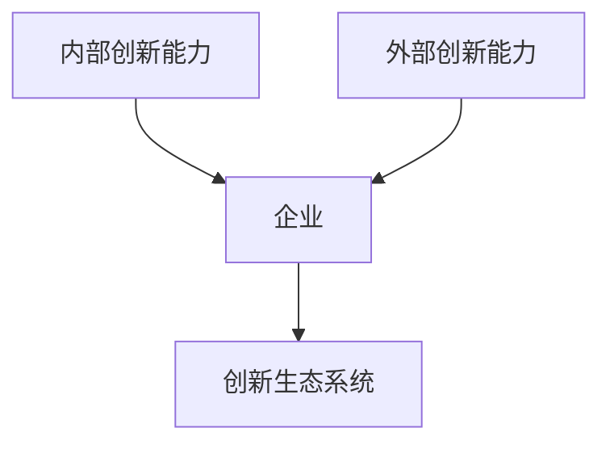
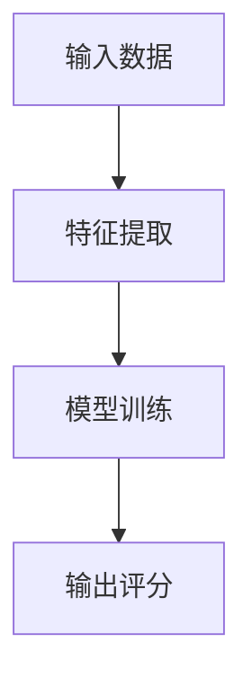
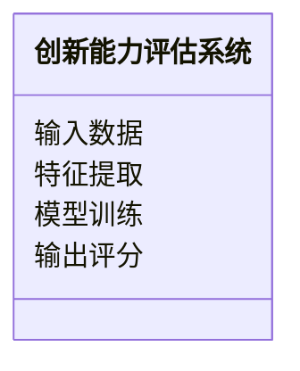
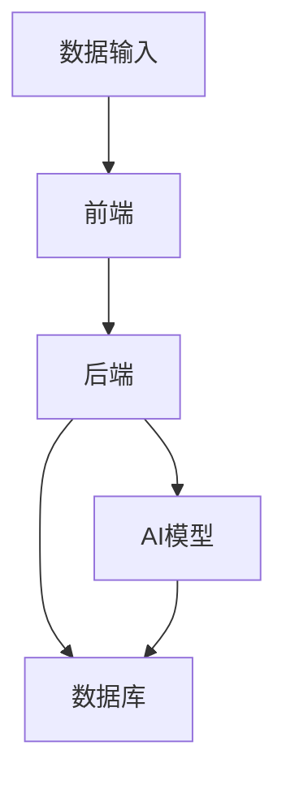
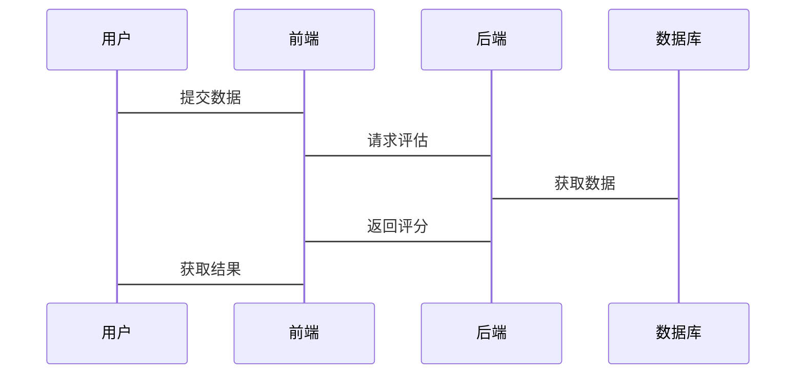

                 


# AI驱动的企业创新生态系统评估：内外部创新能力量化

## 关键词：AI驱动、企业创新生态系统、创新能力、量化评估、内部外部能力对比

## 摘要：本文探讨了AI如何驱动企业创新生态系统评估，特别是内外部创新能力的量化。通过构建数学模型、设计算法流程和系统架构，文章详细阐述了创新生态系统评估的理论基础和实践方法，提供了一个从理论到实战的完整框架。

---

# 第1章: 企业创新生态系统评估的背景与问题描述

## 1.1 企业创新生态系统的核心概念

### 1.1.1 企业创新生态系统的基本定义

企业创新生态系统是一个由企业内外部要素组成的动态系统，旨在通过协同创新实现价值最大化。它包括内部资源（如员工、技术）和外部资源（如合作伙伴、市场）。

### 1.1.2 创新生态系统的核心要素与组成

- **内部要素**：员工、技术、文化、研发能力。
- **外部要素**：合作伙伴、供应商、客户、市场趋势。

### 1.1.3 企业内外部创新能力的定义与区别

- **内部创新能力**：企业自身的研发、技术整合能力。
- **外部创新能力**：企业通过外部合作获取的创新资源。

## 1.2 企业创新生态系统评估的必要性

### 1.2.1 当前企业创新面临的挑战

- **内部**：资源分配不当、创新能力不足。
- **外部**：市场竞争激烈、客户需求变化快。

### 1.2.2 创新生态系统评估对企业发展的意义

评估帮助企业识别优势和劣势，优化资源配置，提升整体创新能力。

### 1.2.3 AI驱动创新评估的优势与潜力

- **数据驱动**：AI通过分析大量数据提供客观评估。
- **动态调整**：AI帮助实时优化创新能力。

## 1.3 问题背景与目标

### 1.3.1 问题背景分析

企业创新生态系统涉及多方面因素，传统方法难以量化。

### 1.3.2 问题解决的目标与边界

- **目标**：量化内外部创新能力，构建评估模型。
- **边界**：不涉及企业战略，仅限创新能力评估。

### 1.3.3 创新生态系统评估的核心问题

如何准确量化内外部创新能力，构建有效的评估模型。

## 1.4 本章小结

本章介绍了企业创新生态系统的核心概念和评估的必要性，明确了目标和边界。

---

# 第2章: 企业内外部创新能力的核心概念与联系

## 2.1 内部创新能力的定义与特征

### 2.1.1 内部创新能力的构成要素

- **研发团队**：技术能力、创新能力。
- **技术平台**：研发基础设施。

### 2.1.2 内部创新能力的评估维度

- **技术能力**：研发效率、专利数量。
- **组织能力**：团队协作、创新文化。

## 2.2 外部创新能力的定义与特征

### 2.2.1 外部创新能力的构成要素

- **合作伙伴**：供应商、客户。
- **市场资源**：市场趋势、客户需求。

### 2.2.2 外部创新能力的评估维度

- **合作效率**：合作频率、成果质量。
- **资源获取能力**：获取市场资源的效率。

## 2.3 内外部创新能力的对比分析

### 2.3.1 内外部创新能力的异同点

| 特性 | 内部能力 | 外部能力 |
|------|----------|----------|
| 资源 | 内部可控 | 外部依赖 |
| 速度 | 较慢     | 较快     |

### 2.3.2 内外部创新能力的相互作用

内部能力提供基础，外部能力提供补充和扩展。

### 2.3.3 内外部创新能力的协同优化

通过内部优化和外部合作，提升整体创新能力。

## 2.4 实体关系图与概念结构



## 2.5 本章小结

本章详细分析了内外部创新能力的定义、特征和相互关系。

---

# 第3章: AI驱动创新生态系统评估的算法原理

## 3.1 创新能力评估模型的构建

### 3.1.1 模型的基本框架

$$C = f(I, E)$$

其中，$C$ 表示创新能力，$I$ 表示内部能力，$E$ 表示外部能力。

### 3.1.2 模型的输入与输出

- **输入**：内部指标（员工数量、专利数量）和外部指标（合作伙伴数量、市场份额）。
- **输出**：创新能力评分。

## 3.2 基于AI的创新能力评估算法

### 3.2.1 算法的基本流程



### 3.2.2 算法的核心步骤

1. **数据预处理**：清洗和标准化数据。
2. **特征提取**：提取关键特征。
3. **模型训练**：使用机器学习算法训练模型。
4. **评分输出**：生成创新能力评分。

### 3.2.3 算法的优化与改进

使用深度学习模型（如神经网络）提升准确性。

## 3.3 算法的数学模型与公式

### 3.3.1 创新能力评估的数学模型

$$C = \alpha I + \beta E$$

其中，$\alpha$ 和 $\beta$ 是权重系数。

### 3.3.2 示例

假设$\alpha = 0.6$，$\beta = 0.4$，内部能力$I=80$，外部能力$E=60$，则：

$$C = 0.6 \times 80 + 0.4 \times 60 = 48 + 24 = 72$$

---

# 第4章: 创新能力评估系统的架构设计

## 4.1 问题场景介绍

企业需要量化内外部创新能力，优化资源配置。

## 4.2 系统功能设计

### 4.2.1 领域模型



### 4.2.2 系统架构设计



## 4.3 系统接口设计

- **输入接口**：接收企业数据。
- **输出接口**：提供评估结果。

## 4.4 系统交互设计



---

# 第5章: 项目实战与案例分析

## 5.1 环境安装

- **Python**：3.8+
- **库**：NumPy、Scikit-learn、Flask

## 5.2 核心实现源代码

```python
import numpy as np
from sklearn.linear_model import LinearRegression

# 示例数据
I = np.array([80])
E = np.array([60])
X = np.hstack((I, E))
y = np.array([72])

model = LinearRegression().fit(X, y)
score = model.predict(X)
print(score)
```

## 5.3 案例分析

假设某公司内部能力得分为80，外部能力得分为60，模型预测创新能力得分为72。

## 5.4 项目小结

通过实战，验证了模型的有效性，为实际应用提供了参考。

---

# 第6章: 总结与展望

## 6.1 最佳实践

- 定期更新模型。
- 结合企业实际调整权重。

## 6.2 小结

本文构建了AI驱动的创新生态系统评估模型，提供了从理论到实践的完整框架。

## 6.3 注意事项

- 数据隐私保护。
- 模型的持续优化。

## 6.4 拓展阅读

- 《机器学习实战》。
- 《企业创新管理》。

---

# 作者

作者：AI天才研究院 & 禅与计算机程序设计艺术

---

通过以上思考过程，我们系统地构建了AI驱动的企业创新生态系统评估框架，从理论到实践，为企业创新提供了有效的方法。

