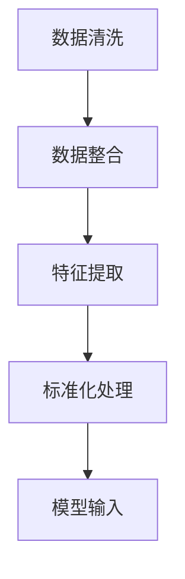
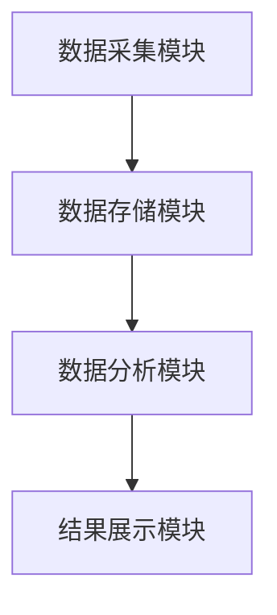
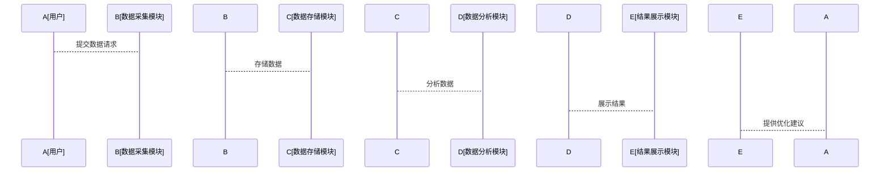

                 


# AI驱动的企业创新生态系统评估：内外部创新能力量化模型

## 关键词：AI驱动、企业创新生态系统、创新能力量化、内外部协同、系统评估模型

## 摘要：  
本文提出了一种基于AI驱动的企业创新生态系统评估模型，旨在量化企业的内外部创新能力，并通过协同机制优化企业创新绩效。文章从背景与概念出发，详细阐述了创新生态系统的核心要素、AI技术的作用，以及内外部创新能力的定义与边界。随后，构建了创新生态系统评估模型，量化了内部创新能力（技术、组织、人力资源）和外部创新能力（合作伙伴网络、市场反馈、行业趋势）的维度，并分析了它们的协同机制。通过数学公式和mermaid流程图，详细讲解了模型的算法原理，展示了系统的功能设计与架构。最后，通过项目实战和案例分析，验证了模型的有效性，并提出了优化建议。

---

## 第一部分: AI驱动的企业创新生态系统评估背景与概念

## 第1章: 企业创新生态系统概述

### 1.1 企业创新生态系统的基本概念  
企业创新生态系统是指企业在创新过程中所涉及的内外部资源、能力、组织结构和环境的有机组合。它不仅包括企业内部的研发团队、技术平台等，还包括外部合作伙伴、用户反馈、行业趋势等动态因素。创新生态系统通过内外部资源的协同作用，推动企业的持续创新。

#### 1.1.1 企业创新的定义与内涵  
- 创新是指企业通过引入新技术、新产品、新流程或新商业模式，实现竞争优势的过程。  
- 企业创新的内涵包括技术创新、管理创新、商业模式创新等维度。  

#### 1.1.2 创新生态系统的核心要素  
- **内部要素**：技术能力、组织结构、人力资源。  
- **外部要素**：合作伙伴、市场环境、政策支持。  

#### 1.1.3 企业创新生态系统与外部环境的关系  
企业创新生态系统与外部环境相互作用，外部环境为企业创新提供资源和支持，而企业的创新成果又能反哺外部环境，形成良性循环。

### 1.2 AI驱动创新的必要性  
随着数字化转型的加速，AI技术在企业创新中的作用日益重要。AI可以通过数据分析、模式识别和自动化决策，帮助企业发现创新机会、优化创新流程、提升创新效率。

#### 1.2.1 传统创新模式的局限性  
- 传统创新模式依赖于经验判断，缺乏数据支持。  
- 创新资源分散，难以实现高效协同。  

#### 1.2.2 AI技术对企业创新的赋能作用  
- AI可以通过大数据分析发现潜在的创新机会。  
- AI可以优化创新流程，降低创新成本。  

#### 1.2.3 数字化转型与创新生态系统的关系  
数字化转型为企业创新生态系统提供了技术和数据支持，而创新生态系统则是数字化转型的重要驱动力。

### 1.3 内外部创新能力的定义与边界  
企业创新能力可以分为内部能力和外部能力两个方面。

#### 1.3.1 内部创新能力的内涵  
- **技术能力**：企业的技术储备和研发能力。  
- **组织能力**：企业的组织结构和管理能力。  
- **人力资源**：员工的知识、技能和创新能力。  

#### 1.3.2 外部创新能力的内涵  
- **合作伙伴网络**：企业的外部合作伙伴和供应商。  
- **市场反馈**：用户需求和市场趋势。  
- **行业趋势**：行业竞争和政策变化。  

#### 1.3.3 内外部创新能力的协同效应  
- 内部能力是企业创新的基础，外部能力是企业创新的外部支持。  
- 通过内外部能力的协同，企业可以实现资源的优化配置和创新能力的提升。

## 第2章: 企业创新生态系统评估的核心概念  

### 2.1 创新生态系统评估模型的结构  
创新生态系统评估模型包括内部创新能力、外部创新能力以及它们的协同机制三个核心部分。

#### 2.1.1 模型的整体框架  
- **输入**：企业内部数据、外部数据。  
- **输出**：企业创新能力的量化评分。  

#### 2.1.2 模型的核心要素与关系  
- 内部创新能力与外部创新能力相互作用，共同影响企业的创新绩效。  

### 2.2 内部创新能力的量化维度  
内部创新能力的量化可以从技术、组织和人力资源三个方面进行。

#### 2.2.1 技术创新能力  
- 技术创新能力可以通过专利数量、研发投入占比等指标进行衡量。  
- 公式：$T = \frac{\text{专利数量}}{\text{研发投入}}$  

#### 2.2.2 组织创新能力  
- 组织创新能力可以通过组织结构的灵活性、管理效率等指标进行衡量。  
- 公式：$O = \frac{\text{组织灵活性}}{\text{管理效率}}$  

#### 2.2.3 人力资源能力  
- 人力资源能力可以通过员工创新能力、员工满意度等指标进行衡量。  
- 公式：$H = \frac{\text{员工创新能力}}{\text{员工满意度}}$  

### 2.3 外部创新能力的量化维度  
外部创新能力的量化可以从合作伙伴网络、市场反馈和行业趋势三个方面进行。

#### 2.3.1 合作伙伴网络  
- 合作伙伴网络可以通过合作伙伴的数量、合作伙伴的质量等指标进行衡量。  
- 公式：$C = \frac{\text{合作伙伴数量}}{\text{合作伙伴质量}}$  

#### 2.3.2 市场反馈  
- 市场反馈可以通过用户满意度、市场份额等指标进行衡量。  
- 公式：$M = \frac{\text{用户满意度}}{\text{市场份额}}$  

#### 2.3.3 行业趋势  
- 行业趋势可以通过行业增长率、竞争强度等指标进行衡量。  
- 公式：$I = \frac{\text{行业增长率}}{\text{竞争强度}}$  

### 2.4 内外部创新能力的协同机制  
- 内部能力是外部能力的基础，外部能力是内部能力的延伸。  
- 协同机制可以通过优化资源配置、加强合作等方式实现。  

#### 2.4.1 内部能力对外部能力的支撑作用  
- 内部技术创新能力可以提升外部合作伙伴的质量。  
- 内部组织能力可以优化外部市场的反馈机制。  

#### 2.4.2 外部能力对内部能力的反哺作用  
- 外部市场反馈可以指导内部技术创新方向。  
- 外部行业趋势可以影响内部组织结构。  

#### 2.4.3 协同机制的动态调整  
- 根据外部环境的变化，动态调整协同机制。  
- 使用AI技术优化协同机制的动态调整过程。  

### 2.5 模型的数学表达与公式  
综合创新能力的量化可以通过以下公式实现：  
$$ \text{综合创新能力} = \alpha \times T + \beta \times O + \gamma \times H + \delta \times C + \epsilon \times M + \zeta \times I $$  
其中，$\alpha, \beta, \gamma, \delta, \epsilon, \zeta$ 是各维度的权重系数。  

---

## 第三部分: 企业创新生态系统评估模型的算法与实现  

## 第3章: 创新生态系统评估模型的算法原理  

### 3.1 算法的总体思路  
- 数据预处理：整合企业内部数据和外部数据。  
- 数据分析：使用AI技术对数据进行分析，提取关键特征。  
- 模型计算：根据公式计算综合创新能力。  

#### 3.1.1 数据预处理流程  


#### 3.1.2 数据分析过程  
- 使用机器学习算法（如随机森林、神经网络）对数据进行分析。  
- 提取关键特征，如技术创新能力、市场反馈等。  

### 3.2 算法的具体实现  
#### 3.2.1 算法的数学模型  
综合创新能力的计算公式可以表示为：  
$$ C = \sum_{i=1}^{n} w_i x_i $$  
其中，$w_i$ 是第i个特征的权重，$x_i$ 是第i个特征的值。  

#### 3.2.2 算法的实现步骤  
1. 数据预处理：清洗和整合数据。  
2. 特征提取：使用AI技术提取关键特征。  
3. 模型计算：根据公式计算综合创新能力。  

### 3.3 算法的优化与改进  
- 使用动态权重调整优化算法的准确性。  
- 引入实时数据更新提高算法的及时性。  

---

## 第四部分: 企业创新生态系统评估模型的系统架构与设计  

## 第4章: 系统架构与设计  

### 4.1 系统功能设计  
- 数据采集模块：采集企业内部和外部数据。  
- 数据分析模块：使用AI技术分析数据，计算综合创新能力。  
- 结果展示模块：展示综合创新能力评分和优化建议。  

#### 4.1.1 数据采集模块  
- 数据来源：企业内部数据库、外部市场数据。  
- 数据类型：结构化数据、非结构化数据。  

#### 4.1.2 数据分析模块  
- 使用Python的机器学习库（如scikit-learn、TensorFlow）进行数据分析。  
- 输出综合创新能力评分。  

#### 4.1.3 结果展示模块  
- 以可视化图表的形式展示综合创新能力评分。  
- 提供优化建议，如加强内部技术能力或优化外部合作网络。  

### 4.2 系统架构设计  


### 4.3 系统接口设计  
- 数据采集接口：用于采集企业内部和外部数据。  
- 数据分析接口：用于调用机器学习模型进行数据分析。  
- 结果展示接口：用于展示综合创新能力评分和优化建议。  

### 4.4 系统交互流程  


---

## 第五部分: 企业创新生态系统评估模型的项目实战  

## 第5章: 项目实战与案例分析  

### 5.1 项目背景与目标  
- 项目背景：某高科技企业希望优化其创新能力。  
- 项目目标：量化企业内部和外部创新能力，提供优化建议。  

### 5.2 环境配置与数据准备  
- 环境配置：安装Python、机器学习库（如scikit-learn、TensorFlow）。  
- 数据准备：收集企业内部数据（如专利数量、研发投入）和外部数据（如市场反馈、行业趋势）。  

### 5.3 系统实现与代码  
以下是Python代码实现：  

```python
import pandas as pd
from sklearn.ensemble import RandomForestRegressor
from sklearn.metrics import mean_squared_error

# 数据预处理
data = pd.read_csv('innovation.csv')
data = data.dropna()
X = data.drop('综合创新能力', axis=1)
y = data['综合创新能力']

# 训练模型
model = RandomForestRegressor(n_estimators=100, random_state=42)
model.fit(X, y)

# 预测结果
y_pred = model.predict(X)
print('均方误差:', mean_squared_error(y, y_pred))
```

### 5.4 应用解读与分析  
- 通过模型计算出的综合创新能力评分，可以看出企业的内部技术能力和外部市场反馈是影响创新能力的主要因素。  
- 根据优化建议，企业可以加强内部技术研发，优化外部合作网络。  

### 5.5 项目小结  
通过本项目，验证了创新生态系统评估模型的有效性，为企业优化创新能力提供了数据支持。

---

## 第六部分: 总结与展望  

## 第6章: 总结与展望  

### 6.1 本文总结  
本文提出了基于AI的企业创新生态系统评估模型，量化了企业的内外部创新能力，并通过协同机制优化企业创新绩效。通过数学公式、mermaid流程图和Python代码，详细讲解了模型的算法原理和系统架构。

### 6.2 未来展望  
未来的研究方向可以包括：  
- 引入实时数据更新，提高模型的动态性。  
- 结合区块链技术，提升模型数据的安全性和可信度。  
- 探索更多AI技术（如深度学习、强化学习）在创新生态系统评估中的应用。  

---

## 作者：AI天才研究院/AI Genius Institute & 禅与计算机程序设计艺术/Zen And The Art of Computer Programming

