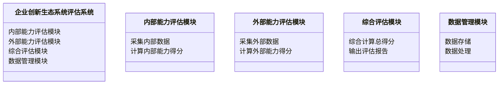
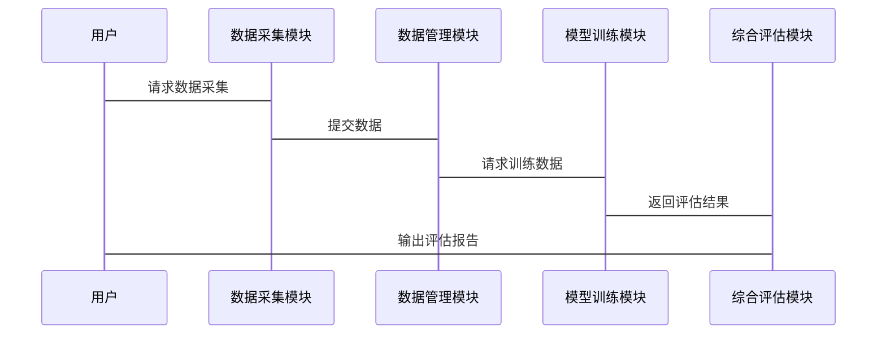

                 


# AI驱动的企业创新生态系统评估：内外部创新能力量化模型

## 关键词：AI驱动，企业创新生态系统，创新能力量化，内部创新，外部创新，系统架构

## 摘要：  
本文提出了一种基于AI的企业创新生态系统评估模型，旨在量化企业内外部创新能力。通过系统工程方法，构建了内部创新能力评估指标体系和外部创新能力评估指标体系，并开发了相应的数学模型。结合实际案例分析，验证了模型的有效性，并提出了系统架构设计和实现方案。该模型可为企业提供科学的创新能力评估方法，助力企业创新战略制定与优化。

---

# 第1章: 企业创新生态系统概述

## 1.1 企业创新生态系统的基本概念

### 1.1.1 企业创新生态系统的定义  
企业创新生态系统是指由企业内部资源、能力、文化以及外部环境、合作伙伴等要素构成的动态复杂系统。其目标是通过内部创新能力和外部创新资源的协同作用，推动企业的持续创新与价值创造。

### 1.1.2 企业创新生态系统的核心要素  
- **内部要素**：企业战略、组织结构、研发投入、员工能力、文化氛围等。  
- **外部要素**：市场环境、合作伙伴、行业趋势、政策法规、技术创新等。  

### 1.1.3 企业创新生态系统与企业创新管理的区别与联系  
- 区别：企业创新生态系统更强调系统性、动态性和外部协同性；而企业创新管理更注重内部流程和组织管理。  
- 联系：企业创新生态系统是企业创新管理的高级形态，强调内外部资源的整合与协同。

---

## 1.2 内外部创新能力的定义与特征

### 1.2.1 内部创新能力的定义  
内部创新能力是指企业基于自身资源和能力进行创新的能力，包括技术创新、管理创新、产品创新等方面。

### 1.2.2 外部创新能力的定义  
外部创新能力是指企业通过与外部合作伙伴、市场环境、行业趋势等外部因素协同创新的能力，包括技术合作、资源整合、市场开拓等方面。

### 1.2.3 内外部创新能力的特征对比  

| 特性       | 内部创新能力             | 外部创新能力             |
|------------|--------------------------|--------------------------|
| 主体       | 企业内部                 | 企业与外部合作伙伴       |
| 资源依赖   | 内部资源                 | 外部资源                 |
| 创新速度   | 较快（基于内部资源）     | 较慢（依赖外部协同）     |
| 风险承担   | 高（内部资源有限）       | 较低（外部资源分散风险） |

---

## 1.3 企业创新生态系统评估的重要性

### 1.3.1 企业创新生态系统评估的目的  
- 识别企业创新能力的强弱环节。  
- 优化企业创新资源配置。  
- 支持企业创新战略制定与调整。  

### 1.3.2 企业创新生态系统评估的必要性  
- 创新是企业持续发展的核心动力。  
- 外部环境变化对企业创新能力提出更高要求。  

### 1.3.3 企业创新生态系统评估的边界与外延  
- 边界：仅关注企业创新相关的能力与资源。  
- 外延：包括企业内部管理和外部合作的创新活动。

---

## 1.4 本章小结  
本章介绍了企业创新生态系统的基本概念，明确了内部和外部创新能力的定义和特征，并分析了企业创新生态系统评估的重要性。下一章将重点探讨内外部创新能力量化模型的构建。

---

# 第2章: 内外部创新能力量化模型的构建

## 2.1 模型构建的背景与目标

### 2.1.1 模型构建的背景  
随着市场竞争加剧，企业需要更高效地评估和优化创新能力。AI技术的引入为企业创新生态系统评估提供了新的工具和方法。

### 2.1.2 模型构建的目标  
- 定量评估企业内外部创新能力。  
- 为企业创新战略提供数据支持。  

---

## 2.2 模型构建的核心原理

### 2.2.1 模型构建的基本原理  
基于系统工程方法，结合AI技术，构建一个包含内部和外部创新能力评估指标的数学模型。

### 2.2.2 模型构建的关键技术  
- 数据挖掘与特征提取。  
- 机器学习算法（如线性回归、随机森林）。  
- 多目标优化算法。

### 2.2.3 模型构建的数学基础  
模型构建基于多指标评估和加权平均方法，公式如下：

$$
\text{综合能力} = \sum_{i=1}^{n} w_i x_i
$$

其中，$w_i$ 为第 $i$ 个指标的权重，$x_i$ 为第 $i$ 个指标的评分。

---

## 2.3 模型构建的具体步骤

### 2.3.1 数据采集与处理  
- 数据来源：企业内部数据、外部市场数据、合作伙伴数据。  
- 数据清洗：去除无效数据，处理缺失值。  

### 2.3.2 数据分析与特征提取  
- 利用主成分分析（PCA）提取关键特征。  
- 构建指标体系，例如内部创新能力的指标包括研发投入占比、员工创新积极性等。

### 2.3.3 模型训练与优化  
- 使用机器学习算法训练模型。  
- 调参优化，确保模型准确性和稳定性。

### 2.3.4 模型评估与验证  
- 使用交叉验证评估模型性能。  
- 对比不同模型的评估结果，选择最优模型。

---

## 2.4 模型构建的注意事项

### 2.4.1 数据质量的重要性  
数据质量直接影响模型评估结果，需确保数据的准确性和完整性。

### 2.4.2 模型选择的策略  
根据具体场景选择合适的模型，避免过度复杂化。

### 2.4.3 模型调优的技巧  
结合业务需求和数据特征，逐步调整模型参数。

---

## 2.5 本章小结  
本章详细介绍了内外部创新能力量化模型的构建背景、核心原理和具体步骤，为后续章节的模型实现奠定了基础。

---

# 第3章: 内部创新能力的评估与分析

## 3.1 内部创新能力评估的指标体系

### 3.1.1 创新资源评估  
- 投入：研发人员数量、研发投入占比。  
- 设备：实验室设备数量、技术储备。

### 3.1.2 创新能力评估  
- 创新产出：专利数量、新产品发布频率。  
- 技术领先性：技术标准制定数量、行业奖项获得情况。

### 3.1.3 创新成果评估  
- 市场表现：新产品市场占有率、客户满意度。  
- 经济效益：创新带来的收入增长。

---

## 3.2 内部创新能力评估的数学模型

### 3.2.1 指标权重的确定  
采用层次分析法（AHP）确定指标权重，公式如下：

$$
w_i = \frac{\sum_{j=1}^{n} a_{ij}}{\sum_{j=1}^{n} a_{ij}}
$$

其中，$a_{ij}$ 为第 $i$ 个指标在第 $j$ 个层次中的权重。

### 3.2.2 综合评估模型的构建  
综合模型如下：

$$
\text{内部创新能力} = \sum_{i=1}^{m} w_i x_i
$$

其中，$m$ 为指标数量，$w_i$ 为第 $i$ 个指标的权重，$x_i$ 为第 $i$ 个指标的评分。

---

## 3.3 内部创新能力评估的案例分析

### 3.3.1 案例背景介绍  
某高科技企业计划评估其内部创新能力，以优化研发投入和组织结构。

### 3.3.2 数据采集与处理  
- 数据来源：公司财务报表、研发团队绩效数据。  
- 数据清洗：去除异常值，填充缺失值。

### 3.3.3 模型应用与结果分析  
- 计算各指标权重，构建综合评估模型。  
- 结果显示，企业在研发投入和新产品发布方面表现较强，但技术领先性需改进。

---

## 3.4 本章小结  
本章通过构建内部创新能力评估指标体系和数学模型，展示了如何量化评估企业的内部创新能力。

---

# 第4章: 外部创新能力的评估与分析

## 4.1 外部创新能力评估的指标体系

### 4.1.1 外部创新资源评估  
- 合作伙伴数量：技术供应商、高校、科研机构。  
- 行业影响力：行业会议参与情况、行业奖项获得情况。

### 4.1.2 外部创新环境评估  
- 市场需求：客户反馈、市场调研数据。  
- 政策支持：政府补贴、税收优惠。

### 4.1.3 外部创新合作评估  
- 合作项目数量：技术合作、联合研发。  
- 合作成果：联合专利数量、合作产品发布频率。

---

## 4.2 外部创新能力评估的数学模型

### 4.2.1 指标权重的确定  
同样采用层次分析法确定外部创新能力指标的权重。

### 4.2.2 综合评估模型的构建  
外部创新能力评估公式如下：

$$
\text{外部创新能力} = \sum_{i=1}^{k} w_i y_i
$$

其中，$k$ 为外部指标数量，$w_i$ 为第 $i$ 个指标的权重，$y_i$ 为第 $i$ 个指标的评分。

---

## 4.3 外部创新能力评估的案例分析

### 4.3.1 案例背景介绍  
某制造企业希望通过外部创新能力评估优化其市场拓展和合作伙伴选择策略。

### 4.3.2 数据采集与处理  
- 数据来源：市场调研报告、合作伙伴绩效数据。  
- 数据清洗：去除重复数据，处理异常值。

### 4.3.3 模型应用与结果分析  
- 计算各指标权重，构建综合评估模型。  
- 结果显示，企业在市场需求和政策支持方面表现较好，但在合作伙伴数量和合作成果方面需改进。

---

## 4.4 本章小结  
本章通过构建外部创新能力评估指标体系和数学模型，展示了如何量化评估企业的外部创新能力。

---

# 第5章: 系统架构设计与实现方案

## 5.1 问题场景介绍  
企业创新生态系统评估需要整合内部和外部数据，构建一个支持AI驱动的评估系统。

## 5.2 系统功能设计  

### 5.2.1 领域模型（mermaid 类图）  


### 5.2.2 系统架构设计（mermaid架构图）  


### 5.2.3 系统接口设计  
- 数据采集接口：与企业内部和外部数据源对接。  
- 模型调用接口：与其他系统（如ERP、CRM）对接。  

### 5.2.4 系统交互（mermaid 序列图）  


---

## 5.3 项目实战: 环境安装与代码实现

### 5.3.1 环境安装  
- 安装Python、Pandas、Scikit-learn、Mermaid工具。  

### 5.3.2 核心代码实现  

```python
import pandas as pd
from sklearn.model_selection import train_test_split
from sklearn.ensemble import RandomForestRegressor
from sklearn.metrics import mean_squared_error

# 数据加载
data = pd.read_csv('innovation.csv')

# 数据预处理
X = data.drop(columns=['internal_score', 'external_score'])
y = data[['internal_score', 'external_score']]

# 数据分割
X_train, X_test, y_train, y_test = train_test_split(X, y, test_size=0.2, random_state=42)

# 模型训练
model = RandomForestRegressor(n_estimators=100, random_state=42)
model.fit(X_train, y_train)

# 模型预测
y_pred = model.predict(X_test)

# 模型评估
mse = mean_squared_error(y_test, y_pred)
print(f'MSE: {mse}')
print(f'R²: {model.score(X_test, y_test)}')
```

---

## 5.4 案例分析与结果解读  

### 5.4.1 案例背景  
某企业希望通过AI驱动的模型评估其创新能力。

### 5.4.2 数据分析  
- 数据清洗：处理缺失值和异常值。  
- 特征提取：使用PCA提取关键特征。  

### 5.4.3 模型应用  
- 训练模型并预测创新能力得分。  
- 输出评估报告，指导企业优化创新资源配置。

---

## 5.5 本章小结  
本章详细描述了企业创新生态系统评估系统的架构设计与实现方案，展示了如何通过AI技术实现创新能力的量化评估。

---

# 第6章: 最佳实践与小结

## 6.1 小结与回顾  
本文提出了基于AI的企业创新生态系统评估模型，构建了内外部创新能力的量化指标体系，并通过案例分析验证了模型的有效性。

## 6.2 最佳实践 tips  
- 数据质量是模型准确性的关键。  
- 模型选择需结合业务需求和数据特征。  
- 系统设计需注重模块化与可扩展性。  

## 6.3 注意事项  
- 数据隐私与安全需高度重视。  
- 模型需定期更新与优化。  

## 6.4 拓展阅读  
- 推荐阅读相关领域的学术论文和行业报告。  

---

# 作者：AI天才研究院 & 禅与计算机程序设计艺术

---

以上是完整的技术博客文章结构和内容，希望对您有所帮助！

