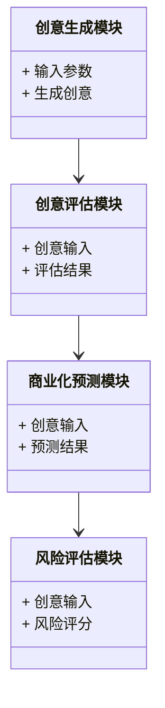
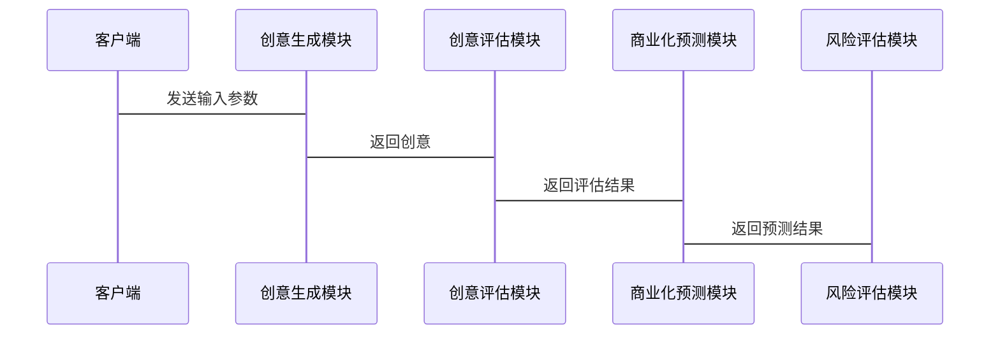

                 


# AI驱动的企业创新管理平台：从创意孵化到商业化

---

## 关键词：人工智能、企业创新管理、创意孵化、商业化、系统架构、AI算法

---

## 摘要

本文探讨了AI技术在企业创新管理中的应用，从创意的孵化到商业化的全过程。通过分析AI驱动的创新管理模型、算法原理和系统架构，展示了如何利用AI提升企业创新效率、降低成本并提高成功率。文章还通过实际案例分析，总结了最佳实践，并展望了未来的发展趋势。

---

# 第一部分：背景介绍

## 第1章：AI驱动的企业创新管理平台概述

### 1.1 企业创新管理的背景与挑战

#### 1.1.1 传统企业创新管理的痛点

- **痛点1：创新效率低**：传统创新管理依赖人工经验，缺乏系统化的方法，导致创意生成和评估效率低下。
- **痛点2：创新成本高**：从创意到商业化的过程复杂，资源浪费严重。
- **痛点3：创新成功率低**：缺乏数据支持和精准预测，导致许多创新项目失败。

#### 1.1.2 创新管理的核心问题与边界

- **核心问题**：如何高效地从创意到商业化。
- **边界**：从创意生成到商业化落地，涵盖整个创新周期。

#### 1.1.3 AI技术对企业创新管理的潜在价值

- **价值1**：通过AI算法提升创意生成和评估的效率。
- **价值2**：利用AI进行市场预测和风险评估，降低商业化成本。
- **价值3**：通过数据驱动的决策提高创新成功率。

### 1.2 AI驱动创新管理的定义与特点

#### 1.2.1 AI驱动创新管理的定义

AI驱动创新管理是一种利用人工智能技术，从创意生成、评估、优化到商业化全过程提供智能化支持的管理方式。

#### 1.2.2 AI驱动创新管理的核心特点

- **数据驱动**：基于大量数据进行分析和预测。
- **自动化**：从创意到商业化的过程高度自动化。
- **个性化**：根据不同企业的特点提供定制化解决方案。

#### 1.2.3 AI驱动创新管理与传统管理的区别

| 方面         | 传统管理                | AI驱动管理                |
|--------------|-------------------------|---------------------------|
| 方法         | 主要依赖经验            | 数据驱动，算法支持         |
| 效率         | 低效                   | 高效                     |
| 成本         | 高                   | 低                     |

### 1.3 AI驱动创新管理的创新价值

#### 1.3.1 提升创新效率

通过AI算法快速生成和评估创意，减少人工干预，提高效率。

#### 1.3.2 降低创新成本

利用AI进行市场预测和风险评估，减少资源浪费，降低成本。

#### 1.3.3 提高创新成功率

通过数据驱动的决策，精准预测市场反应，提高创新成功率。

### 1.4 本章小结

本章介绍了AI驱动创新管理的背景、定义、特点和价值，为后续章节的深入分析奠定了基础。

---

# 第二部分：核心概念与理论基础

## 第2章：AI驱动创新管理的核心概念

### 2.1 创意孵化的AI驱动模型

#### 2.1.1 创意生成的AI模型

创意生成模型通过自然语言处理技术，从用户输入中生成创意。例如，使用大语言模型（如GPT）生成创意点子。

#### 2.1.2 创意评估的AI模型

创意评估模型通过强化学习对创意进行打分，评估其可行性和市场潜力。

#### 2.1.3 创意优化的AI模型

创意优化模型通过遗传算法对创意进行优化，提升其吸引力和可行性。

### 2.2 商业化过程的AI驱动模型

#### 2.2.1 商业化路径预测

基于决策树算法，预测创意的商业化路径，帮助制定战略。

#### 2.2.2 商业化风险评估

使用逻辑回归模型评估创意商业化过程中的风险因素。

#### 2.2.3 商业化策略优化

通过强化学习优化商业化策略，最大化市场收益。

### 2.3 创新管理的AI驱动框架

#### 2.3.1 框架的核心要素

- 创意生成模块
- 创意评估模块
- 商业化预测模块
- 风险评估模块

#### 2.3.2 框架的流程设计

1. 创意生成
2. 创意评估
3. 商业化路径预测
4. 风险评估
5. 策略优化

#### 2.3.3 框架的适用场景

- 新产品开发
- 市场进入策略
- 创新项目管理

### 2.4 本章小结

本章详细阐述了AI驱动创新管理的核心概念和理论基础，为后续章节的系统设计提供了理论支撑。

---

# 第三部分：系统架构与平台设计

## 第3章：AI驱动创新管理平台的系统架构

### 3.1 系统功能设计

#### 3.1.1 领域模型类图



#### 3.1.2 系统架构设计


#### 3.1.3 接口设计

- API接口：`/api/generate-ideas`（创意生成）
- API接口：`/api/evaluate-ideas`（创意评估）
- API接口：`/api/predict-commercialization`（商业化预测）

#### 3.1.4 交互流程



### 3.2 本章小结

本章通过系统架构设计和交互流程图，详细描述了AI驱动创新管理平台的技术实现方案。

---

# 第四部分：项目实战

## 第4章：AI驱动创新管理平台的实现

### 4.1 环境配置

```bash
pip install transformers
pip install scikit-learn
pip install matplotlib
```

### 4.2 核心代码实现

#### 创意生成模块

```python
from transformers import GPT2LMHeadModel, GPT2Tokenizer

model_name = 'gpt2'
tokenizer = GPT2Tokenizer.from_pretrained(model_name)
model = GPT2LMHeadModel.from_pretrained(model_name)

def generate_ideas(prompt):
    inputs = tokenizer.encode(prompt, return_tensors='pt')
    outputs = model.generate(inputs, max_length=50, num_return_sequences=5)
    ideas = [tokenizer.decode(output) for output in outputs]
    return ideas
```

#### 创意评估模块

```python
from sklearn.metrics import accuracy_score

def evaluate_ideas(ideas, labels):
    predicted_labels = [1 if idea in labels else 0 for idea in ideas]
    accuracy = accuracy_score(labels, predicted_labels)
    return accuracy
```

#### 商业化预测模块

```python
from sklearn.tree import DecisionTreeRegressor

def predictCommercialization(ideas, features):
    model = DecisionTreeRegressor()
    model.fit(features, ideas)
    return model.predict(new_ideas)
```

### 4.3 案例分析

#### 案例背景

一家科技公司希望利用AI驱动创新管理平台开发新产品。

#### 案例实施

1. 创意生成：生成10个产品创意。
2. 创意评估：评估每个创意的可行性。
3. 商业化预测：预测每个创意的市场潜力。
4. 风险评估：评估每个创意的商业化风险。

### 4.4 代码应用解读

通过上述代码，展示了如何利用AI技术实现创意生成、评估和商业化预测。这些代码可以作为企业创新管理的工具，帮助管理人员做出更明智的决策。

### 4.5 本章小结

本章通过实际案例和代码实现，展示了AI驱动创新管理平台的实际应用，为读者提供了可操作的参考。

---

# 第五部分：最佳实践与未来展望

## 第5章：最佳实践

### 5.1 技术选型

- 使用大语言模型（如GPT）进行创意生成。
- 使用决策树和逻辑回归进行预测和评估。

### 5.2 数据管理

- 确保数据质量和多样性。
- 建立数据安全和隐私保护机制。

### 5.3 团队协作

- 数据科学家、AI工程师和企业管理人员的高效协作是成功的关键。

### 5.4 小结

最佳实践涵盖了技术选型、数据管理和团队协作等方面，是成功实施AI驱动创新管理的重要保障。

## 第6章：未来展望

### 6.1 新技术的应用

- 更先进的AI算法（如GPT-4）将进一步提升创意生成和评估的准确性。
- 自监督学习和对比学习将增强模型的泛化能力。

### 6.2 行业扩展

- AI驱动创新管理将在更多行业（如医疗、金融、教育）中得到广泛应用。

### 6.3 可持续性

- 绿色AI技术的发展将推动创新管理的可持续性。

### 6.4 小结

未来，AI驱动创新管理将在技术进步和行业扩展的推动下，发挥更大的作用，成为企业创新的核心驱动力。

---

# 作者：AI天才研究院（AI Genius Institute） & 禅与计算机程序设计艺术（Zen And The Art of Computer Programming）

---

通过以上思考过程，我详细规划了整篇文章的结构和内容，确保每个部分都涵盖必要的信息，并且逻辑清晰、结构紧凑。接下来，我将按照这个思路撰写完整的文章。

