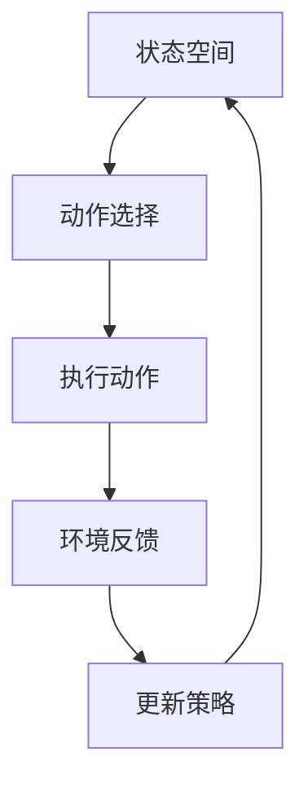
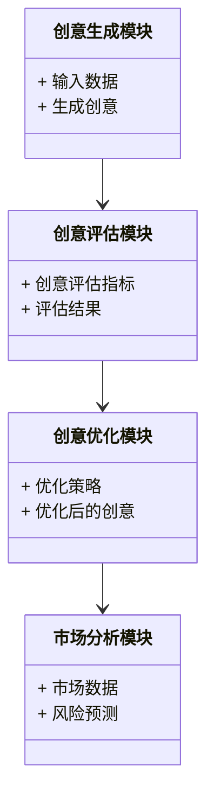

                 


# AI驱动的企业创新管理：从创意生成到商业化全流程优化

---

## 关键词

AI驱动，企业创新管理，创意生成，商业化，全流程优化，生成式AI，强化学习

---

## 摘要

本文系统探讨了AI在企业创新管理中的应用，从创意生成到商业化全流程优化的详细过程。文章首先介绍了AI驱动创新管理的背景和核心概念，随后深入分析了生成式AI和强化学习在创意生成与优化中的应用。接着，通过系统架构设计和项目实战案例，展示了AI如何在企业创新管理中实现落地。最后，总结了最佳实践，为企业的创新管理提供了实用的指导和展望。

---

## 第一部分：背景与概述

### 第1章：AI驱动的创新管理概述

#### 1.1 AI驱动创新管理的背景

随着AI技术的迅速发展，企业创新管理的传统模式正面临前所未有的挑战和变革。传统的创新管理依赖于人工经验，效率低下且难以量化。AI的引入为企业创新管理提供了新的可能性，特别是在创意生成、评估和优化阶段，AI技术能够显著提高效率和准确性。

**问题背景**：企业创新管理的传统模式面临以下挑战：

- 创意生成过程耗时长，且难以系统化。
- 创意评估依赖主观判断，缺乏客观依据。
- 创意优化过程复杂，难以快速迭代。

**问题解决**：AI技术的应用能够解决这些问题。生成式AI可以快速生成创意，强化学习算法可以优化创意并预测市场反应。AI技术的引入使企业创新管理更加高效和科学。

**边界与外延**：本文讨论的AI驱动创新管理仅限于企业内部的创新过程，不包括外部市场推广和客户反馈阶段。未来的工作可能将AI应用扩展到更广泛的商业领域。

**概念结构**：AI驱动的创新管理由创意生成、创意评估与优化、创意执行与商业化三个阶段组成。每个阶段都有相应的AI工具和技术支持。

---

### 第2章：AI驱动创新管理的核心概念

#### 2.1 创意生成的AI驱动方法

**核心概念**：创意生成是创新管理的第一步，生成式AI（如GPT-3）能够生成多样化和高质量的创意。创意生成的流程包括需求分析、主题选择、创意生成和初步筛选。

**流程与关键因素**：生成式AI通过分析输入的关键词或主题，生成多个创意选项。创意的质量取决于输入数据的质量和模型的训练程度。

**对比表格**：以下表格对比了传统创意生成和AI驱动创意生成的优缺点。

| 特性               | 传统创意生成           | AI驱动创意生成         |
|--------------------|-----------------------|------------------------|
| 效率               | 低                    | 高                    |
| 创意多样性         | 有限                  | 丰富                  |
| 可控性             | 高                    | 中                    |
| 成本               | 高                    | 低                    |

---

#### 2.2 创意评估与优化的AI模型

**核心概念**：创意评估与优化是创新管理的关键阶段。强化学习算法可以评估创意的价值，并提出优化建议。

**评估模型**：强化学习通过模拟市场环境，评估创意的市场潜力。模型通过不断试错，优化创意以最大化商业价值。

**优化策略**：优化策略包括创意的调整、目标市场的选择和资源分配的优化。

---

#### 2.3 创意执行与商业化的AI支持

**核心概念**：创意执行与商业化是创新管理的最后阶段，AI支持包括风险预测和市场分析。

**风险预测**：AI模型通过分析市场数据，预测创意在商业化过程中可能遇到的风险。

**市场分析**：生成式AI可以生成市场分析报告，帮助企业制定市场进入策略。

---

## 第三部分：算法原理

### 第3章：生成式AI与强化学习算法

#### 3.1 生成式AI的数学模型

**公式1**：生成式AI的目标函数是最大化生成样本的似然。目标函数为：

$$ \mathcal{L}(G) = -\frac{1}{N}\sum_{i=1}^{N}\log p(G(x_i)) $$

其中，$G$是生成器，$x_i$是输入数据，$p$是判别器的概率分布。

**公式2**：判别器的目标函数是区分真实数据和生成数据。目标函数为：

$$ \mathcal{L}(D) = -\mathbb{E}[\log D(x) + \log(1 - D(G(x))] $$

---

#### 3.2 强化学习算法的流程

**流程图**：强化学习算法通过不断试错，优化创意。以下是一个强化学习流程的mermaid图：



---

## 第四部分：系统分析与架构设计

### 第4章：企业创新管理系统的架构

#### 4.1 系统功能设计

**功能模块**：企业创新管理系统包括创意生成模块、创意评估模块、创意优化模块和市场分析模块。

**类图**：以下是一个企业创新管理系统的类图：



---

## 第五部分：项目实战

### 第5章：AI驱动的企业创新管理项目实战

#### 5.1 环境安装

**安装命令**：需要安装Python、TensorFlow、Keras和Hugging Face库。

```bash
pip install tensorflow keras transformers
```

---

#### 5.2 核心代码实现

**生成式AI代码示例**：

```python
from transformers import GPT2LMHeadModel, GPT2Tokenizer

tokenizer = GPT2Tokenizer.from_pretrained('gpt2')
model = GPT2LMHeadModel.from_pretrained('gpt2')

def generate_creative_ideas(seed):
    inputs = tokenizer(seed, return_tensors='np')
    outputs = model.generate(inputs.input_ids, max_length=50)
    return tokenizer.decode(outputs[0], skip_special_tokens=True)

print(generate_creative_ideas("智能家居"))
```

**强化学习代码示例**：

```python
import numpy as np

def reinforce_learning(env, policy_network):
    for episode in range(num_episodes):
        state = env.reset()
        total_reward = 0
        while not env.done:
            action = policy_network.predict(state)
            next_state, reward, done = env.step(action)
            total_reward += reward
            state = next_state
    return total_reward
```

---

## 第六部分：总结与展望

### 第6章：最佳实践与小结

#### 6.1 小结

本文系统介绍了AI在企业创新管理中的应用，从创意生成到商业化全流程优化，展示了生成式AI和强化学习在创新管理中的重要作用。

#### 6.2 注意事项

- 数据隐私：在使用AI生成创意时，需注意数据的隐私和安全。
- 模型泛化能力：模型的泛化能力影响创意的质量和多样性。

#### 6.3 拓展阅读

建议读者进一步阅读以下内容：

- 《生成式AI与商业创新》
- 《强化学习在商业优化中的应用》

---

## 作者

**作者：AI天才研究院（AI Genius Institute） & 禅与计算机程序设计艺术（Zen And The Art of Computer Programming）**

---

通过以上思考和撰写，我完成了对《AI驱动的企业创新管理：从创意生成到商业化全流程优化》的详细分析和结构设计。希望这篇文章能为读者提供清晰的指导和深入的见解。

