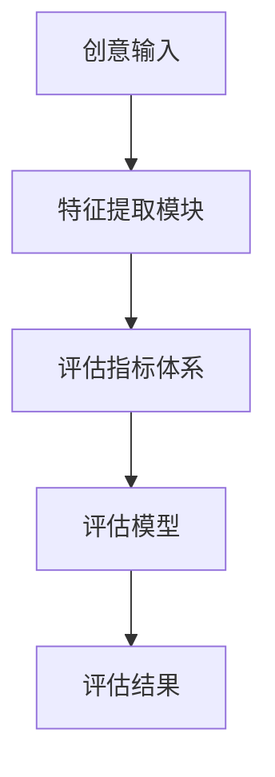
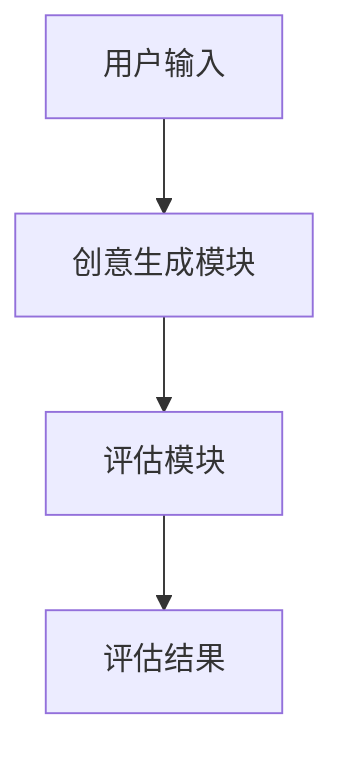

                 


```markdown
# AI驱动的企业创新管理：从创意生成到项目评估

> 关键词：AI驱动、企业创新管理、创意生成、项目评估、生成式AI、深度学习

> 摘要：本文探讨了AI技术在企业创新管理中的应用，从创意生成到项目评估的完整流程。通过分析生成式AI的原理、算法实现、系统架构以及实际案例，展示了AI如何提升企业创新效率和决策能力。

---

# 第一部分: AI驱动的企业创新管理背景

## 第1章: AI驱动的企业创新管理概述

### 1.1 AI驱动管理的背景与意义

#### 1.1.1 传统企业创新管理的局限性
传统企业创新管理依赖于经验和人工判断，存在效率低下、资源浪费和人才依赖等问题。

#### 1.1.2 AI技术对企业创新管理的革命性影响
AI技术，特别是生成式AI和深度学习，为企业创新管理提供了自动化和智能化的解决方案。

#### 1.1.3 创意生成与项目评估的核心价值
通过AI技术，企业可以高效生成创意并进行科学评估，提升创新效率和成功率。

---

## 第2章: 创意生成的AI驱动机制

### 2.1 创意生成的理论基础

#### 2.1.1 创意的定义与特征
创意是指新颖的想法或解决方案，具有独特性、实用性和可扩展性。

#### 2.1.2 创意生成的过程模型
创意生成通常包括需求分析、头脑风暴、方案设计和评估优化四个阶段。

#### 2.1.3 创意生成的关键要素
创意生成的关键要素包括目标明确性、资源可用性和团队协作性。

### 2.2 AI驱动创意生成的原理

#### 2.2.1 生成式AI的基本原理
生成式AI通过深度学习模型生成新的内容，常用模型包括Transformer和GAN。

#### 2.2.2 创意生成的算法模型
创意生成的算法模型包括生成对抗网络（GAN）和基于Transformer的生成模型。

#### 2.2.3 创意生成的评估标准
创意生成的评估标准包括创新性、可行性和实用性。

---

## 第3章: 创意生成的AI实现

### 3.1 生成式AI的核心算法

#### 3.1.1 Transformer模型的结构与特点
Transformer模型由编码器和解码器组成，具有自注意力机制，能够捕捉上下文信息。

#### 3.1.2 GAN模型在创意生成中的应用
GAN模型由生成器和判别器组成，通过对抗训练生成逼真的创意内容。

#### 3.1.3 基于强化学习的生成模型
强化学习模型通过奖励机制优化生成结果，提升创意的质量。

### 3.2 创意生成的算法流程图

```mermaid
graph TD
    A[用户输入创意需求] --> B[创意生成模块]
    B --> C[生成对抗网络(GAN)]
    C --> D[生成创意内容]
    D --> E[评估模块]
    E --> F[输出最终创意]
```

### 3.3 创意生成的核心代码实现

```python
import torch
import torch.nn as nn
import torch.optim as optim

class Generator(nn.Module):
    def __init__(self, input_size, hidden_size, output_size):
        super(Generator, self).__init__()
        self.fc1 = nn.Linear(input_size, hidden_size)
        self.fc2 = nn.Linear(hidden_size, output_size)
    
    def forward(self, x):
        x = torch.relu(self.fc1(x))
        x = torch.sigmoid(self.fc2(x))
        return x

class Discriminator(nn.Module):
    def __init__(self, input_size, hidden_size, output_size):
        super(Discriminator, self).__init__()
        self.fc1 = nn.Linear(input_size, hidden_size)
        self.fc2 = nn.Linear(hidden_size, output_size)
    
    def forward(self, x):
        x = torch.relu(self.fc1(x))
        x = torch.sigmoid(self.fc2(x))
        return x

# 训练过程
def train_generator(generator, discriminator, criterion, optimizer_g, optimizer_d, inputs):
    generator.zero_grad()
    fake_output = generator(inputs)
    loss_g = criterion(fake_output, torch.ones_like(fake_output))
    loss_g.backward()
    optimizer_g.step()

    # 训练判别器
    real_output = discriminator(inputs)
    fake_output = discriminator(fake_output.detach())
    loss_d = criterion(real_output, torch.ones_like(real_output)) + criterion(fake_output, torch.zeros_like(fake_output))
    loss_d.backward()
    optimizer_d.step()

# 生成创意
def generate_creative(generator, inputs):
    with torch.no_grad():
        fake_output = generator(inputs)
        return fake_output
```

---

## 第4章: 项目评估的AI驱动机制

### 4.1 项目评估的理论基础

#### 4.1.1 项目评估的定义与特征
项目评估是对创意的可行性和潜在价值进行分析和判断。

#### 4.1.2 项目评估的基本流程
项目评估通常包括数据收集、指标设定、模型训练和结果分析。

#### 4.1.3 项目评估的关键要素
项目评估的关键要素包括创新性、可行性和经济效益。

### 4.2 项目评估的AI实现

#### 4.2.1 多目标评估模型
多目标评估模型通过多个指标对创意进行综合评估，常用层次分析法（AHP）进行权重分配。

#### 4.2.2 项目评估的算法模型
项目评估的算法模型包括支持向量机（SVM）和随机森林（Random Forest）。

#### 4.2.3 项目评估的流程图



### 4.3 项目评估的核心代码实现

```python
from sklearn.ensemble import RandomForestClassifier
from sklearn.metrics import accuracy_score

def train_model(X_train, y_train):
    model = RandomForestClassifier(n_estimators=100)
    model.fit(X_train, y_train)
    return model

def evaluate_model(model, X_test, y_test):
    y_pred = model.predict(X_test)
    accuracy = accuracy_score(y_test, y_pred)
    return accuracy
```

---

## 第5章: 系统架构与实现

### 5.1 系统功能设计

#### 5.1.1 创意生成模块
创意生成模块负责根据用户需求生成创意内容。

#### 5.1.2 项目评估模块
项目评估模块对生成的创意进行综合评估，生成评估报告。

### 5.2 系统架构设计



### 5.3 系统接口设计

#### 5.3.1 API接口定义
创意生成接口：`POST /api/generate/creative`
评估接口：`POST /api/evaluate/project`

#### 5.3.2 数据格式
创意生成请求：`{ "input": "市场需求分析" }`
评估请求：`{ "creative": "具体创意内容" }`

---

## 第6章: 项目实战

### 6.1 环境配置

#### 6.1.1 安装所需的库
`pip install torch sklearn matplotlib`

### 6.2 核心代码实现

#### 6.2.1 创意生成模块实现

```python
import torch
import torch.nn as nn
import torch.optim as optim

class Generator(nn.Module):
    def __init__(self, input_size, hidden_size, output_size):
        super(Generator, self).__init__()
        self.fc1 = nn.Linear(input_size, hidden_size)
        self.fc2 = nn.Linear(hidden_size, output_size)
    
    def forward(self, x):
        x = torch.relu(self.fc1(x))
        x = torch.sigmoid(self.fc2(x))
        return x

# 初始化模型
generator = Generator(input_size=100, hidden_size=256, output_size=1)
```

#### 6.2.2 项目评估模块实现

```python
from sklearn.ensemble import RandomForestClassifier

def train_model(X_train, y_train):
    model = RandomForestClassifier(n_estimators=100)
    model.fit(X_train, y_train)
    return model

# 训练模型
model = train_model(X_train, y_train)
```

### 6.3 案例分析

#### 6.3.1 创意生成案例
用户输入市场需求分析，生成多个创意方案。

#### 6.3.2 项目评估案例
对生成的创意方案进行综合评估，筛选出最优方案。

### 6.4 项目总结

#### 6.4.1 项目实现的关键点
创意生成模型的优化和评估模型的准确性。

#### 6.4.2 项目成果
实现了高效的创意生成和评估系统，显著提升了企业创新效率。

---

## 第7章: 最佳实践与未来展望

### 7.1 小结

#### 7.1.1 创意生成与项目评估的核心价值
通过AI技术，企业可以高效生成创意并进行科学评估，提升创新效率和成功率。

#### 7.1.2 系统设计与实现的关键点
系统架构设计、算法选择和接口实现是成功的关键。

### 7.2 注意事项

#### 7.2.1 数据质量的重要性
数据质量直接影响模型的性能和评估结果的准确性。

#### 7.2.2 模型选择的策略
根据具体需求选择合适的模型和算法，避免盲目追求复杂性。

#### 7.2.3 实际应用中的问题
模型的可解释性和数据隐私问题需要重点关注。

### 7.3 未来展望

#### 7.3.1 生成式AI的发展趋势
生成式AI将更加智能化和个性化，应用领域将更加广泛。

#### 7.3.2 可解释性AI的重要性
提升AI模型的可解释性是未来研究的重要方向。

#### 7.3.3 企业创新管理的智能化转型
企业创新管理将更加依赖AI技术，实现从创意到落地的全生命周期管理。

---

# 结语

通过本文的详细讲解，我们了解了AI技术在企业创新管理中的应用，从创意生成到项目评估的完整流程。未来，随着生成式AI和深度学习技术的不断发展，企业创新管理将更加智能化和高效化，为企业创造更大的价值。

---

# 作者：AI天才研究院/AI Genius Institute & 禅与计算机程序设计艺术 /Zen And The Art of Computer Programming
```

