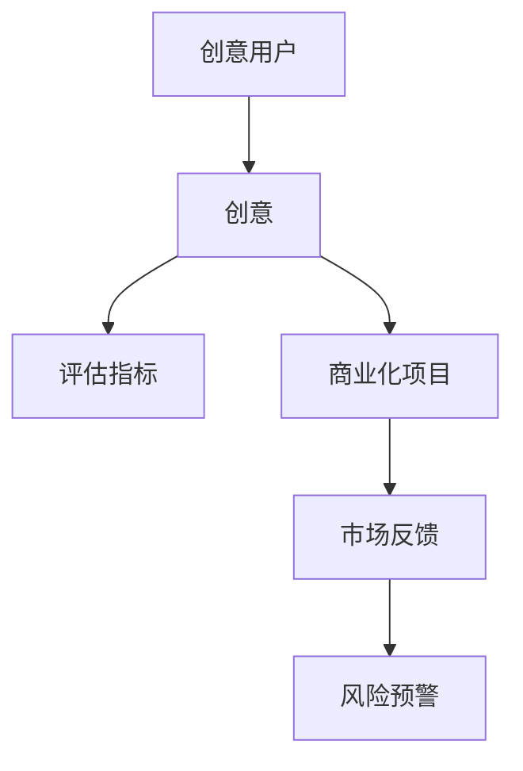
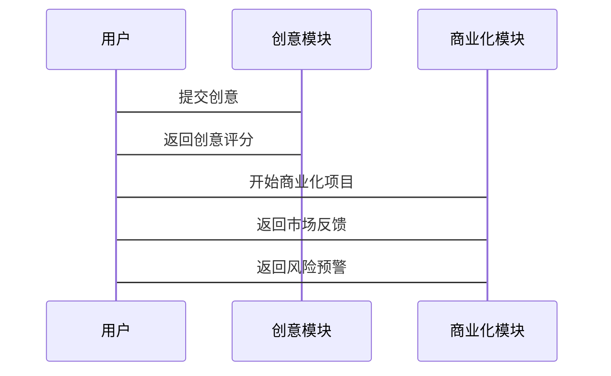

                 


# AI驱动的企业创新管理：从创意评估到商业化追踪

> 关键词：AI驱动、企业创新管理、创意评估、商业化追踪、系统架构、算法原理、项目实战

> 摘要：  
本文深入探讨了AI技术如何赋能企业创新管理，从创意评估到商业化追踪的完整流程。文章首先分析了传统创新管理的痛点与挑战，然后详细阐述了AI在其中的应用潜力与核心价值。通过系统架构设计、算法原理解析、项目实战与案例分析，本文展示了如何利用AI技术提升企业创新效率与成功率。最后，文章总结了AI驱动创新管理的最佳实践与未来发展方向。

---

## 第一部分：AI驱动的企业创新管理背景

### 第1章：企业创新管理的现状与挑战

#### 1.1 创新管理的痛点与挑战
企业创新管理是推动企业持续发展的核心动力，但在实际操作中面临诸多挑战：
- **创意评估的主观性**：传统评估方式依赖人工判断，存在主观性强、效率低下的问题。
- **创新过程的不确定性**：从创意到商业化的过程充满不确定性，难以量化和预测。
- **数据孤岛问题**：各部门之间的数据分散，难以形成有效的协同与反馈机制。

#### 1.2 AI技术的推动作用
AI技术的快速发展为企业创新管理带来了新的可能性：
- **数据驱动的决策支持**：通过AI算法分析海量数据，提供客观的评估依据。
- **自动化与智能化**：AI能够自动筛选、优化创意，并实时追踪商业化过程中的关键指标。
- **全局优化**：AI能够从整体视角优化创新资源的分配，提升创新效率。

---

## 第二部分：AI驱动创新管理的核心概念与联系

### 第2章：创意评估与商业化追踪的核心要素

#### 2.1 创意评估的关键指标
创意评估需要考虑以下几个核心指标：
- **创新性**：创意的独特性和原创性。
- **可行性**：创意在技术、资源、市场等方面的实现难度。
- **市场潜力**：创意的市场需求和商业价值。

#### 2.2 商业化追踪的步骤与目标
商业化追踪的目标是确保创意能够顺利落地，并实现商业价值：
- **项目监控**：实时跟踪项目的进展和关键节点。
- **风险预警**：通过数据分析预测潜在风险并提出解决方案。
- **绩效评估**：评估项目的最终成果与预期目标的匹配度。

#### 2.3 创意评估与商业化追踪的关联性
创意评估是创新管理的起点，而商业化追踪则是创意落地的关键保障。两者相辅相成，共同推动企业的创新进程。

### 第3章：AI驱动创新管理的系统架构

#### 3.1 创意评估模块的ER实体关系图
创意评估模块涉及的主要实体包括：
- 用户：提出创意的人员或团队。
- 创意：具体的创意内容及其相关信息。
- 评估指标：用于评估创意的核心维度。

```mermaid
er
actor 创意用户 {
  id: int
  username: string
  department: string
}
actor 创意 {
  id: int
  title: string
  description: string
  submitter_id: int
  submission_time: datetime
}
actor 评估指标 {
  id: int
  name: string
  weight: float
}
```

#### 3.2 商业化追踪模块的系统架构图
商业化追踪模块需要与创意评估模块紧密配合，确保创意的顺利落地。



---

## 第三部分：AI驱动创新管理的算法原理

### 第4章：创意评估的算法实现

#### 4.1 创意评分模型
创意评分模型基于机器学习算法，综合考虑创新性、可行性和市场潜力。

$$ \text{创意评分} = f(\text{创新性} \times 0.4 + \text{可行性} \times 0.3 + \text{市场潜力} \times 0.3) $$

#### 4.2 创意评分的实现步骤
1. 数据收集：收集创意的相关数据，包括文本描述、技术参数等。
2. 特征提取：提取创意的创新性、可行性和市场潜力特征。
3. 模型训练：使用机器学习算法（如随机森林或神经网络）训练创意评分模型。
4. 评分输出：根据模型预测结果输出创意评分。

### 第5章：商业化追踪的算法实现

#### 5.1 市场反馈分析
市场反馈分析基于深度学习算法，实时分析市场数据，预测商业化成功的概率。

$$ \text{商业化成功概率} = g(\text{市场需求} \times 0.4 + \text{竞争环境} \times 0.3 + \text{项目执行度} \times 0.3) $$

#### 5.2 风险预警机制
风险预警机制通过分析项目进展数据和市场反馈，预测潜在风险并提出应对策略。

---

## 第四部分：AI驱动创新管理的系统架构设计

### 第6章：系统功能设计

#### 6.1 创意评估模块的功能需求
- 用户提交创意：用户可以通过系统提交创意，并填写相关描述。
- 自动化评分：系统基于算法模型对创意进行自动化评分。
- 反馈与优化：用户可以根据评分结果优化创意内容。

#### 6.2 商业化追踪模块的功能需求
- 项目监控：实时跟踪项目的进展和关键节点。
- 市场反馈分析：分析市场数据，预测商业化成功的概率。
- 风险预警：基于数据分析预测潜在风险并提出解决方案。

#### 6.3 系统交互流程


---

## 第五部分：项目实战与案例分析

### 第7章：项目环境安装与配置

#### 7.1 环境搭建
- **Python版本**：建议使用Python 3.8或以上版本。
- **依赖库安装**：安装必要的库，如`scikit-learn`、`tensorflow`、`pandas`等。

#### 7.2 代码实现
以下是创意评估模块的Python代码示例：

```python
import numpy as np
from sklearn.ensemble import RandomForestRegressor

# 数据准备
features = np.array([[85, 70, 90], [70, 85, 80], [90, 60, 85]])
labels = np.array([95, 85, 90])

# 模型训练
model = RandomForestRegressor(n_estimators=100)
model.fit(features, labels)

# 预测评分
new_feature = np.array([[80, 80, 85]])
predicted_score = model.predict(new_feature)
print("创意评分:", predicted_score[0])
```

---

## 第六部分：总结与展望

### 第8章：最佳实践与小结

#### 8.1 最佳实践 tips
- 数据质量是关键：确保数据的准确性和完整性。
- 模型调优：根据实际情况不断优化模型参数。
- 保持数据更新：及时更新市场数据和项目反馈，提升模型的预测精度。

#### 8.2 项目小结与未来展望
本文详细探讨了AI技术在企业创新管理中的应用，从创意评估到商业化追踪的完整流程。未来，随着AI技术的不断进步，企业创新管理将更加智能化、数据化和高效化。

---

**作者：AI天才研究院（AI Genius Institute） & 禅与计算机程序设计艺术（Zen And The Art of Computer Programming）**

