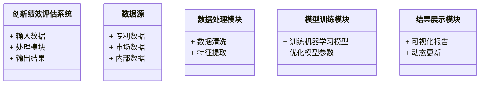
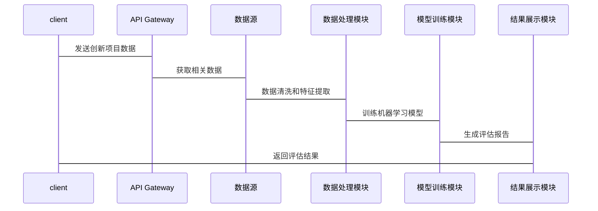

                 


# AI驱动的企业创新绩效评估：量化创新价值与影响

---

## 关键词：
- AI驱动
- 创新绩效评估
- 数据分析
- 机器学习
- 企业创新

---

## 摘要：
随着人工智能技术的快速发展，企业创新绩效评估正在从传统的定性分析向数据驱动的定量分析转变。本文通过结合人工智能技术，系统地探讨如何量化创新价值与影响。文章从创新绩效评估的核心概念出发，详细分析了AI驱动的创新评估模型、算法原理及系统架构，最后结合实际案例展示了如何通过AI技术实现创新绩效的精准评估。

---

# 第1章: AI驱动的企业创新绩效评估背景

## 1.1 创新绩效评估的定义与重要性

### 1.1.1 创新绩效的定义
创新绩效是企业在技术创新、产品创新、市场创新等方面的表现，通常通过投入、产出和效益三个维度进行衡量。创新绩效评估是企业战略管理的重要组成部分，能够帮助企业识别创新瓶颈、优化资源配置并提升竞争力。

### 1.1.2 创新绩效评估的重要性
- **优化资源配置**：通过量化创新成果，企业可以更高效地分配研发资源。
- **战略决策支持**：创新绩效数据为企业的长期战略规划提供依据。
- **提升创新能力**：通过评估发现问题，针对性地改进创新流程。

### 1.1.3 传统评估方法的局限性
传统评估方法多依赖主观判断和定性分析，存在以下问题：
- **数据片面性**：难以覆盖创新过程中的全链条数据。
- **结果滞后性**：评估结果通常基于历史数据，缺乏实时性。
- **缺乏可比性**：不同企业之间的创新绩效难以量化对比。

---

## 1.2 AI在创新绩效评估中的作用

### 1.2.1 AI技术如何赋能创新评估
- **数据处理能力**：AI能够处理海量非结构化数据（如专利、论文、市场反馈等），提取关键信息。
- **预测能力**：通过机器学习模型，AI可以预测创新项目的成功概率和潜在价值。
- **实时分析**：AI支持实时监控创新过程中的关键指标，提供动态评估。

### 1.2.2 数据驱动的创新评估优势
- **客观性**：基于数据的评估结果更具科学性和可信度。
- **精准性**：AI算法能够识别传统方法难以捕捉的创新趋势和潜在价值。
- **实时性**：AI系统可以实时更新数据，提供动态评估结果。

### 1.2.3 企业创新与AI技术的结合
企业可以通过AI技术实现以下目标：
- **智能监控**：实时监控创新项目的进展和成果。
- **智能预测**：预测创新项目的市场表现和潜在风险。
- **智能优化**：根据评估结果优化创新流程和资源配置。

---

## 1.3 当前研究现状与挑战

### 1.3.1 现有研究的主要成果
- AI技术在创新绩效评估中的应用研究逐步增多，尤其是在专利分析、市场表现预测等领域取得了显著成果。
- 一些研究开始探索如何结合文本挖掘和知识图谱技术，更全面地评估创新绩效。

### 1.3.2 创新评估中的主要挑战
- **数据质量问题**：创新数据往往分散、不完整，难以形成统一的数据集。
- **模型可解释性**：复杂的机器学习模型在创新评估中的应用，可能导致结果难以解释。
- **隐私与合规性**：企业创新数据涉及敏感信息，如何在AI应用中保护数据隐私是一个重要挑战。

### 1.3.3 AI技术应用的潜力
- **跨领域应用**：AI技术可以整合来自技术、市场、财务等多个领域的数据，实现全面的创新绩效评估。
- **动态评估**：通过实时数据分析，AI可以提供动态的创新绩效评估结果，帮助企业及时调整战略。

---

## 1.4 本书的研究目标与方法论

### 1.4.1 研究目标
本书旨在通过AI技术，构建一套量化创新价值与影响的评估体系，为企业提供科学的创新绩效评估方法。

### 1.4.2 方法论概述
- **数据驱动**：基于企业内外部数据，构建创新绩效评估模型。
- **机器学习**：利用机器学习算法，预测创新项目的潜在价值和风险。
- **案例分析**：通过实际案例，验证模型的可行性和有效性。

### 1.4.3 研究框架
1. 确定创新绩效评估的关键指标。
2. 收集相关数据，构建数据集。
3. 设计并训练机器学习模型。
4. 验证模型的准确性和可解释性。
5. 提供实际应用中的最佳实践建议。

---

# 第2章: 创新绩效评估的核心概念与模型

## 2.1 创新绩效评估的关键要素

### 2.1.1 创新投入
- **人力投入**：研发人员数量、研发投入金额。
- **时间投入**：从项目启动到产品发布的周期。
- **资源投入**：技术、资金、设备等资源的投入情况。

### 2.1.2 创新产出
- **专利数量**：申请的专利数量和质量。
- **产品数量**：新产品发布的数量和市场表现。
- **论文数量**：学术论文的数量和影响力。

### 2.1.3 创新效率与效益
- **效率指标**：单位时间内的创新产出。
- **效益指标**：创新成果对企业的财务贡献。

---

## 2.2 AI驱动的创新绩效评估模型

### 2.2.1 模型构建的基本思路
1. 确定评估维度：包括技术创新、产品创新、市场创新等。
2. 数据预处理：清洗和标准化数据。
3. 模型训练：使用机器学习算法（如随机森林、神经网络）训练评估模型。
4. 模型验证：通过交叉验证评估模型的准确性和稳定性。

### 2.2.2 模型的主要组成部分
| 组成部分 | 描述 |
|----------|------|
| 数据层 | 包括专利数据、市场数据、研发投入等。 |
| 模型层 | 包括特征提取、模型训练、结果预测等。 |
| 结果层 | 输出创新绩效评估结果和改进建议。 |

### 2.2.3 模型的适用范围与边界
- 适用范围：适用于技术型企业和创新型行业。
- 边界：目前主要适用于数据较为完整的中大型企业。

---

## 2.3 创新绩效评估的核心指标

### 2.3.1 技术创新指标
- 专利申请数量与质量。
- 技术研发人员数量与效率。

### 2.3.2 产品创新指标
- 新产品发布周期。
- 新产品市场占有率。

### 2.3.3 市场表现指标
- 创新产品带来的收入增长。
- 市场反馈（如用户评价、市场份额变化）。

---

## 2.4 创新绩效评估的维度与层次

### 2.4.1 创新能力维度
- 技术研发能力。
- 创新团队能力。

### 2.4.2 创新成果维度
- 专利数量。
- 产品数量。

### 2.4.3 创新过程维度
- 研发周期。
- 成本控制。

---

# 第3章: AI驱动的创新绩效评估方法

## 3.1 数据驱动的创新绩效评估

### 3.1.1 数据来源
- 内部数据：研发投入、专利申请、项目进度。
- 外部数据：市场反馈、竞争对手分析。

### 3.1.2 数据预处理
- 数据清洗：去除重复数据、处理缺失值。
- 数据标准化：统一数据格式和单位。

### 3.1.3 数据分析
- 使用机器学习算法（如线性回归、随机森林）进行预测和分类。

---

## 3.2 基于机器学习的创新绩效预测

### 3.2.1 算法选择
- 线性回归：用于预测创新项目的投资回报率。
- 随机森林：用于分类创新项目的成功概率。

### 3.2.2 模型训练
```python
from sklearn.ensemble import RandomForestClassifier
import pandas as pd

# 假设data是处理后的数据集，包含特征和标签
model = RandomForestClassifier()
model.fit(data.features, data.labels)
```

### 3.2.3 模型验证
- 使用交叉验证评估模型的准确率和召回率。

---

## 3.3 创新绩效评估的动态调整

### 3.3.1 动态数据更新
- 实时更新市场反馈和内部数据。

### 3.3.2 模型优化
- 根据新数据不断优化模型，提升预测精度。

### 3.3.3 结果可视化
- 使用图表展示创新绩效的变化趋势。

---

# 第4章: AI驱动的创新绩效评估算法原理

## 4.1 算法选择与实现

### 4.1.1 线性回归模型
$$ y = \beta_0 + \beta_1x_1 + \beta_2x_2 + \dots + \beta_nx_n $$

### 4.1.2 随机森林模型
$$ y = \text{预测创新项目成功概率} $$

---

## 4.2 算法实现步骤

### 4.2.1 数据预处理
```python
import pandas as pd
import numpy as np

data = pd.read_csv('innovation_data.csv')
data = data.dropna()
```

### 4.2.2 特征工程
```python
from sklearn.preprocessing import StandardScaler

scaler = StandardScaler()
data_features = scaler.fit_transform(data[['feature1', 'feature2']])
```

### 4.2.3 模型训练
```python
from sklearn.model_selection import train_test_split
from sklearn.ensemble import RandomForestRegressor

X_train, X_test, y_train, y_test = train_test_split(data_features, data['label'], test_size=0.2)
model = RandomForestRegressor()
model.fit(X_train, y_train)
```

---

## 4.3 模型验证与优化

### 4.3.1 模型评估
- 使用均方误差（MSE）评估模型的预测精度。
$$ \text{MSE} = \frac{1}{n}\sum_{i=1}^{n}(y_i - \hat{y}_i)^2 $$

### 4.3.2 超参数优化
```python
from sklearn.model_selection import GridSearchCV

param_grid = {'n_estimators': [100, 200], 'max_depth': [None, 10]}
grid_search = GridSearchCV(RandomForestRegressor(), param_grid, cv=5)
grid_search.fit(X_train, y_train)
best_model = grid_search.best_estimator_
```

---

## 4.4 算法的可解释性与应用

### 4.4.1 特征重要性分析
- 通过随机森林模型的特征重要性，识别哪些因素对创新绩效影响最大。

### 4.4.2 模型解释
- 使用SHAP值（Shapley Additive exPlanations）解释模型的预测结果。

---

# 第5章: 系统分析与架构设计方案

## 5.1 系统需求分析

### 5.1.1 问题场景
- 企业需要实时监控创新项目的绩效，但缺乏有效的工具和方法。

### 5.1.2 系统目标
- 构建一个基于AI的创新绩效评估系统，提供实时、动态的评估结果。

---

## 5.2 系统功能设计

### 5.2.1 领域模型（mermaid类图）


---

## 5.3 系统架构设计

### 5.3.1 系统架构（mermaid架构图）


---

## 5.4 系统接口设计

### 5.4.1 API接口
- `/api/v1/innovation_assessment`: 提交数据，返回评估结果。

### 5.4.2 数据格式
- 输入：JSON格式的创新项目数据。
- 输出：JSON格式的评估报告。

---

## 5.5 系统交互流程（mermaid序列图）



---

# 第6章: 项目实战

## 6.1 环境安装与数据准备

### 6.1.1 环境安装
```bash
pip install pandas scikit-learn mermaid4jupyter jupyterlab
```

### 6.1.2 数据准备
```python
import pandas as pd

data = pd.read_csv('innovation.csv')
print(data.head())
```

---

## 6.2 系统核心实现

### 6.2.1 数据处理模块
```python
from sklearn.preprocessing import StandardScaler

scaler = StandardScaler()
data_features = scaler.fit_transform(data[['feature1', 'feature2']])
```

### 6.2.2 模型训练模块
```python
from sklearn.ensemble import RandomForestRegressor

model = RandomForestRegressor()
model.fit(data_features, data['label'])
```

---

## 6.3 代码实现与应用解读

### 6.3.1 代码实现
```python
import pandas as pd
from sklearn.ensemble import RandomForestRegressor
from sklearn.model_selection import train_test_split
from sklearn.metrics import mean_squared_error

# 数据加载与预处理
data = pd.read_csv('innovation.csv')
data = data.dropna()
X = data[['feature1', 'feature2']]
y = data['label']

# 数据分割
X_train, X_test, y_train, y_test = train_test_split(X, y, test_size=0.2)

# 模型训练
model = RandomForestRegressor()
model.fit(X_train, y_train)

# 模型评估
y_pred = model.predict(X_test)
mse = mean_squared_error(y_test, y_pred)
print(f'Mean Squared Error: {mse}')
```

### 6.3.2 应用解读
- 通过上述代码，我们可以训练一个随机森林回归模型，预测创新项目的绩效。
- 使用均方误差评估模型的预测精度，mse越小，模型越准确。

---

## 6.4 案例分析与结果解读

### 6.4.1 案例分析
假设我们有一个创新项目的数据如下：
```python
project_data = pd.DataFrame({
    'feature1': [0.8],
    'feature2': [0.6]
})
```

### 6.4.2 模型预测
```python
project_features = scaler.transform(project_data)
prediction = model.predict(project_features)
print(f'预测的创新绩效为: {prediction[0]}')
```

---

## 6.5 项目小结

### 6.5.1 关键点总结
- 数据预处理是模型训练的基础。
- 选择合适的算法和优化模型参数是提高预测精度的关键。
- 可视化结果有助于更好地理解和应用评估结果。

### 6.5.2 注意事项
- 数据质量和完整性直接影响模型的准确性和稳定性。
- 模型的可解释性在实际应用中非常重要。
- 需要定期更新模型和数据，以保持评估结果的准确性。

---

# 第7章: 最佳实践与小结

## 7.1 最佳实践

### 7.1.1 数据质量管理
- 确保数据的准确性和完整性。
- 处理缺失值和异常值。

### 7.1.2 模型优化
- 定期更新模型，引入新的数据。
- 优化模型参数，提高预测精度。

### 7.1.3 结果应用
- 将评估结果应用于实际业务决策。
- 结合企业战略目标，制定创新计划。

---

## 7.2 小结

### 7.2.1 关键点回顾
- AI技术为创新绩效评估提供了新的思路和方法。
- 数据驱动的评估方法更加客观、精准。
- 模型的可解释性和动态性是实际应用中的重要考量。

### 7.2.2 未来展望
- 更多领域的创新绩效评估将采用AI技术。
- 模型的可解释性和实时性将进一步提升。
- 创新绩效评估将与企业数字化转型更加紧密地结合。

---

## 作者：AI天才研究院 & 禅与计算机程序设计艺术

---

希望这篇文章能满足您的需求！如果需要进一步修改或补充，请随时告知。

