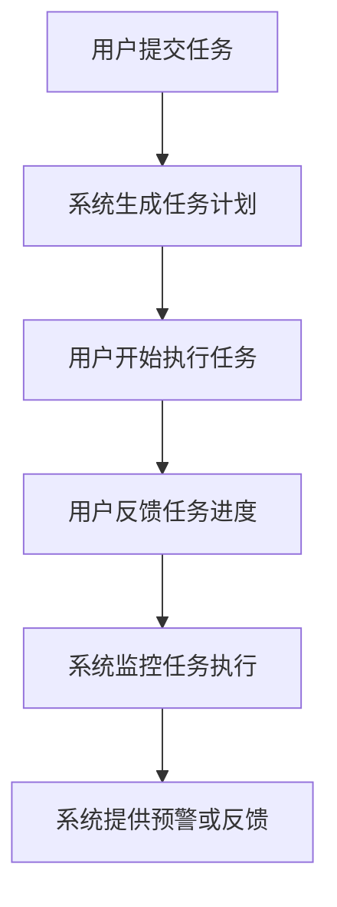

                 

# AI驱动的企业创新项目管理：从立项到商业化

## 关键词：人工智能（AI）、项目管理、创新、企业、商业化、系统架构

## 摘要：  
本文深入探讨了人工智能技术如何驱动企业创新项目管理的变革，从项目的立项、执行到商业化落地的全生命周期进行系统性分析。通过结合AI技术的核心概念、算法原理、系统架构设计以及实际项目案例，详细阐述了AI在项目管理中的应用场景、优势及实现方法，为企业创新项目管理提供了全新的思路和实践指导。

---

# 第1章: AI驱动的企业创新项目管理背景

## 1.1 企业创新项目管理的现状与挑战

### 1.1.1 传统项目管理的局限性
传统项目管理方法（如瀑布模型）在企业创新项目中面临以下问题：
- **需求变更难应对**：创新项目往往需求不明确，传统方法难以适应频繁变更。
- **效率低下**：人工审批和流程流转耗时长，资源利用率低。
- **风险预测能力弱**：缺乏数据驱动的分析，风险预警能力不足。

### 1.1.2 创新项目管理的核心问题
创新项目管理的核心挑战包括：
- 创新性与可行性的平衡：如何在追求创新的同时确保项目的可实施性。
- 多目标优化：兼顾成本、时间、质量等多维度目标。
- 复杂性与不确定性：创新项目往往涉及未知因素，增加了管理难度。

### 1.1.3 AI技术在项目管理中的应用背景
随着AI技术的快速发展，企业开始将AI应用于项目管理的各个环节，以提高效率和准确性。AI的优势包括：
- **数据驱动决策**：通过分析历史数据和实时数据，提供科学的决策支持。
- **自动化处理**：AI可以自动完成任务分配、进度跟踪等重复性工作。
- **智能预测**：利用机器学习模型预测项目进度、成本和风险。

---

## 1.2 AI驱动的创新项目管理的优势

### 1.2.1 提高项目执行效率
AI可以通过自动化工具快速处理任务，减少人工干预，显著提高项目执行效率。

### 1.2.2 增强风险预测能力
通过分析历史数据和实时数据，AI能够提前预测项目可能面临的风险，并提供应对策略。

### 1.2.3 优化资源分配
AI可以根据项目需求和资源可用性，智能分配人力、时间和预算，提高资源利用率。

---

## 1.3 本章小结

本章分析了传统项目管理的局限性，提出了创新项目管理的核心问题，并介绍了AI技术在项目管理中的应用背景及其优势。AI技术的引入为项目管理带来了新的可能性，能够显著提升企业的创新效率和成功率。

---

# 第2章: AI驱动的创新项目管理核心概念与方法论

## 2.1 项目管理的基本概念

### 2.1.1 项目管理的定义与目标
项目管理是指通过计划、执行、监控和收尾等过程，确保项目按时、按质、按预算完成。其目标包括：
- 实现项目目标。
- 控制项目成本。
- 提高项目质量。

### 2.1.2 项目管理的核心要素
项目管理的核心要素包括：
- **范围**：项目的 deliverables 和工作范围。
- **时间**：项目的进度和关键里程碑。
- **成本**：项目的预算和资金分配。
- **质量**：项目的交付成果是否符合标准。
- **资源**：项目所需的人员、设备和材料。
- **沟通**：项目相关人员之间的信息传递。
- **风险**：项目可能面临的风险及应对措施。

---

## 2.2 AI在项目管理中的应用领域

### 2.2.1 项目计划与进度管理
AI可以通过机器学习算法预测项目进度偏差，并自动调整计划。

### 2.2.2 风险管理
AI能够分析历史数据，识别潜在风险，并提供风险缓解策略。

### 2.2.3 资源分配与成本控制
AI可以根据项目需求和资源可用性，优化资源分配，降低项目成本。

---

## 2.3 本章小结

本章详细介绍了项目管理的基本概念和AI在项目管理中的应用领域，强调了AI技术在提高项目效率和降低风险方面的潜力。

---

# 第3章: 基于AI的创新项目管理方法

## 3.1 敏捷开发与AI的结合

### 3.1.1 敏捷开发的基本理念
敏捷开发是一种以迭代和增量的方式开发产品的模式，强调客户合作、快速交付和持续改进。

### 3.1.2 AI在敏捷开发中的应用
AI可以辅助敏捷团队进行任务优先级排序、自动分配任务，并实时监控团队进度。

### 3.1.3 敏捷开发与传统开发的对比
| 对比维度 | 敏捷开发 | 传统开发 |
|----------|----------|----------|
| 计划方式 | 迭代式 | 瀑布式 |
| 变更处理 | 灵活 | 固化 |
| 交付速度 | 快 | 慢 |

---

## 3.2 数据驱动的项目管理

### 3.2.1 数据驱动的决策支持
AI可以通过数据分析提供项目执行情况的实时反馈，帮助管理者做出科学决策。

### 3.2.2 数据分析在项目管理中的应用
- **预测分析**：预测项目进度、成本和风险。
- **趋势分析**：识别项目执行中的趋势和模式。
- **偏差分析**：分析实际与计划的偏差，提出改进措施。

### 3.2.3 数据可视化工具的选择与使用
常用数据可视化工具包括Tableau、Power BI和Google Data Studio。

---

## 3.3 本章小结

本章探讨了敏捷开发与AI的结合，以及数据驱动的项目管理方法，强调了AI技术在提高项目管理效率和决策能力方面的重要作用。

---

# 第4章: AI驱动的项目管理系统架构设计

## 4.1 系统设计目标与范围

### 4.1.1 系统目标
系统旨在通过AI技术实现项目管理的智能化，提高项目执行效率和成功率。

### 4.1.2 系统范围
系统覆盖项目立项、执行、监控和收尾四个阶段。

---

## 4.2 系统功能模块设计

### 4.2.1 项目计划模块
- 功能：自动生成项目计划，包括任务分解、时间安排和资源分配。
- 关键技术：基于AI的优化算法。

### 4.2.2 项目执行模块
- 功能：实时跟踪项目进度，自动调整计划。
- 关键技术：实时数据采集和机器学习模型。

### 4.2.3 项目监控模块
- 功能：监控项目风险，提供预警和应对策略。
- 关键技术：异常检测和预测模型。

---

## 4.3 系统架构设计

### 4.3.1 分层架构设计
- **数据层**：存储项目数据和AI模型。
- **服务层**：提供API接口，处理业务逻辑。
- **表现层**：用户界面，展示项目信息。

### 4.3.2 微服务架构设计
- **任务管理服务**：负责任务分配和进度跟踪。
- **风险管理服务**：负责风险预警和应对策略。
- **数据服务**：负责数据存储和查询。

### 4.3.3 数据流设计
- 数据从前端输入，经过服务层处理后，存储在数据库中，最终通过前端展示。

---

## 4.4 系统接口设计

### 4.4.1 API接口设计
- **任务分配接口**：`POST /api/tasks`
- **进度更新接口**：`PUT /api/tasks/{id}`
- **风险预警接口**：`GET /api/risk`

---

## 4.5 系统交互设计

### 4.5.1 系统交互流程
- 用户提交任务需求。
- 系统自动生成任务计划。
- 用户执行任务并反馈进度。
- 系统监控任务执行情况，提供预警。

### 4.5.2 交互流程图

---

## 4.6 本章小结

本章详细介绍了AI驱动的项目管理系统架构设计，包括功能模块设计、系统架构设计和系统接口设计。通过合理的架构设计，可以实现项目的智能化管理。

---

# 第5章: AI驱动的创新项目管理实战

## 5.1 项目背景与目标

### 5.1.1 项目背景
某企业计划开发一款创新性的AI客服系统，希望通过AI技术提升客户服务质量。

### 5.1.2 项目目标
- 实现AI客服系统的开发和部署。
- 提高客户满意度。
- 降低人工客服成本。

---

## 5.2 项目需求分析

### 5.2.1 功能需求
- 自然语言处理（NLP）功能：实现智能对话。
- 机器学习模型：预测客户情绪。

### 5.2.2 非功能需求
- 系统可用性：99.9%。
- 响应时间：≤2秒。

---

## 5.3 项目可行性评估

### 5.3.1 技术可行性
- 国内AI技术发展成熟，有足够的技术支撑。
- 企业已有一定的技术储备。

### 5.3.2 经济可行性
- 项目投资预算合理。
- 预计上线后可为企业带来显著收益。

---

## 5.4 项目实施计划

### 5.4.1 时间安排
| 阶段 | 时间 | 主要任务 |
|------|------|----------|
| 立项 | 1周 | 确定需求和团队 |
| 开发 | 2周 | 开发NLP模块 |
| 测试 | 1周 | 测试系统功能 |
| 部署 | 1周 | 上线运行 |

### 5.4.2 资源分配
- 开发人员：3人。
- 测试人员：1人。
- 项目经理：1人。

---

## 5.5 本章小结

本章通过一个实际案例，详细介绍了AI驱动的创新项目管理从立项到实施的全过程，强调了科学的项目管理和资源分配对项目成功的重要性。

---

# 第6章: AI驱动的创新项目管理最佳实践与注意事项

## 6.1 最佳实践

### 6.1.1 数据质量的重要性
确保数据的准确性和完整性，是AI模型有效运行的前提。

### 6.1.2 持续优化
定期评估项目管理系统的性能，根据反馈进行优化。

### 6.1.3 团队协作
加强团队协作，确保AI技术与项目管理的有机结合。

---

## 6.2 注意事项

### 6.2.1 数据隐私与安全
在使用AI技术时，必须注意数据隐私和安全问题。

### 6.2.2 技术风险
AI技术的应用可能带来技术风险，需提前制定应对措施。

### 6.2.3 人员培训
确保相关人员接受足够的培训，掌握AI工具的使用方法。

---

## 6.3 本章小结

本章总结了AI驱动的创新项目管理的最佳实践和注意事项，强调了数据质量、持续优化和团队协作的重要性。

---

# 第7章: 总结与展望

## 7.1 总结

本文系统性地探讨了AI驱动的企业创新项目管理的理论与实践，从立项、执行到商业化落地，详细介绍了AI技术在项目管理中的应用场景和优势。通过实际案例分析，展示了AI技术如何提升项目管理的效率和成功率。

---

## 7.2 展望

未来，随着AI技术的不断发展，企业创新项目管理将更加智能化和自动化。AI技术将进一步深度融合到项目管理的各个环节，为企业创新提供更强大的支持。

---

# 作者：AI天才研究院/AI Genius Institute & 禅与计算机程序设计艺术 /Zen And The Art of Computer Programming

---

感谢您的阅读！希望本文对您在AI驱动的企业创新项目管理方面有所启发！

