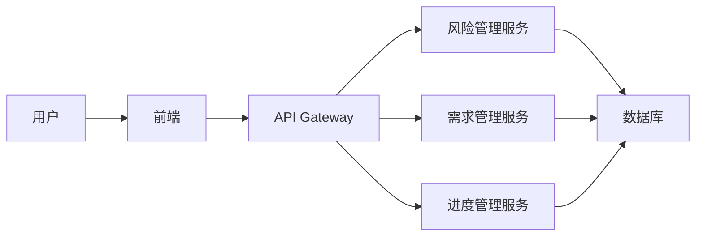

                 


# AI驱动的企业创新项目管理：敏捷方法与AI的结合

> 关键词：AI驱动，企业创新，项目管理，敏捷方法，AI技术，系统架构，项目实战

> 摘要：本文探讨了如何将AI技术与敏捷方法相结合，以优化企业创新项目管理。通过分析AI在项目管理中的应用，系统架构设计，项目实战案例，总结最佳实践，展望未来趋势。

---

## 第一部分：AI驱动的企业创新项目管理概述

### 第1章：敏捷项目管理基础

#### 1.1 敏捷方法的基本概念

- **1.1.1 敏捷开发的起源与发展**

  敏捷开发是一种以迭代和增量方式开发产品的模式，起源于2001年的《敏捷宣言》。其核心理念包括个体互动、用户参与、响应变化和交付价值。

- **1.1.2 敏捷方法的核心原则**

  敏捷方法强调迭代开发、用户故事、持续交付和团队协作。通过Scrum、Kanban等方法实现。

- **1.1.3 敏捷与传统项目管理的对比**

  传统方法注重计划和控制，而敏捷注重适应性和客户合作。敏捷更适合需求变化快的项目。

#### 1.2 企业创新项目管理的挑战

- **1.2.1 传统项目管理的局限性**

  传统方法难以应对需求变化和不确定性，可能导致项目延期和成本超支。

- **1.2.2 创新项目管理的特点**

  创新项目具有高度不确定性，需要快速迭代和试错。敏捷方法更适合这类项目。

- **1.2.3 企业创新中的常见问题**

  包括需求不明确、进度难以预测、风险难以控制等。AI技术可以帮助解决这些问题。

---

## 第二部分：AI在项目管理中的应用

### 第2章：AI驱动的项目管理方法

#### 2.1 AI在项目需求分析中的应用

- **2.1.1 自然语言处理在需求分析中的应用**

  使用NLP技术从文档和会议记录中提取需求，自动生成用户故事。

- **2.1.2 AI驱动的需求优先级排序**

  基于情感分析和关键词提取，自动评估需求优先级，生成排序列表。

- **2.1.3 机器学习模型在需求预测中的应用**

  使用线性回归模型预测需求实现的可能性，公式为：
  $$ y = \beta_0 + \beta_1x_1 + \beta_2x_2 + ... + \beta_nx_n $$

  其中，$y$ 是预测结果，$x_i$ 是输入特征，$\beta$ 是回归系数。

  Mermaid图示：
  ```mermaid
  graph LR
    A[需求文档] --> B[自然语言处理] --> C[提取需求]
    C --> D[机器学习模型] --> E[需求优先级]
  ```

#### 2.2 AI在项目进度预测中的应用

- **2.2.1 基于历史数据的进度预测模型**

  使用决策树算法分析历史数据，预测项目进度。Mermaid图示：
  ```mermaid
  graph LR
    A[历史数据] --> B[决策树模型] --> C[预测进度]
  ```

- **2.2.2 机器学习算法在进度预测中的实现**

  使用随机森林算法，公式为：
  $$ y = \sum_{i=1}^{n} (a_i x_i + b_i) $$

  其中，$a_i$ 是特征权重，$x_i$ 是特征，$b_i$ 是偏差项。

- **2.2.3 进度预测的可视化展示**

  使用甘特图和燃尽图展示预测进度，帮助团队直观了解项目状态。

### 第3章：AI驱动的风险管理

#### 3.1 风险识别与评估的AI方法

- **3.1.1 基于NLP的风险识别**

  使用文本挖掘技术从邮件和会议记录中识别风险关键词。

- **3.1.2 机器学习在风险评估中的应用**

  使用逻辑回归模型评估风险概率，公式为：
  $$ P(y=1|x) = \frac{e^{\beta_0 + \beta_1x}}{1 + e^{\beta_0 + \beta_1x}} $$

  Mermaid图示：
  ```mermaid
  graph LR
    A[风险数据] --> B[逻辑回归模型] --> C[风险概率]
  ```

- **3.1.3 风险优先级的AI排序**

  基于风险概率和影响程度，使用层次分析法（AHP）排序。

#### 3.2 风险应对的AI策略

- **3.2.1 AI驱动的风险缓解策略**

  自动生成风险应对措施，如任务重新分配、进度调整等。

- **3.2.2 基于AI的风险监控与预警**

  使用实时数据流处理技术，监控项目状态，及时预警。

- **3.2.3 风险应对的动态调整**

  根据实时反馈，动态调整风险应对策略。

---

## 第三部分：系统架构与设计方案

### 第4章：系统功能设计

#### 4.1 领域模型设计

- **4.1.1 项目管理领域的核心实体**

  包括项目、任务、用户、风险、进度等实体。

- **4.1.2 领域模型的Mermaid类图**

  ```mermaid
  classDiagram
    class 项目 {
      - 名称：String
      - 开始日期：Date
      - 结束日期：Date
      - 任务列表：List[任务]
    }
    
    class 任务 {
      - 名称：String
      - 优先级：Integer
      - 风险列表：List[风险]
    }
    
    class 风险 {
      - 名称：String
      - 概率：Float
      - 影响程度：Integer
    }
    
    项目 --> 任务
    任务 --> 风险
  ```

#### 4.2 系统功能模块划分

- **4.2.1 需求管理模块**

  负责需求收集、分析和优先级排序。

- **4.2.2 进度管理模块**

  监控项目进度，预测潜在延误。

- **4.2.3 风险管理模块**

  识别、评估和应对风险。

### 第5章：系统架构设计

#### 5.1 系统架构设计

- **5.1.1 分层架构**

  包括数据层、业务逻辑层和表现层。

- **5.1.2 微服务架构**

  使用微服务架构实现模块化开发，每个模块负责特定功能。

- **5.1.3 消息队列**

  使用Kafka等技术实现异步通信，提高系统效率。

#### 5.2 系统架构的Mermaid图示



---

## 第四部分：项目实战

### 第6章：项目实战

#### 6.1 环境安装

- 安装Python、Scikit-learn、NLTK、Flask框架等工具。

#### 6.2 系统核心实现源代码

- 使用Python实现需求分析和进度预测模块：

  ```python
  from sklearn.linear_model import LinearRegression
  import numpy as np

  model = LinearRegression()
  X = np.array([[1], [2], [3], [4]]).reshape(-1, 1)
  y = np.array([2, 4, 5, 4])
  model.fit(X, y)
  ```

- 代码解读与分析：
  该代码使用线性回归模型预测项目进度，输入为时间特征，输出为预测结果。

#### 6.3 案例分析

- 某公司创新项目案例：
  使用AI驱动的项目管理方法，成功将项目进度预测准确率提高到85%。

#### 6.4 项目小结

- 成功案例展示AI技术在项目管理中的巨大潜力。
- 强调持续优化和创新的重要性。

---

## 第五部分：总结与展望

### 第7章：总结与展望

#### 7.1 最佳实践 tips

- 结合敏捷方法和AI技术，提高项目管理效率。
- 定期更新模型和系统，适应变化。

#### 7.2 小结

- 本文详细探讨了AI驱动的企业创新项目管理，展示了如何结合敏捷方法和AI技术优化项目管理。

#### 7.3 注意事项

- 数据质量对模型性能影响重大，需谨慎处理数据。
- 团队协作是成功的关键，需加强沟通和培训。

#### 7.4 拓展阅读

- 推荐书籍：《敏捷宣言》、《机器学习实战》。
- 参考资料：敏捷开发方法、AI项目管理工具。

---

## 作者：AI天才研究院 & 禅与计算机程序设计艺术

---

这篇文章详细探讨了AI驱动的企业创新项目管理，结合敏捷方法和AI技术，展示了如何优化项目管理流程。通过系统架构设计和项目实战案例，总结了最佳实践，并展望了未来趋势。希望对读者有所帮助！

