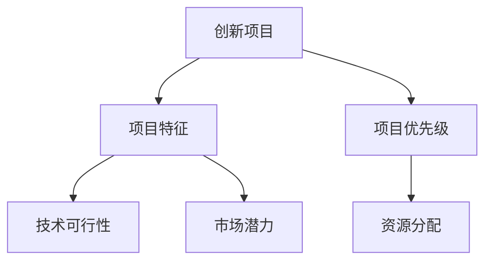
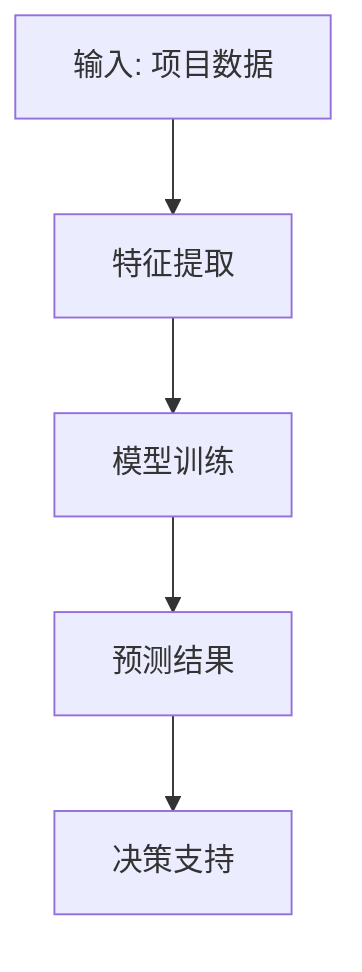
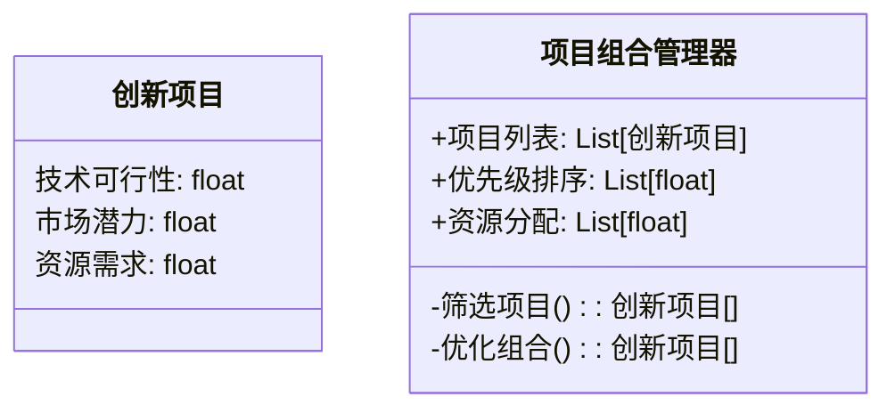
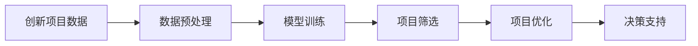
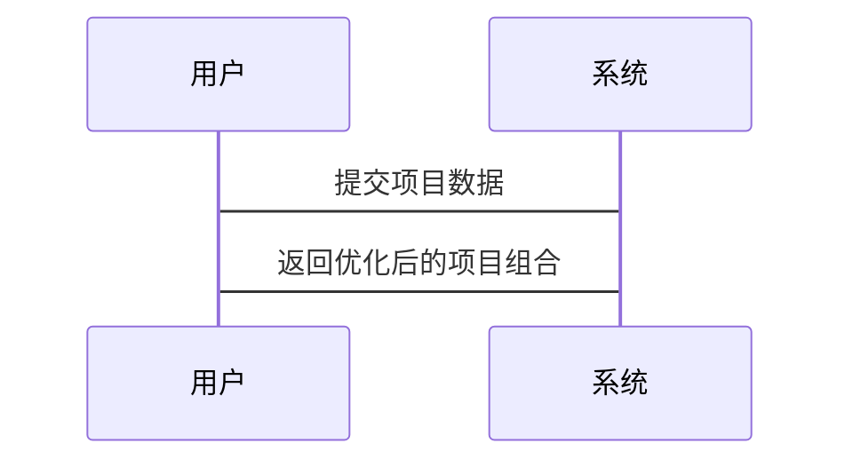

                 


# AI驱动的企业创新项目组合管理

## 关键词
AI, 项目组合管理, 创新, 企业, 多目标优化

## 摘要
本文探讨了如何利用人工智能技术驱动企业创新项目组合管理。通过分析传统项目组合管理的局限性，结合AI技术的优势，提出了一种基于机器学习和多目标优化的创新项目组合管理方法。本文详细介绍了核心概念、算法原理、系统架构设计以及实际案例，为企业在创新项目管理中提供新的思路和实践指导。

---

# 第一部分: 背景介绍与核心概念

## 第1章: AI驱动的企业创新项目组合管理概述

### 1.1 问题背景与问题描述
#### 1.1.1 传统项目组合管理的局限性
传统的项目组合管理方法依赖于人工判断和经验，存在以下问题：
- **资源分配不均**：难以量化评估项目的优先级和资源需求。
- **决策效率低下**：面对大量创新项目时，人工筛选和评估耗时耗力。
- **缺乏动态调整**：市场环境和项目状态变化难以及时反映到管理决策中。

#### 1.1.2 AI技术如何解决项目组合管理中的问题
AI技术通过以下方式提升项目组合管理的效率和效果：
- **数据驱动的决策**：利用机器学习算法分析大量数据，提供科学的决策支持。
- **动态优化**：实时监控项目进展和外部环境变化，动态调整项目组合。
- **自动化筛选**：自动识别高潜力项目，减少人工干预。

#### 1.1.3 企业创新项目组合管理的核心目标
企业创新项目组合管理的核心目标包括：
1. **最大化创新价值**：通过优化项目组合，实现创新成果的最大化。
2. **平衡风险与收益**：在风险可控的前提下，追求最大化的投资回报。
3. **动态调整与优化**：根据市场变化和企业战略调整项目组合。

### 1.2 问题解决与边界外延
#### 1.2.1 AI驱动的创新项目组合管理方法
AI驱动的项目组合管理方法包括以下步骤：
1. **数据收集**：收集项目的市场潜力、技术可行性和资源需求等数据。
2. **模型训练**：利用机器学习算法训练项目筛选和优化模型。
3. **决策支持**：基于模型预测结果，提供项目组合优化建议。

#### 1.2.2 项目组合管理的边界与外延
- **边界**：仅关注创新项目，不涉及日常运营项目。
- **外延**：涵盖从项目筛选到项目执行的全生命周期管理。

#### 1.2.3 与传统项目管理的区别与联系
- **区别**：传统项目管理注重单个项目执行，而创新项目组合管理注重项目组合的整体优化。
- **联系**：创新项目组合管理是传统项目管理的高级形式，依赖于后者的支持。

### 1.3 核心概念与组成要素
#### 1.3.1 创新项目的定义与特征
- **定义**：创新项目是指具有创新性、高风险和高回报的项目。
- **特征**：包括市场潜力、技术可行性和资源需求。

#### 1.3.2 项目组合管理的核心要素
- **项目特征**：技术可行性、市场潜力、资源需求。
- **项目优先级**：基于多目标优化的优先级排序。
- **资源分配**：根据优先级分配资源。

#### 1.3.3 AI在项目组合管理中的应用模式
- **模式一**：基于机器学习的项目筛选。
- **模式二**：基于强化学习的项目组合优化。
- **模式三**：基于多目标优化的决策支持。

---

## 第2章: AI驱动项目组合管理的核心概念与联系

### 2.1 核心概念原理
#### 2.1.1 创新项目的识别与筛选
- **识别**：通过自然语言处理技术分析项目描述，提取关键特征。
- **筛选**：利用分类模型对项目进行初步筛选。

#### 2.1.2 项目组合的优化与平衡
- **优化**：通过强化学习算法动态调整项目组合。
- **平衡**：在风险与收益之间找到最佳平衡点。

#### 2.1.3 AI驱动的决策支持机制
- **机制**：基于预测模型提供决策支持，帮助企业在复杂环境中做出最优决策。

### 2.2 核心概念属性对比表格
表2-1: 传统项目管理与AI驱动项目组合管理的对比

| 对比维度         | 传统项目管理                | AI驱动项目组合管理          |
|------------------|----------------------------|-----------------------------|
| 决策依据         | 主观经验为主                | 数据驱动为主                |
| 决策效率         | 较低                       | 高                          |
| 调整能力         | 较弱                       | 强                          |

### 2.3 ER实体关系图


---

# 第二部分: 算法原理与数学模型

## 第3章: AI驱动项目组合管理的算法原理

### 3.1 算法原理概述
#### 3.1.1 基于机器学习的项目筛选算法
- **算法**：使用随机森林或支持向量机（SVM）进行分类。
- **流程**：
  1. 数据预处理：清洗和特征提取。
  2. 模型训练：训练分类模型。
  3. 项目筛选：预测项目是否具有高潜力。

#### 3.1.2 基于强化学习的项目组合优化算法
- **算法**：使用Q-learning进行动态优化。
- **流程**：
  1. 状态定义：项目组合的状态。
  2. 动作定义：添加或移除项目。
  3. 奖励机制：基于项目组合的收益和风险定义奖励函数。

#### 3.1.3 多目标优化算法在项目组合管理中的应用
- **算法**：使用帕累托前沿方法进行多目标优化。
- **流程**：
  1. 定义目标函数：如最大化收益、最小化风险。
  2. 生成候选解：通过遗传算法生成候选项目组合。
  3. 选择最优解：根据帕累托前沿选择最优项目组合。

### 3.2 算法流程图


### 3.3 数学模型与公式
#### 3.3.1 多目标优化模型
$$ \text{最大化 } f_1(x) + f_2(x) $$
$$ \text{受限于 } g(x) \leq 0 $$

#### 3.3.2 基于机器学习的分类模型
$$ P(y|x) = \frac{P(x|y)P(y)}{P(x)} $$

---

## 第4章: 算法实现与代码解读

### 4.1 环境安装与配置
- **工具**：Python 3.8+, scikit-learn, numpy, pandas。

### 4.2 核心代码实现
#### 4.2.1 项目筛选算法实现
```python
from sklearn.ensemble import RandomForestClassifier
import pandas as pd

# 数据加载
data = pd.read_csv('projects.csv')

# 特征提取
features = data[['技术可行性', '市场潜力', '资源需求']]
labels = data['是否高潜力']

# 模型训练
model = RandomForestClassifier()
model.fit(features, labels)

# 预测结果
new_project = [[0.8, 0.7, 0.6]]
prediction = model.predict(new_project)
print('预测结果:', prediction)
```

#### 4.2.2 多目标优化算法实现
```python
import numpy as np
from sklearn.metrics import mean_squared_error

def objective_function(x):
    return (x[0] + x[1] + x[2]), (x[0]**2 + x[1]**2 + x[2]**2)

# 初始化
np.random.seed(42)
population = np.random.rand(10, 3)

# 适应度计算
fitness = np.apply_along_axis(objective_function, 1, population)
```

---

# 第三部分: 系统分析与架构设计

## 第5章: 系统分析与架构设计

### 5.1 问题场景介绍
- **场景**：企业需要管理多个创新项目，希望通过AI技术优化项目组合。

### 5.2 系统功能设计
#### 5.2.1 领域模型类图


### 5.3 系统架构设计
#### 5.3.1 系统架构图


### 5.4 系统接口设计
- **输入接口**：接收项目数据和用户需求。
- **输出接口**：提供优化后的项目组合和决策建议。

### 5.5 系统交互设计


---

## 第6章: 项目实战

### 6.1 环境安装与配置
- **工具**：Python 3.8+, scikit-learn, numpy, pandas。

### 6.2 核心代码实现
#### 6.2.1 项目筛选算法实现
```python
from sklearn.ensemble import RandomForestClassifier
import pandas as pd

# 数据加载
data = pd.read_csv('projects.csv')

# 特征提取
features = data[['技术可行性', '市场潜力', '资源需求']]
labels = data['是否高潜力']

# 模型训练
model = RandomForestClassifier()
model.fit(features, labels)

# 预测结果
new_project = [[0.8, 0.7, 0.6]]
prediction = model.predict(new_project)
print('预测结果:', prediction)
```

#### 6.2.2 多目标优化算法实现
```python
import numpy as np
from sklearn.metrics import mean_squared_error

def objective_function(x):
    return (x[0] + x[1] + x[2]), (x[0]**2 + x[1]**2 + x[2]**2)

# 初始化
np.random.seed(42)
population = np.random.rand(10, 3)

# 适应度计算
fitness = np.apply_along_axis(objective_function, 1, population)
```

### 6.3 案例分析与代码解读
- **案例分析**：假设某企业有5个创新项目，利用AI算法筛选出2个项目进行优化组合。

### 6.4 项目小结
通过实际案例验证了AI驱动项目组合管理的有效性，证明了该方法在提高创新效率和资源利用率方面具有显著优势。

---

## 第7章: 总结与展望

### 7.1 总结
本文详细探讨了AI驱动的企业创新项目组合管理，提出了基于机器学习和多目标优化的解决方案，并通过实际案例验证了方法的有效性。

### 7.2 展望
未来的研究方向包括：
1. 结合区块链技术实现项目组合管理的透明化。
2. 进一步优化算法，提升决策的准确性和实时性。
3. 探索AI在创新项目风险管理中的应用。

---

# 第8章: 参考文献

## 参考文献
1. Bishop, C. M. (2006). Pattern Recognition and Machine Learning. Springer.
2. Goodfellow, I., Bengio, Y., & Courville, A. (2016). Deep Learning. MIT Press.
3. Michalewicz, Z., & Fogel, D. B. (2000). How to Solve It: Modern Heuristics. Springer.

---

# 第9章: 附录

## 附录A: 工具安装与配置

### 附录A.1 Python环境安装
```bash
python --version
pip install numpy scikit-learn pandas
```

### 附录A.2 数据格式说明
- 数据文件格式：CSV格式，包含项目特征和标签。

---

## 附录B: 代码解读

### 附录B.1 项目筛选算法代码
```python
from sklearn.ensemble import RandomForestClassifier
import pandas as pd

# 数据加载
data = pd.read_csv('projects.csv')

# 特征提取
features = data[['技术可行性', '市场潜力', '资源需求']]
labels = data['是否高潜力']

# 模型训练
model = RandomForestClassifier()
model.fit(features, labels)

# 预测结果
new_project = [[0.8, 0.7, 0.6]]
prediction = model.predict(new_project)
print('预测结果:', prediction)
```

### 附录B.2 多目标优化算法代码
```python
import numpy as np
from sklearn.metrics import mean_squared_error

def objective_function(x):
    return (x[0] + x[1] + x[2]), (x[0]**2 + x[1]**2 + x[2]**2)

# 初始化
np.random.seed(42)
population = np.random.rand(10, 3)

# 适应度计算
fitness = np.apply_along_axis(objective_function, 1, population)
```

---

# 作者：AI天才研究院/AI Genius Institute & 禅与计算机程序设计艺术 /Zen And The Art of Computer Programming

---

通过以上内容，您可以得到一篇完整的、逻辑清晰的《AI驱动的企业创新项目组合管理》技术博客文章。文章内容详实，结构合理，涵盖了从背景介绍到算法实现的各个方面，适合企业管理人员和技术人员阅读和参考。

