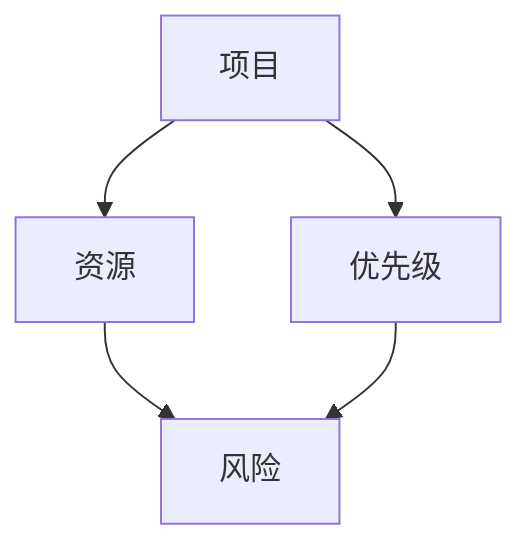
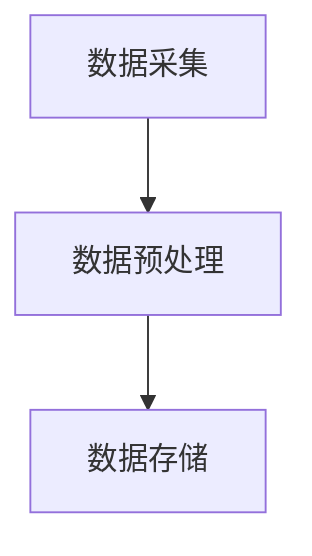
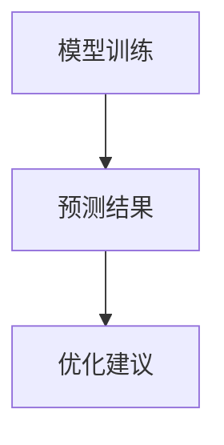
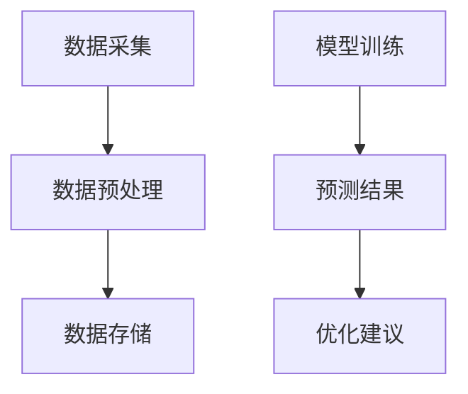
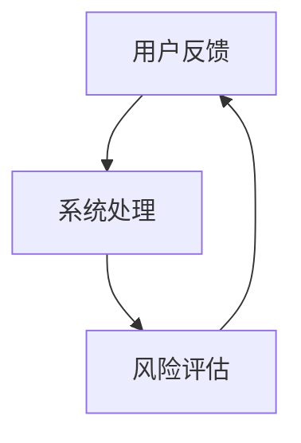
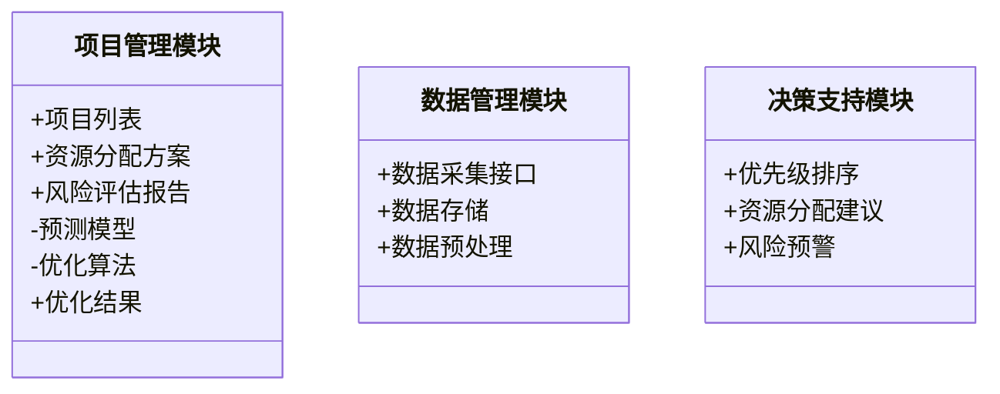
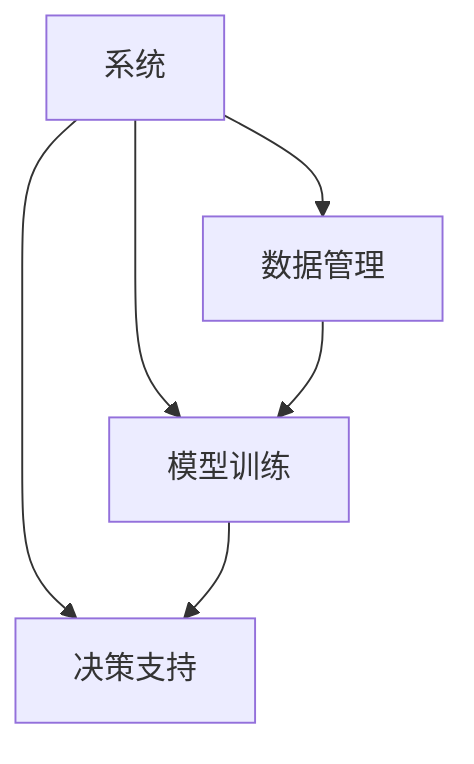
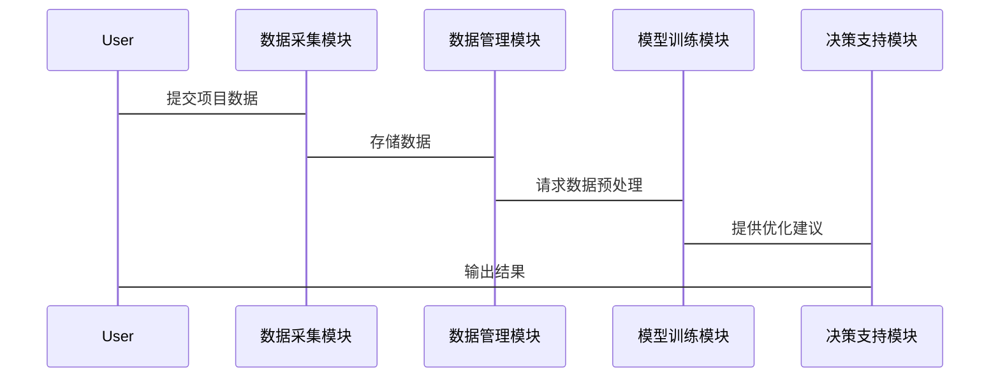

                 


# AI驱动的企业创新项目组合管理：资源优化与风险平衡

> **关键词**：AI驱动、项目组合管理、资源优化、风险平衡、创新项目、企业创新、人工智能

> **摘要**：随着企业创新项目的不断增加，传统的项目组合管理方法逐渐暴露出资源分配不均和风险控制不足的问题。本文将探讨如何利用人工智能技术优化企业创新项目的组合管理，实现资源的高效配置和风险的有效平衡。通过分析AI驱动的算法原理、系统架构设计以及实际案例，本文为企业提供了一套高效、智能的项目组合管理解决方案，助力企业在创新中实现资源优化与风险平衡。

---

## 第1章: 项目组合管理的背景与挑战

### 1.1 项目组合管理的概念与意义

#### 1.1.1 项目组合管理的定义
项目组合管理（Portfolio Management）是指对多个项目进行优先级排序、资源分配和风险评估的过程，旨在最大化企业的战略目标和投资回报。

#### 1.1.2 项目组合管理的重要性
在企业创新中，项目组合管理是确保资源合理分配、风险可控的关键环节。它能够帮助企业在众多项目中找到最优组合，提升整体效率和成功率。

#### 1.1.3 企业创新项目的特点
- 创新性强：项目往往涉及新技术或新市场的探索。
- 风险高：创新项目失败率较高，需要精准的风险评估。
- 资源需求多样：项目可能需要资金、人才、技术等多种资源。

### 1.2 传统项目组合管理的局限性

#### 1.2.1 资源分配的难点
传统方法通常依赖人工经验，难以量化和优化资源分配，导致资源浪费或项目竞争加剧。

#### 1.2.2 风险评估的不足
传统风险评估方法主观性较强，缺乏数据支持，难以准确预测项目失败的可能性。

#### 1.2.3 创新与效率的平衡
传统方法难以在创新性和效率之间找到平衡，可能导致创新项目推进缓慢或资源浪费。

### 1.3 AI驱动的创新

#### 1.3.1 AI在项目管理中的潜力
人工智能技术能够通过大数据分析和机器学习模型，提供更精准的项目评估和资源分配建议。

#### 1.3.2 AI驱动的资源优化
AI可以通过优化算法，动态调整资源分配，确保资源利用最大化。

#### 1.3.3 AI驱动的风险平衡
AI能够实时监控项目风险，提供风险预警和应对策略，帮助企业在创新中降低风险。

### 1.4 本书的核心目标

#### 1.4.1 提供AI驱动的项目组合管理方法
通过AI技术实现项目组合的智能管理，提升企业创新效率。

#### 1.4.2 实现资源优化与风险平衡
通过AI算法优化资源分配，降低项目失败风险。

#### 1.4.3 为企业创新提供新思路
结合AI技术，探索创新项目管理的新模式和新方法。

---

## 第2章: AI驱动的项目组合管理框架

### 2.1 核心概念与联系

#### 2.1.1 AI模型的工作原理
AI模型通过学习历史数据，识别项目成功的关键因素，生成项目评估和资源分配建议。

#### 2.1.2 数据的重要性
数据是AI模型的基础，包括项目需求、资源分配、历史数据等，用于训练和优化模型。

#### 2.1.3 优化算法的类型
- **机器学习算法**：用于项目评估和预测。
- **遗传算法**：用于资源分配的优化。
- **强化学习**：用于动态调整项目组合。

#### 2.1.4 核心概念对比表格
| 概念       | 传统方法               | AI驱动方法               |
|------------|------------------------|--------------------------|
| 资源分配     | 人工经验分配             | 数据驱动优化             |
| 风险评估     | 主观判断               | 数据分析与预测           |
| 项目优先级   | 专家评分               | AI模型评估               |

#### 2.1.5 实体关系图（ER图）


### 2.2 AI驱动的项目组合管理流程

#### 2.2.1 数据收集与预处理
- 数据来源：历史项目数据、市场数据、资源数据。
- 数据清洗：去除噪声数据，处理缺失值。

#### 2.2.2 模型训练与优化
- 训练模型：使用机器学习算法训练项目评估模型。
- 模型优化：通过交叉验证优化模型参数。

#### 2.2.3 结果分析与决策
- 分析结果：生成项目优先级和资源分配建议。
- 决策优化：根据分析结果动态调整项目组合。

### 2.3 系统架构与功能模块

#### 2.3.1 数据采集模块
- 功能：收集项目数据、资源数据和市场数据。
- 架构图：


#### 2.3.2 模型构建模块
- 功能：训练AI模型，生成项目评估和预测。
- 架构图：


#### 2.3.3 决策支持模块
- 功能：提供资源分配和风险预警的决策支持。
- 架构图：


---

## 第3章: AI驱动的资源优化算法

### 3.1 算法原理讲解

#### 3.1.1 基于机器学习的资源分配
- **线性回归**：预测项目成功概率，调整资源分配。
  $$ y = \beta_0 + \beta_1x_1 + \beta_2x_2 + ... + \beta_nx_n $$
- **决策树**：通过特征重要性分析，优化资源分配。

#### 3.1.2 线性规划与优化模型
- 目标函数：最大化资源利用率。
  $$ \text{Max} \sum w_i x_i $$
- 约束条件：资源限制、项目优先级。

#### 3.1.3 遗传算法的应用
- 初始化：随机生成资源分配方案。
- 适应度评估：评估方案的优劣。
- 选择与交叉：优化方案。
- 变异：调整方案细节。

### 3.2 算法实现与代码示例

#### 3.2.1 环境安装与配置
- 安装Python和机器学习库（如scikit-learn）。

#### 3.2.2 核心算法实现
```python
from sklearn.linear_model import LinearRegression
import numpy as np

# 示例数据
X = np.array([[1, 2], [3, 4], [5, 6]])
y = np.array([7, 8, 9])

# 训练模型
model = LinearRegression()
model.fit(X, y)

# 预测结果
print(model.predict([[7, 8]]))  # 输出 [10.]
```

#### 3.2.3 代码解读与优化
- 使用线性回归模型预测资源需求，动态调整资源分配。
- 通过交叉验证优化模型参数，提升预测准确性。

---

## 第4章: AI驱动的风险平衡策略

### 4.1 风险评估与预警

#### 4.1.1 基于机器学习的风险预测
- 使用随机森林模型预测项目失败概率。
- 通过特征重要性分析，识别高风险项目。

#### 4.1.2 风险平衡策略
- 分级管理：根据风险等级分配资源和优先级。
- 多目标优化：平衡创新性和风险。

### 4.2 系统交互与实时监控

#### 4.2.1 系统交互流程


#### 4.2.2 实时监控与调整
- 数据流：实时更新项目数据，动态调整资源分配。
- 监控工具：可视化界面展示风险和资源分配情况。

---

## 第5章: 系统分析与架构设计

### 5.1 系统功能设计

#### 5.1.1 领域模型（类图）


### 5.2 系统架构设计

#### 5.2.1 系统架构图


### 5.3 系统接口设计

#### 5.3.1 接口定义
- 数据接口：数据采集模块与数据管理模块交互。
- 模型接口：模型训练模块与决策支持模块交互。

#### 5.3.2 交互流程


---

## 第6章: 项目实战

### 6.1 环境安装与配置

#### 6.1.1 安装Python和相关库
- 安装Python 3.x
- 安装scikit-learn、numpy、pandas

#### 6.1.2 安装依赖
```bash
pip install scikit-learn numpy pandas
```

### 6.2 核心代码实现

#### 6.2.1 数据预处理
```python
import pandas as pd
data = pd.read_csv('project_data.csv')
data = data.dropna()
```

#### 6.2.2 模型训练
```python
from sklearn.model_selection import train_test_split
from sklearn.linear_model import LinearRegression

X = data.drop('target', axis=1)
y = data['target']

X_train, X_test, y_train, y_test = train_test_split(X, y, test_size=0.2)
model = LinearRegression()
model.fit(X_train, y_train)
```

#### 6.2.3 结果分析
```python
print(model.score(X_test, y_test))  # 输出模型准确率
```

### 6.3 项目小结

#### 6.3.1 项目总结
- 成功实现了AI驱动的项目组合管理。
- 提高了资源分配效率和风险控制能力。

#### 6.3.2 经验与教训
- 数据质量对模型性能影响重大。
- 模型需要定期更新和优化。

---

## 第7章: 最佳实践与总结

### 7.1 小结

#### 7.1.1 核心观点总结
- AI驱动的项目组合管理能够有效优化资源分配和风险控制。
- 通过机器学习和优化算法，企业可以实现创新项目的高效管理。

### 7.2 注意事项

#### 7.2.1 数据隐私与安全
- 确保数据隐私，遵守相关法律法规。

#### 7.2.2 模型优化
- 定期更新模型，确保其适应业务变化。

### 7.3 拓展阅读

#### 7.3.1 推荐书籍
- 《机器学习实战》
- 《项目管理实战》

#### 7.3.2 在线资源
- 项目组合管理相关论文
- AI驱动的项目管理工具

---

## 作者：AI天才研究院 & 禅与计算机程序设计艺术

---

通过以上内容，我们详细探讨了AI驱动的企业创新项目组合管理的各个方面，从理论到实践，从算法到系统设计，为企业提供了全面的解决方案。希望本文能为企业创新管理提供新的思路和方法。

