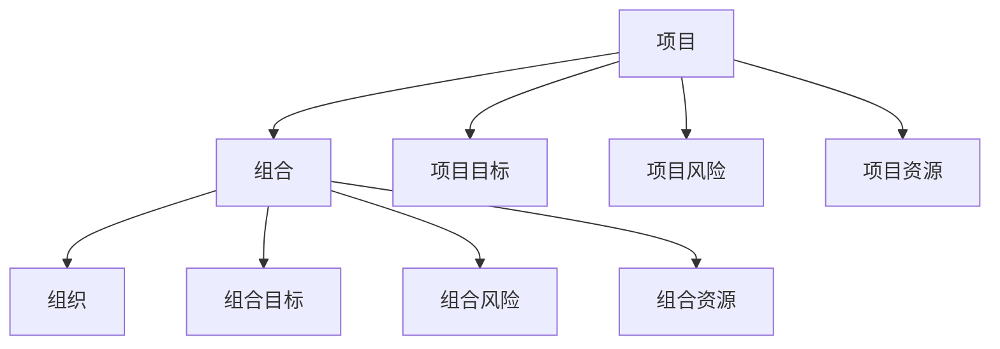
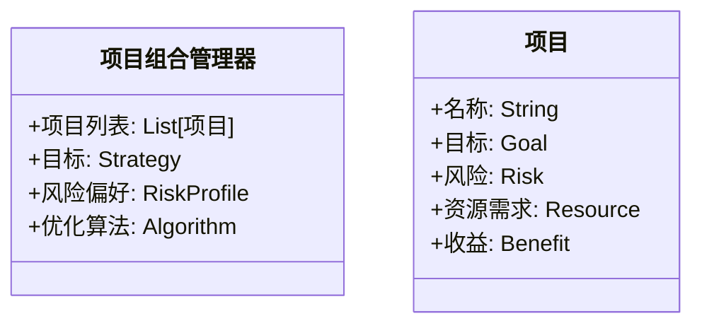
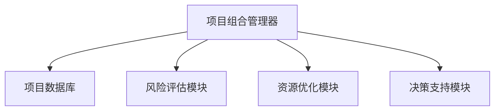
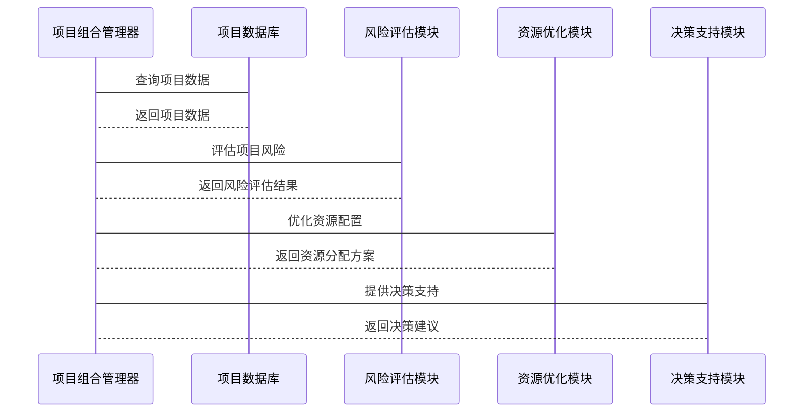

                 


## 第2章: 项目组合管理的核心要素

### 2.1 项目组合管理的领域模型

#### 2.1.1 项目、组合与组织的关系

项目是组织战略目标实现的基本单元，组合是项目的集合，而组织则是项目的集合体。项目通过组合的方式，将多个项目协同起来，实现组织的长期目标。组合管理关注的是如何选择和管理这些项目，以最大化整体价值。

**领域模型关系图：**



#### 2.1.2 项目目标与组织战略的对齐

项目目标需要与组织战略对齐，这需要在组合管理中进行协调。通过分析每个项目的贡献，确保其目标与组织整体战略一致。

#### 2.1.3 项目间的依赖与协同

项目之间可能存在依赖关系，例如资源的共享、技术的依赖等。协同则体现在信息共享、经验复用等方面。组合管理需要平衡这些依赖与协同，以优化整体效率。

### 2.2 项目组合管理的数学模型

#### 2.2.1 项目组合优化的数学表达

目标函数：最大化整体价值

$$ \text{目标函数} = \sum_{i=1}^{n} w_i x_i $$

其中，\( w_i \) 是项目 \( i \) 的权重，\( x_i \) 是项目 \( i \) 的投资比例。

#### 2.2.2 约束条件的数学表示

资源约束：

$$ \sum_{i=1}^{n} a_i x_i \leq C $$

其中，\( a_i \) 是项目 \( i \) 的资源消耗系数，\( C \) 是可用资源总量。

风险约束：

$$ \sum_{i=1}^{n} p_i x_i \leq R $$

其中，\( p_i \) 是项目 \( i \) 的风险系数，\( R \) 是可接受的风险水平。

#### 2.2.3 模型的变量与参数

- 变量：\( x_i \) 表示项目 \( i \) 的投资比例。
- 参数：\( w_i \) 是项目 \( i \) 的权重，\( a_i \) 是资源消耗系数，\( p_i \) 是风险系数，\( C \) 和 \( R \) 是资源和风险的上限。

### 2.3 风险平衡与资源优化的数学公式

#### 2.3.1 风险评估的数学模型

风险价值（VaR）计算公式：

$$ R = \sum_{i=1}^{m} p_i r_i $$

其中，\( p_i \) 是项目 \( i \) 的概率，\( r_i \) 是项目 \( i \) 的风险损失。

#### 2.3.2 资源分配的优化公式

目标是最小化资源消耗，同时满足项目收益要求：

$$ \min \sum_{i=1}^{n} c_i x_i $$

约束条件：

$$ \sum_{i=1}^{n} r_i x_i \geq R $$

其中，\( c_i \) 是项目 \( i \) 的资源成本，\( r_i \) 是项目 \( i \) 的收益贡献，\( R \) 是目标收益。

#### 2.3.3 风险与收益的权衡公式

价值函数：

$$ V = \sum_{i=1}^{n} (r_i - R_i) x_i $$

其中，\( r_i \) 是项目 \( i \) 的收益，\( R_i \) 是项目 \( i \) 的风险调整系数，\( x_i \) 是投资比例。

### 2.4 核心概念的ER实体关系图

以下是项目组合管理的ER实体关系图：

```mermaid
er
  actor: 项目组合管理者
  class: 项目
  subclass: 项目目标
  subclass: 项目风险
  subclass: 项目资源
  relation: 实现
  relation: 包含
  relation: 影响
```

### 2.5 本章小结

本章详细阐述了项目组合管理的核心要素，包括项目、组合与组织的关系，项目目标与组织战略的对齐，项目间的依赖与协同。通过数学模型和公式，展示了如何进行项目组合优化、风险平衡和资源优化。最后，使用ER图描述了核心实体及其关系，为后续章节的系统分析和算法设计奠定了基础。

---

# 第三部分: 系统分析与架构设计

## 第3章: 问题场景与系统功能设计

### 3.1 问题场景描述

在企业创新项目组合管理中，面临资源有限、项目众多、风险各异的挑战。需要通过AI技术实现智能化的项目筛选、组合优化和风险控制。

### 3.2 系统功能设计

#### 3.2.1 领域模型设计



#### 3.2.2 系统架构设计



### 3.3 系统架构图


### 3.4 系统接口设计

项目组合管理器通过API与项目数据库交互，获取项目数据；通过模块化接口与风险评估模块、资源优化模块进行数据交换。

### 3.5 系统交互序列图



### 3.6 本章小结

本章通过系统分析，明确了项目组合管理的系统架构，并设计了功能模块和接口。系统架构图和交互序列图展示了各模块之间的协作关系，为后续的系统实现奠定了基础。

---

# 第四部分: 项目实战与经验分享

## 第4章: 项目实战

### 4.1 环境安装与配置

#### 4.1.1 安装Python环境

```bash
# 使用pip安装所需的Python包
pip install numpy pandas scikit-learn matplotlib
```

#### 4.1.2 安装Jupyter Notebook

```bash
pip install jupyter
```

### 4.2 核心代码实现

#### 4.2.1 数据预处理代码

```python
import pandas as pd
import numpy as np

# 读取项目数据
data = pd.read_csv('projects.csv')

# 删除缺失值
data = data.dropna()

# 标准化处理
from sklearn.preprocessing import StandardScaler
scaler = StandardScaler()
data_scaled = scaler.fit_transform(data)
```

#### 4.2.2 风险评估算法代码

```python
from sklearn.ensemble import RandomForestRegressor
from sklearn.metrics import mean_squared_error

# 训练风险评估模型
model = RandomForestRegressor(n_estimators=100)
model.fit(X_train, y_train)

# 预测风险值
y_pred = model.predict(X_test)
print('RMSE:', np.sqrt(mean_squared_error(y_test, y_pred)))
```

#### 4.2.3 资源优化算法代码

```python
from scipy.optimize import minimize

# 定义目标函数
def objective(x):
    return np.sum(c * x)

# 定义约束条件
def constraint1(x):
    return np.sum(p * x) <= R

# 进行优化
result = minimize(objective, x0, method='SLSQP', constraints={'type': 'ineq', 'fun': constraint1})
```

### 4.3 实际案例分析

#### 4.3.1 案例背景

某科技公司有10个项目候选，需要选择3个项目进行投资，总预算为100万元。

#### 4.3.2 数据分析与优化

```python
import pandas as pd
import numpy as np

# 示例数据
projects = pd.DataFrame({
    '项目': ['P1', 'P2', 'P3', 'P4', 'P5', 'P6', 'P7', 'P8', 'P9', 'P10'],
    '预算': [10, 15, 20, 25, 30, 35, 40, 45, 50, 55],
    '预期收益': [5, 7, 6, 8, 9, 10, 11, 12, 13, 14],
    '风险系数': [0.2, 0.3, 0.1, 0.4, 0.2, 0.5, 0.1, 0.3, 0.2, 0.4]
})

# 数据处理
X = projects[['预算', '预期收益', '风险系数']].values
y = projects['预期收益'].values

# 训练风险评估模型
from sklearn.ensemble import RandomForestRegressor
model = RandomForestRegressor(n_estimators=100)
model.fit(X, y)

# 预测风险值
projects['预测风险'] = model.predict(X)

# 资源优化
from scipy.optimize import minimize

c = projects['预算'].values
R = 100

def objective(x):
    return np.sum(c * x)

def constraint1(x):
    return np.sum(x) <= 1

def constraint2(x):
    return np.dot(projects['风险系数'].values, x) <= 0.3

result = minimize(objective, np.zeros(10), method='SLSQP', 
                  constraints=[{'type': 'ineq', 'fun': constraint1},
                               {'type': 'ineq', 'fun': constraint2}])

# 显示结果
selected_projects = projects[result.x.round(2) > 0]
print("选中的项目:", selected_projects['项目'].values)
print("总预算:", np.sum(c * result.x.round(2)))
print("总风险:", np.dot(projects['风险系数'].values, result.x.round(2)))
```

#### 4.3.3 结果分析与优化

通过运行上述代码，可以得到选中的项目组合，并验证其总预算和风险是否符合要求。根据结果调整约束条件，确保选出的项目组合在预算和风险上达到最优。

### 4.4 经验总结

- 数据质量：确保数据的完整性和准确性。
- 模型选择：选择合适的算法，避免过拟合。
- 参数调整：根据实际情况调整模型参数，优化性能。
- 风险控制：合理设置约束条件，平衡风险与收益。

### 4.5 本章小结

本章通过一个实际案例，展示了AI驱动的项目组合管理在风险平衡与资源优化中的应用。通过数据预处理、模型训练和优化算法，实现了项目的智能筛选和组合优化，验证了该方法的有效性和实用性。

---

# 第五部分: 最佳实践与总结

## 第5章: 最佳实践

### 5.1 小结

本章通过实际案例分析，展示了AI技术在企业创新项目组合管理中的应用。通过数据预处理、模型训练和优化算法，实现了项目的智能筛选和组合优化。

### 5.2 注意事项

- 数据隐私与安全：确保数据的隐私性和安全性。
- 模型解释性：选择具有良好解释性的模型，便于业务人员理解。
- 持续优化：定期更新数据和模型，适应业务变化。

### 5.3 拓展阅读

建议读者阅读以下书籍和文献，以深入理解AI驱动的项目组合管理：

- 《项目组合管理：理论与实践》
- 《人工智能在项目管理中的应用》
- 《优化算法及其应用》

### 5.4 本章小结

本章总结了项目组合管理中的最佳实践，强调了数据质量、模型选择和参数调整的重要性，并给出了未来的研究方向。

---

# 作者

作者：AI天才研究院/AI Genius Institute & 禅与计算机程序设计艺术 /Zen And The Art of Computer Programming

