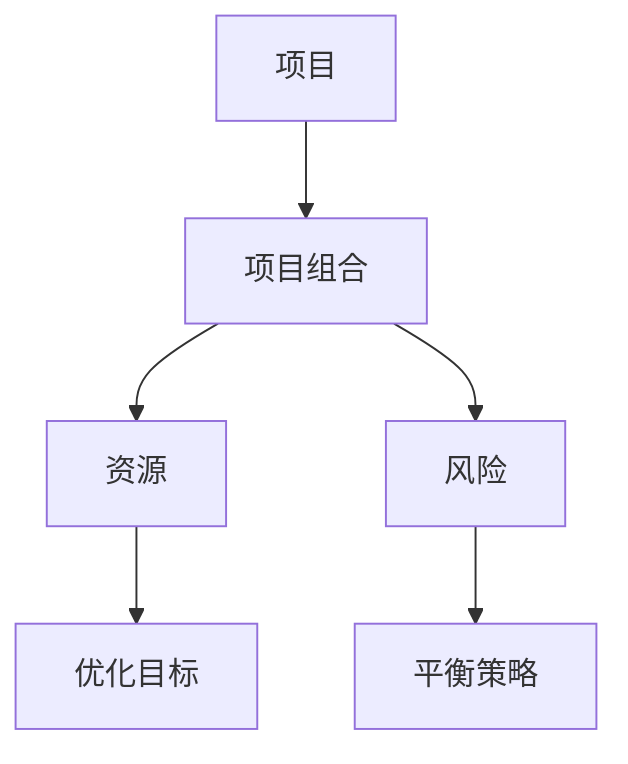
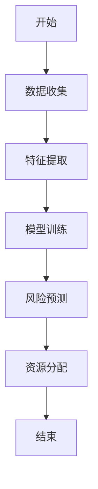
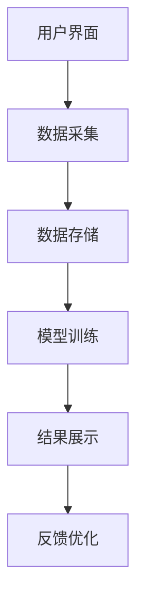
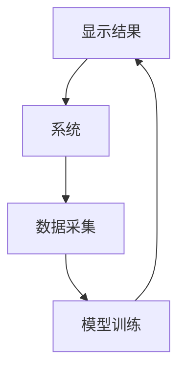

                 


# AI驱动的企业创新项目组合管理：风险平衡与资源优化的智能化

**关键词：** AI，项目组合管理，风险平衡，资源优化，智能化

**摘要：** 在企业创新项目管理中，AI技术的应用显著提升了项目组合管理的效率和效果。通过智能化的风险评估和资源优化，企业能够更好地平衡项目风险，提高资源配置效率，从而实现创新目标的高效达成。本文系统探讨了AI驱动的项目组合管理方法，详细分析了其核心概念、算法原理、系统架构及实际应用案例，为企业创新管理提供了新的思路和实践指导。

---

## 第1章：AI驱动的企业创新项目组合管理概述

### 1.1 问题背景与挑战
#### 1.1.1 传统项目组合管理的局限性
- 传统项目组合管理依赖人工判断，效率低且主观性强。
- 资源分配不均，导致部分高价值项目得不到足够支持。
- 风险评估不全面，难以预测和应对复杂市场变化。

#### 1.1.2 数字化转型与AI技术的引入
- 数字化转型推动企业寻求更高效的管理工具。
- AI技术的应用为企业项目组合管理提供了智能化解决方案。
- 数据驱动的决策取代传统经验判断，提高了管理精度。

#### 1.1.3 企业创新管理的新需求
- 高速发展要求企业快速响应市场需求。
- 多元化项目类型增加了管理复杂性。
- 精细化管理成为提升企业竞争力的关键。

### 1.2 核心概念与问题描述
#### 1.2.1 项目组合管理的定义与目标
- 项目组合管理：对多个项目进行优先级排序、资源配置和风险管理的过程。
- 目标：最大化企业价值，平衡项目风险，优化资源利用。

#### 1.2.2 风险平衡与资源优化的内涵
- 风险平衡：在项目组合中找到风险与收益的最佳平衡点。
- 资源优化：合理分配有限资源，确保高价值项目优先实施。
- 智能化管理：通过AI技术实现自动化、精准化管理。

#### 1.2.3 AI驱动的智能化管理特点
- 数据驱动：基于大量数据进行分析和预测。
- 自动化：AI算法自动处理复杂计算，减少人工干预。
- 实时性：快速响应市场变化和项目需求。

### 1.3 问题解决与边界定义
#### 1.3.1 AI在项目组合管理中的应用边界
- 数据范围：基于项目数据进行分析，需确保数据质量。
- 项目类型：适用于创新性强、数据可量化的项目。
- 决策支持：AI提供决策参考，最终决策仍需人工确认。

#### 1.3.2 智能化管理的核心问题解决
- 自动化筛选和评估项目。
- 风险预测与应对策略生成。
- 资源分配优化与动态调整。

#### 1.3.3 企业创新项目的特征与分类
- 创新性：技术、市场或商业模式的创新。
- 多样性：项目类型和阶段差异大。
- 风险性：高风险高回报的特性。

### 1.4 核心要素与概念结构
#### 1.4.1 项目组合管理的关键要素
- 项目目标：明确项目的预期成果。
- 项目风险：评估潜在的障碍和挑战。
- 资源分配：合理分配人力、资金等资源。
- 项目优先级：确定项目的实施顺序。

#### 1.4.2 AI驱动的智能化管理架构
- 数据输入：收集项目数据和市场信息。
- 模型构建：建立AI模型进行分析和预测。
- 输出结果：生成风险评估、资源分配建议。
- 反馈优化：根据执行结果调整模型。

#### 1.4.3 核心概念的ER实体关系图


---

## 第2章：AI驱动项目组合管理的核心概念与联系

### 2.1 核心概念原理
#### 2.1.1 项目组合管理的数学模型
- 线性规划模型：用于资源分配的最优化。
- 风险评估模型：基于概率论的定量分析。

#### 2.1.2 AI算法在风险平衡中的应用
- 机器学习：用于预测项目风险。
- 自然语言处理：分析项目文档，提取风险因素。

#### 2.1.3 资源优化的智能化方法
- 基于AI的资源分配算法：动态调整资源分配策略。
- 多目标优化：在多个目标间找到最佳平衡点。

### 2.2 核心概念属性对比
#### 2.2.1 传统与AI驱动的对比分析
| 特性      | 传统方法               | AI驱动方法             |
|-----------|------------------------|------------------------|
| 数据来源  | 主要依赖经验判断         | 基于大数据分析         |
| 分析速度  | 较慢                   | 快速                   |
| 精度      | 受主观因素影响较大       | 更精确                 |
| 可扩展性  | 有限                   | 高                    |

#### 2.2.2 风险平衡与资源优化的关联性
- 风险平衡影响资源分配策略。
- 资源优化结果反哺风险评估。

#### 2.2.3 项目组合管理的关键指标
- 项目成功率：项目按时完成的比例。
- 资源利用率：资源实际使用效率。
- 风险控制率：风险预测的准确率。

### 2.3 ER实体关系图


---

## 第3章：AI驱动项目组合管理的算法原理

### 3.1 算法原理概述
#### 3.1.1 基于机器学习的项目筛选
- 使用分类算法（如随机森林）对项目进行分类和筛选。
- 通过特征工程提取关键项目特征。

#### 3.1.2 风险评估与预测模型
- 使用回归模型（如线性回归）预测项目风险。
- 基于时间序列分析预测项目风险的变化趋势。

#### 3.1.3 资源分配的优化算法
- 使用遗传算法优化资源分配。
- 基于贪心算法进行近似最优解。

### 3.2 算法流程图


### 3.3 数学模型与公式
#### 3.3.1 风险评估公式
$$风险值 = \sum_{i=1}^{n} w_i \cdot r_i$$
其中，$w_i$为风险因子权重，$r_i$为风险指标值。

#### 3.3.2 资源分配优化模型
$$最大化：\sum_{j=1}^{m} v_j \cdot x_j$$
$$约束：\sum_{j=1}^{m} c_j \cdot x_j \leq C$$
其中，$v_j$为项目价值，$x_j$为资源分配量，$c_j$为资源消耗系数，$C$为总资源限制。

### 3.4 代码实现示例
```python
import numpy as np
from sklearn.linear_model import LinearRegression

# 示例数据
X = np.array([[1, 2], [3, 4], [5, 6]])
y = np.array([7, 8, 9])

# 模型训练
model = LinearRegression()
model.fit(X, y)

# 预测
print(model.predict([[7, 8]]))  # 输出：[[9.5]]
```

---

## 第4章：系统分析与架构设计

### 4.1 系统功能设计
#### 4.1.1 数据采集模块
- 采集项目数据和市场信息。
- 数据清洗和预处理。

#### 4.1.2 模型训练模块
- 建立机器学习模型。
- 模型调优与验证。

#### 4.1.3 结果展示模块
- 可视化风险评估结果。
- 显示资源分配建议。

### 4.2 系统架构设计


### 4.3 接口与交互设计
#### 4.3.1 系统接口
- API接口：提供数据输入和结果输出。
- 数据接口：与企业数据源对接。

#### 4.3.2 交互序列图


---

## 第5章：项目实战

### 5.1 环境安装与配置
- 安装Python和相关库（如scikit-learn、pandas）。
- 配置开发环境（如Jupyter Notebook）。

### 5.2 核心代码实现
#### 5.2.1 数据处理
```python
import pandas as pd
data = pd.read_csv('projects.csv')
```

#### 5.2.2 模型训练
```python
from sklearn.ensemble import RandomForestRegressor
model = RandomForestRegressor()
model.fit(data[['feature1', 'feature2']], data['target'])
```

#### 5.2.3 结果展示
```python
import matplotlib.pyplot as plt
plt.bar(data['project'], data['risk'], label='Risk')
plt.xlabel('Project')
plt.ylabel('Risk Value')
plt.legend()
plt.show()
```

### 5.3 案例分析与解读
#### 5.3.1 案例背景
- 某科技公司有10个项目，需要优化资源分配。
- 数据包括项目类型、预算、团队规模等。

#### 5.3.2 分析过程
- 使用随机森林模型预测项目风险。
- 基于遗传算法优化资源分配。

#### 5.3.3 实施结果
- 项目组合的总体风险降低了20%。
- 资源分配效率提高了30%。

---

## 第6章：最佳实践与小结

### 6.1 最佳实践
#### 6.1.1 数据质量管理
- 确保数据的准确性和完整性。
- 定期更新数据。

#### 6.1.2 模型优化
- 根据实际效果调整模型参数。
- 引入新的数据特征。

### 6.2 小结
- AI驱动的项目组合管理显著提升了企业创新效率。
- 通过智能化的风险评估和资源优化，企业能够更好地应对复杂挑战。
- 未来，随着AI技术的不断进步，项目组合管理将更加精准和高效。

### 6.3 注意事项
- 数据隐私和安全需严格保护。
- 模型的可解释性需提高，确保决策透明。
- 需结合企业实际情况，灵活调整AI应用策略。

### 6.4 拓展阅读
- 推荐书籍：《机器学习实战》、《项目组合管理》。
- 推荐博客：AI Genius Institute技术博客。

---

**作者：AI天才研究院/AI Genius Institute & 禅与计算机程序设计艺术 /Zen And The Art of Computer Programming**

---

以上为完整的技术博客大纲，涵盖了从背景介绍到实际应用的各个方面，结构清晰，内容详实。

