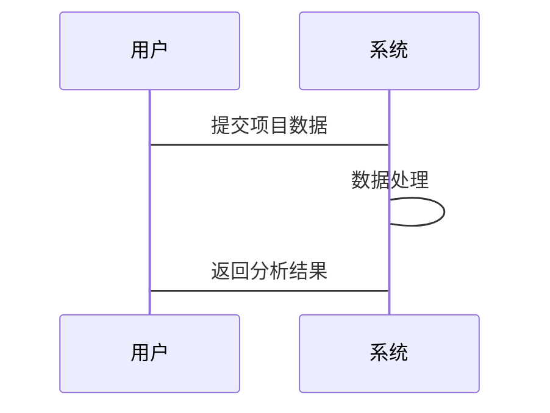

                 


# AI驱动的企业创新项目组合管理：风险平衡与资源最优分配

> 关键词：AI驱动，企业创新，项目组合管理，风险平衡，资源最优分配

> 摘要：本文探讨了AI在企业创新项目组合管理中的应用，重点分析了如何利用AI技术实现风险平衡与资源的最优分配。通过详细阐述数据分析、机器学习模型、优化算法等核心概念，结合实际案例，展示了AI如何提升项目组合管理的效率和效果。

## 第一部分：引言

### 1.1 项目组合管理的重要性
#### 1.1.1 项目组合管理的基本概念
项目组合管理（Project Portfolio Management, PPM）是指对多个项目进行选择、优先级排序和资源配置的过程，以确保最大化企业价值。传统的项目组合管理依赖于经验和主观判断，容易受到人为因素的影响，难以应对复杂多变的市场环境。

#### 1.1.2 传统项目组合管理的挑战
随着市场竞争加剧，企业创新项目数量激增，传统的项目组合管理方法面临以下挑战：
- 数据量大且复杂，难以快速处理和分析
- 风险预测不够精准，可能导致资源浪费或项目失败
- 资源分配不均，影响项目整体效益

#### 1.1.3 AI驱动的创新与优势
人工智能（AI）技术的应用为项目组合管理带来了新的可能性。通过机器学习算法，企业可以更高效地分析海量数据，预测项目风险，优化资源配置，从而提高决策的科学性和准确性。

### 1.2 人工智能在项目组合管理中的作用
#### 1.2.1 AI如何优化项目组合管理
AI可以通过以下方式优化项目组合管理：
- 数据分析：利用机器学习模型对历史数据进行挖掘，发现潜在规律。
- 风险预测：构建风险评估模型，提前识别项目潜在风险。
- 资源分配：基于优化算法，实现资源的最优配置。

#### 1.2.2 风险平衡与资源分配的AI解决方案
AI驱动的解决方案可以帮助企业在风险和收益之间找到最佳平衡点，确保资源得到最优分配，提高项目成功率。

#### 1.2.3 企业创新中的AI驱动模式
企业可以通过AI技术实现创新项目的智能化管理，提升创新效率，降低管理成本。

## 第二部分：AI驱动的项目组合管理概述

### 2.1 项目组合管理的基本原理
#### 2.1.1 项目组合管理的定义与目标
项目组合管理是指对一组项目进行选择、排序和监控，以实现企业战略目标和最大化投资回报。其核心目标是确保项目选择与企业战略一致，资源分配合理，风险可控。

#### 2.1.2 项目组合管理的流程与方法
项目组合管理的流程通常包括：
- 数据收集与整理
- 项目评估与排序
- 资源分配与监控
- 绩效评估与优化

#### 2.1.3 项目组合管理的关键成功因素
成功的项目组合管理依赖于以下几个关键因素：
- 高质量的数据
- 科学的评估方法
- 合理的资源配置
- 持续的监控与优化

### 2.2 AI在项目组合管理中的应用领域
#### 2.2.1 数据分析与预测
AI技术可以对项目的历史数据进行深度分析，预测项目成功的概率和潜在风险。

#### 2.2.2 风险评估与管理
通过机器学习模型，企业可以实时监控项目风险，制定相应的应对策略。

#### 2.2.3 资源分配与优化
AI优化算法可以帮助企业在有限的资源条件下，实现项目的最优配置。

### 2.3 AI驱动的项目组合管理方法论
#### 2.3.1 数据驱动的决策模型
数据驱动的决策模型通过分析历史数据，识别影响项目成功的关键因素，构建预测模型。

#### 2.3.2 机器学习在项目预测中的应用
机器学习算法（如逻辑回归、随机森林）可以用于项目成功概率的预测和风险评估。

#### 2.3.3 多目标优化的AI策略
多目标优化算法（如遗传算法）可以同时考虑多个目标（如成本、时间、风险），找到最优解。

## 第三部分：核心概念与联系

### 3.1 数据分析与特征工程
#### 3.1.1 数据预处理与清洗
在进行数据分析之前，需要对数据进行预处理，包括去重、填补缺失值、处理异常值等。

#### 3.1.2 特征选择与工程
选择对项目成功影响较大的特征（如项目规模、团队经验）并进行特征工程，提升模型性能。

#### 3.1.3 数据可视化与探索性分析
通过数据可视化工具（如Python中的matplotlib）进行探索性分析，发现数据中的潜在规律。

### 3.2 项目风险预测模型
#### 3.2.1 风险评估指标与标准
常见的风险评估指标包括项目失败率、成本超支率等。

#### 3.2.2 基于机器学习的风险预测模型
使用逻辑回归模型预测项目失败概率。模型训练过程如下：

1. 数据预处理：清洗数据，处理缺失值。
2. 特征选择：选择关键特征。
3. 模型训练：使用训练数据训练逻辑回归模型。
4. 模型评估：使用测试数据评估模型性能，计算准确率、召回率等指标。

#### 3.2.3 模型评估与验证
通过交叉验证等方法评估模型的泛化能力，并根据实际业务需求调整模型参数。

### 3.3 资源分配优化算法
#### 3.3.1 资源分配问题的数学建模
资源分配问题可以转化为一个数学优化问题，目标是最化资源利用率，约束条件包括资源限制、项目优先级等。

#### 3.3.2 基于遗传算法的资源分配优化
遗传算法是一种常见的优化算法，适用于多目标优化问题。以下是遗传算法的优化流程：

1. 初始化：生成初始种群。
2. 适应度评估：计算每个个体的适应度值。
3. 选择：根据适应度值选择优秀个体。
4. 交叉：进行基因交叉，生成新个体。
5. 变异：随机改变个体的某些基因。
6. 重复步骤2-5，直到满足终止条件。

## 第四部分：系统架构设计

### 4.1 问题场景介绍
企业需要管理多个创新项目，每个项目有不同的需求和风险。通过AI系统，企业可以实时监控项目状态，优化资源配置，降低风险。

### 4.2 系统功能设计
系统功能模块包括：
- 数据采集模块：收集项目数据。
- 数据分析模块：进行数据预处理和特征工程。
- 风险预测模块：预测项目风险。
- 资源分配模块：优化资源配置。
- 用户界面模块：提供可视化界面供用户操作。

### 4.3 系统架构设计
使用分层架构设计，包括数据层、业务逻辑层和表现层。以下是系统架构的Mermaid图：


### 4.4 系统接口设计
系统接口包括：
- 数据接口：与数据库交互。
- API接口：供其他系统调用。

### 4.5 系统交互设计
以下是系统交互的Mermaid序列图：



## 第五部分：项目实战

### 5.1 环境安装
需要安装以下工具：
- Python 3.8+
- Jupyter Notebook
- Scikit-learn
- Pandas
- Matplotlib

### 5.2 核心实现源代码
以下是项目组合管理系统的Python代码示例：

```python
import pandas as pd
from sklearn.model_selection import train_test_split
from sklearn.linear_model import LogisticRegression
from sklearn.metrics import accuracy_score

# 数据预处理
data = pd.read_csv('projects.csv')
data = data.dropna()
data = pd.get_dummies(data)

# 特征选择
features = data[['project_scale', 'team_experience', 'technology_risk']]
target = data['project_success']

# 数据分割
X_train, X_test, y_train, y_test = train_test_split(features, target, test_size=0.2)

# 模型训练
model = LogisticRegression()
model.fit(X_train, y_train)

# 模型评估
y_pred = model.predict(X_test)
print('准确率:', accuracy_score(y_test, y_pred))
```

### 5.3 代码应用解读与分析
上述代码实现了基于逻辑回归的项目成功概率预测模型。数据预处理部分包括删除缺失值和特征编码，特征选择部分选取了项目规模、团队经验和技术创新风险作为关键特征。

### 5.4 实际案例分析
假设企业有三个创新项目，分别属于不同的技术领域，团队经验不同，项目规模也不同。通过模型预测，企业可以识别高风险项目，并优先分配资源到高潜力项目。

### 5.5 项目小结
通过实际案例分析，展示了AI在项目组合管理中的应用价值，能够帮助企业提高决策效率和准确性。

## 第六部分：总结与展望

### 6.1 总结
本文详细介绍了AI在企业创新项目组合管理中的应用，从数据分析到模型构建，再到系统实现，展示了如何利用AI技术优化项目管理流程，实现风险平衡与资源最优分配。

### 6.2 未来展望
未来，随着AI技术的不断发展，项目组合管理将更加智能化和自动化。可能的研究方向包括：
- 更加复杂的优化算法
- 实时监控与动态调整
- 多维度数据的深度挖掘

## 结语

通过AI技术的应用，企业可以在创新项目组合管理中实现更高效的决策和资源配置，从而在竞争激烈的市场环境中占据优势。希望本文能为企业的创新管理提供有价值的参考和启示。

作者：AI天才研究院/AI Genius Institute & 禅与计算机程序设计艺术 /Zen And The Art of Computer Programming

