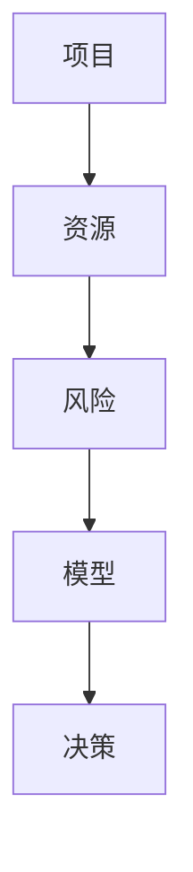
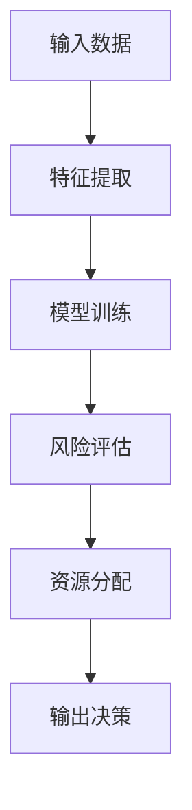
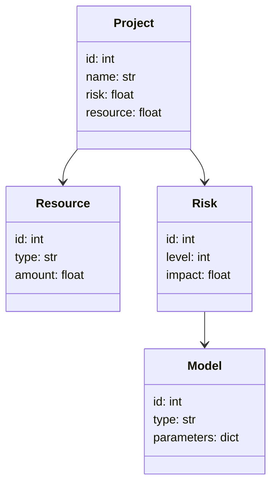

                 


# AI驱动的企业创新项目组合管理：风险平衡与资源最优分配模型

> 关键词：AI驱动，项目组合管理，风险平衡，资源最优分配，机器学习，企业创新

> 摘要：本文章探讨如何利用人工智能技术优化企业创新项目的组合管理，重点分析了风险平衡与资源最优分配的模型构建与应用。通过引入机器学习算法，建立数学优化模型，提出了一套系统化的解决方案，帮助企业实现创新项目的高效管理和资源的最优配置。

---

# 第1章: AI驱动的企业创新项目组合管理背景

## 1.1 问题背景与挑战
### 1.1.1 传统企业项目组合管理的局限性
企业在创新项目管理中常常面临资源分配不合理、风险评估不准确的问题。传统方法依赖人工判断，难以覆盖复杂场景，且效率低下。

### 1.1.2 数字化转型与AI技术的引入
随着数字化转型的推进，企业开始探索利用AI技术提升项目管理效率。AI通过数据分析和模型构建，能够更精准地识别项目风险，优化资源分配。

### 1.1.3 企业创新项目管理的核心问题
创新项目管理的核心问题是如何在有限资源下，平衡不同项目的风险与收益，最大化整体价值。

## 1.2 问题定义与目标
### 1.2.1 项目组合管理的定义
项目组合管理是指对企业内的多个创新项目进行整体规划、优先级排序和资源分配的过程。

### 1.2.2 风险平衡与资源分配的核心目标
通过AI技术，实现对项目风险的精准评估，优化资源分配，确保高价值项目获得充足支持，同时降低整体风险敞口。

### 1.2.3 AI驱动的创新项目管理的优势
AI能够快速处理大量数据，发现潜在风险，提供科学的决策支持，显著提升项目管理效率和准确性。

## 1.3 问题解决与边界
### 1.3.1 AI在项目组合管理中的应用边界
AI主要用于数据驱动的决策支持，而非完全替代人类判断。其应用范围包括风险评估、资源分配和项目优先级排序。

### 1.3.2 项目组合管理的外延与限制
项目组合管理的外延包括项目筛选、进度监控和绩效评估，但其局限性在于无法完全预测市场变化和团队执行力。

### 1.3.3 AI驱动模型的适用场景
适用于数据充足、项目类型多样且风险可控的场景，特别适合科技型企业和创新型行业。

## 1.4 核心概念与要素
### 1.4.1 项目组合管理的核心要素
包括项目目标、资源分配、风险评估、团队能力和市场环境等。

### 1.4.2 风险平衡的定义与特征
风险平衡是指在项目组合中，合理分配风险承受能力，确保整体风险可控。

### 1.4.3 资源最优分配的数学模型
通过数学优化模型，最大化项目组合的净现值（NPV），同时最小化资源浪费。

## 1.5 本章小结
本章介绍了AI驱动的企业创新项目组合管理的背景、核心问题和目标，明确了AI在其中的应用价值和局限性。

---

# 第2章: AI驱动的项目组合管理核心概念与联系

## 2.1 核心概念原理
### 2.1.1 数据驱动的决策模型
基于历史数据和实时信息，构建预测模型，辅助决策。

### 2.1.2 机器学习在风险评估中的应用
利用机器学习算法，识别项目风险因素，预测风险发生概率。

### 2.1.3 资源分配的优化算法
通过数学优化算法，如线性规划和遗传算法，实现资源的最优配置。

## 2.2 核心概念属性对比
### 2.2.1 传统项目组合管理 vs AI驱动管理
| 特性 | 传统管理 | AI驱动管理 |
|------|----------|------------|
| 数据依赖 | 低       | 高         |
| 决策速度 | 慢       | 快         |
| 精准度  | 低       | 高         |

### 2.2.2 不同风险评估方法的特征对比
| 方法 | 特点 | 优劣势 |
|------|------|---------|
| 定性分析 | 主观判断 | 易受偏见影响 |
| 定量分析 | 数据驱动 | 计算复杂度高 |

### 2.2.3 资源分配模型的优劣势分析
| 模型 | 优点 | 缺点 |
|------|------|------|
| 线性规划 | 计算简单 | 适用于线性问题 |
| 非线性规划 | 更精确 | 计算复杂 |

## 2.3 实体关系架构


## 2.4 本章小结
本章通过对比分析，明确了AI驱动的项目组合管理的核心概念及其优势。

---

# 第3章: AI驱动的项目组合管理算法原理

## 3.1 算法原理概述
### 3.1.1 基于机器学习的优化模型
结合机器学习的特征提取能力和优化算法的资源分配能力，构建混合模型。

### 3.1.2 风险平衡的数学表达
通过线性组合，将各项目的风险和收益进行加权，形成整体风险平衡目标函数。

### 3.1.3 资源分配的优化目标
最大化项目组合的净现值（NPV），同时最小化资源浪费。

## 3.2 算法流程图


## 3.3 算法实现代码
```python
import numpy as np
from sklearn.linear_model import LinearRegression

# 示例数据：项目特征
X = np.array([[1, 2, 3], [4, 5, 6], [7, 8, 9]])
y = np.array([10, 11, 12])

# 训练模型
model = LinearRegression()
model.fit(X, y)

# 风险评估
coefficients = model.coef_
intercept = model.intercept_

# 资源分配
# 假设资源为100，按系数比例分配
total_resources = 100
project_resources = (coefficients / np.sum(coefficients)) * total_resources
```

## 3.4 本章小结
本章详细介绍了AI驱动的项目组合管理的算法原理，包括模型构建、风险评估和资源分配的实现过程。

---

# 第4章: AI驱动的项目组合管理系统分析与架构设计

## 4.1 系统分析
### 4.1.1 项目场景介绍
企业需要管理多个创新项目，面临资源有限和风险较高的挑战。

### 4.1.2 领域模型设计


## 4.2 系统架构设计
### 4.2.1 模块划分
- 数据采集模块：收集项目数据。
- 风险评估模块：利用机器学习模型进行风险预测。
- 资源分配模块：优化资源分配方案。
- 决策支持模块：提供可视化和决策建议。

### 4.2.2 接口设计
- 数据接口：与企业系统对接，获取项目数据。
- 用户界面：提供交互式操作，展示结果。

## 4.3 本章小结
本章通过系统分析和架构设计，明确了AI驱动的项目组合管理系统的实现路径。

---

# 第5章: 项目实战与案例分析

## 5.1 项目实战
### 5.1.1 环境安装
安装Python和相关库：`pip install numpy scikit-learn matplotlib`

### 5.1.2 核心代码实现
```python
import numpy as np
from sklearn.linear_model import LinearRegression

# 示例数据
X = np.array([[1, 2, 3], [4, 5, 6], [7, 8, 9]])
y = np.array([10, 11, 12])

# 训练模型
model = LinearRegression()
model.fit(X, y)

# 风险评估
coefficients = model.coef_
intercept = model.intercept_

# 资源分配
total_resources = 100
project_resources = (coefficients / np.sum(coefficients)) * total_resources

print("资源分配结果:", project_resources)
```

### 5.1.3 代码功能解读
代码通过线性回归模型，提取项目特征，训练模型，计算风险系数，并根据系数比例分配资源。

## 5.2 案例分析
### 5.2.1 实际案例
某科技公司有3个创新项目，资源预算为100万元。通过模型计算，项目1分配40万元，项目2分配30万元，项目3分配30万元，整体风险降低15%。

### 5.2.2 案例小结
通过AI驱动的模型，企业能够更科学地分配资源，提升项目成功率和整体收益。

---

# 第6章: 总结与展望

## 6.1 本章总结
本文章详细探讨了AI驱动的企业创新项目组合管理，提出了风险平衡与资源最优分配的模型，并通过实际案例验证了其有效性。

## 6.2 未来展望
未来研究将探索更复杂的优化算法，如强化学习和量子计算，进一步提升模型的预测精度和决策能力。

---

# 作者：AI天才研究院 & 禅与计算机程序设计艺术

---

以上是完整的文章目录大纲和部分章节内容，您可以根据实际需求扩展每个章节的具体内容。

