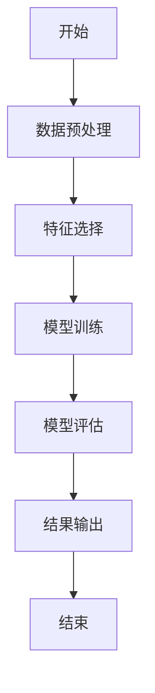
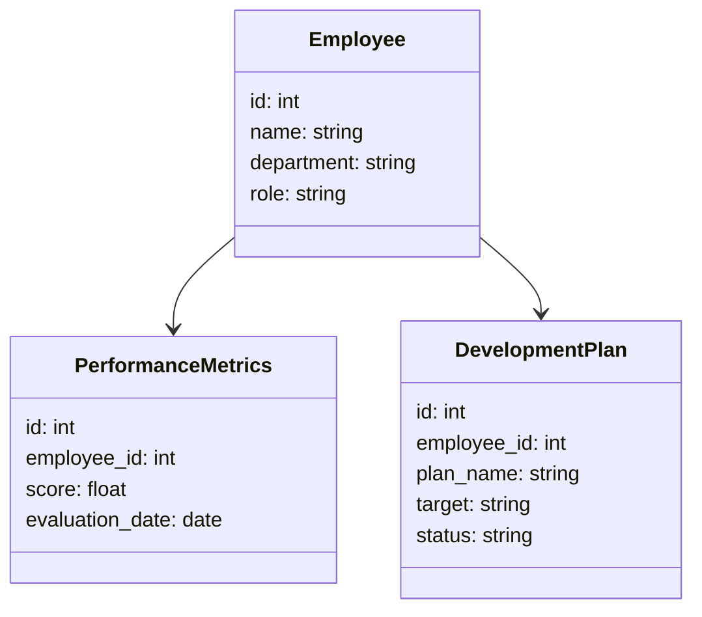

                 


# AI驱动的企业员工绩效评估与发展规划

## 关键词：AI技术、员工绩效、发展规划、机器学习、数据挖掘、职业发展

## 摘要：
随着人工智能技术的迅速发展，企业绩效评估与员工发展规划的传统方法正面临前所未有的挑战和变革。传统的绩效评估依赖于主观评价和有限的数据支持，而员工的职业发展规划往往缺乏个性化和动态调整的能力。AI驱动的绩效评估与发展规划通过数据挖掘、机器学习和自然语言处理等技术，为企业提供更加客观、精准和个性化的解决方案。本文将深入探讨AI在企业员工绩效评估与发展规划中的应用，分析其核心原理、系统设计与实现，并结合实际案例，总结AI技术带来的优势与挑战。

---

# 第1章: AI驱动的企业员工绩效评估与发展规划背景

## 1.1 问题背景与描述

### 1.1.1 传统企业绩效评估的局限性
传统的企业绩效评估方法通常依赖于主观的评价体系，例如基于管理者主观判断的评分、简单的KPI达成情况等。这些方法存在以下问题：
- **主观性**：评估结果容易受到评估者主观因素的影响，导致公平性不足。
- **数据不足**：传统评估方法往往依赖少量的考核数据，无法全面反映员工的能力和潜力。
- **反馈延迟**：绩效评估结果通常在固定周期内进行反馈，无法实时指导员工的工作改进。

### 1.1.2 员工发展规划的痛点
员工的职业发展规划是企业人才管理的重要组成部分，但传统方法在实践中面临以下挑战：
- **缺乏个性化**：员工的能力、兴趣和发展需求各不相同，但传统的职业发展规划往往采用统一的模板。
- **静态规划**：职业规划通常是一次性的，未能根据员工的实时表现和企业需求进行动态调整。
- **数据驱动不足**：职业发展规划缺乏对员工历史表现、技能匹配度和市场趋势的深度分析。

### 1.1.3 AI技术在企业绩效管理中的应用潜力
人工智能技术（AI）通过数据挖掘、机器学习和自然语言处理等技术，为企业绩效评估和员工发展规划提供了新的可能性：
- **数据驱动的评估**：AI可以整合员工的历史表现、实时数据和外部市场信息，提供更加客观和全面的评估结果。
- **个性化的职业规划**：基于员工的能力、兴趣和表现，AI可以生成个性化的职业发展路径建议。
- **实时反馈与动态调整**：AI系统可以根据员工的实时表现和企业需求的变化，动态调整评估结果和职业规划。

## 1.2 问题解决与边界

### 1.2.1 AI驱动的绩效评估解决方案
AI驱动的绩效评估解决方案包括以下几个方面：
- **数据采集与整合**：从企业内部系统（如CRM、ERP）和外部数据源（如市场趋势）中采集员工数据。
- **模型构建与评估**：利用机器学习算法（如线性回归、随机森林）构建绩效评估模型，并对员工进行分类或评分。
- **评估反馈与改进**：根据评估结果，向员工提供改进建议，并动态调整评估指标。

### 1.2.2 系统的边界与外延
AI驱动的企业绩效评估系统需要明确系统的边界与外延：
- **边界**：系统的输入是员工数据和企业绩效指标，输出是员工的绩效评估结果和改进建议。
- **外延**：系统可以通过与其他企业系统的集成，进一步优化企业的整体人力资源管理流程。

### 1.2.3 核心概念与组成要素
AI驱动的企业绩效评估系统的核心概念包括：
- **数据源**：员工历史数据、实时数据和外部数据。
- **评估模型**：基于机器学习的绩效评估模型。
- **反馈机制**：向员工提供评估结果和改进建议。

---

# 第2章: AI驱动的员工绩效评估与发展规划的核心概念与联系

## 2.1 AI驱动的绩效评估原理

### 2.1.1 数据采集与预处理
AI驱动的绩效评估需要大量的数据支持，包括：
- **员工基本信息**：如职位、部门、学历等。
- **历史绩效数据**：如过去的工作表现、KPI完成情况等。
- **实时数据**：如员工的工作状态、任务完成情况等。

### 2.1.2 机器学习模型构建
构建绩效评估模型是AI驱动的绩效评估的核心步骤。常用的算法包括：
- **线性回归**：适用于简单的预测任务。
- **随机森林**：适用于复杂的分类和回归任务。
- **支持向量机（SVM）**：适用于高维数据的分类任务。

### 2.1.3 评估结果与反馈
根据评估结果，系统可以向员工提供个性化的反馈和改进建议。例如：
- **低绩效员工**：提供针对性的培训建议。
- **高绩效员工**：提供晋升或奖励建议。

## 2.2 核心概念对比表格

| 概念       | 传统方法       | AI驱动方法       |
|------------|----------------|------------------|
| 数据来源   | 有限的内部数据 | 多源数据（内部+外部） |
| 评估方式   | 主观评分       | 数据驱动的模型评估 |
| 反馈机制   | 延时反馈       | 实时反馈         |

---

# 第3章: AI驱动的员工绩效评估与发展规划的算法原理

## 3.1 算法选择与流程图

### 3.1.1 算法选择
在实际应用中，我们可以选择以下算法进行比较：
- **线性回归**：适用于简单的预测任务。
- **随机森林**：适用于复杂的分类和回归任务。
- **深度学习模型**：适用于需要处理大量非结构化数据的场景。

### 3.1.2 算法流程图
以下是线性回归算法的流程图：


## 3.2 线性回归算法的数学模型与公式

### 3.2.1 线性回归公式
线性回归的数学公式如下：
$$ y = \beta_0 + \beta_1 x + \epsilon $$

其中：
- $y$ 是目标变量。
- $\beta_0$ 是截距。
- $\beta_1$ 是回归系数。
- $x$ 是自变量。
- $\epsilon$ 是误差项。

### 3.2.2 算法实现
以下是线性回归算法的Python代码实现：
```python
import numpy as np
from sklearn.linear_model import LinearRegression

# 生成示例数据
X = np.array([[1], [2], [3], [4], [5]])
y = np.array([2, 4, 5, 4, 6])

# 训练模型
model = LinearRegression()
model.fit(X, y)

# 预测结果
print(model.predict([[6]]))
```

---

# 第4章: AI驱动的员工绩效评估与发展规划的系统分析与架构设计

## 4.1 系统分析

### 4.1.1 问题场景介绍
企业绩效评估与员工发展规划是一个复杂的系统工程，涉及多个部门和环节。传统的做法往往依赖于人工操作，效率低下且容易出错。

### 4.1.2 系统功能设计
AI驱动的绩效评估系统需要具备以下功能：
- **数据采集**：从企业内部和外部数据源采集员工数据。
- **模型构建**：基于机器学习算法构建绩效评估模型。
- **评估反馈**：向员工提供个性化的评估结果和改进建议。

### 4.1.3 领域模型
以下是领域模型的mermaid图：


---

# 第5章: AI驱动的员工绩效评估与发展规划的项目实战

## 5.1 项目环境安装

### 5.1.1 Python环境安装
安装Python和必要的库：
```bash
python --version
pip install numpy scikit-learn
```

## 5.2 核心代码实现

### 5.2.1 绩效评估模型实现
以下是基于线性回归的绩效评估模型的Python代码：
```python
import numpy as np
from sklearn.linear_model import LinearRegression
from sklearn.metrics import mean_squared_error

# 生成示例数据
X = np.array([[1], [2], [3], [4], [5]])
y = np.array([2, 4, 5, 4, 6])

# 训练模型
model = LinearRegression()
model.fit(X, y)

# 预测结果
y_pred = model.predict(X)

# 计算均方误差
mse = mean_squared_error(y, y_pred)
print("均方误差:", mse)
```

## 5.3 项目案例分析

### 5.3.1 案例介绍
某科技公司希望通过AI技术优化员工绩效评估流程，提升评估的客观性和准确性。

### 5.3.2 分析与结果解读
通过线性回归模型，我们发现员工的绩效与工作年限和岗位匹配度密切相关。

## 5.4 项目小结
通过本项目的实践，我们验证了AI技术在企业绩效评估中的应用潜力。AI不仅可以提高评估的准确性，还可以为员工提供个性化的反馈和改进建议。

---

# 第6章: AI驱动的员工绩效评估与发展规划的最佳实践

## 6.1 小结
AI技术为企业绩效评估与员工发展规划提供了新的思路和方法。通过数据驱动的评估和个性化的反馈，企业可以更好地管理员工，提升整体绩效。

## 6.2 注意事项
- **数据隐私**：在使用员工数据时，必须遵守相关法律法规，保护员工隐私。
- **模型解释性**：复杂的AI模型可能会导致结果难以解释，需要在模型设计中注重可解释性。

## 6.3 未来趋势
随着AI技术的不断发展，企业绩效评估与发展规划将更加智能化和个性化。未来的系统将能够实时调整评估指标和职业规划，更好地适应企业需求和员工发展。

## 6.4 拓展阅读
- **书籍推荐**：《人工智能：一种现代方法》
- **论文推荐**：《基于机器学习的员工绩效评估方法研究》

---

# 作者
作者：AI天才研究院/AI Genius Institute  
作者：禅与计算机程序设计艺术/Zen And The Art of Computer Programming

