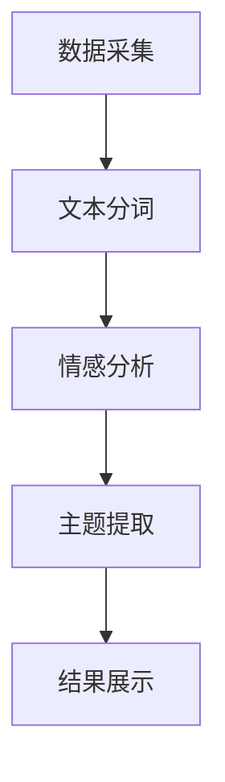
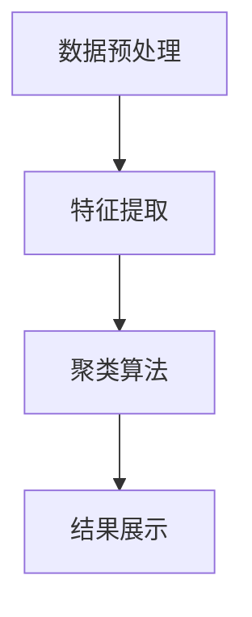
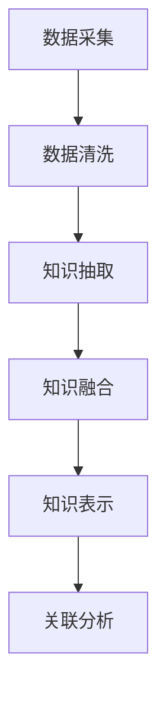
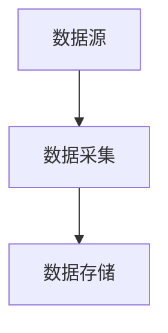
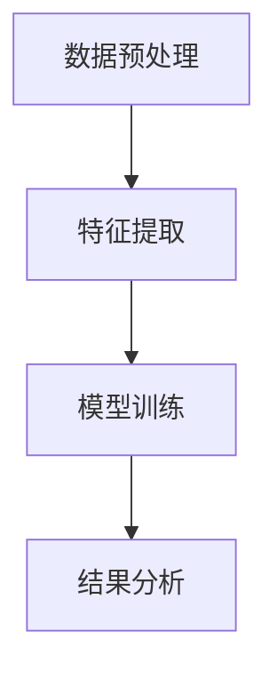
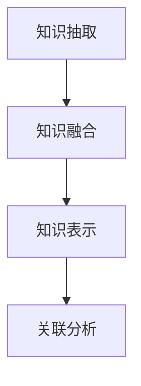
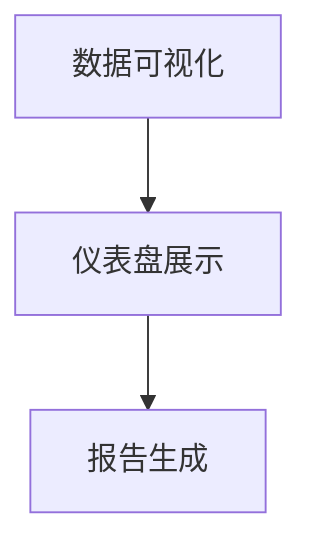
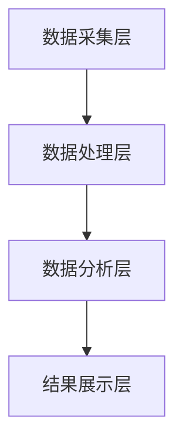
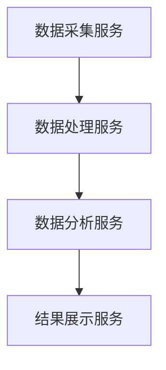

                 


# AI驱动的企业战略情报系统：竞争对手分析

> 关键词：AI, 企业战略, 竞争对手分析, 知识图谱, 自然语言处理, 机器学习

> 摘要：本文深入探讨了AI技术在企业战略情报系统中的应用，特别是竞争对手分析模块。通过系统化的分析流程和算法原理，结合实际案例和系统架构设计，展示了如何利用AI技术提升企业战略决策的准确性和效率。

---

# 第一部分: AI驱动的企业战略情报系统概述

## 第1章: 企业战略情报系统与竞争对手分析

### 1.1 企业战略情报系统的定义与背景

#### 1.1.1 企业战略情报的定义

企业战略情报系统是指通过收集、分析和处理内外部信息，为企业战略决策提供支持的系统。它不仅关注企业的内部运营，还包括对竞争对手、市场趋势、客户行为等外部因素的分析。通过整合多源数据，企业能够更好地识别机会和威胁，制定科学的战略规划。

#### 1.1.2 竞争对手分析的重要性

竞争对手分析是企业战略情报系统的核心模块之一。通过对竞争对手的产品、市场策略、财务状况、研发能力等多维度信息的分析，企业可以更好地了解市场格局，制定更具竞争力的市场策略。例如，当一家企业计划进入一个新市场时，竞争对手分析可以帮助其了解市场的主要参与者、他们的优势和劣势，从而制定更有针对性的竞争策略。

#### 1.1.3 AI技术在战略情报中的应用前景

随着AI技术的快速发展，企业战略情报系统正在逐步向智能化方向转型。AI技术可以通过自然语言处理（NLP）、机器学习等技术，从海量数据中提取有价值的信息，帮助企业在复杂的市场环境中快速做出决策。例如，通过AI驱动的竞争对手分析系统，企业可以实时监控竞争对手的社交媒体动态、产品发布信息以及市场反馈，从而快速调整自己的市场策略。

### 1.2 AI驱动的战略情报系统的概念

#### 1.2.1 AI在情报分析中的优势

AI技术在情报分析中的优势主要体现在以下几个方面：

1. **数据处理能力**：AI系统可以处理海量数据，包括文本、图像、视频等多种数据类型，帮助企业在复杂的数据环境中快速找到关键信息。
2. **实时分析能力**：通过流数据处理技术，AI系统可以实时监控市场动态，为企业提供实时的竞争情报。
3. **预测能力**：基于历史数据和机器学习模型，AI系统可以预测竞争对手的未来行为，为企业制定前瞻性战略提供支持。

#### 1.2.2 战略情报系统的构成要素

AI驱动的战略情报系统通常包括以下几个构成要素：

1. **数据采集模块**：负责从多种数据源（如社交媒体、新闻网站、行业报告等）采集数据。
2. **数据处理模块**：对采集到的数据进行清洗、转换和整合，为后续分析提供高质量的数据。
3. **数据分析模块**：利用NLP、机器学习等技术对数据进行深入分析，识别关键信息。
4. **知识图谱构建模块**：将分析结果转化为知识图谱，帮助用户更直观地理解市场格局。
5. **结果展示模块**：以可视化的方式呈现分析结果，支持用户进行决策。

#### 1.2.3 竞争对手分析的流程与方法

竞争对手分析的流程通常包括以下几个步骤：

1. **数据采集**：从多种数据源采集竞争对手的相关信息。
2. **数据清洗**：对采集到的数据进行去重、标准化处理。
3. **特征提取**：从数据中提取关键特征，如竞争对手的市场占有率、产品特点、客户评价等。
4. **模型训练**：利用机器学习算法（如聚类分析、分类算法）对竞争对手进行分类和预测。
5. **结果分析**：结合业务目标，对分析结果进行解读，制定相应的竞争策略。

## 第2章: AI驱动的战略情报系统的核心概念与联系

### 2.1 核心概念原理

#### 2.1.1 数据采集与处理

数据采集与处理是AI驱动的战略情报系统的基础。数据采集模块需要从多种数据源（如社交媒体、新闻网站、行业报告等）采集竞争对手的相关信息。数据处理模块需要对采集到的数据进行清洗、转换和整合，确保数据的准确性和一致性。

#### 2.1.2 自然语言处理在情报分析中的应用

自然语言处理（NLP）技术在情报分析中发挥着重要作用。通过NLP技术，系统可以自动提取文本中的关键词、主题和情感倾向，帮助用户快速理解竞争对手的市场动态。例如，通过分析竞争对手的新闻稿和社交媒体评论，可以识别其市场策略的变化趋势。

#### 2.1.3 知识图谱构建与分析

知识图谱是一种用于表示知识的图形结构，可以帮助用户更直观地理解市场格局。通过将竞争对手的相关信息（如公司背景、产品特点、市场策略等）转化为知识图谱，用户可以快速识别竞争对手之间的关联关系，发现潜在的合作机会或威胁。

### 2.2 概念属性特征对比表格

以下是战略情报系统与传统情报系统的对比：

| 特性               | 传统情报系统                     | AI驱动的战略情报系统                 |
|--------------------|----------------------------------|--------------------------------------|
| 数据来源           | 有限的结构化数据                | 结构化、非结构化数据                 |
| 数据处理能力       | 手动处理，效率低                 | 自动化处理，效率高                   |
| 分析能力           | 依赖人工经验                     | 基于机器学习算法，智能化分析         |
| 实时性             | 无法实时监控                     | 支持实时数据处理和分析               |

### 2.3 ER实体关系图架构

以下是战略情报系统的实体关系图：

```mermaid
erDiagram
    competitor {
        id
        name
        industry
        market_share
        product_info
    }
    market {
        id
        name
        competitor_id
        shareholding_ratio
        revenue
    }
    strategy {
        id
        name
        competitor_id
        start_date
        end_date
        strategy_type
    }
    relationship {
        id
        source_competitor
        target_competitor
        relationship_type
        strength
    }
    competitor --> relationship: 参与
    market --> competitor: 属于
    strategy --> competitor: 制定
```

---

# 第二部分: 竞争对手分析的算法原理

## 第3章: 竞争对手分析的算法原理

### 3.1 竞争对手分析的流程

#### 3.1.1 数据预处理

数据预处理是竞争对手分析的基础。主要包括以下步骤：

1. **数据清洗**：去除重复数据、缺失值和噪声数据。
2. **数据转换**：将数据转换为适合算法处理的格式，如文本分词、数值归一化等。
3. **数据整合**：将来自不同数据源的数据进行整合，确保数据的连贯性和一致性。

#### 3.1.2 数据分析与建模

数据分析与建模是竞争对手分析的核心。主要包括以下步骤：

1. **特征提取**：从数据中提取关键特征，如竞争对手的市场占有率、产品特点、客户评价等。
2. **模型训练**：利用机器学习算法（如聚类分析、分类算法）对竞争对手进行分类和预测。
3. **结果分析**：结合业务目标，对分析结果进行解读，制定相应的竞争策略。

#### 3.1.3 结果可视化

结果可视化是竞争对手分析的重要环节。通过可视化工具（如Tableau、Power BI）将分析结果以图表、仪表盘等形式呈现，帮助用户更直观地理解分析结果。

### 3.2 竞争对手分析的算法实现

#### 3.2.1 基于自然语言处理的文本分析

自然语言处理技术在竞争对手分析中发挥着重要作用。例如，通过分析竞争对手的新闻稿和社交媒体评论，可以识别其市场策略的变化趋势。以下是基于NLP的文本分析流程：



#### 3.2.2 基于机器学习的分类算法

机器学习算法在竞争对手分析中被广泛应用。例如，可以通过聚类分析将竞争对手分为不同的类别（如按市场占有率、产品特点等）。以下是聚类分析的流程：



#### 3.2.3 基于知识图谱的关联分析

知识图谱可以帮助用户更直观地理解市场格局。通过将竞争对手的相关信息（如公司背景、产品特点、市场策略等）转化为知识图谱，用户可以快速识别竞争对手之间的关联关系，发现潜在的合作机会或威胁。以下是知识图谱构建的流程：



### 3.3 竞争对手分析的数学模型与公式

#### 3.3.1 文本相似度计算公式

文本相似度计算是NLP技术中的一个重要环节。以下是常用的余弦相似度公式：

$$\text{cos}(\theta) = \frac{\vec{A} \cdot \vec{B}}{|\vec{A}| |\vec{B}|}$$

其中，$\vec{A}$和$\vec{B}$分别是两个文本的向量表示。

#### 3.3.2 竞争对手关系的图模型

竞争对手关系的图模型可以通过图论中的边表示。例如，可以使用PageRank算法对竞争对手的影响力进行评估：

$$\vec{x}^{(k+1)} = \alpha \vec{x}^{(k)} + (1-\alpha) \vec{M} \vec{x}^{(k)}$$

其中，$\vec{M}$是转移矩阵，$\alpha$是阻尼系数。

#### 3.3.3 竞争对手影响力评估模型

竞争对手影响力评估模型可以通过加权求和的方式进行计算：

$$I = \sum_{i=1}^{n} w_i x_i$$

其中，$w_i$是第$i$个特征的权重，$x_i$是第$i$个特征的值。

---

# 第三部分: 系统分析与架构设计

## 第4章: 竞争对手分析系统的架构设计

### 4.1 竞争对手分析系统的功能设计

#### 4.1.1 数据采集模块

数据采集模块负责从多种数据源（如社交媒体、新闻网站、行业报告等）采集竞争对手的相关信息。以下是数据采集模块的功能流程图：



#### 4.1.2 数据分析模块

数据分析模块负责对采集到的数据进行清洗、转换和整合，为后续分析提供高质量的数据。以下是数据分析模块的功能流程图：



#### 4.1.3 知识图谱构建模块

知识图谱构建模块负责将分析结果转化为知识图谱，帮助用户更直观地理解市场格局。以下是知识图谱构建模块的功能流程图：



#### 4.1.4 结果展示模块

结果展示模块负责以可视化的方式呈现分析结果，支持用户进行决策。以下是结果展示模块的功能流程图：



### 4.2 竞争对手分析系统的架构设计

#### 4.2.1 分层架构设计

竞争对手分析系统的分层架构设计包括数据采集层、数据处理层、数据分析层和结果展示层。以下是分层架构设计图：



#### 4.2.2 微服务架构设计

微服务架构设计将系统划分为多个独立的服务模块，每个模块负责特定的功能。以下是微服务架构设计图：



#### 4.2.3 可扩展性与可维护性设计

为了确保系统的可扩展性和可维护性，可以通过模块化设计和依赖注入的方式进行实现。以下是模块化设计的示意图：


### 4.3 竞争对手分析系统的接口设计

竞争对手分析系统的接口设计需要考虑以下几个方面：

1. **数据接口**：定义数据的输入格式和输出格式，确保数据的顺利传输。
2. **API接口**：提供RESTful API，方便其他系统调用竞争对手分析结果。
3. **可视化接口**：提供友好的用户界面，支持用户进行交互操作。

### 4.4 竞争对手分析系统的交互设计

竞争对手分析系统的交互设计需要考虑以下几点：

1. **用户角色**：根据用户的角色（如决策者、分析师）设计不同的权限和操作界面。
2. **操作流程**：设计清晰的操作流程，确保用户能够快速上手。
3. **反馈机制**：提供实时的反馈机制，帮助用户了解操作结果。

---

# 第五章: 项目实战

## 5.1 竞争对手分析系统的环境安装

为了运行竞争对手分析系统，需要安装以下环境和工具：

1. **Python**：推荐使用Python 3.8及以上版本。
2. **Jupyter Notebook**：用于数据分析和可视化。
3. **TensorFlow**：用于机器学习模型的训练。
4. **Nltk**：用于自然语言处理任务。
5. **Graphviz**：用于生成知识图谱的可视化图。

## 5.2 竞争对手分析系统的核心实现

以下是竞争对手分析系统的核心实现代码：

```python
import nltk
from sklearn.feature_extraction.text import TfidfVectorizer
from sklearn.cluster import KMeans
import matplotlib.pyplot as plt

# 数据预处理
def preprocess(text):
    return nltk.word_tokenize(text.lower())

# 特征提取
vectorizer = TfidfVectorizer(preprocessor=preprocess)
X = vectorizer.fit_transform(corpus)

# 模型训练
model = KMeans(n_clusters=3, random_state=42)
model.fit(X)

# 结果分析
print("Number of clusters:", model.n_clusters)
print("Cluster centers:", model.cluster_centers_)
```

## 5.3 项目实战的详细解读与分析

通过对实际案例的分析，可以验证竞争对手分析系统的有效性和实用性。例如，分析竞争对手的市场策略变化趋势，可以通过以下步骤进行：

1. **数据采集**：从社交媒体和新闻网站采集竞争对手的市场动态。
2. **数据清洗**：去除重复数据和噪声数据。
3. **特征提取**：提取关键词和主题。
4. **模型训练**：利用聚类分析将竞争对手分为不同的类别。
5. **结果展示**：生成可视化报告，支持用户进行决策。

## 5.4 项目小结

通过实际案例的分析，可以发现竞争对手分析系统在企业战略决策中的重要作用。通过AI技术，企业可以快速获取竞争对手的市场动态，制定更具竞争力的市场策略。

---

# 结语

AI技术正在逐步改变企业战略情报系统的运作方式。通过本文的深入分析，我们可以看到AI在竞争对手分析中的巨大潜力。未来，随着技术的不断发展，AI驱动的战略情报系统将更加智能化、自动化，为企业提供更强大的支持。

---

# 作者

作者：AI天才研究院/AI Genius Institute & 禅与计算机程序设计艺术 /Zen And The Art of Computer Programming

