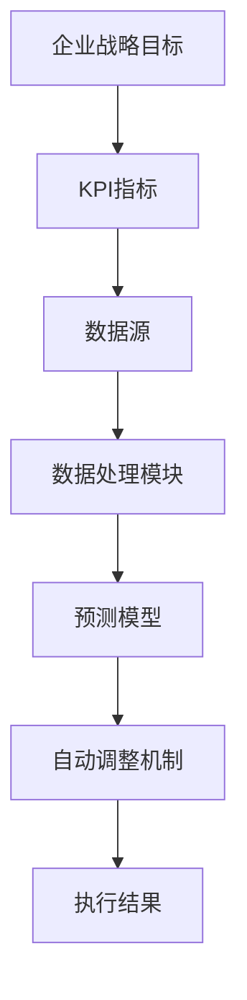
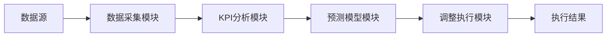
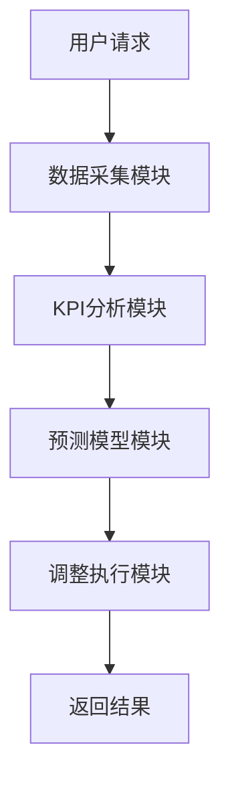

                 


# AI驱动的企业战略执行仪表盘：实时KPI追踪与自动调整

## 关键词：人工智能, 企业战略, KPI追踪, 自动调整, 数据驱动决策, 仪表盘设计

## 摘要：  
在现代企业环境中，实时监控和优化战略执行是确保企业高效运作的关键。本文介绍了一种基于AI的解决方案，通过实时KPI追踪与自动调整机制，帮助企业实现战略执行的智能化和自动化。文章从背景分析、核心概念、算法原理到系统架构，详细阐述了AI驱动仪表盘的设计与实现，并通过实际案例展示了其在企业战略执行中的应用价值。

---

## 第1章: 问题背景与核心概念

### 1.1 问题背景
#### 1.1.1 传统企业战略执行的挑战
企业在执行战略目标时，常常面临以下问题：
- **数据分散**：来自不同部门和系统的数据难以整合，导致信息孤岛。
- **滞后性**：传统KPI报告通常基于历史数据，无法实时反映当前状态。
- **手动调整**：战略执行中的调整依赖人工决策，效率低下且容易出错。

#### 1.1.2 数据驱动决策的必要性
企业需要通过实时数据和预测模型来快速响应市场变化，优化资源配置。数据驱动决策能够提高企业灵活性和竞争力。

#### 1.1.3 AI技术在企业战略执行中的作用
AI技术可以通过实时数据分析、预测建模和自动化调整，帮助企业实现战略执行的智能化和高效化。

### 1.2 核心概念
#### 1.2.1 企业战略执行仪表盘的定义
仪表盘是一种可视化工具，用于实时监控和分析企业战略执行的关键指标（KPI），并提供数据驱动的决策支持。

#### 1.2.2 实时KPI追踪的实现方式
通过AI算法实时分析数据源，提取关键指标，并通过可视化界面呈现给用户。

#### 1.2.3 自动调整机制的核心原理
基于实时数据分析和预测模型，系统能够自动识别偏差，并提出调整建议或直接执行调整。

### 1.3 问题解决与边界
#### 1.3.1 问题描述与目标设定
企业的战略执行目标通常是提高效率、降低成本、增强客户满意度等。实时KPI追踪与自动调整的目标是快速识别问题并优化执行过程。

#### 1.3.2 解决方案的边界与外延
解决方案的边界包括数据源的范围、调整的范围和系统的可扩展性。外延则涉及与其他系统的集成和数据隐私保护。

#### 1.3.3 核心要素与组成结构
核心要素包括数据采集模块、KPI分析模块、预测模型模块和调整执行模块。

---

## 第2章: 核心概念与联系

### 2.1 AI驱动仪表盘的核心原理
#### 2.1.1 数据采集与处理流程
数据采集模块从各个系统中获取数据，并进行清洗、转换和存储。

#### 2.1.2 KPI分析与预测模型
使用机器学习模型对KPI进行实时预测，并分析预测结果与实际值的偏差。

#### 2.1.3 自动调整机制的实现方式
系统根据预测结果和实际偏差，自动调整执行策略或发出调整建议。

### 2.2 核心概念对比分析
#### 2.2.1 数据源与数据处理方式对比
- 数据源：结构化数据（如销售数据、生产数据）和非结构化数据（如文本、图像）。
- 数据处理方式：数据清洗、特征提取、数据增强。

#### 2.2.2 不同KPI分析方法的优劣势
- 常见方法：回归分析、聚类分析、时间序列分析。
- 优劣势对比：回归分析适合因果关系分析，时间序列分析适合预测趋势。

#### 2.2.3 自动调整算法的特征分析
- 常见算法：强化学习、遗传算法、模拟退火。
- 特征分析：实时性、自适应性、可解释性。

### 2.3 实体关系图


---

## 第3章: 算法原理与实现

### 3.1 机器学习算法基础
#### 3.1.1 数据预处理方法
- 数据清洗：处理缺失值、重复值和异常值。
- 特征提取：从数据中提取有用的特征，如主成分分析（PCA）。

#### 3.1.2 特征提取与选择
- 特征选择：基于特征重要性进行选择，如使用LASSO回归。
- 特征提取：使用主成分分析（PCA）降低特征维度。

#### 3.1.3 常见机器学习模型介绍
- 线性回归：用于预测连续型KPI。
- 支持向量机（SVM）：用于分类任务。
- 随机森林：用于特征重要性分析和分类/回归任务。

### 3.2 深度学习模型应用
#### 3.2.1 神经网络结构设计
- 输入层：接收原始数据。
- 隐藏层：通过多层神经网络提取特征。
- 输出层：生成预测结果。

#### 3.2.2 模型训练与优化
- 模型训练：使用反向传播算法和梯度下降优化。
- 模型优化：调整超参数，如学习率、批次大小。

#### 3.2.3 模型部署与实时预测
- 模型部署：将训练好的模型部署到生产环境中。
- 实时预测：通过API接口接收实时数据，返回预测结果。

### 3.3 算法实现代码示例
```python
# 示例代码：KPI预测模型训练
import numpy as np
from sklearn.linear_model import LinearRegression

# 数据准备
X = np.array([[x1], [x2], [x3], ...])  # 特征向量
y = np.array([y1, y2, y3, ...])  # 标签

# 模型训练
model = LinearRegression()
model.fit(X, y)

# 预测与评估
y_pred = model.predict(X)
```

### 3.4 数学模型与公式
#### 3.4.1 线性回归模型
$$ y = \beta_0 + \beta_1 x_1 + \beta_2 x_2 + ... + \beta_n x_n $$

#### 3.4.2 神经网络模型
$$ a^{[l]} = \sigma(w^{[l]} a^{[l-1]} + b^{[l]}) $$

其中，$a^{[l]}$ 是第$l$层的激活值，$\sigma$ 是激活函数，$w^{[l]}$ 和 $b^{[l]}$ 分别是权重和偏置。

---

## 第4章: 系统分析与架构设计

### 4.1 问题场景介绍
企业需要实时监控销售、生产、客户服务等KPI，并根据预测结果自动调整资源配置。

### 4.2 系统功能设计
- 数据采集模块：从ERP、CRM等系统中获取实时数据。
- KPI分析模块：对数据进行清洗、转换和分析。
- 预测模型模块：基于机器学习模型生成预测结果。
- 调整执行模块：根据预测结果自动调整执行策略。

### 4.3 系统架构设计


### 4.4 系统接口设计
- 数据采集接口：通过API获取实时数据。
- 模型预测接口：通过API返回预测结果。
- 调整执行接口：通过API执行调整策略。

### 4.5 系统交互流程图


---

## 第5章: 项目实战

### 5.1 环境安装
- 安装Python和必要的库（如NumPy、scikit-learn、TensorFlow）。
- 安装可视化工具（如Matplotlib、Seaborn）。

### 5.2 核心代码实现
```python
# 数据处理模块
import pandas as pd

data = pd.read_csv('data.csv')
data_cleaned = data.dropna()

# 模型训练模块
from sklearn.linear_model import LinearRegression
model = LinearRegression()
model.fit(X_train, y_train)

# 调整执行模块
def auto_adjust(predicted, actual):
    if predicted > actual:
        return "增加资源"
    else:
        return "减少资源"
```

### 5.3 代码解读与分析
- 数据处理模块：清洗数据，去除缺失值。
- 模型训练模块：使用线性回归模型进行训练。
- 调整执行模块：根据预测结果和实际值调整资源分配。

### 5.4 实际案例分析
通过一个实际案例，展示如何使用仪表盘进行实时KPI追踪和自动调整。

### 5.5 项目小结
总结项目实现的关键点和经验教训。

---

## 第6章: 最佳实践与小结

### 6.1 最佳实践
- 数据质量是关键：确保数据准确性和完整性。
- 模型选择要合适：根据问题类型选择合适的算法。
- 系统可扩展性：设计灵活的架构，便于后续扩展。

### 6.2 小结
本文详细介绍了AI驱动的企业战略执行仪表盘的设计与实现，从背景分析、核心概念到算法实现，再到系统架构和项目实战，为读者提供了全面的指导。

### 6.3 注意事项
- 数据隐私保护：确保数据安全和合规性。
- 系统稳定性：确保系统在高负载下的稳定性。

### 6.4 拓展阅读
- 《机器学习实战》
- 《深度学习入门：基于Python》
- 《企业架构设计：复杂系统的简化之道》

---

## 作者：AI天才研究院 & 禅与计算机程序设计艺术

---

以上就是《AI驱动的企业战略执行仪表盘：实时KPI追踪与自动调整》的技术博客文章的详细目录和内容框架。

