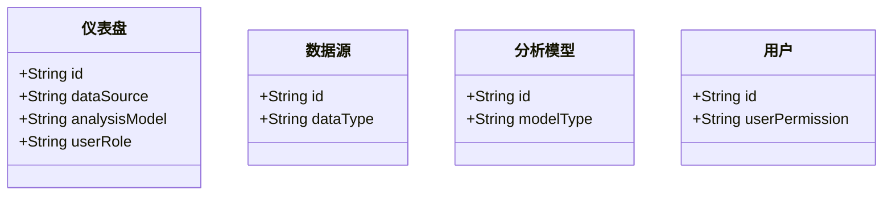
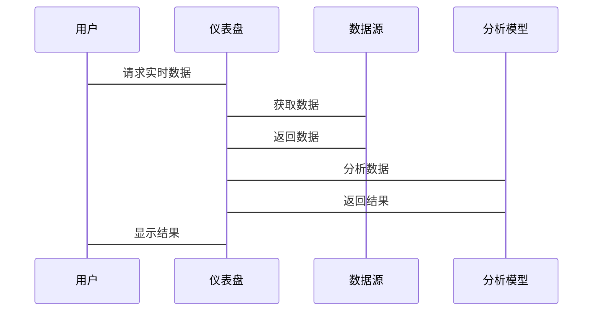

                 


# AI驱动的企业战略执行仪表盘：实时KPI追踪与调整

## 关键词：
- AI驱动
- 企业战略
- KPI追踪
- 实时调整
- 数据分析

## 摘要：
本文深入探讨了如何利用人工智能技术构建企业战略执行仪表盘，实现KPI的实时追踪与动态调整。通过分析AI在KPI管理中的应用，结合算法原理和系统架构设计，提供了一套完整的解决方案，帮助企业提升战略执行效率和应对市场变化的能力。

---

## 第一部分: 背景介绍

### 第1章: 问题背景与核心概念

#### 1.1 问题背景
##### 1.1.1 企业战略执行的挑战
在现代企业中，战略执行的效率和效果直接影响企业的生存与发展。然而，传统的KPI管理方式存在数据滞后、分析不及时、调整不够灵活等问题，难以应对快速变化的市场环境。

##### 1.1.2 传统KPI管理的局限性
- 数据采集延迟：传统KPI管理依赖定期报告，无法实时反映企业运营状况。
- 分析单一：传统分析方法通常基于静态数据，难以捕捉动态变化。
- 调整缓慢：策略调整往往需要经过多层审批，导致反应时间过长。

##### 1.1.3 AI驱动的解决方案
人工智能技术的应用可以实时采集、分析数据，并根据结果动态调整策略，从而提高KPI管理的效率和精准度。

#### 1.2 问题描述
##### 1.2.1 KPI实时追踪的需求
企业需要实时了解各项关键指标的执行情况，以便快速做出决策。

##### 1.2.2 数据孤岛与信息滞后
不同部门和系统之间的数据分散，导致信息无法及时整合和分析。

##### 1.2.3 策略调整的及时性要求
在市场环境快速变化的情况下，企业需要能够迅速调整战略，以应对突发情况。

#### 1.3 问题解决
##### 1.3.1 AI在KPI管理中的应用
通过机器学习算法，AI可以实时分析数据，提供预测和建议，辅助决策者进行策略调整。

##### 1.3.2 实时数据处理的技术实现
利用流数据处理技术，AI系统可以实时采集和分析数据，确保信息的及时性。

##### 1.3.3 智能调整机制的设计
基于实时数据的分析结果，AI系统可以自动生成调整建议，帮助企业在最短时间内优化策略。

#### 1.4 边界与外延
##### 1.4.1 仪表盘的功能边界
仪表盘主要用于实时数据展示和分析，不直接参与企业的具体业务操作。

##### 1.4.2 与企业其他系统的交互
仪表盘需要与企业的ERP、CRM等系统对接，获取和整合数据。

##### 1.4.3 未来的扩展方向
随着技术的发展，仪表盘可以进一步集成更多的AI功能，如自然语言处理和自动化决策。

#### 1.5 核心要素组成
##### 1.5.1 数据源的多样性
仪表盘需要整合来自不同部门和系统的数据，确保全面性。

##### 1.5.2 AI算法的实时性
实时数据处理和分析能力是仪表盘的核心竞争力。

##### 1.5.3 用户界面的直观性
直观友好的界面设计能够提高用户的使用体验和工作效率。

---

## 第二部分: 核心概念与联系

### 第2章: 核心概念解析

#### 2.1 AI驱动的仪表盘核心概念
##### 2.1.1 实时数据采集
通过传感器、API接口等方式，实时采集企业运营数据。

##### 2.1.2 KPI分析模型
基于机器学习的模型，对实时数据进行分析，生成预测结果。

##### 2.1.3 反馈机制
根据分析结果，自动生成调整建议，并实时反馈给相关部门。

#### 2.2 概念属性对比
##### 2.2.1 数据源类型对比
| 数据源类型 | 描述 |
|------------|------|
| 结构化数据 | 如数据库中的数值型数据 |
| 非结构化数据 | 如文本、图像等 |
| 实时数据 | 需要实时采集和处理的数据 |

##### 2.2.2 分析模型的性能对比
| 模型类型 | 处理速度 | 准确率 |
|----------|----------|--------|
| 线性回归 | 较快 | 中等 |
| 时间序列 | 较慢 | 高 |

##### 2.2.3 ER实体关系图
```mermaid
erd
  战略执行仪表盘
    统一标识符: id
    数据来源: dataSource
    分析模型: analysisModel
    用户角色: userRole
  实体: 数据源
    统一标识符: id
    数据类型: dataType
  实体: 分析模型
    统一标识符: id
    模型类型: modelType
  实体: 用户
    统一标识符: id
    用户权限: userPermission
```

---

## 第三部分: 算法原理讲解

### 第3章: 算法原理与实现

#### 3.1 数据预处理
##### 3.1.1 数据清洗
使用Python的Pandas库进行数据清洗，去除无效数据和异常值。
```python
import pandas as pd

# 读取数据
df = pd.read_csv('data.csv')

# 删除空值
df.dropna(inplace=True)

# 去除重复值
df.drop_duplicates(inplace=True)
```

##### 3.1.2 数据转换
将数据转换为适合模型训练的格式，例如标准化或归一化。
```python
from sklearn.preprocessing import StandardScaler

scaler = StandardScaler()
scaled_data = scaler.fit_transform(df[['feature1', 'feature2']])
```

#### 3.2 模型训练
##### 3.2.1 线性回归模型
使用线性回归模型预测KPI的趋势。
```python
from sklearn.linear_model import LinearRegression

model = LinearRegression()
model.fit(scaled_data, target)
```

##### 3.2.2 时间序列模型
使用LSTM（长短期记忆网络）处理时间序列数据。
```python
from keras.layers import LSTM, Dense
from keras.models import Sequential

model = Sequential()
model.add(LSTM(64, input_shape=(timesteps, features)))
model.add(Dense(1))
model.compile(optimizer='adam', loss='mean_squared_error')
model.fit(x_train, y_train, epochs=10, batch_size=32)
```

#### 3.3 实时预测与反馈
##### 3.3.1 实时数据流处理
使用Apache Kafka处理实时数据流。
```python
from kafka import KafkaConsumer

consumer = KafkaConsumer('kpistream', bootstrap_servers='localhost:9092')
for message in consumer:
    data = message.value
    # 数据处理
    process_data(data)
```

##### 3.3.2 反馈机制
根据模型预测结果，自动生成调整建议。
```python
# 示例反馈逻辑
if predicted_value < target_value:
    suggest_adjustment('increase budget')
else:
    suggest_adjustment('reduce expenses')
```

---

## 第四部分: 系统分析与架构设计方案

### 第4章: 系统架构设计

#### 4.1 问题场景介绍
企业需要实时监控KPI，及时调整策略，以应对市场变化。

#### 4.2 项目介绍
开发一个基于AI的企业战略执行仪表盘，实现KPI的实时追踪与调整。

#### 4.3 系统功能设计
##### 4.3.1 领域模型


##### 4.3.2 系统架构


##### 4.3.3 接口设计
- 数据接口：用于数据源与仪表盘之间的数据传输。
- 分析接口：用于分析模型接收数据并返回结果。
- 用户接口：用于用户查看实时数据和调整建议。

##### 4.3.4 交互流程


---

## 第五部分: 项目实战

### 第5章: 项目实现与案例分析

#### 5.1 环境安装
- Python 3.8+
- Jupyter Notebook
- Pandas、Scikit-learn、Keras、Apache Kafka

#### 5.2 核心代码实现
##### 5.2.1 数据处理代码
```python
import pandas as pd
import numpy as np
from sklearn.preprocessing import StandardScaler
from sklearn.linear_model import LinearRegression
from keras.layers import LSTM, Dense
from keras.models import Sequential
from kafka import KafkaConsumer

# 数据处理
data = pd.read_csv('data.csv')
data = data.dropna()
scaled_data = StandardScaler().fit_transform(data[['feature1', 'feature2']])

# 线性回归模型
model_lr = LinearRegression()
model_lr.fit(scaled_data, data['target'])

# LSTM模型
model_lstm = Sequential()
model_lstm.add(LSTM(64, input_shape=(timesteps, features)))
model_lstm.add(Dense(1))
model_lstm.compile(optimizer='adam', loss='mean_squared_error')
model_lstm.fit(x_train, y_train, epochs=10, batch_size=32)

# 实时数据处理
consumer = KafkaConsumer('kpistream', bootstrap_servers='localhost:9092')
for message in consumer:
    data_point = message.value
    # 处理数据并进行预测
    prediction = model_lstm.predict(data_point)
    # 反馈机制
    if prediction < target:
        suggest_adjustment('increase budget')
    else:
        suggest_adjustment('reduce expenses')
```

##### 5.2.2 案例分析
假设某企业销售KPI出现下降趋势，仪表盘实时分析数据后，建议增加市场推广预算，最终帮助企业扭转销售下滑的趋势。

#### 5.3 项目小结
通过实际案例，展示了AI驱动的仪表盘在实时KPI追踪与调整中的应用价值，帮助企业快速响应市场变化。

---

## 第六部分: 最佳实践

### 第6章: 总结与展望

#### 6.1 小结
AI驱动的企业战略执行仪表盘通过实时数据处理和智能分析，显著提高了KPI管理的效率和精准度。

#### 6.2 注意事项
- 数据隐私和安全问题需要特别注意。
- 系统的实时性和稳定性是关键，需要进行充分的测试和优化。

#### 6.3 拓展阅读
- 推荐阅读《机器学习实战》和《深度学习》等书籍，进一步了解AI技术的应用。

---

## 作者：AI天才研究院 & 禅与计算机程序设计艺术

---

**摘要：** 本文详细探讨了如何利用AI技术构建企业战略执行仪表盘，实现KPI的实时追踪与动态调整。通过分析AI在KPI管理中的应用，结合算法原理和系统架构设计，提供了一套完整的解决方案，帮助企业提升战略执行效率和应对市场变化的能力。

