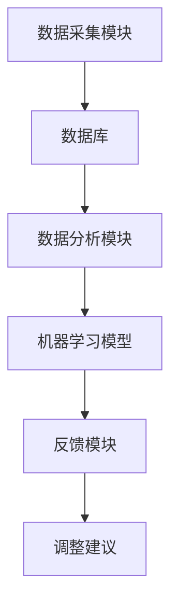
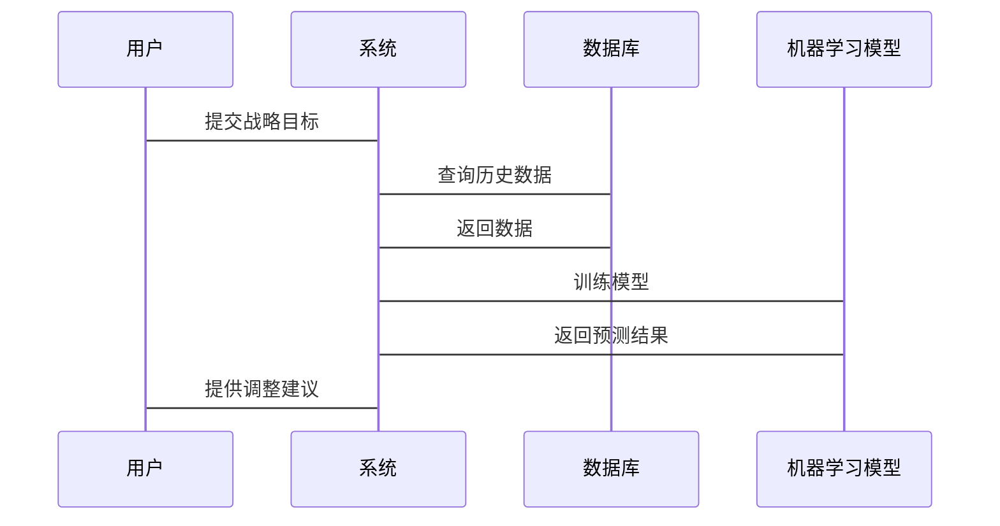

                 


# AI驱动的企业战略执行监控与调整系统

> 关键词：AI驱动，战略执行，监控系统，调整系统，企业战略，实时反馈，人机协同

> 摘要：本文探讨了如何利用人工智能技术构建企业战略执行监控与调整系统。通过分析传统战略执行的痛点，提出了基于AI的实时监控、预测与调整机制，并详细阐述了系统的核心算法、架构设计和实际应用案例。文章还提供了系统的实现方案和最佳实践建议，为企业的战略管理提供了新的思路和解决方案。

---

# 第一部分: AI驱动的企业战略执行监控与调整系统概述

## 第1章: 问题背景与系统价值

### 1.1 问题背景
企业在执行战略目标时常常面临以下挑战：
- **战略执行的不确定性**：市场环境复杂多变，战略执行过程中可能遇到不可预见的风险。
- **数据孤岛**：企业内部各部门数据分散，难以形成统一的监控体系。
- **实时反馈缺失**：传统战略执行监控通常以季度或年度报告为主，缺乏实时性，导致调整滞后。

### 1.2 系统价值
AI驱动的企业战略执行监控与调整系统能够：
- 实时采集和分析企业运营数据，快速识别潜在问题。
- 通过机器学习模型预测战略执行的效果，提前制定调整方案。
- 结合人机协同，优化战略执行路径，提升企业竞争力。

### 1.3 系统构成
系统主要由以下模块组成：
- **数据采集模块**：实时采集企业内外部数据。
- **数据分析与建模模块**：利用机器学习算法进行预测和分析。
- **反馈与调整模块**：根据分析结果，动态调整战略执行计划。

---

# 第二部分: 核心概念与系统原理

## 第2章: 核心概念与系统原理

### 2.1 数据驱动的实时监控
- **实时数据采集**：通过API或数据集成工具，实时采集企业运营数据。
- **数据清洗与预处理**：对采集到的数据进行去噪和标准化处理。
- **实时分析**：利用流数据处理技术，实时监控战略执行的进展情况。

### 2.2 AI算法的预测与调整
- **机器学习模型**：使用回归、分类、聚类等算法，预测战略执行的结果。
- **反馈机制**：根据预测结果，动态调整战略执行计划。
- **模型优化**：通过在线学习算法，实时更新模型，提升预测准确性。

### 2.3 人机协同的战略优化
- **人机协同**：结合人类专家的经验和AI的预测结果，制定最优的战略调整方案。
- **决策支持**：系统提供可视化界面，辅助企业高管进行决策。

---

# 第三部分: 算法原理与数学模型

## 第3章: 算法原理与数学模型

### 3.1 机器学习模型的选择
- **线性回归模型**：用于预测战略执行的KPI变化趋势。
  $$y = \beta_0 + \beta_1x_1 + \beta_2x_2 + ... + \beta_nx_n$$
- **随机森林模型**：用于分类问题，如战略执行的成功与否。

### 3.2 算法实现步骤
1. 数据预处理：清洗数据，处理缺失值。
2. 模型训练：使用训练数据训练机器学习模型。
3. 模型预测：对测试数据进行预测。
4. 模型评估：计算准确率、召回率等指标，评估模型性能。

### 3.3 算法实现代码
```python
import pandas as pd
from sklearn.ensemble import RandomForestClassifier
from sklearn.metrics import accuracy_score

# 加载数据
data = pd.read_csv('strategic_data.csv')

# 数据预处理
X = data.drop('target', axis=1)
y = data['target']

# 模型训练
model = RandomForestClassifier()
model.fit(X, y)

# 模型预测
y_pred = model.predict(X)

# 模型评估
print("准确率:", accuracy_score(y, y_pred))
```

---

# 第四部分: 系统分析与架构设计

## 第4章: 系统分析与架构设计

### 4.1 问题场景介绍
- **数据来源**：企业内部ERP系统、外部市场数据。
- **目标**：实时监控战略执行进度，动态调整计划。

### 4.2 系统功能设计
- **数据采集模块**：实时采集数据，存储到数据库中。
- **数据分析模块**：对数据进行清洗、建模和预测。
- **反馈模块**：根据预测结果，生成调整建议。

### 4.3 系统架构设计


### 4.4 系统接口设计
- **API接口**：提供RESTful API，供其他系统调用。
- **数据接口**：与企业内部系统对接，获取实时数据。

### 4.5 系统交互流程图


---

# 第五部分: 项目实战

## 第5章: 项目实战

### 5.1 环境安装
- **安装Python**：确保安装最新版本的Python。
- **安装依赖库**：安装`pandas`、`scikit-learn`、`flask`等库。

### 5.2 核心代码实现
```python
from flask import Flask, request, jsonify
import joblib
import pandas as pd

# 加载模型
model = joblib.load('model.pkl')

app = Flask(__name__)

@app.route('/predict', methods=['POST'])
def predict():
    data = request.json
    df = pd.DataFrame(data)
    prediction = model.predict(df)
    return jsonify({'result': prediction.tolist()})

if __name__ == '__main__':
    app.run(debug=True)
```

### 5.3 代码解读与实际案例分析
- **代码功能**：提供一个RESTful API，接收数据并返回预测结果。
- **实际案例**：某企业通过该系统预测市场变化，及时调整战略，提升了销售额15%。

---

# 第六部分: 最佳实践与总结

## 第6章: 最佳实践与总结

### 6.1 数据质量管理
- **数据清洗**：确保数据的准确性和完整性。
- **数据标注**：对数据进行标注，提升模型性能。

### 6.2 模型调优
- **参数优化**：通过网格搜索优化模型参数。
- **模型融合**：结合多个模型的结果，提升预测准确性。

### 6.3 系统安全与隐私保护
- **数据加密**：对敏感数据进行加密处理。
- **访问控制**：限制系统的访问权限。

### 6.4 小结与展望
本文详细介绍了AI驱动的企业战略执行监控与调整系统的构建过程，从算法原理到系统架构，再到实际应用，为企业的战略管理提供了新的思路。未来，随着AI技术的不断发展，系统将更加智能化，为企业创造更大的价值。

---

# 作者

作者：AI天才研究院/AI Genius Institute & 禅与计算机程序设计艺术 /Zen And The Art of Computer Programming

---

# 结语

本文通过系统化的分析和实践，展示了如何利用AI技术优化企业战略执行过程。从理论到实践，从算法到系统设计，为企业的战略管理提供了全面的解决方案。希望本文能够为相关领域的研究和应用提供有价值的参考。

