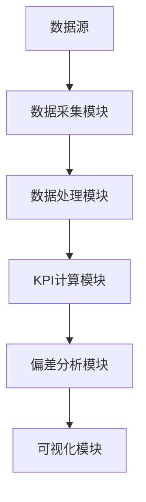
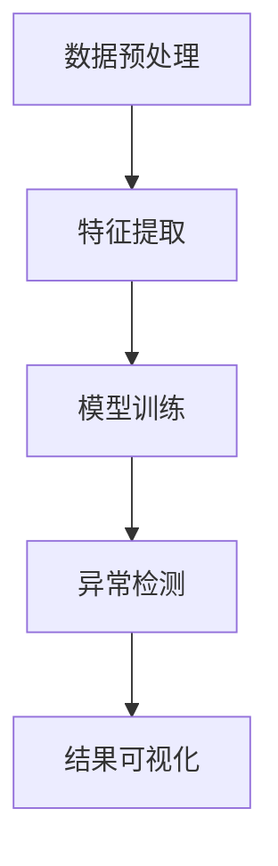
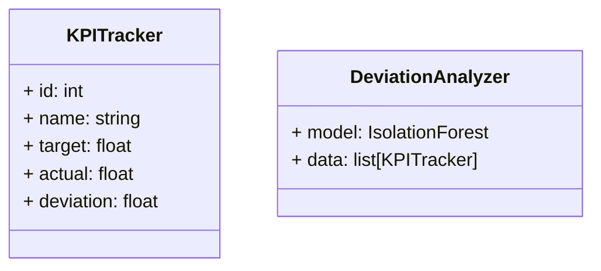
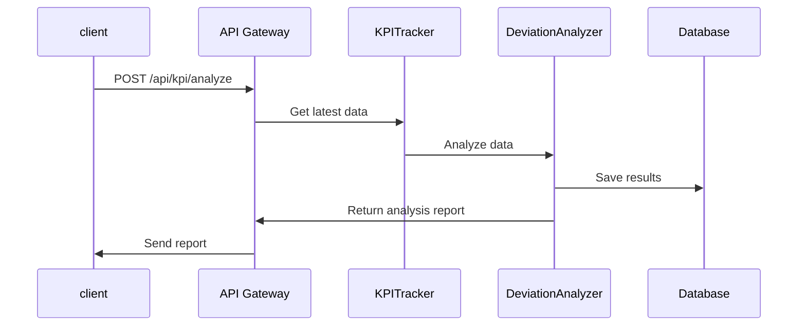

                 


# AI驱动的企业战略执行监控：KPI智能跟踪与偏差分析

> 关键词：AI, KPI, 偏差分析, 企业战略, 智能监控, 机器学习

> 摘要：随着企业规模的不断扩大和市场竞争的加剧，传统的KPI监控方式逐渐暴露出效率低下、数据处理复杂等问题。本文将详细探讨如何利用人工智能技术，实现企业战略执行的智能化监控，包括KPI的智能跟踪与偏差分析的核心概念、算法原理、系统设计和实际应用案例。通过本文的分析，读者将能够深入了解AI在企业战略执行监控中的应用价值，并掌握如何利用AI技术提升企业的运营效率和决策能力。

---

# 第一部分: AI驱动的企业战略执行监控背景

## 第1章: AI驱动的企业战略执行监控背景

### 1.1 问题背景与挑战

#### 1.1.1 传统企业战略执行监控的局限性
传统的KPI监控方式依赖人工数据收集和分析，效率低下且容易出错。企业面对海量数据时，难以快速识别关键问题，导致战略执行中的偏差无法及时发现和纠正。

#### 1.1.2 数据爆炸对企业监控的新要求
随着企业业务的扩展，数据量呈指数级增长。传统的监控方法难以处理高维数据和复杂场景，企业需要更高效的工具来实时跟踪KPI并进行偏差分析。

#### 1.1.3 AI技术在企业监控中的应用潜力
AI技术，尤其是机器学习和深度学习，能够处理海量数据，发现隐藏在数据中的模式和趋势。通过AI驱动的监控系统，企业可以实时跟踪KPI，快速识别偏差，并提供优化建议。

### 1.2 KPI智能跟踪与偏差分析的核心概念

#### 1.2.1 KPI的定义与分类
KPI（Key Performance Indicators）是衡量企业战略执行效果的关键指标。常见的KPI分类包括财务类、客户类、内部流程类和学习与成长类。

#### 1.2.2 偏差分析的基本原理
偏差分析是指通过比较实际结果与预期目标之间的差异，识别潜在问题并采取纠正措施。AI驱动的偏差分析利用机器学习算法，自动识别数据中的异常，并预测未来趋势。

#### 1.2.3 AI驱动监控的边界与外延
AI驱动的监控系统不仅能够跟踪KPI，还可以通过数据分析优化企业战略执行。其外延包括预测分析、实时监控和自动化决策支持。

### 1.3 本章小结
本章介绍了传统企业战略执行监控的局限性，提出了AI驱动监控的必要性，并详细阐述了KPI智能跟踪与偏差分析的核心概念。

---

# 第二部分: AI驱动的KPI智能跟踪与偏差分析原理

## 第2章: 核心概念与系统联系

### 2.1 KPI跟踪与偏差分析的原理

#### 2.1.1 数据采集与处理流程
数据采集是AI驱动监控的第一步。企业需要从各个数据源收集数据，并进行清洗、转换和标准化处理，确保数据的准确性和一致性。

#### 2.1.2 KPI计算与可视化方法
通过机器学习模型，AI系统可以自动计算KPI，并生成可视化图表，帮助企业管理者直观地了解战略执行情况。

#### 2.1.3 偏差分析的数学模型
偏差分析基于统计学和机器学习模型，通过比较实际值与预测值的差异，识别数据中的异常点，并分析其原因。

### 2.2 AI驱动的监控系统架构

#### 2.2.1 数据流与系统模块关系（Mermaid图）


#### 2.2.2 实体关系模型（ER图）
```mermaid
erd
左对齐
KPI表
  id
  name
  type
  target
  实际值
  偏差
  分析报告
  负责人
  日期
```

### 2.3 本章小结
本章详细阐述了KPI跟踪与偏差分析的原理，并通过Mermaid图和ER图展示了AI驱动监控系统的架构。

---

# 第三部分: AI驱动的KPI智能跟踪算法原理

## 第3章: 基于机器学习的偏差分析算法

### 3.1 算法原理与流程

#### 3.1.1 数据预处理与特征提取
数据预处理包括数据清洗、缺失值处理和异常值剔除。特征提取则是从数据中提取有助于模型训练的特征，如销售额、成本、客户满意度等。

#### 3.1.2 基于监督学习的偏差检测
监督学习模型（如决策树、随机森林）通过历史数据训练，识别正常和异常的KPI值。当实际值与预测值存在显著差异时，系统会触发警报。

#### 3.1.3 基于无监督学习的异常检测
无监督学习模型（如K-means、DBSCAN）能够自动发现数据中的异常模式，适用于未知异常的检测。

### 3.2 算法实现与代码示例

#### 3.2.1 Python代码实现（示例）
```python
import pandas as pd
from sklearn.ensemble import IsolationForest

# 加载数据
data = pd.read_csv('kpi_data.csv')

# 特征工程
X = data[['sales', 'cost', 'customer_satisfaction']]

# 训练模型
model = IsolationForest(n_estimators=100, random_state=42)
model.fit(X)

# 预测异常值
outliers = model.predict(X)
outliers[outliers == -1] = 1
outliers[outliers == 1] = 0
data['outliers'] = outliers
```

#### 3.2.2 算法流程图（Mermaid）


### 3.3 数学模型与公式解析

#### 3.3.1 线性回归模型：$1+1=2$
线性回归模型用于预测KPI的趋势。例如，预测销售额：
$$ y = \beta_0 + \beta_1x + \epsilon $$

#### 3.3.2 异常检测算法：LOF（局部 outlier factor）
LOF算法通过计算局部密度比来检测异常点：
$$ LOF = \frac{reachability_{dd(k)}(x)}{reachability_{dd(k)}(x')}, where x' \text{ is a k nearest neighbor of x} $$

---

# 第四部分: 系统分析与架构设计

## 第4章: 系统分析与架构设计方案

### 4.1 问题场景介绍
企业需要实时监控多个KPI，包括销售额、成本、客户满意度等。通过AI驱动的系统，企业可以快速识别异常，并采取纠正措施。

### 4.2 系统功能设计

#### 4.2.1 领域模型（Mermaid类图）


### 4.3 系统架构设计

#### 4.3.1 系统架构图（Mermaid）


### 4.4 系统接口设计

#### 4.4.1 API接口
```http
GET /api/kpi/tracker
POST /api/kpi/analyze
```

### 4.5 系统交互流程图（Mermaid）


---

# 第五部分: 项目实战

## 第5章: 项目实战

### 5.1 环境安装与配置

#### 5.1.1 安装Python和相关库
```bash
pip install numpy pandas scikit-learn
```

### 5.2 核心代码实现

#### 5.2.1 KPITracker类实现
```python
class KPITracker:
    def __init__(self, data):
        self.data = data
        self.models = {}

    def train_model(self, model_type):
        # 训练模型并存储
        pass

    def predict(self, new_data):
        # 使用模型预测
        pass
```

### 5.3 实际案例分析与解读

#### 5.3.1 案例分析
某企业销售额KPI出现异常下降，AI系统通过偏差分析发现是由于供应链问题导致的。系统建议优化供应链管理，提升客户满意度。

### 5.4 项目小结
通过实际案例分析，读者可以了解AI驱动的KPI跟踪与偏差分析在实际中的应用，掌握如何利用代码实现相关功能。

---

# 第六部分: 最佳实践

## 第6章: 最佳实践

### 6.1 小结与总结
AI驱动的企业战略执行监控是未来企业智能化发展的趋势。通过AI技术，企业可以实时跟踪KPI，快速识别偏差，并采取纠正措施。

### 6.2 注意事项与建议
在实际应用中，需要注意数据质量、模型选择和结果解释等问题。建议企业根据自身需求选择合适的AI工具和方法。

### 6.3 拓展阅读与资源推荐
推荐读者阅读《机器学习实战》和《深度学习》等书籍，深入了解AI算法和应用场景。

---

# 作者：AI天才研究院 & 禅与计算机程序设计艺术

---

以上就是《AI驱动的企业战略执行监控：KPI智能跟踪与偏差分析》的技术博客文章大纲和详细内容。希望这篇博客能够为企业在AI驱动的战略执行监控方面提供有价值的参考和指导。

