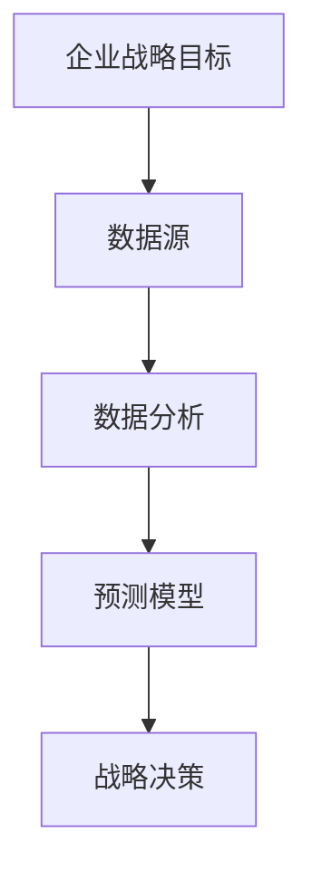
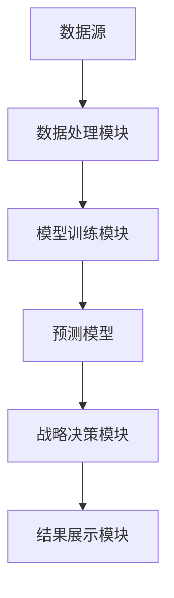

                 


# AI驱动的企业战略规划：大数据分析与预测性建模的融合

## 关键词：AI驱动，企业战略规划，大数据分析，预测性建模，机器学习，企业决策优化

## 摘要：  
本文探讨了如何利用AI和大数据分析技术来优化企业战略规划，通过预测性建模的融合，帮助企业做出更明智、数据驱动的决策。文章详细介绍了AI驱动战略规划的核心概念、技术方法、系统架构，并通过实际案例展示了如何将这些技术应用于企业战略规划中。最后，文章总结了最佳实践和未来发展方向，为读者提供了全面的指导。

---

## 第1章: AI驱动的企业战略规划概述

### 1.1 什么是AI驱动的企业战略规划

#### 1.1.1 企业战略规划的传统方法  
企业战略规划 traditionally relies on market research, expert opinions, and historical data to formulate long-term goals and action plans. However, these methods often lack the ability to predict future trends with high accuracy, leading to suboptimal decisions.

#### 1.1.2 AI在企业战略规划中的作用  
AI通过分析海量数据、识别模式和趋势，能够提供更精准的预测和洞察。AI不仅能够处理结构化数据，还能分析非结构化数据（如文本、图像），从而为战略规划提供更全面的信息支持。

#### 1.1.3 AI驱动战略规划的核心要素  
- **数据驱动决策**：利用大数据分析技术，从数据中提取 actionable insights。
- **预测性建模**：通过机器学习算法，预测未来市场趋势、客户行为和潜在风险。
- **实时监控与调整**：AI系统能够实时跟踪市场变化，并根据新的数据调整战略规划。

### 1.2 大数据分析与预测性建模的融合

#### 1.2.1 大数据分析的基本概念  
大数据分析是指对海量、多样化、高速生成的数据进行处理、分析和洞察提取的过程。它包括数据清洗、数据建模、数据分析和数据可视化等步骤。

#### 1.2.2 预测性建模的原理  
预测性建模是利用历史数据训练机器学习模型，以预测未来事件的发生概率或结果。常用的预测模型包括线性回归、决策树、随机森林和神经网络等。

#### 1.2.3 两者的融合对企业战略的意义  
通过将大数据分析与预测性建模相结合，企业能够更准确地预测市场趋势、客户需求和竞争对手的动向，从而制定更具前瞻性的战略规划。

### 1.3 企业战略规划的AI驱动优势

#### 1.3.1 提高决策的准确性  
AI能够处理大量数据，识别人类难以察觉的模式，从而提高决策的准确性。

#### 1.3.2 加强数据驱动的洞察力  
通过大数据分析，企业能够从数据中发现新的洞察，制定更科学的战略决策。

#### 1.3.3 优化资源配置效率  
AI驱动的战略规划能够帮助企业更有效地分配资源，降低成本，提高效率。

---

## 第2章: AI驱动战略规划的核心概念

### 2.1 问题背景与问题描述

#### 2.1.1 传统战略规划的局限性  
传统战略规划方法依赖于主观判断和经验，难以应对复杂多变的市场环境。此外，由于数据量和计算能力的限制，传统方法难以处理海量数据，导致决策的滞后性和不准确性。

#### 2.1.2 数据驱动决策的需求  
随着数据量的爆炸式增长和计算能力的提升，企业需要利用数据驱动的方法来优化决策过程。

#### 2.1.3 AI在战略规划中的应用潜力  
AI技术的快速发展为企业提供了新的工具和方法，能够在复杂环境中快速分析数据、识别趋势，并制定最优策略。

### 2.2 核心概念与联系

#### 2.2.1 AI驱动战略规划的核心要素  
- **数据源**：包括市场数据、客户数据、竞争对手数据等。
- **数据分析**：通过大数据分析技术对数据进行清洗、建模和分析。
- **预测性建模**：利用机器学习算法预测未来趋势和结果。
- **战略决策**：基于预测结果和数据分析，制定和调整战略规划。

#### 2.2.2 大数据分析与预测性建模的关系  
大数据分析为预测性建模提供了数据基础，而预测性建模则利用这些数据为企业战略规划提供支持。两者相辅相成，共同推动企业决策的优化。

#### 2.2.3 ER实体关系图架构（Mermaid流程图）  



---

## 第3章: 预测性建模的算法原理

### 3.1 常用预测性建模算法

#### 3.1.1 线性回归  
线性回归是一种简单而强大的预测模型，适用于预测连续型变量（如销售额、价格等）。

**数学模型**：  
$$ y = \beta_0 + \beta_1x + \epsilon $$  
其中，$y$ 是目标变量，$x$ 是自变量，$\beta_0$ 和 $\beta_1$ 是模型参数，$\epsilon$ 是误差项。

#### 3.1.2 支持向量机（SVM）  
SVM适用于分类和回归问题，能够在高维空间中找到数据的最优分隔线。

**数学模型**：  
$$ \text{目标函数} = \min \frac{1}{2}||\beta||^2 + C \sum_{i=1}^n \xi_i $$  
$$ \text{约束条件}：y_i(\beta^T x_i + \beta_0) \geq 1 - \xi_i $$

#### 3.1.3 随机森林  
随机森林是一种基于树的集成方法，通过构建多个决策树并进行投票或平均来提高模型的准确性和鲁棒性。

#### 3.1.4 神经网络  
神经网络是一种模拟人脑结构和功能的模型，适用于复杂非线性关系的预测。

### 3.2 算法原理与流程图

#### 3.2.1 算法选择与数据预处理  
选择合适的算法需要考虑数据类型、问题类型和数据规模。数据预处理包括数据清洗、特征选择和数据标准化等。

#### 3.2.2 模型训练与调优  
通过交叉验证和网格搜索等方法，找到最优的模型参数，提高模型的泛化能力。

#### 3.2.3 模型评估与部署  
使用准确率、召回率、F1分数等指标评估模型性能，并将模型部署到生产环境中进行实时预测。

### 3.3 数学模型与公式

#### 线性回归的最小二乘法  
$$ \hat{y} = \beta_0 + \beta_1x $$  
$$ \text{最小化} \sum_{i=1}^n (y_i - \hat{y}_i)^2 $$

#### 支持向量机的对偶形式  
$$ \max \left( \frac{1}{2}||\beta||^2 - C \sum_{i=1}^n \xi_i \right) $$  
$$ \text{约束条件}：y_i(\beta^T x_i + \beta_0) \geq 1 - \xi_i $$

---

## 第4章: 系统架构与设计

### 4.1 系统设计概述

#### 4.1.1 问题场景介绍  
企业需要构建一个AI驱动的战略规划系统，整合内部和外部数据，利用预测性建模技术辅助决策。

#### 4.1.2 系统功能设计  
- 数据采集与处理：从多个数据源获取数据并进行清洗和预处理。
- 模型训练与部署：基于数据训练预测模型，并将模型部署到生产环境。
- 战略决策支持：根据模型预测结果，生成战略建议并实时监控执行情况。

#### 4.1.3 系统架构设计（Mermaid架构图）



#### 4.1.4 接口设计与交互流程  
- 数据接口：与数据源系统对接，获取实时数据。
- API接口：提供预测结果查询和战略建议生成的API。
- 交互流程：用户输入需求，系统返回预测结果和战略建议。

---

## 第5章: 项目实战

### 5.1 环境安装与配置

#### 5.1.1 安装Python环境  
使用Anaconda或Miniconda安装Python 3.8以上版本，并配置虚拟环境。

#### 5.1.2 安装依赖库  
安装pandas、numpy、scikit-learn、xgboost等机器学习库，以及matplotlib或seaborn用于数据可视化。

### 5.2 核心代码实现

#### 5.2.1 数据处理代码  

```python
import pandas as pd
import numpy as np

# 读取数据
data = pd.read_csv('input.csv')

# 数据清洗
data.dropna(inplace=True)
data = pd.get_dummies(data)
```

#### 5.2.2 模型训练代码  

```python
from sklearn.model import LinearRegression
from sklearn.metrics import mean_squared_error

# 训练模型
model = LinearRegression()
model.fit(X_train, y_train)

# 预测结果
y_pred = model.predict(X_test)
```

### 5.3 案例分析与总结

#### 5.3.1 案例分析  
以某零售企业为例，利用历史销售数据和市场数据，训练一个销售预测模型，预测未来季度的销售额。

#### 5.3.2 模型评估与优化  
通过交叉验证和超参数调优，提高模型的准确性和稳定性。

#### 5.3.3 项目总结  
总结项目实施过程中的经验教训，提出改进建议，并展望未来的优化方向。

---

## 第6章: 最佳实践与总结

### 6.1 最佳实践

#### 6.1.1 数据质量管理  
确保数据的准确性和完整性，避免数据偏差对模型预测的影响。

#### 6.1.2 模型解释性  
选择具有可解释性的模型，便于业务人员理解和信任。

#### 6.1.3 模型更新与维护  
定期更新模型，确保其适应市场变化和数据分布的变化。

### 6.2 小结

通过本文的介绍，读者可以了解AI驱动的企业战略规划的核心概念、技术方法和系统架构。企业可以利用这些方法和工具，优化战略规划过程，提高决策的准确性和效率。

### 6.3 注意事项

- 数据隐私和安全问题需要特别关注。
- 模型的泛化能力可能受到数据质量和数量的限制。
- 业务人员和技术人员需要紧密合作，确保模型的应用符合业务需求。

### 6.4 拓展阅读

- 《机器学习实战》
- 《大数据分析与挖掘》
- 《企业战略管理》

---

## 作者：AI天才研究院 & 禅与计算机程序设计艺术

